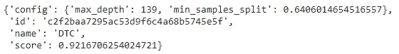

# 自动化机器学习模型优化

> 原文：<https://towardsdatascience.com/automating-machine-learning-model-optimization-5dd6119b0a86?source=collection_archive---------29----------------------->

## 使用贝叶斯调整和强盗进行机器学习


亨特·哈里特在 [Unsplash](https://unsplash.com?utm_source=medium&utm_medium=referral) 上的照片

创建机器学习模型是一项艰巨的任务，因为我们需要建立一个最适合我们数据的模型，并且我们可以优化以获得更好的性能和准确性。一般来说，建立机器学习模型很容易，但找出最佳参数和优化是一个耗时的过程。

有一些库/包可以让你自动完成这个过程，毫不费力地制作机器学习模型。我们可以使用这些软件包来为我们的数据选择最佳模型以及模型的最佳参数。

在本文中，我们将讨论贝叶斯调整和 BTB，它用于选择和超参数调整最佳模型，以解决给定的机器学习问题。我们将探索为机器学习的 BTB 提供的不同功能。

让我们开始吧…

# 安装所需的库

在本文中，我们将使用 Google Colab。让我们使用下面给出的命令安装所需的库，即 BTB

```
!pip install baytune
```

# 导入所需的库

在这一步，我们将导入所有需要的库，如 sklearn、btb 等。

```
from sklearn.datasets import load_breast_cancer
from sklearn.linear_model import SGDClassifier
from sklearn.metrics import f1_score, make_scorer
from sklearn.model_selection import cross_val_score
from sklearn.tree import DecisionTreeClassifier, ExtraTreeClassifier
from btb.tuning import Tunable
from btb.tuning import hyperparams as hp
from btb import BTBSession
```

# 加载数据集和定义模型

接下来，我们将从 sklearn 导入著名的乳腺癌数据集，我们还将定义一个字典，其中包含我们需要的不同模型的名称。

```
dataset = load_breast_cancer()
models = {
'DTC': DecisionTreeClassifier,
'SGDC': SGDClassifier,
'ETC': ExtraTreeClassifier,
}
```

# 计算不同模型的分数

定义模型名称后，接下来我们将创建一个函数，用于计算不同模型的得分。我们将使用该函数来比较不同模型的得分。

```
def scoring_function(model_name, hyperparameter_values):
    model_class = models[model_name]
    model_instance = model_class(**hyperparameter_values)
    scores = cross_val_score( estimator=model_instance,
                      X=dataset.data,y=dataset.target,     
                      scoring=make_scorer(f1_score, average='macro'))
return scores.mean()
```

# 定义可调超参数

在这一步中，我们将定义要调整的超参数，我们将为不同的模型提供不同的超参数。

```
tunables = {
    'DTC': Tunable({
        'max_depth': hp.IntHyperParam(min=3, max=200),
        'min_samples_split': hp.FloatHyperParam(min=0.01, max=1)
    }),
    'ETC': Tunable({
        'max_depth': hp.IntHyperParam(min=3, max=200),
        'min_samples_split': hp.FloatHyperParam(min=0.01, max=1)
    }),
    'SGDC': Tunable({
        'max_iter': hp.IntHyperParam(min=1, max=5000, default=1000),
        'tol': hp.FloatHyperParam(min=1e-3, max=1, default=1e-3),
    }),
}
```

# 创建 BTB 会话

现在，这是最后一步，我们将通过传递可调超参数和上面定义的评分函数来创建一个 BTB 会话，以找出哪个模型最适合我们的数据。

```
session = BTBSession(
tunables=tunables,
scorer=scoring_function
)
```

现在，在定义了会话之后，我们将通过传递我们想要的迭代次数来运行这个会话。

```
best_proposal = session.run(20)
```

现在我们将打印出结果，它是一个字典，包含最佳模型的名称以及该模型的最佳超参数值。

```
best_proposal
```



最佳模特(来源:作者)

这就是如何使用 BTB 来选择具有最佳超参数值的最佳性能机器学习模型。继续尝试不同的数据集，并让我知道您在回复部分的评论。

本文是与 [Piyush Ingale](https://medium.com/u/40808d551f5a?source=post_page-----5dd6119b0a86--------------------------------) 合作完成的。

# 在你走之前

***感谢*** *的阅读！如果你想与我取得联系，请随时在 hmix13@gmail.com 上联系我或我的* [***LinkedIn 个人资料***](http://www.linkedin.com/in/himanshusharmads) *。可以查看我的*[***Github***](https://github.com/hmix13)**简介针对不同的数据科学项目和包教程。还有，随意探索* [***我的简介***](https://medium.com/@hmix13) *，阅读我写过的与数据科学相关的不同文章。**