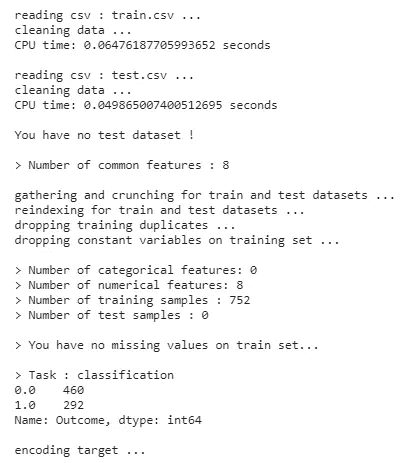
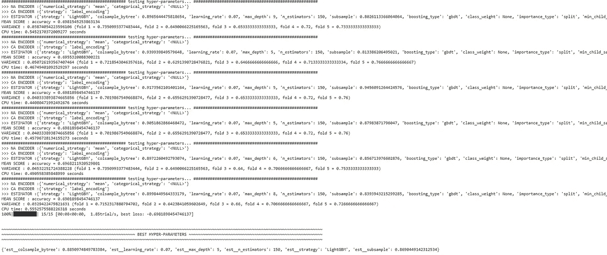
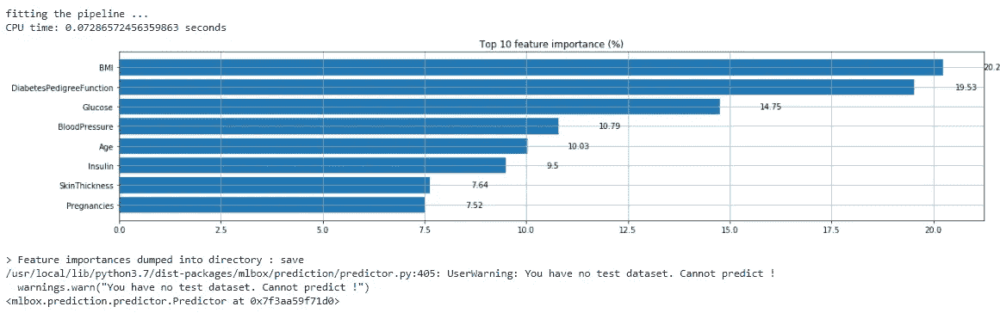

# 自动化机器学习建模

> 原文：<https://towardsdatascience.com/automating-machine-learning-modelling-62aac2081e3f?source=collection_archive---------28----------------------->

## 使用 MLBox 创建高度优化的机器学习模型


马库斯·温克勒在 [Unsplash](https://unsplash.com?utm_source=medium&utm_medium=referral) 上的照片

创建机器学习模型并不是一项困难的任务，因为 Python 提供了大量的库，可以帮助创建与回归、分类等问题相关的模型。像 Sklearn Statsmodel 这样的 Python 包可以用来创建这些模型，但困难的部分是优化和概括这些模型，以便它们也可以处理看不见的数据。

换句话说，单独创建一个机器学习模型并不能解决问题，我们还应该能够调整这些模型的超参数，使其通用化，并实现更高的性能和精度。有大量的机器学习模型，我们可以从中选择最适合我们数据集的模型，但这是一个耗时的过程，因为我们需要为每个算法编写代码和训练模型。类似地，如果我们能够选择模型，那么我们需要选择模型的最佳超参数，这也是一个耗时的过程。

因此，为了减少这些过程中花费的精力和时间，我们可以使用 MLBox 实现自动化。它是一个开源 python 库，用于自动化机器学习过程，包括特征选择、超参数优化、创建模型以及使用该模型生成预测。

在本文中，我们将探索 MLBox 提供的一些功能。

让我们开始吧…

# 安装所需的库

我们将从使用 pip 安装 MLBox 开始。下面给出的命令可以做到这一点。

```
!pip install mlbox
```

# 导入所需的库

在这一步，我们将导入自动化机器学习过程所需的库。

```
from mlbox.preprocessing import *
from mlbox.optimisation import *
from mlbox.prediction import *
```

# 正在加载数据集

对于本文，我们将使用著名的糖尿病数据集，这是一个分类问题。我已经将数据分为测试和训练两个不同的电子表格。这个数据集的目标变量是“结果”。

```
paths = ["/content/train.csv","/content/test.csv"]
target_name = "Outcome"
```

在此之后，我们将使用读取器读取数据，并测试火车分割数据。

```
rd = Reader(sep = ",")
df = rd.train_test_split(paths, target_name)
```



来源:作者

这里您可以看到，在拆分数据的同时，它还对数据进行了清理和预处理。

# 创建模型

接下来，我们将定义优化器以及我们将为此数据集考虑的模型。

```
#Defining Optimiser
opt = Optimiser(scoring = "accuracy", n_folds = 5)#Defining the model
space = {
'est__strategy':{"search":"choice","space":["LightGBM"]},'est__n_estimators':{"search":"choice","space":[150]},'est__colsample_bytree':{"search":"uniform","space":[0.8,0.95]},'est__subsample':{"search":"uniform","space":[0.8,0.95]},'est__max_depth':{"search":"choice","space":[5,6,7,8,9]},'est__learning_rate':{"search":"choice","space":[0.07]}
}
params = opt.optimise(space, df,15)
```



来源:作者

在这里，您可以清楚地看到 MLBox 使用 LightGBM 模型为此数据集导出的最佳超参数。

# 特征重要性

在这一步中，我们将根据我们创建的模型找出该数据集最重要的特征。

```
prd = Predictor()
prd.fit_predict(params, df)
```



来源:作者

在这里，您可以清楚地看到数据集最重要的特征。

继续用不同的数据集尝试这种方法，并自动化机器学习的过程。如果您发现任何困难，请在回复部分告诉我。

本文是与 [Piyush Ingale](https://medium.com/u/40808d551f5a?source=post_page-----62aac2081e3f--------------------------------) 合作完成的。

# 在你走之前

***感谢*** *的阅读！如果你想与我取得联系，请随时联系我在 hmix13@gmail.com 或我的* [***LinkedIn 简介***](http://www.linkedin.com/in/himanshusharmads) *。可以查看我的*[***Github***](https://github.com/hmix13)**简介针对不同的数据科学项目和包教程。还有，随意探索* [***我的简介***](https://medium.com/@hmix13) *，阅读我写过的与数据科学相关的不同文章。**