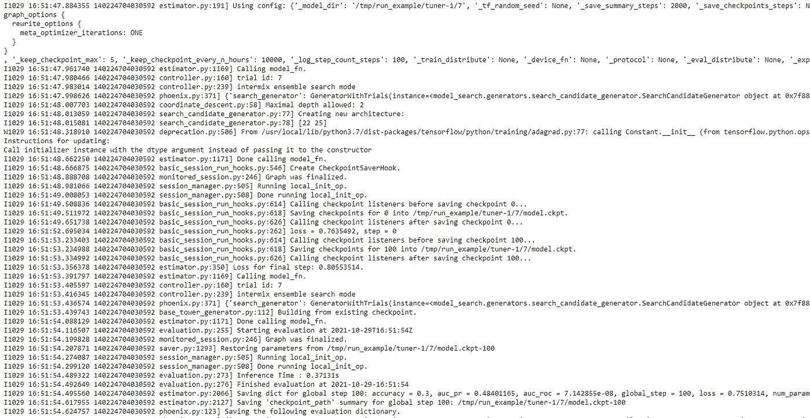

# 自动化机器学习管道

> 原文：<https://towardsdatascience.com/automating-machine-learning-pipeline-edcf74e869a4?source=collection_archive---------31----------------------->

## 使用模型搜索实现机器学习自动化


由 [Unsplash](https://unsplash.com?utm_source=medium&utm_medium=referral) 上的 [Pietro Jeng](https://unsplash.com/@pietrozj?utm_source=medium&utm_medium=referral) 拍摄

创建机器学习模型是一项艰巨的任务，因为我们需要编写大量代码来尝试不同的模型，并找出针对特定问题的执行模型。有不同的库可以自动化这一过程，以找出性能最佳的机器学习模型，但它们也需要一些编码。

如果我告诉你，我们可以运行多种 AutoML 算法，在单个代码单元中找出分类问题的最佳模型架构，会怎么样？模型搜索有助于实现分类问题的 AutoML。它运行多种 ML 算法并相互比较。它创建了一个搜索空间，我们可以在其中定制我们想要的神经网络层的类型。

Model Search 是一个开源的 Python 库，它提供了一种轻松的方法来运行多个 AutoML 并找出最佳的一个。这是非常有用的省时省力的工作。

在本文中，我们将探索模型搜索及其一些功能。

让我们开始吧…

# 安装所需的库

我们将从使用 pip 安装来安装模型搜索开始。下面给出的命令将使用 pip 安装模型搜索。

```
!git clone [https://github.com/google/model_search.git](https://github.com/google/model_search.git)
%cd /content/model_search/
```

# 导入所需的库

在此步骤中，我们将导入创建模型所需的所有库，并训练模型以找到最佳模型。

```
import model_search
from model_search import constants
from model_search import single_trainer
from model_search.data import csv_data
```

# 创建模型

现在我们将直接创建模型。我们将使用已经存储在模型搜索中的 CSV 数据。为了创建模型，我们只需传递所有必需的参数并开始训练。

```
trainer = single_trainer.SingleTrainer(
    data=csv_data.Provider(
        label_index=0,
        logits_dimension=2,
        record_defaults=[0, 0, 0, 0],
        filename="model_search/data/testdata/csv_random_data.csv"),
    spec='/content/model_search/model_search/configs/dnn_config.pbtxt')trainer.try_models(
    number_models=200,
    train_steps=1000,
    eval_steps=100,
    root_dir="/tmp/run_example",
    batch_size=32,
    experiment_name="example",
    experiment_owner="model_search_user")
```



模型训练(来源:作者)

正如我们在这里看到的，模型正在接受训练。现在我们还可以打印最佳模型及其参数。

```
!ls /tmp/run_example/tuner-1/
```


产出(来源:作者)

这里你可以看到表现最好的模型。所有模型文件都保存在本地计算机的 run_example 文件夹中。继续尝试不同的数据集，创建不同的模型，并让我知道您在回复部分的评论。

本文是与[皮尤什·英格尔](https://medium.com/u/40808d551f5a?source=post_page-----edcf74e869a4--------------------------------)合作完成的。

# 在你走之前

***感谢*** *的阅读！如果你想与我取得联系，请随时通过 hmix13@gmail.com 联系我或我的* [***LinkedIn 个人资料***](http://www.linkedin.com/in/himanshusharmads) *。可以查看我的*[***Github***](https://github.com/hmix13)**简介针对不同的数据科学项目和包教程。还有，随意探索* [***我的简介***](https://medium.com/@hmix13) *，阅读我写过的与数据科学相关的不同文章。**