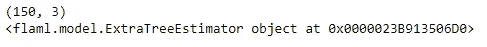
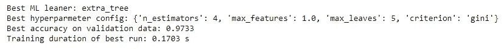
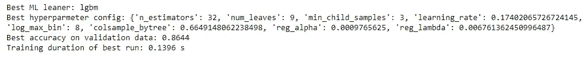

# 使用 FLAML 实现机器学习自动化

> 原文：<https://towardsdatascience.com/automating-machine-learning-using-flaml-46400b94a6b3?source=collection_archive---------11----------------------->

## 使用 FLAML 实现机器学习过程的自动化


由 [Unsplash](https://unsplash.com?utm_source=medium&utm_medium=referral) 上的 [Pietro Jeng](https://unsplash.com/@pietrozj?utm_source=medium&utm_medium=referral) 拍摄

机器学习是一个过程，在这个过程中，我们试图使用一套不同的算法来解决现实生活中的商业问题。创建机器学习模型很容易，但选择哪个模型在泛化和性能方面最适合我们的数据是一项困难的任务。

回归和分类都有各种各样的机器学习算法。这些可以根据我们试图解决的问题的类型来选择，但是这是一个需要很高的计算成本、时间和努力的过程。有不同的 Python 库提供了一个选项来自动高效地选择最佳机器学习模型的过程，其中一个这样的库是 FLAML。

FLAML 是一个轻量级开源 Python 库，有助于自动、高效、经济地找出最佳的机器学习模型。它既快又省时，而且设计轻巧。

在本文中，我们将探索 FLAML 及其功能。

让我们开始吧…

# 安装所需的库

我们将从使用 pip 安装来安装 FLAML 开始。下面给出的命令将使用 pip 安装 FLAML。

```
pip install flaml
```

# 导入所需的库

在这一步中，我们将导入创建机器学习模型和下载数据集所需的所有库。

```
from flaml import AutoML
```

# 解决分类问题

现在我们将从解决一个分类问题开始。我们将在这里使用的数据是著名的 Iris 数据集，可以很容易地从 Seaborn 库中加载。让我们开始创建模型。

```
#Loading the Dataset
from sklearn.datasets import load_iris
```

为 Automl 创建实例很重要，定义 Automl 设置也很重要，因此在这一步中，我们还将创建 Automl 实例并定义设置。

```
automl = AutoML()automl_settings = {
    "time_budget": 10,  # in seconds
    "metric": 'accuracy',
    "task": 'classification'
}
```

接下来，我们将拆分数据负载，并将其放入模型中。最后，我们还将使用模型进行预测，并找到最佳模型。

```
X_train, y_train = load_iris(return_X_y=True)
# Train with labeled input data
automl.fit(X_train=X_train, y_train=y_train,
           **automl_settings)print(automl.predict_proba(X_train).shape)
# Export the best model
print(automl.model)
```



模型(来源:作者)

在这里，我们可以清楚地看到，额外的树估计量是这个数据的最佳模型。现在让我们打印出模型的最佳超参数和精确度。

```
print('Best ML leaner:', automl.best_estimator)
print('Best hyperparmeter config:', automl.best_config)
print('Best accuracy on validation data: {0:.4g}'.format(1-automl.best_loss))
print('Training duration of best run: {0:.4g} s'.format(automl.best_config_train_time))
```



最佳模特(来源:作者)

同样，对于回归问题，我们也将遵循相同的过程。

# 解决回归问题

现在我们将解决一个回归问题。我们将在这里使用的数据是著名的波士顿数据集，可以很容易地从 Seaborn 库中加载。我们可以遵循与分类问题完全相同的过程。

```
from sklearn.datasets import load_boston

automl = AutoML()

automl_settings = {
    "time_budget": 10,  # in seconds
    "metric": 'r2',
    "task": 'regression'
}
X_train, y_train = load_boston(return_X_y=True)
# Train with labeled input data
automl.fit(X_train=X_train, y_train=y_train,
           **automl_settings)
# Predict
print(automl.predict(X_train).shape)
# Export the best model
print(automl.model)
```


模型(来源:作者)

```
print('Best ML leaner:', automl.best_estimator)
print('Best hyperparmeter config:', automl.best_config)
print('Best accuracy on validation data: {0:.4g}'.format(1-automl.best_loss))
print('Training duration of best run: {0:.4g} s'.format(automl.best_config_train_time))
```



最佳模特(来源:作者)

在这里，我们可以清楚地看到回归问题的最佳模型和超参数。

同样，您可以对您的数据集执行此过程，并为您的问题找到最佳模型和超参数。尝试使用不同的数据集，并在回复部分告诉我您的意见。

本文是与 [Piyush Ingale](https://medium.com/u/40808d551f5a?source=post_page-----46400b94a6b3--------------------------------) 合作完成的。

# 在你走之前

***感谢*** *的阅读！如果你想与我取得联系，请随时联系我在 hmix13@gmail.com 或我的* [***LinkedIn 简介***](http://www.linkedin.com/in/himanshusharmads) *。可以查看我的*[***Github***](https://github.com/hmix13)**简介针对不同的数据科学项目和包教程。还有，随意探索* [***我的简介***](https://medium.com/@hmix13) *，阅读我写过的与数据科学相关的不同文章。**