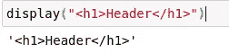
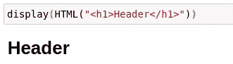
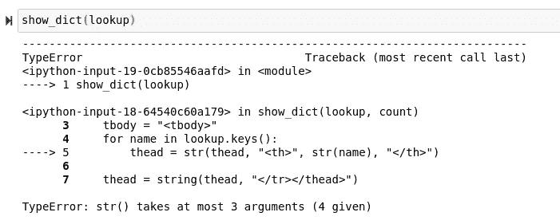
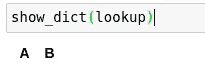
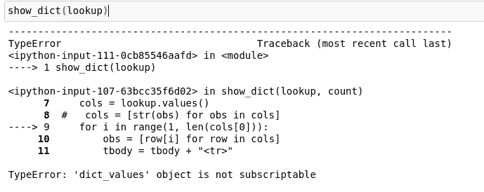
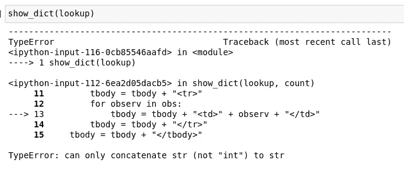
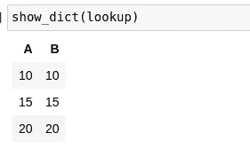
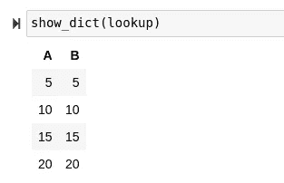

# 使用 Python 和 HTML5 自动化标记

> 原文：<https://towardsdatascience.com/automating-markup-with-python-and-html5-9054362e87ce?source=collection_archive---------32----------------------->

## 使用原始 Python 处理 HTML5 非常容易，以便从字典数据创建 web 友好的表格。


(src =[https://unsplash.com/photos/0qE0qZ7_3eY](https://unsplash.com/photos/0qE0qZ7_3eY)

# 介绍

IPython 笔记本在 Python 的奇妙世界和超文本标记的世界之间建立了一座急需的桥梁。虽然在此之前，通过利用诸如网页之类的东西来利用 Python 的某些标记特性是完全可能的，但是随着 IPython 笔记本和 IPython 模块的普及，看到这两种语言一起工作来实现某个目标已经变得更加常见了。

标记的伟大之处在于，在某种程度上，它只是一组被解析的表达式，用来指示解析器需要在屏幕上显示什么。这意味着基本上任何编程语言都可以创建它，并解码它。元编程是一个术语，主要用于做同样的事情，但是有表达式和求值，然而我认为在很多方面，将编程语言与标记结合起来的行为与元编程非常相似。

> [笔记本](https://github.com/emmettgb/Emmetts-DS-NoteBooks/blob/master/Python3/Writing%20HTML%20from%20Python.ipynb)

# 数据表

在现代 Python 编程世界中，HTML5 的一个非常常见的应用是 IPython 笔记本内部的显示。这通常是用 HTML5 或 Javascript 完成的。这两种方法都有各自的优点，比如交互性和简单性，但是不管怎样，能够做出一些非常有用的东西是非常好的，比如在 Python 笔记本中显示数据表的方法。

有趣的是，我最初在 Julia 语言中编写了这个算法，以便使用 data frames . JL。data frames . JL 有一个众所周知的可怕的显示输出，这是由它背后的大量软件包提供的，以便提供该功能。我决定用一个扩展来改变我自己安装的 DataFrames.jl，这个扩展可以用更具表现力的 HTML 输出来显示数据帧。如果你想看看我在字典上的实现，你可以看看 OddFrames.jl，这是一个在 Julia 中处理数据的包:

</introducing-oddframes-jl-data-in-one-dimension-296e1389c27a>  

现在，我们将编写一个新的算法，将 Python 中的一些字典数据解析成 HTML5 表。

# 编写我们的函数

在深入研究这个函数之前，我们首先需要评估的是输入和输出。首先，需要注意的是，我们很可能想要使用某种显示方法，而不是常规的返回。这是因为如果我们排除这个调用，HTML5 可能会以字符串的形式返回，而不是显示出来。根据我的经验，我估计 IPython 的 display()函数可能是最适合使用的解决方案。然而，在围绕一个函数构建某些东西之前测试它的功能总是很棒的，所以让我们尝试使用这种方法显示一些 HTML，看看我们得到了什么:

```
from IPython.display import display
```

注意，这个函数包含在同名的模块中。这一点很重要，因为很容易不小心说

```
from IPython import display
```

然后不小心调用了一个模块作为函数。现在让我们在一点 HTML 上试试这个函数:

```
display("<h1>Header</h1>")
```



作者图片

这正是为什么先测试一下是个好主意的原因。然而，在模块内部还有一个 HTML 类型，它在其构造函数中接受一个字符串。我猜 display 方法也可以接受这个 HTML 类型，以便实际返回 HTML，因为现在它认为它只是在处理一个字符串。

```
from IPython.display import display, HTML
display(HTML("<h1>Header</h1>"))
```



作者图片

既然我们已经确定有一个可靠的方法来显示我们的 HTML，我们可以假设函数的输出步骤已经完成。现在让我们考虑位置参数形式的输入。首先，当然，我们需要一本字典。对于本例，我将调用该查找。如果我们最终得到一个非常长的数据表，我们可能不希望显示所有的数据，所以我们应该添加另一个参数来决定我们的数据表要打印多少行。所有这些给了我们一个函数定义，看起来像这样:

```
def show_dict(lookup : dict, count : int = 5):
```

由于这种情况下的大部分工作都是字符串连接，我们需要做的第一件事就是创建一个字符串。在这个特殊的例子中，我们将创建一个保存字典中的键的表头和一个保存字典中的值的表体。表头是用 HTML5 中的标签做的。我们还将添加一个标签，因为头部只有一行。对于表体，我们将把它作为一个字符串设置到标签中。

```
def show_dict(lookup : dict, count : int = 5):
    thead = "<thead><tr>"
    tbody = "<tbody>"
```

接下来，我们将使用 dict.keys()函数遍历字典中的键。这将从我们的字典中返回一个有序的键列表。对于这个列表中的每个迭代，我们将使用表头标签添加一个新的表头。在标签之间，我们将放入在这个迭代循环中循环的每个名字。我将把“str”类型转换到这些键上，以防它们被存储为不同的数据类型，以避免任何方法错误的问题。总结一下我的意思，如果我们不事先将这个类型转换成字符串，就有可能出现“没有方法匹配字符串(str，不支持的类型，str)”的错误。也就是说，如果字符串构造函数不能首先转换我们的类型，那么添加这个构造函数基本上是没有用的。

```
for name in lookup.keys():
        thead = str(thead, "<th>", str(name), "</th>")
```

现在，我们将通过添加我们的和标签的结尾来结束我们的 head 标签，这两个标签是相同的，只是添加了一个斜杠，有点像正则表达式中的反斜杠:

```
thead = string(thead, "</tr></thead>")
```

现在，我们实际上可以尝试一下这个功能，看看头部的显示器实际上是否工作。当然，我们首先需要添加 IPython.display.display()调用。

```
def show_dict(lookup : dict, count : int = 5):
    thead = "<thead><tr>"
    tbody = "<tbody>"
    for name in lookup.keys():
        thead = str(thead, "<th>", str(name), "</th>")thead = str(thead, "</tr></thead>")
    display(HTML(thead))
```

我们来试试吧！

```
lookup = dict({"A": [5, 10, 15, 20], "B": [5, 10, 15, 20]})
show_dict(lookup)
```



(图片由作者提供)

> 使用多种语言的问题是。

在 Python 中，我们实际上不需要强制转换这种类型，我们可以使用+运算符来连接字符串。我来自编程的函数世界，我认为这很有趣也很酷，因为这些字符串是完整的类，而不仅仅是保存数据的简单结构。让我们改用加法运算符:

```
def show_dict(lookup : dict, count : int = 5):
    thead = "<thead><tr>"
    tbody = "<tbody>"
    for name in lookup.keys():
        thead = thead + "<th>" + str(name) + "</th>" thead = thead + "</tr></thead>"
    display(HTML(thead))
```



作者图片

# 添加正文

至于表的主体，我们将从使用 dict.values()函数提取值开始，就像我们使用 dict.keys()函数一样。

```
cols = lookup.values()
```

鉴于前面的操作，很容易想象我们下一步需要做什么。我们当然会迭代地创建新的表行。为了做到这一点，我们不打算像上次一样循环遍历我们的新值集。这是因为我们将按顺序创建每个标记，所以如果我们要遍历这些值，我们将遍历一个特征的所有观察值，而不是遍历行。换句话说，我们需要水平填充，而不是垂直填充。考虑到这一点，我们将在迭代中使用一个范围生成器。这将允许我们为每一行调用附加 for 循环中的每个观察。当然，我们不希望这调用特征的长度，而是我们希望调用第一个特征的长度，因为否则我们将得到特征计数而不是观察计数。

```
for i in range(1, len(cols[0])):
```

现在，我们将使用另一个迭代循环将我们的工作限制在我们的一行特征上:

```
for i in range(1, len(cols[0])):
     obs = [row[i] for row in cols]
```

现在，我们将在 for 循环中为此行开始一个新的行标记:

```
tbody = tbody + "<tr>"
```

现在我们将遍历行内的值，并将它们添加到我们的 tbody 中的标签之间:

```
for observ in obs:
            tbody = tbody + "<td>" + observ + "</td>"
```

最后，我们将使用之前开始的标记结束该行:

```
tbody = tbody + "</tr>"
```

现在，整个循环应该看起来像这样:

```
for i in range(1, len(cols[0])):
        obs = [row[i] for row in cols]
        tbody = tbody + "<tr>"
        for observ in obs:
            tbody = tbody + "<td>" + observ + "</td>"
        tbody = tbody + "</tr>"
```

在这个循环之后，我们将关闭 tbody 标记:

```
tbody = tbody + "</tbody>"
```

最后，我们将组合 thead 和 tbody，然后使用 display 函数和 HTML 构造函数来显示结果:

```
composition = str(thead + tbody)
display(HTML(composition))
```

现在我们的函数应该看起来有点像这样:

```
def show_dict(lookup : dict, count : int = 5):
    thead = "<thead><tr>"
    tbody = "<tbody>"
    for name in lookup.keys():
        thead = thead + "<th>" + str(name) + "</th>"
    thead = thead + "</tr></thead>"
    cols = lookup.values()
    for i in range(1, len(cols[0])):
        obs = [row[i] for row in cols]
        tbody = tbody + "<tr>"
        for observ in obs:
            tbody = tbody + "<td>" + observ + "</td>"
        tbody = tbody + "</tr>"
    tbody = tbody + "</tbody>"
    composition = str(thead + tbody)
    display(HTML(composition))
```

现在让我们试着在字典上使用这个函数:

```
show_dict(lookup)
```



作者图片

> 这是一个问题。

奇怪的是，似乎字典键和值都有一个单独的类。为了避免遇到这个问题，我们需要创建一种新的方法来提取没有 values()函数的值，或者找出一种方法来重新转换我们的类型。我选择了前者，因为我们已经将键放入了一个列表中，要创建这样一个列表，循环遍历这个列表是相当简单的。

```
cols = [lookup[name] for name in lookup.keys()]
```

现在我们的新函数看起来像这样:

```
def show_dict(lookup : dict, count : int = 5):
    thead = "<thead><tr>"
    tbody = "<tbody>"
    for name in lookup.keys():
        thead = thead + "<th>" + str(name) + "</th>"
    thead = thead + "</tr></thead>"
    cols = [lookup[name] for name in lookup.keys()]
    for i in range(1, len(cols[0])):
        obs = [row[i] for row in cols]
        tbody = tbody + "<tr>"
        for observ in obs:
            tbody = tbody + "<td>" + observ + "</td>"
        tbody = tbody + "</tr>"
    tbody = tbody + "</tbody>"
    composition = str(thead + tbody)
    display(HTML(composition))
```

让我们看看这个解决方案是否可行！

```
show_dict(lookup)
```



作者图片

有趣的是，我可能已经做了我之前警告过的事情，但是这是一个类型错误而不是方法错误。这可能是 Julia 的一个方法错误，所以这就是错误的来源，你每天都会学到新的东西！

```
def show_dict(lookup : dict, count : int = 5):
    thead = "<thead><tr>"
    tbody = "<tbody>"
    for name in lookup.keys():
        thead = thead + "<th>" + str(name) + "</th>"
    thead = thead + "</tr></thead>"
    cols = [lookup[name] for name in lookup.keys()]
    for i in range(1, len(cols[0])):
        obs = [row[i] for row in cols]
        tbody = tbody + "<tr>"
        for observ in obs:
            tbody = tbody + "<td>" + str(observ) + "</td>"
        tbody = tbody + "</tr>"
    tbody = tbody + "</tbody>"
    composition = str(thead + tbody)
    display(HTML(composition))show_dict(lookup)
```



作者图片

> 成功了！

您可能已经注意到列表是[5，10，15，20]，换句话说，第一个值从行中删除了。发生这种情况的原因是因为我使用 1 作为我们的范围生成器的开始，因为 Python 的索引从 0 开始。回到指责我的错误是因为习惯了 Julia，Julia 从 1 开始它的索引，就像 Mathematica 一样。如果我们将其更改为 0，我们会看到现在所有的值都已填充:



作者图片

# 结论

在我看来，这是相当有趣的编程练习！将文本连接在一起制作一个微型网页不仅很酷，而且如果没有一千个更好的实现的话，这段代码可能会很有用。也就是说，不管它是否有用，我确实认为在这里检查代码，并在 Python 中使用这样的算法是有价值的！这是我们的最后一个函数，正如我之前讨论的那样，范围生成器发生了改变:

```
def show_dict(lookup : dict, count : int = 5):
    thead = "<thead><tr>"
    tbody = "<tbody>"
    for name in lookup.keys():
        thead = thead + "<th>" + str(name) + "</th>"
    thead = thead + "</tr></thead>"
    cols = [lookup[name] for name in lookup.keys()]
    for i in range(0, len(cols[0])):
        obs = [row[i] for row in cols]
        tbody = tbody + "<tr>"
        for observ in obs:
            tbody = tbody + "<td>" + str(observ) + "</td>"
        tbody = tbody + "</tr>"
    tbody = tbody + "</tbody>"
    composition = str(thead + tbody)
    display(HTML(composition))
```

希望这是一种有趣的方式来提高一些循环技巧，并发现一些关于 Python 编程语言的更有趣的事情。谢谢你的阅读，它对我来说意味着整个世界！