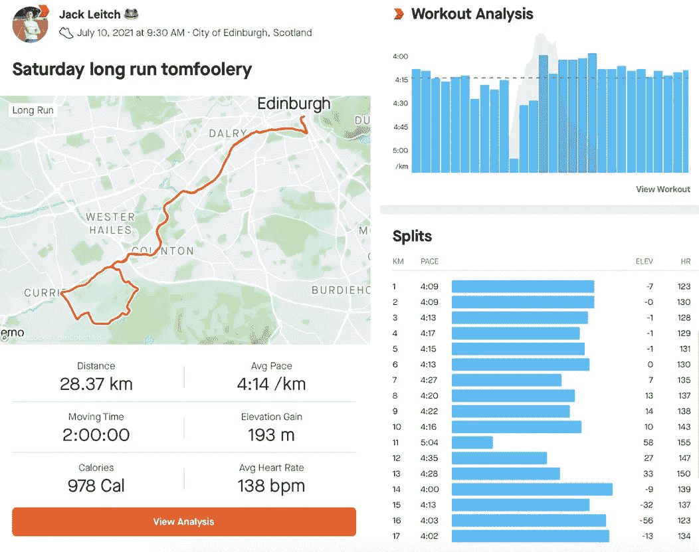
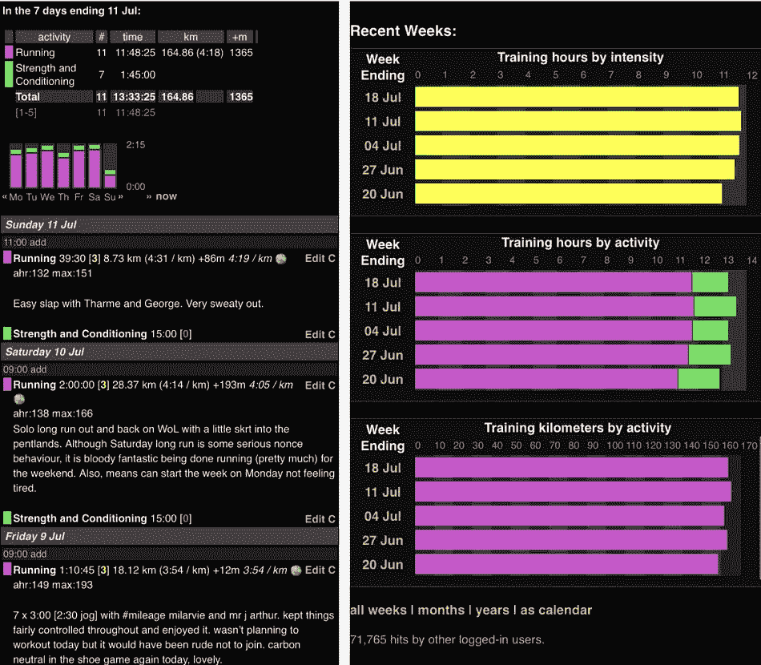

# 使用 Selenium 和 Heroku 自动处理日常的基于 Web 的任务

> 原文：<https://towardsdatascience.com/automating-mundane-web-based-tasks-with-selenium-and-heroku-715a2f1ec35e?source=collection_archive---------30----------------------->

## 用简单的方法自动化掉那些不断重复的任务

在 [Unsplash](https://unsplash.com?utm_source=medium&utm_medium=referral) 上 [Magnet.me](https://unsplash.com/@magnetme?utm_source=medium&utm_medium=referral) 拍照

## 手头的任务

作为一个狂热的跑步者和数据爱好者，我自然喜欢记录我的训练。几年前我确定的解决方案是在 Strava 和 Attackpoint 上记录我的培训。虽然这两个平台都提供使用 GPS 数据跟踪锻炼的服务，但 Strava 强调的是社交网络，它允许你以深入的方式查看每个活动，这是 Attackpoint 所缺乏的；另一方面，Attackpoint 更简单，我个人更喜欢把它作为我训练的一个整体(以周/月/年为时间尺度)。

左边的[斯特拉瓦](https://www.strava.com/)和右边的[攻击点](https://www.attackpoint.org/)。作者图片

然而，我的一个问题是，我总是努力保持这两个日志是最新的。Garmin(我的跑步手表的制造商)通过 API 与两个网站同步，所以我的跑步神奇地出现在两个网站上，所以问题不在于我的跑步只出现在一个网站上。我的问题是保持两个网站都有运行记录/描述是一件乏味的事情。我倾向于总是保持 Strava 的最新状态，并在我感到烦恼的时候在 Attackpoint 上浏览帖子。那么，为什么不把我对这些网站的承诺问题自动化呢？

**任务:每次我在 Strava 上跑步并写下关于它的描述，然后把它添加到 Attackpoint 上相应的跑步帖子中。**

## 游戏计划

所以我有了一个为什么，剩下的就是找出方法。选择从 Strava 到 Attackpoint，而不是相反，是一个简单的选择。首先，Strava 使用起来更好，其次，该网站更现代、更灵活、更别致，因此编写代码来发布内容并与之交互虽然可行，但会更具挑战性。那么我实际上是怎么做的呢？

输入硒。Selenium 是一个 Python 包，用于启动和控制 web 浏览器。它能够在这个浏览器中填写表格和模拟鼠标点击。一个关于 Selenium 的优秀教程，我用的比较多，可以在这里找到:[https://towardsdatascience . com/controlling-the-web-with-python-6 fceb 22 C5 f 08](/controlling-the-web-with-python-6fceb22c5f08)。

有了这些东西，我发现写下行动计划总是好的；无论是在纸上还是在你的电脑上，这完全取决于个人喜好，我倾向于用纸。当事情不可避免地出错时，我往往最终会严重偏离最初的计划，但不管怎样，我发现写下最初的想法/想法会让我思路清晰，给我方向感。

因此，下面是我选择自动执行这项任务的大致轮廓:

*   调用 Strava API 来获取我最近跑步的惟一 id 的有序列表。这原本不在计划中，但是由于增加的复杂性(例如，我的许多 runs 组运行，html 在这里变得棘手)，从 Strava 获得我的活动+相应的时间顺序信息比我最初想象的要困难得多。有了这些 id，提取信息就更容易了。

*   使用 Selenium 登录 Strava，导航到“您的活动”选项卡，检索与每个唯一活动 ID 对应的跑步信息。正如您在下面的代码中看到的，Selenium 非常容易使用，因为它非常直观。下面的代码是一个大概的框架，完整的代码+注释可以在我的 [Github](https://github.com/jackmleitch/strava2ap) 页面找到。

*   现在我们有了我最近的所有活动(按照完成的顺序！)以及活动细节:时间、标题、描述、距离和速度。现在剩下要做的就是将标题和描述添加到我的 Attackpoint 页面，尽管还有一些小的微妙之处。首先，如果任何活动已经有了描述，我不想再去管它们。其次，如果任何 Strava 标题是默认的，即没有被改变，我也想离开岗位，因为我还没有得到周围命名 Strava 运行。和以前一样，为了清楚起见，省略了一些代码细节。

我们完成了，如果我在终端中运行 attackpointSelenium.py，它会将任何缺失的描述添加到我的攻击点中！

## 使自动装置完全自动化

显然，一天运行一行代码一两次太费力了，所以剩下要做的最后一件事就是把代码部署到网上的某个地方，这样我就完全置身事外了。遵循这个优秀的[教程](https://medium.com/analytics-vidhya/schedule-a-python-script-on-heroku-a978b2f91ca8)，我能够将我的代码部署到 [Heroku](https://id.heroku.com/login) 并对其进行调度，以便我的代码检查我的攻击点是否需要每 10 分钟更新一次！最棒的是，它完全免费。

**TL；DR 编写了代码，自动将信息从一个网站发布到另一个网站的相应部分。**

**代号:**<https://github.com/jackmleitch/strava2ap>

**感谢阅读，我希望你喜欢它。这里有一些你可能感兴趣的我的其他故事…**

**</organizing-machine-learning-projects-e4f86f9fdd9c>  </building-a-recipe-recommendation-api-using-scikit-learn-nltk-docker-flask-and-heroku-bfc6c4bdd2d4> **