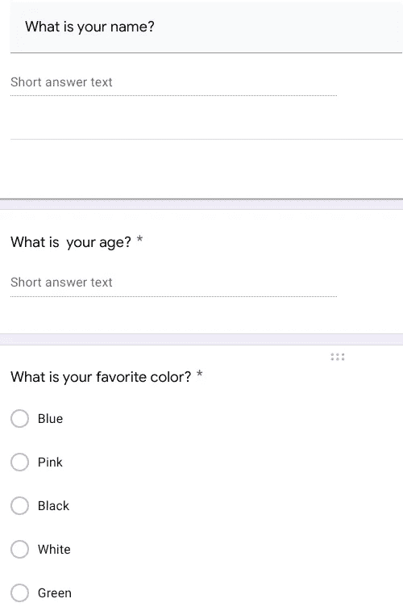
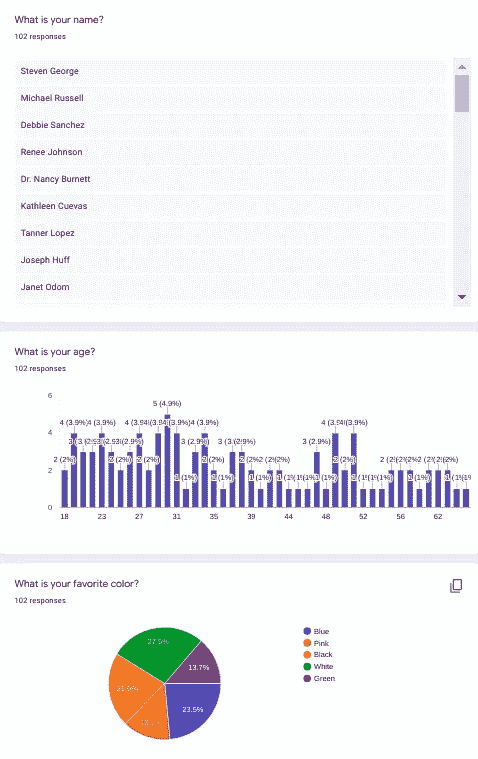

# 使用 Python 自动提交表单

> 原文：<https://towardsdatascience.com/automating-submission-forms-with-python-94459353b03e?source=collection_archive---------3----------------------->


照片由[格伦·卡斯滕斯-彼得斯](https://unsplash.com/@glenncarstenspeters?utm_source=medium&utm_medium=referral)在 [Unsplash](https://unsplash.com?utm_source=medium&utm_medium=referral) 拍摄

## 永远不要再填写提交表单

# 不用再填表格了

填写在线表格很烦人。然而，许多从事案头工作的人有时仍然不得不花相当多的时间填写在线表格。那么，为什么不使用 Python 来自动化这个过程并节省一些宝贵的时间呢？

在本文中，我将向您展示如何使用 Python 来自动化填写提交表单的过程。

如果你喜欢视频，请点击这里查看我的 Youtube 视频:

## 台阶

对于这个例子，我将创建一个简单的 google forms 调查，然后我将检查它以收集执行自动化所需的必要 web 元素。

总体步骤将是:

1.  **将您的答案设置为. csv 文件**
2.  **根据输入类型检查必要的网页元素**
3.  **设置网址和浏览器**
4.  **访问网址**
5.  **发送基于文本输入的按键**
6.  **发送复选框类型输入的点击**
7.  **访问并点击提交按钮完成**
8.  **循环访问数据库并为每个用户提交答案**

## 1.将您的答案设置为. csv 文件

为了简单起见，我在 google forms 上创建的表单由三个简单的问题组成:

1.  你叫什么名字？
2.  你多大了？
3.  你最喜欢什么颜色？

我知道我知道…非常原始，但这只是为了演示的目的，所以对我来说是赤裸裸的。实际的形式如下所示:



作者图片

现在，让我们建立一个. csv 文件来存储我们的答案。我将使用`faker`库、`numpy.rando.randint()`方法和熊猫来模拟一个简单的名字、年龄和颜色选择的数据库，作为最终的数据帧。

```
from selenium import webdriver
import pandas as pd
import time
import json
from datetime import datetime
import pathlib
import glob
import sys
sys.path.append(".")
import faker
import numpy as np
import pandas as pd

f = faker.Faker()
colors = ["Blue","Pink","Black","White","Green"]

names = [f.name() for _ in range(100)]
ages =  [np.random.randint(18,65) for _ in range(100)]
color_choices = [np.random.choice(colors,1)[0] for _ in range(100)]

database = pd.DataFrame(dict(names=names, ages=ages, colors = color_choices))
database.to_csv("submission_form_database.csv", index=False)
database.head()
```


作者图片

完美！现在我们有了数据库，让我们设置浏览器自动化。

## 2.根据输入类型检查必要的 web 元素

现在，我只需进入我的 google 表单的预览链接，或真实案例调查的实际网址，并根据输入类型收集不同问题的类别名称。

在这种情况下，我有三个问题，其中两个是基于文本的，一个是多选的，所以我通过按下`CTRL+Shift+I`检查问题中的每个元素，如果你在 chrome 中，然后转到:`copy -> copy element`，在那里我复制每个问题的元素，看起来应该是这样的:

*   问题 1 和 2 的 Web 元素:`<input type="text" class="quantumWizTextinputPaperinputInput exportInput" jsname="YPqjbf" autocomplete="off" tabindex="0" aria-labelledby="i1" aria-describedby="i2 i3" required="" dir="auto" data-initial-dir="auto" data-initial-value="">`
*   问题 3 的 Web 元素(多选)`<div class="appsMaterialWizToggleRadiogroupOffRadio exportOuterCircle"><div class="appsMaterialWizToggleRadiogroupOnRadio exportInnerCircle"></div></div>`

现在，我只是复制每种类型的类名，并把它和提交按钮的`xpath`一起设置为两个不同的变量:

```
text_question_element_class = "quantumWizTextinputPaperinputInput"
checkbox_question_element_class = "appsMaterialWizToggleRadiogroupOffRadio"
submit_element_class = '//*[@id="mG61Hd"]/div[2]/div/div[3]/div[1]/div/div/span/span'
```

太好了，现在我们已经为自动化部分做好了准备！

## 3.**设置网址和浏览器**

```
url = "https://forms.gle/WY7E9N8wkiMtziTD9"
driver = webdriver.Chrome(executable_path="./chromedriver")
```

这里，我们只是为提交表单的 url 和浏览器设置了变量，在我的例子中是 Google Chrome。要使用它，你需要下载 chromedriver，你可以在这里找到。

## 4.访问网址

```
driver.get(url)
```

## 5.为基于文本的输入发送按键

现在，我们编写一个函数，通过使用提供的 element 类来回答基于文本的问题。这个函数将把数据帧、类名、用户 ID 和控制浏览器的驱动程序作为输入，并提交适当的答案。

```
def answerNameAge(driver, df, element_class, user_id):
    name = df["names"][user_id]
    age = df["ages"][user_id]
    text_answers = [name, str(age)] # following the order in the form
    text_questions = driver.find_elements_by_class_name(element_class)
    for a,q in zip(text_answers,text_questions):
        q.send_keys(a)

    return driver
```

## 6.发送复选框输入的点击

现在，我们设置函数来填充复选框问题，对于这个问题，我们需要一个字典来匹配颜色和它们在表单中的相应顺序。

```
color_index_dict = {"Blue": 0, "Pink": 1, "Black": 2, "White": 3, "Green": 4}

def answerCheckBox(driver, df, element_class, user_id):
    color_answer = df["colors"][user_id]
    color_answer_index = color_index_dict[color_answer]
    driver.find_elements_by_class_name(element_class)[color_answer_index].click()

    return driver
```

太好了，现在我们要做的就是提交表单！

## 7.访问并单击提交按钮完成

在这里，我们只编写一个简单的函数来访问之前获得的提交按钮的`xpath`并单击它。

```
def submit(driver, element_class):
    driver.find_element_by_xpath(element_class).click()
    return driver
```

搞定了。现在，我们遍历数据库并提交每个用户的答案。

## 8.遍历数据库并提交每个用户的答案

让我们在包含数据的数据帧上创建一个简单的循环，然后一个接一个地提交答案。

```
df = pd.read_csv("./submission_form_database.csv")
text_question_element_class = "quantumWizTextinputPaperinputInput"
checkbox_question_element_class = "appsMaterialWizToggleRadiogroupOffRadio"

url = "https://forms.gle/WY7E9N8wkiMtziTD9"
driver = webdriver.Chrome(executable_path="./chromedriver")
for user_id in range(len(df)):
    driver.get(url)

    driver.maximize_window()
    driver = answerNameAge(driver, df, text_question_element_class, user_id)
    driver = answerCheckBox(driver, df, checkbox_question_element_class, user_id)
    driver = submit(driver, submit_element_class)
```

我们做到了，我们自动化了提交多个表单的枯燥过程！在我的谷歌表单回复统计页面上，我现在看到了这个:



作者图片

这对于经常发现自己填写具有相似结构的在线表单的个人，以及从事案头工作并必须为客户或其组织中的人员执行这些类型的提交的人来说可能是有用的。

# 为什么要自动化？

我们在网上做的任何可重复的任务都应该自动化，这样我们就可以只关注重要的事情。当试图检测可自动化的任务时，一件有用的事情是问:*我是否定期这样做？它是否涉及可重复的过程，很少或没有涉及明智的决策？*如果两个问题的答案都是肯定的，那么你应该自动完成这个任务。

在本文中，您了解了:

*   如何使用 Python 的`selenium`框架来自动化填写提交表单(如 google forms)的过程
*   自动化提交表单包括:用表单的数据建立一个数据框架，从所需的 web 地址检查 web 元素以了解如何导航在线表单，编写一个函数来回答基于输入类型的问题，编写一个简单的函数来点击相关的按钮，如提交按钮

如果你喜欢这篇文章，请在 [Twitter](https://twitter.com/LucasEnkrateia) 、 [LinkedIn](https://www.linkedin.com/in/lucas-soares-969044167/) 、 [Instagram](https://www.instagram.com/theaugmentedself/) 上联系我，并在 [Medium](https://lucas-soares.medium.com) 上关注我。谢谢，下次再见！:)