# 使用 AWS Textract，Lambda & DynamoDB 自动进行文本提取和数据预处理

> 原文：<https://towardsdatascience.com/automating-text-extraction-and-data-preprocessing-using-aws-textract-lambda-dynamodb-e3de318d9122?source=collection_archive---------7----------------------->

## 自动化是关键。任何时候，只要有一项耗时或手动的任务可以轻松地自动化，您就应该这样做。

数据科学家工作最重要的部分之一是自动化流程，这可以减轻耗时任务的负担，让您有时间处理更重要的事情。在本教程中，我们将介绍一个用于自动化文档文本提取的端到端 AWS 解决方案。我们将原始的和非结构化的文档组织起来进行解析。

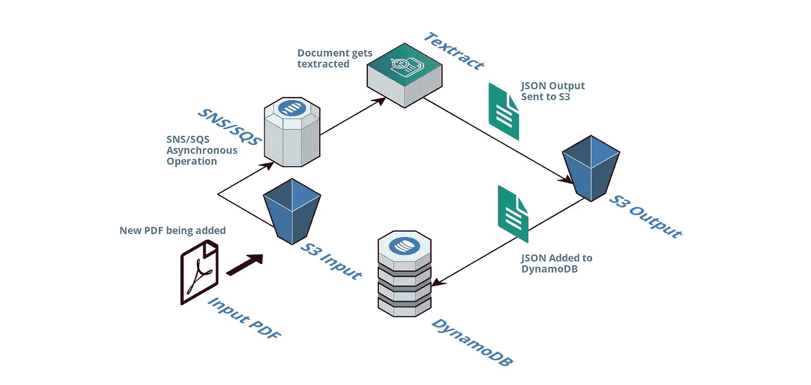

自动文本提取过程的流程图。图片作者。

## **目录:**

1.  **创建两个 S3 桶**
2.  **创建一个 Textract Lambda 函数& IAM 角色**
3.  **创建一个 DynamoDB 表**
4.  **创建一个 DynamoDB Lambda 函数& IAM 角色**
5.  **结论**

## 1-创建两个 S3 存储桶:

您需要创建两个 S3 存储桶，一个作为输入存储桶，另一个作为输出存储桶。您可以很容易地将这两者合并到一个桶中，但是，递归对于类似这样的 lambda 过程可能是有问题的——因此，在本教程中，我们将使用两个桶的解决方案。

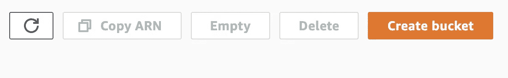

图片是来自 AWS 的屏幕截图。

当您创建此项目所需的资源时，请确保指定的区域保持不变。如果您为 S3 时段选择“us-east-2 ”,则所有其它资源也需要这样做。导航到 S3 控制台并单击“创建存储桶”,创建一个新的存储桶。您可以将这个存储桶命名为您想要的任何名称，但是，建议您坚持特定的命名约定——在我们的例子中，它将是“s3-json-input-bucket”。

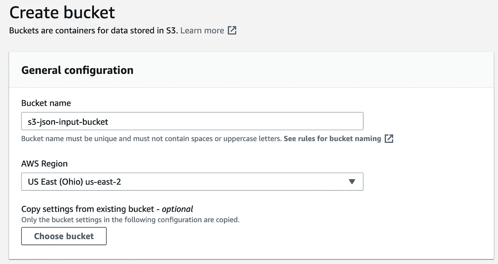

图片是来自 AWS 的屏幕截图。

一旦完成，您应该看到您的两个 S3 桶列在 S3 AWS 控制台下。

## 2-创建 Textract Lambda 函数和 IAM 角色:

有了 S3 桶，让我们继续创建我们的 Lambda 函数。在 AWS 中导航到 Lambda 控制台，然后单击“创建函数”。

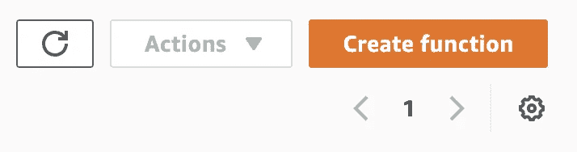

图片是来自 AWS 的屏幕截图。

选择“使用蓝图”选项，搜索“蓝图名称:s3-get-object-python”。单击“配置”,以便我们可以编辑一些设置。

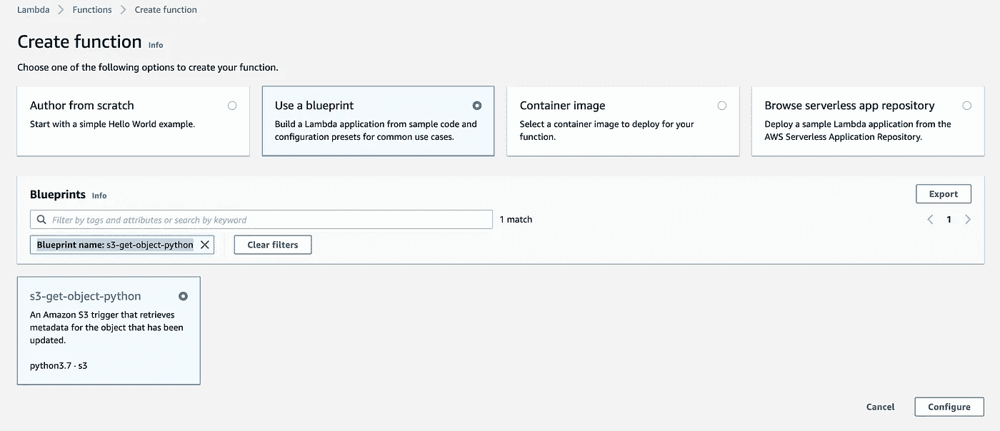

图片是来自 AWS 的屏幕截图。

继续输入一个函数名。最佳实践是根据 lambda 函数的用途来标记它。在这种情况下，我们将调用函数“textract-s3-to-json-function”。接下来，为名为“textract-s3-to-json-role”的函数创建一个新角色。命名的一致性有助于您在单独工作时记住每个资源的用途，或者有助于其他人在团队工作时轻松完成项目。在页面底部，选择感兴趣的特定 S3 存储桶——在我们的示例中，这将是我们之前创建的 s3-json-input-bucket”。我们将使用此输入区作为新 pdf 的“放置区”。一旦文件被放入，lambda 函数将被触发以触发 Textract 脚本。

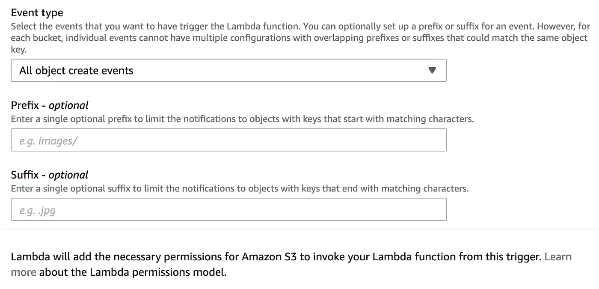

图片是来自 AWS 的屏幕截图。

您可以通过前缀(即仅查看特定目录中的文件)或后缀(即仅查看以.结尾的文件)来限制将应用此功能的文件。pdf)。这些是可选参数，如果需要，可以在以后添加。接下来，点击“创建函数”。

我们将使用 Boto——AWS 官方 python SDK——将该功能连接到我们的其他 AWS 资源。为了让这个 SDK 在我们的 Lambda 函数中工作，我们需要将它作为一个层上传。在屏幕的左侧，从菜单中选择“创建图层”。

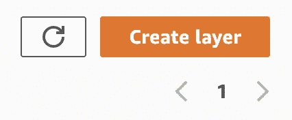

图片是来自 AWS 的屏幕截图。

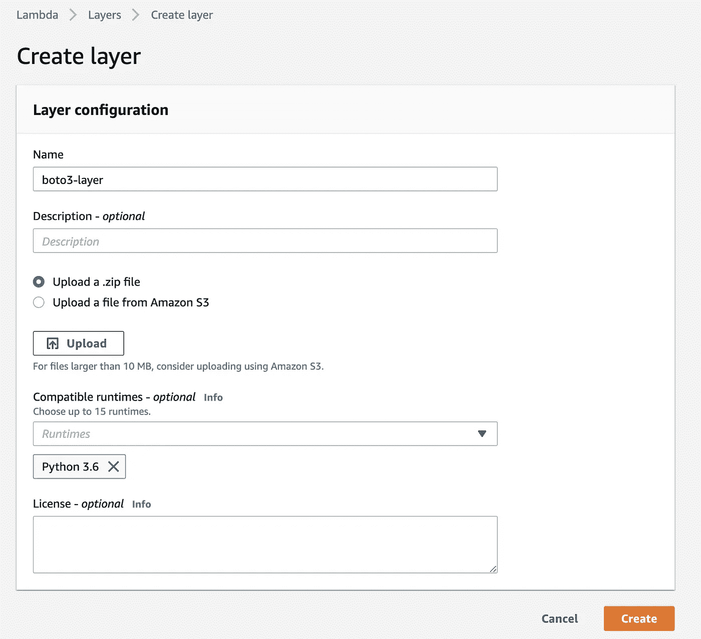

图片是来自 AWS 的屏幕截图。

通过上传一个可以从我的 [Github](https://github.com/alkhalifas/automated-aws-textract-dynamodb-using-lambda/blob/main/boto3-layer.zip) 中获取的 zip 文件来创建一个层。这将允许该函数使用 Boto。上传后，点击“创建”。导航回 lambda 函数，在屏幕底部，点击“添加层”。


图片是来自 AWS 的屏幕截图。

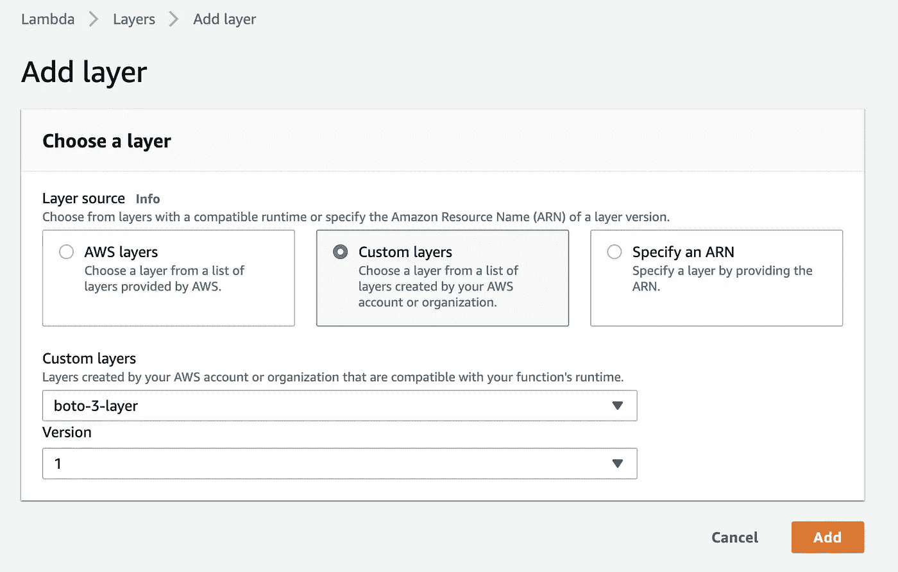

图片是来自 AWS 的屏幕截图。

在代码部分，继续用我的 [GitHub 文件](https://github.com/alkhalifas/automated-aws-textract-dynamodb-using-lambda/blob/main/s3_pdf_to_json_function.py)中的代码替换代码。这个代码片段将在第一个 S3 桶中接收任何传入的文档，通过 AWS textract 运行它们，然后将它们写回到第二个 S3 桶中。注意，这个 Github 文件中有两个字段需要替换:

*   **ARN 的角色(见于第 27 行)。**
*   **输出桶名(第 111 行)。**

您可以用在第一步中选择的存储桶名称替换输出存储桶名称。但是，ARN 角色需要替换为写在 IAM 控制台角色页面顶部的 ARN 角色。这将确保该功能可以使用与角色相关联的适当权限。

一些 pdf 文件需要比其他文件更长的分析时间。为了确保 pdf 不会在处理过程中超时，您需要延长超时限制。文档越大，分析时间就越长——该设置高度依赖于提交的文档。

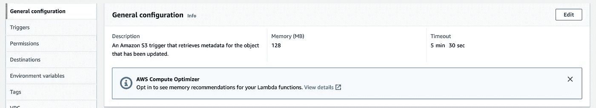

图片是来自 AWS 的屏幕截图。

完成功能设置后，我们现在可以编辑角色，以确保配置了所有必要的权限。在 AWS 中导航到 IAM 控制台，搜索我们之前创建的名为“textract-s3-to-json-role”的角色。

ARN 角色将在本页顶部注明，这与您之前配置 Python 代码时需要的 ARN 角色相同。

导航到权限部分，添加我们将需要的其他资源:

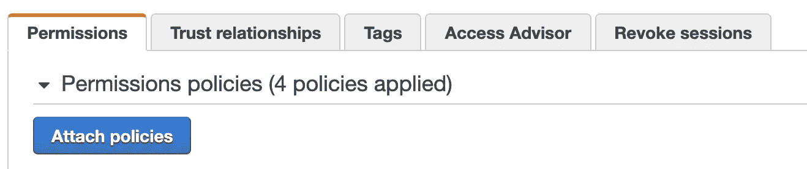

图片是来自 AWS 的屏幕截图。

除了已经指定的两个，我们将需要“AmazonS3FullAccess”和“AmazonDynamoDBFullAccess”。继续并附加那些策略。

在下一个名为“信任关系”的选项卡上，确保关系如下:

```
{
 “Version”: “2012–10–17”,
 “Statement”: [
 {
 “Effect”: “Allow”,
 “Principal”: {
 “Service”: “lambda.amazonaws.com”
 },
 “Action”: “sts:AssumeRole”
 }
 ]
}
```

完成这两个步骤后，您现在可以将 pdf 文件放入“输入”桶，这将自动提取文件的文本并将它们作为 JSON 上传到“输出”桶。很漂亮吧？

## 3-创建一个 DynamoDB 表

完成 textract 部分后，现在让我们把注意力集中在设置表上。在 AWS 中导航 DynamoDB 控制台，并单击“创建表”。

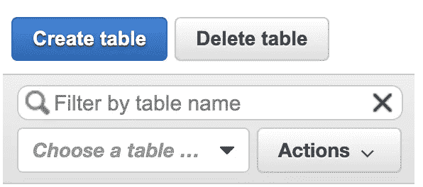

图片是来自 AWS 的屏幕截图。

输入表名和主键。在我们的例子中，我们称主键为“id”。但是，您可以根据自己的需要，使用数据中的任何其他唯一 ID 来重命名该字段。继续并点击屏幕底部的“创建”。

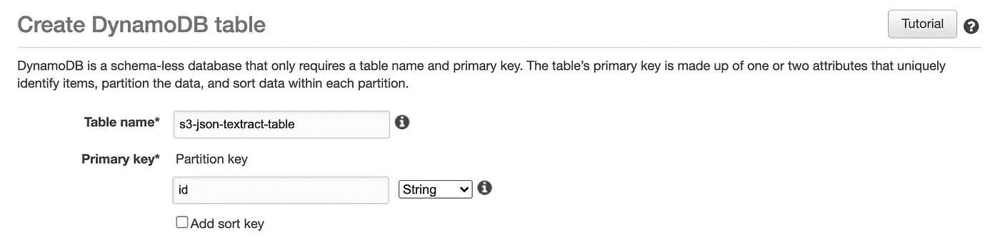

图片是来自 AWS 的屏幕截图。

创建完成后，您应该会在屏幕右侧看到填充的表格。

## 4-创建 DynamoDB Lambda 函数和 IAM 角色:

与前面的 Lambda 函数类似，继续重复创建函数、添加 boto 层和更改相关角色的权限的相同过程。请注意，这个函数和另一个函数之间会有一些细微的差别:

1.  确保相关的触发器指向输出桶。记住，这里的想法是第一个函数的输出将是第二个函数的输入。
2.  确保与该函数相关的代码不会重新运行 textract，而只是获取 JSON 输出并通过 DynamoDB 运行它。从下面复制代码片段，或者从我的 [GitHub 文件](https://github.com/alkhalifas/automated-aws-textract-dynamodb-using-lambda/blob/main/json_to_dynamodb_function.py)复制。

```
import json
import boto3
import os
import urllib.parse
import json
import uuid
from decimal import Decimals3_client = boto3.client(‘s3’)
dynamodb = boto3.resource(‘dynamodb’)def lambda_handler(event, context): 
    print(“Starting Transfer:”)
    bucket = event[‘Records’][0][‘s3’][‘bucket’][‘name’]
    json_file_name = urllib.parse.unquote_plus(event[‘Records’][0][‘s3’][‘object’][‘key’], encoding=’utf-8')
    json_object = s3_client.get_object(Bucket = bucket, Key = json_file_name)
    jsonFileReader = json_object[‘Body’].read()
    jsonDict = json.loads(jsonFileReader, parse_float=Decimal)
    table = dynamodb.Table(‘s3-json-textract-table’) 
    finalObject = jsonDict[0]
    finalObject[“key”] = json_file_name
    finalObject[‘id’] = str(uuid.uuid4())
    table.put_item(Item = jsonDict[0])
```

3.最后，确保该函数的 IAM 角色包括 DynamoDB 的权限和 S3 完全访问权限。您可以通过导航到 IAM 控制台，搜索角色名称，并在权限部分下添加 DynamoDB 和 S3 来添加这些角色。

## **5 —结论**

至此，您应该已经准备好了！当您使用 PDF 文件填充输入 S3 存储桶时，这将触发第一个 lambda 函数对您的文件应用 Textract OCR，并将 JSON 格式的输出发送到输出存储桶。一旦进入输出桶，第二个 lambda 函数将被触发，并将新创建的 JSON 文件传输到 DynamoDB。虽然本教程主要面向 PDF 文件，但 Textract 也能够处理图像。来吧，自己试试这个！