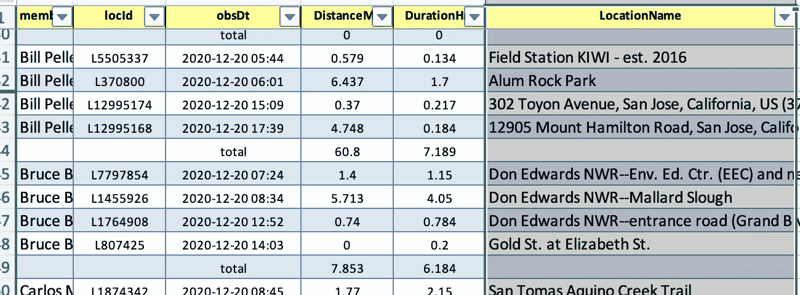

# 自动化圣诞鸟计数:Redux

> 原文：<https://towardsdatascience.com/automating-the-christmas-bird-count-redux-9dd308fed225?source=collection_archive---------65----------------------->

## 什么有效，什么无效


作者笔下的鱼鹰

在之前的一篇文章 [*中，我描述了一个一年一度的观鸟活动如何自动化的愿景。随着 2020 年*](/automating-the-christmas-bird-count-c884328ae8ab)*[第 121 届圣诞鸟数](https://www.audubon.org/conservation/science/christmas-bird-count)的结束，让我们看看哪些可行，哪些不可行。*

在这个疫情年，自动化成了这个过程中的一个必要部分。由于公共卫生命令，包括旧金山和奥克兰在内的一些地方计数被完全取消。其他的计算也可以进行，但是有一套严格的规则来确保社会距离。这也意味着许多国家积极鼓励使用 eBird 来收集数据。

这样做的一个结果是有大量的一个或两个人的团队。这给部门领导和编纂者带来了更多的工作。在不止一种情况下，这导致计数的取消。使用这个工具，合并清单变成了几分钟的任务，而不是几天。

在计数之前，我已经将我认为对计数领导者最重要的工具的工作进行了优先排序。套用老赫尔穆特·冯·毛奇的一句名言，这个计划在与敌人的接触中失败了。在投票之前和之后的日子里，软件变化很快。此时，它正在生成准确而有用的数据，并且通过现场测试得到了极大的改进。

# 名字

因为仅仅谈论“工具”会让人感到困惑，所以我被鼓励给整个包起一个名字。我称它为[伽马射线 Corvi](https://en.wikipedia.org/wiki/Gamma_Corvi) ，以乌鸦星座中最亮的星星命名。这不是一个不寻常的名字，如果你想象这个包的目的之一是[数乌鸦](https://en.wikipedia.org/wiki/Counting_Crows) …

# Gamma Corvi 概述

Gamma Corvi 中的工具目前以 Jupyter Python 笔记本的形式出现。使用的两个主要工具是服务解析和服务计数。Service-Parse 的主要任务是为计数生成一个带注释的、标准化的清单版本。这项工作是为我参与的两个项目提前完成的，这两个项目是圣荷西(CASJ)和卡莱罗-摩根山(CACR)。许多改进来自帕洛阿尔托(CAPA)和蒙特里半岛(营地)的类似工作。


CASJ 2020 标准化清单之首

第二个工具 Service-Count 有多个阶段，包括从 eBird 检索数据，为每个部门创建详细的报告，然后将这些报告合并成一个总结报告，该报告可用于将数据输入到 Audubon 官方网站供编译器使用。

# 合并

整个软件包的最大优势之一是能够将计数数据合并到一个主列表中，该列表是按分类学排序的。

为了进一步说明这一点，让我们看一个 FeederWatch 示例。CASJ 的主要清单有 206 个物种和变种。一组 FeederWatch 数据是通过电子邮件发送过来的。这是手动转换成一个 CSV 文件与 32 个物种和计数，没有特定的顺序。将此作为一列输入计数摘要非常繁琐:浏览摘要以找到物种，输入计数，然后继续下一个物种。

然而，当使用服务计数工具时，我们只是将 CSV 文件放在输入目录中，它被合并为一个单独的列。大获全胜。

# 总结报告

总结报告有六页，下面我将展示其中的一些。编译器的主要用途是汇总所有部门汇总的小计。


CASJ 2020 最终清单的一部分

每个扇区都有自己的列，添加到“总计”列中。向 Audubon 站点输入数据时，total 为零且“Category”字段不是“species”的行将被过滤掉。通常这是按‘分类顺序’排序的，但按‘NACC _ 排序 _ 顺序’排序会按奥杜邦的顺序排列。

稀有物种表显示了一些物种的快速总结，这些物种要么被编辑者明确标记为稀有，要么在主要清单中缺失。


CASJ 2020 珍奇物品单

个人详细信息表显示了计数圈内归档的每个清单的有用信息。


CASJ 2020 个别细节部分

这里的一些关键字段是地点名称、评论和 eBird 上的清单的可点击链接。

# 自动派对

Autoparty 不是一些涉及机动车辆的节日，它是我用来描述基于 eBird 数据自动创建聚会的名称。今年这一点非常重要，因为社交距离措施迫使许多小党派加入。



CASJ 2020 汽车派对表部分

这通过将地点 ID 和观察时间与相应清单上的人分组来创建当事人。填写党的努力和时间被大多数领导人认为是一个主要的痛点，今年更糟。Autoparty 可以提供帮助。

# 部门摘要

很难手工构建的部门摘要的一个特征是按地点和时间分组。


CASJ 2020 明矾岩板块概要

上图显示了这一关键特性，为了清晰起见，删除了一些列。Bill 和他的妻子 Kitty 在两个地点(L12060407 和 L12988268)观鸟。没有显示 Kitty，因为他们创建了一个共享的清单。蓝色的列显示了比尔和约翰都获得了 L370800 的情况。他们在不同的时间出现在那里，并且没有共享一个清单。前两个位置使用求和函数，因为没有重复。最后两列使用了一个 MAX 函数，因为我们想避免两次计算鸟的数量。这就引出了“总计”栏中的公式:

```
=SUM($I2:$Q2)+MAX($R2:$W2)
```

注意，我在这里隐藏了列，但是$I 到$Q 是所有不重复的位置，而$R 到$W 是用于 L370800 的。如果有更多的重复位置，那么在“总计”公式中，每个位置都有一个最大分组。

如果我们有一个好的系统来指定参与方，这可以用来为“总计”字段生成适当的公式。无论如何，这肯定是要自动化的事情，因为 CASJ 2020 的统计中包括了 198 份清单。

# 地图

通常，展示大量数据的最佳方式是使用图形。这可能很有启发性，但是交互式图形更好。为了全面了解每个人在哪里观鸟，我用叶子制作了一张地图。


CASJ CBC 2020 活动

这显示了 12–20–20 日加州圣何塞计数圈内 eBird 中的每个观察值。带数字的圆圈是观察的集群，点击它们可以显示出来(在地图的交互式版本中)。有几个不同的层，可以打开和关闭。

正如你在上面的地图上看到的，在常青星区有很多观察者，但是根本没有人观察贝里萨星区和卡拉维拉斯星区。

个人观察有一个带有双筒望远镜图标的标记。标记工具提示显示了观察的详细信息，并包括一个指向基本 eBird 清单的可点击链接。这篇[文章](https://medium.com/@nchristiansen/making-an-interactive-web-map-in-python-with-folium-part-2-map-makery-d40db1d4101a)是弄清楚如何让这些层正常工作的关键。

我认为这可以成为明年统计的一个很好的计划工具。

# eBird 规则

科内尔最近发表了一篇文章 [*记录你的圣诞鸟数*](https://ebird.org/news/ebirding-your-christmas-bird-count-updated) 。这主要描述了如何使用 eBird 进行精确计数。除了他们的建议之外，我还要补充以下几点:

*   在每一个新的地点开始一份新的清单，或者如果聚会分裂了。
*   汇编者和行业领导者应分发首选位置/热点名称列表。这使得判断多人是否在同一个地点观鸟变得更加容易。请注意，如果两个位置之间的距离在 150 米以内，代码会认为它们是相同的，因此这有所帮助。
*   物种计数不要用‘X’；而是粗略的猜测一下(10，50，100，1000 等。).我设置‘X’等于 3(一，二，多)；参见*[*皮拉人*](https://en.wikipedia.org/wiki/Pirahã_people) *。**

# *视窗网际网路名称服务*

*   *手工将多个清单中的数据合并到一个主清单中是一件极其痛苦的事情。为此使用 Gamma Corvi，即使大部分数据不是来自 eBird，它本身也是值得的。*
*   *一位与会者说，“使用伽马射线 Corvi 节省的时间让我们能够参与另一次计数”。*
*   *Gamma Corvi 用于提供三个计数圈的数据。对于一个 alpha 版本来说还不错。*

# *损耗*

*   *可填充的 pdf 应该很容易获胜，但是人们似乎不愿意使用它们。至少，Audubon 应该使稀有鸟类表单可填充(我在 GitHub 库中有一个)。*
*   *其他数据(如以 CSV 文件形式提供的 FeederWatch 数据)仍涉及一些手动步骤。*
*   *eBird 有 200 个清单的限制，这是整个县一天的清单。幸运的是，我们在这一点上勉强过关，但这一限制显然必须提高。*
*   *管理聚会时间和工作量的过程仍然很乏味，但是自动聚会功能很有帮助。参与者列表管理是一个需要关注的领域。*
*   *需要将这些代码制作成 web 服务，以便部门领导和汇编人员能够访问。例如，康奈尔大学可能希望将它放在他们的服务器上。*

# *我最喜欢的功能*

*   *节省时间的合并功能*
*   *规划图*
*   *自动党表*

*代码和例子见 [GitHub 库](https://github.com/jhurley13/automatingcbc.git)。我计划改进代码，并希望很快将其用于春夏计数和鸟类马拉松。*

# *参考*

*<https://github.com/jhurley13/automatingcbc>  <https://www.audubon.org/conservation/science/christmas-bird-count>  <https://ebird.org/news/ebirding-your-christmas-bird-count-updated> *