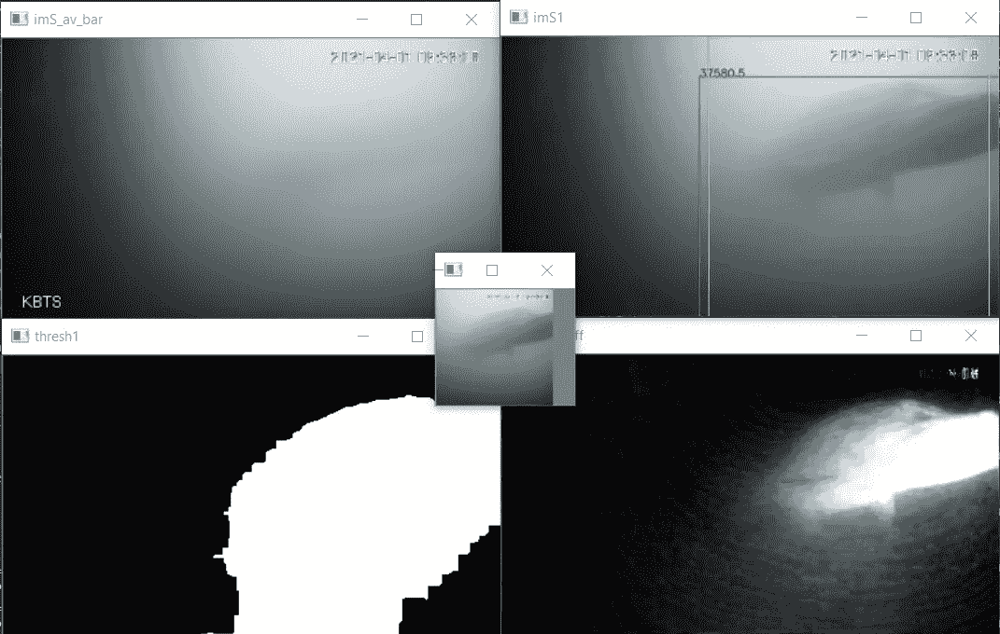

# 鱼网:自动鱼门铃

> 原文：<https://towardsdatascience.com/automating-the-fish-doorbell-a668285728d6?source=collection_archive---------40----------------------->

## 使用机器学习和计算机视觉支持鱼类洄游

许多不同的鱼类每年都要长途跋涉才能到达它们的繁殖地。如今，由于水闸等障碍，这一旅程变得更加困难。乌特勒支的 Weerdsluis 是沿着一条受欢迎的鱼类迁徙路线设置的水闸之一。为了提高认识，与乌得勒支市共同发起了一项倡议:T2 鱼门铃。在这里，用户可以观看船闸处的实时水流，如果他们发现了一条鱼，就会“按铃”。然后锁可以打开，让任何等待的鱼通过。这个倡议很快就像病毒一样传播开来，门铃被按了[超过 10 万次！](https://www.rtvutrecht.nl/nieuws/2184860/visdeurbel-gaat-offline-maar-niet-getreurd-hij-komt-volgend-jaar-terug.html)

乌特勒支的 Weerdsluis，图片来自[维基媒体](https://commons.wikimedia.org/wiki/File:Weerdsluis_Utrecht.jpg)

尽管这显然是一场提高意识的活动，但我们开始想知道是否有一种方法可以自动检测这些鱼，这样即使没有人观看溪流，它们也可以通过。我们使用图像处理方法和深度学习创建了一个解决方案。

# 我们的解决方案

那么我们到底如何才能检测到这些鱼呢？我们提出了一个由两步组成的解决方案:

*   使用传统的图像处理从包含运动的静止视频中提取碎片
*   使用快速简单的卷积神经网络(CNN)来确定图像块是否包含鱼。

**图像处理**

鱼可见的时间只占直播的一小部分。我们希望收集潜在鱼类游过的图像，并希望这些图像包含尽可能多的有用信息。
为了做到这一点，我们决定实施一种[背景减法](https://en.wikipedia.org/wiki/Foreground_detection)方法来检测运动并获得包含没有背景的鱼的图像块。“数据收集”一节**解释了我们是如何做到这一点的。**检索到的图像块然后被调整到 100x100 像素的分辨率，并被送入下一部分:CNN。

**网络**

该模型应该能够实时工作，以便与直播工作。我们也更喜欢网络只使用有限的训练数据。我们选择使用一个简单的 CNN 进行鱼类分类。该网络仅由两个卷积层和两个全连接层组成。由此产生的网络架构如下图所示。在一些测试中，我们发现增加更多的层并没有显著的积极效果，但是仍然有优化的空间。

通过[https://bit.ly/3vlnkuU](https://bit.ly/3vlnkuU)获得的网络架构

# 收集和注释数据

因为我们是作为监督学习任务来处理的，所以我们需要一些带注释的数据来训练我们的网络。由于游过 Weerdsluis 的鱼的公共注释数据集并不存在，我们不得不创建自己的数据集。

**数据收集**

我们直接从 [visdeurbel.nl](http://visdeurbel.nl/) 读取直播，为此我们使用了 OpenCV 和从网站上提取的直播 url。使用[指数加权移动平均](https://en.wikipedia.org/wiki/Moving_average#Approximating_the_EMA_with_a_limited_number_of_terms) (EWMA)，我们获得了一个移动的背景流图像，如下图左上角所示。这个背景图像不会包含快速移动的物体，如鱼，并且会随着白天的光照条件而变化。

数据收集器的快照，左上:背景图像，右上:带有边界框的视频帧，左下:阈值，右下:减去背景后的帧-作者提供的图像

接下来，我们对视频的最新帧的背景图像执行简单的数字减法，并将结果放大五倍，以获得仅包含移动对象的图像，如本视频所示。

背景减除的视频流——作者根据[原始来源](https://www.youtube.com/watch?v=45khuKKECyw)制作的视频

最后，我们在图像上应用过滤器并执行阈值操作，从而产生包含运动物体轮廓的遮罩。如果轮廓超过一定的大小，并且可以跟踪 20 帧，我们将保存一帧视频以及减影图像的 100×100 像素块。在仅仅 2-3 天的时间里，我们收集了超过 7000 种潜在鱼类的照片。

**数据标注**

因为注释成千上万的图像补丁听起来并不吸引我们，所以我们想让它尽可能简单。为此，我们编写了一个单独的脚本: *annotator.py.* 这个脚本加载还没有被注释的图像补丁，然后允许用户通过一次按键来标记它们。它还会统计注释的总量、当前会话中的注释量以及您每分钟的平均注释量，有时会达到每分钟 55 个以上的注释。我们区分两类:鱼(30%)和非鱼(70%)。我们也可以将图像归类为不清晰，之后在训练中忽略。我们最终注释了大约 3000 个样本，其中 2500 个是清晰的，用于我们的网络。

数据标注工具快照—图片由作者提供

# 训练网络

我们使用 TensorFlow 2 和 Keras 构建了网络。我们使用 Adam 作为优化器，使用二进制交叉熵损失作为损失函数。我们使用 80/20 的训练测试分割。训练网络真的很快，在普通笔记本电脑上只需要一分钟左右。我们做了一些简短的实验，看看什么样的超参数最适合我们的问题。在未来的工作中，我们希望进行更广泛的超参数优化，以获得最佳结果。

# 结果

下图显示了训练和测试数据集在训练时期数量上的准确度曲线。奇怪的是，测试精度曲线在 20 个时期后变平，但随着模型过度拟合，不会进一步降低。对于最佳模型，我们在大约 10 个时期后使用早期停止。

精确度曲线

这里画出了模型的损失。随着训练损失接近于 0，测试损失继续增加。我们的假设是，网络试图使训练损失尽可能接近于 0，但在这样做的过程中，预测错误的预测越来越多。这不会对准确性产生负面影响，但会增加这种预测的损失，从而增加总体测试损失。

损失曲线

这里绘制了 ROC 曲线。该模型实现了高的真阳性率(或召回率)，即使是在相对低的假阳性率下。这意味着该模型能够非常频繁地检测到鱼，而当对象不是鱼时，将对象分类为鱼的机会非常低。这对于这种应用尤其重要，因为我们不希望水锁无缘无故被打开。

受试者工作特征曲线

# 项目的状态

我们这个项目的计划是让这个模型对鱼进行实时分类。然而，到目前为止，我们只能在同一天收集的图像块上测试该模型。当我们想用直播实现这个模型时，我们发现鱼门铃刚刚离线[到 2022 年春天](https://www.dutchnews.nl/news/2021/06/utrecht-migrating-fish-will-keep-their-doorbell-next-season/)，我们再也不能用直播演示这个模型了。
我们希望在某个时候能够用视频数据展示这个模型的工作情况。如果是这样的话，我们一定会用我们的结果更新这篇博文。

Simon 已经为 FISH-Net v2 编制了一个主要和次要的更改列表，包括更好的背景过滤、数据收集值嵌入等。所以明年一定要收听更多。

# 接触

西蒙·范·伊登~ 5185734
[simonvaneeden@hotmail.com](http://simonvaneeden@hotmail.com)
沃特·德·勒乌~ 4487753
[w . f . deleeuw @ student . tudelft . nl](http://w.f.deleeuw@student.tudelft.nl)

*如需获取本项目中使用的源代码，请发送电子邮件至:*[*simonvaneeden@hotmail.com*](http://simonvaneeden@hotmail.com)