# 自动化 SageMaker Studio 自定义图像的设置

> 原文：<https://towardsdatascience.com/automating-the-setup-of-sagemaker-studio-custom-images-4a3433fd7148?source=collection_archive---------17----------------------->

## 在工作室域中连续交付自定义图像的分步指南

Amazon SageMaker Studio 是一个完全集成的 IDE，它统一了管理您的 ML 项目和与您的团队成员协作所需的工具。

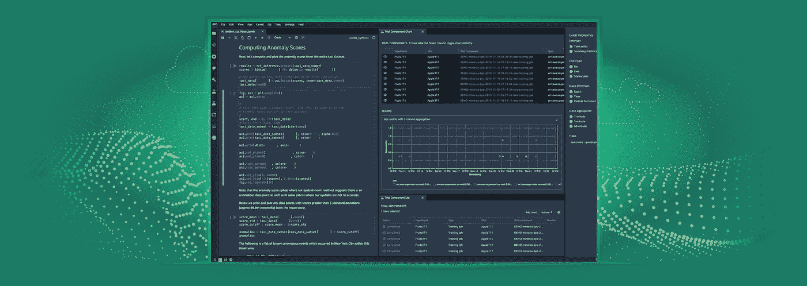

来源:[亚马逊 SageMaker](https://aws.amazon.com/sagemaker/)

除了为运行您的笔记本提供[预建图像](https://docs.aws.amazon.com/sagemaker/latest/dg/notebooks-available-kernels.html)，SageMaker Studio 还允许您创建包含您最喜欢的库的容器，并将它们作为自定义图像附加到您的域中。

在大多数大型企业中，ML 平台管理员将管理这些自定义图像，以确保工作室用户仅使用经批准的库。如果手动完成，这可能会给管理员带来运营开销。

在这篇文章中，我将展示如何通过为您的自定义图像实现简单的连续交付来实现 Studio 域设置的自动化。

照片由[拉希德](https://unsplash.com/@rashidgrey?utm_source=unsplash&utm_medium=referral&utm_content=creditCopyText)在 [Unsplash](https://unsplash.com/photos/S4ve7XLNmOc?utm_source=unsplash&utm_medium=referral&utm_content=creditCopyText) 上拍摄

我们将基于 Tensorflow 2.5.0 创建一个自定义图像，并将其附加到工作室域。我们将使用 CodeCommit、CodeBuild 和 CodePipeline 来连续交付定制图像。在您的环境中随意使用您选择的任何 CI/CD 工具。该堆栈打包在一个 CloudFormation 模板中，因此您可以按需重复设置。

访问[将您自己的定制容器图像带到 Amazon SageMaker Studio 笔记本](https://aws.amazon.com/blogs/machine-learning/bringing-your-own-custom-container-image-to-amazon-sagemaker-studio-notebooks/)、 [SageMaker Studio 定制图像示例](https://github.com/aws-samples/sagemaker-studio-custom-image-samples)和[代码管道教程](https://docs.aws.amazon.com/codepipeline/latest/userguide/tutorials.html)可能是一个好的开始，如果这些东西对您来说听起来很新的话。

# 演练概述

我们将分三步解决这个问题:

*   我们将首先启动一个堆栈来创建一个 CodeCommit repo、一个 CodeBuild 项目和一个 CodePipeline 管道。
*   然后，我们将把定制图像 Dockerfile、configs 和 buildspec.yaml 推入代码报告中。这将触发管道。
*   一旦映像被附加到域，我们将在 Studio 中推出一个带有自定义内核的笔记本。

# 先决条件

要浏览此示例，请确保您具备以下条件:

1.  这是建立在 SageMaker Studio 的自定义图像功能之上的。在开始之前，确保你熟悉[这个博客](https://aws.amazon.com/blogs/machine-learning/bringing-your-own-custom-container-image-to-amazon-sagemaker-studio-notebooks/)和[那些代码样本](https://github.com/aws-samples/sagemaker-studio-custom-image-samples)。
2.  访问[亚马逊 SageMaker 工作室环境](https://docs.aws.amazon.com/sagemaker/latest/dg/gs-studio-onboard.html)，熟悉[工作室用户界面](https://docs.aws.amazon.com/sagemaker/latest/dg/studio-ui.html)。
3.  拥有自定义图像的 IAM 角色。当您运行映像时，会将权限授予该映像。例如，您可以使用您的 Studio 用户配置文件角色 arn。
4.  这个 [GitHub 库](https://github.com/SofianHamiti/amazon-sagemaker-studio-image-pipeline)克隆到您的环境中

# 步骤 1:启动云形成堆栈

## 架构概述

首先，我们需要基于[模板](https://github.com/SofianHamiti/amazon-sagemaker-studio-image-pipeline/blob/main/template.yaml)创建一个 CloudFormation 堆栈。

下面是设置的架构概述:

堆栈将创建一个 CodeCommit repo，我们将在其中推送 Dockerfile、configs 和 [buildspec.yaml](https://github.com/SofianHamiti/amazon-sagemaker-studio-image-pipeline/blob/main/tf25/buildspec.yaml) 。它还将创建一个 CodePipeline 管道和一个 CodeBuild 项目。CodeBuild 项目将负责执行 buildspec.yaml 文件来构建容器映像并将其推送到 ECR，并将其附加到 Studio 域。该模板还将创建基本的 SageMaker 映像和其他有用的资源，如 IAM 角色。

## 在您的帐户中创建堆栈

要创建堆栈，请执行以下步骤:

*   导航到 [AWS CloudFormation](http://aws.amazon.com/cloudformation) 控制台页面。确保您是从与 SageMaker Studio 域相同的 AWS 区域执行此操作的
*   选择**上传模板文件**用[模板](https://github.com/SofianHamiti/amazon-sagemaker-studio-image-pipeline/blob/main/template.yaml)创建堆栈

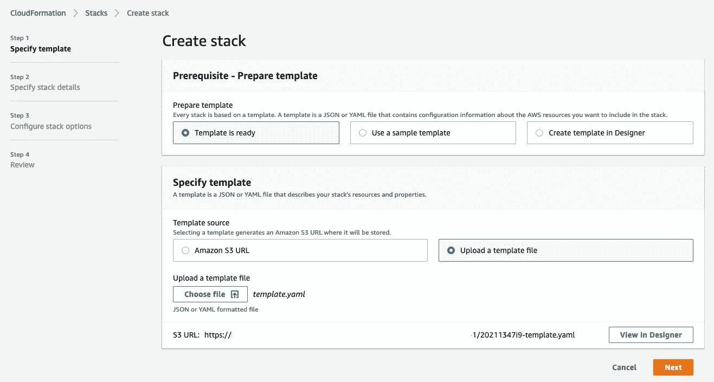

作者图片

*   选择**下一个**

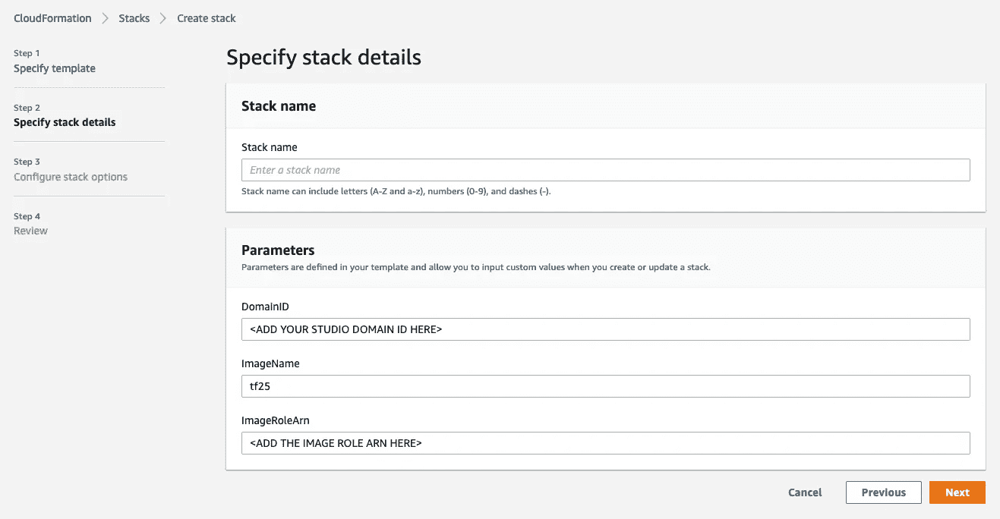

作者图片

在这里，您需要为图像输入一个堆栈名称、SageMaker 工作室*域 ID* 和*角色 ARN* 。您可以让 *ImageName* 保持原样。

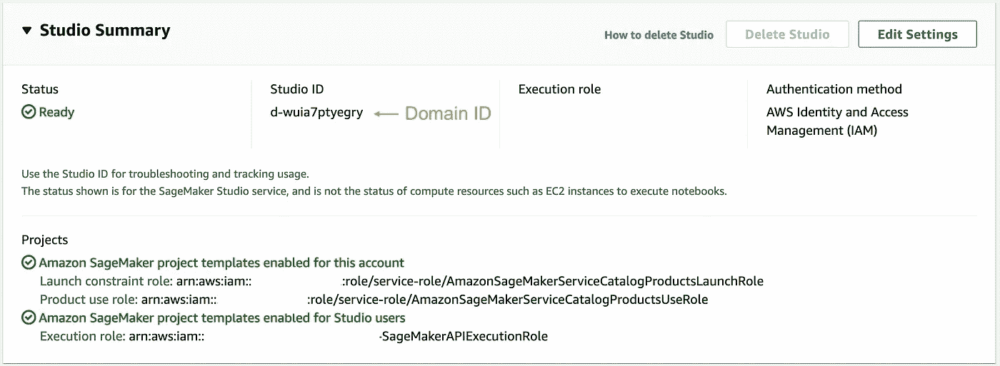

作者图片:你可以在 SageMaker Studio 控制台页面找到你的工作室 ID

*   选择**下一步**
*   将所有选项保留为默认，直到您到达最后一个屏幕
*   选择**我承认 AWS CloudFormation 可能会创建 IAM 资源。**

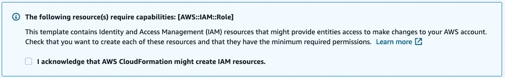

作者图片

*   选择**创建**

这需要几分钟才能完成。

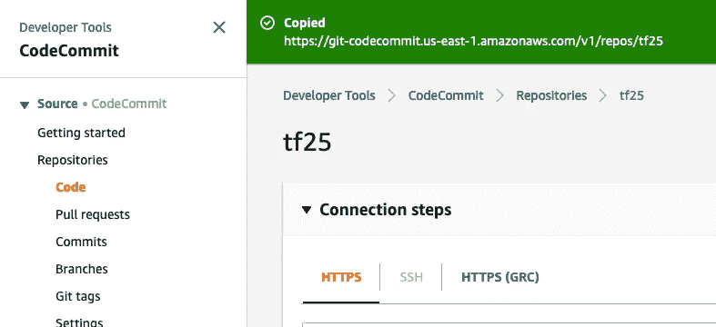

Image by author:完成后，您可以将创建的 CodeCommit repo 克隆到您的环境中

# 步骤 2:用您的映像更新代码报告

接下来，您需要将 tf25 文件夹[中的内容推送到 CodeCommit repo 中。](https://github.com/SofianHamiti/amazon-sagemaker-studio-image-pipeline/tree/main/tf25)

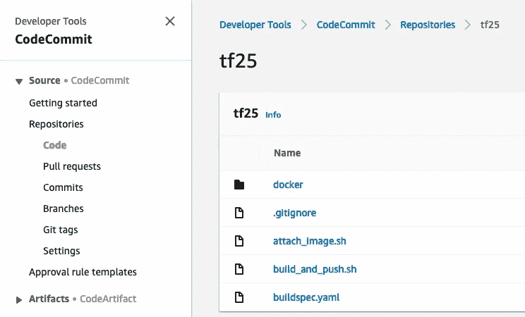

作者图片:这里我将代码推送到回购的主分支

以下 buildspec.yaml 将由 CodeBuild 执行:

它将运行 [build_and_push.sh](https://github.com/SofianHamiti/amazon-sagemaker-studio-image-pipeline/blob/main/tf25/build_and_push.sh) 根据这个 [Dockerfile](https://github.com/SofianHamiti/amazon-sagemaker-studio-image-pipeline/blob/main/tf25/docker/Dockerfile) 将容器映像推送到 ECR，并运行 [attach_image.sh](https://github.com/SofianHamiti/amazon-sagemaker-studio-image-pipeline/blob/main/tf25/attach_image.sh) 将 ECR 映像附加到 Studio。

在将映像推送到 ECR 之前，您还可以在这里运行进一步的林挺和测试。您还可以在 ECR 存储库上启用[图像扫描](https://docs.aws.amazon.com/AmazonECR/latest/userguide/image-scanning.html)来识别常见的漏洞。

一旦代码被推送到 repo 的主分支，您就可以导航到 CodePipeline 并看到您的管道正在运行。

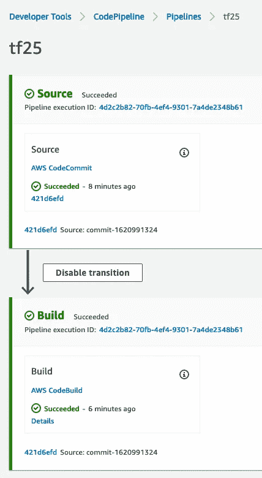

几分钟后，您应该会看到您的 Studio 域更新了最新版本的自定义图像。

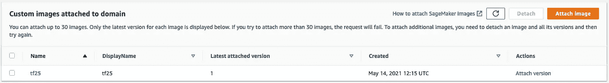

作者图片

从现在开始，每次你提交，Studio 都会自动获得你自定义图像的新版本。

## 如果您有多个自定义图像

[update-domain-input . JSON](https://github.com/SofianHamiti/amazon-sagemaker-studio-image-pipeline/blob/main/tf25/docker/update-domain-input.json)是用于使用自定义映像及其配置更新您的域的配置。

在这个例子中，我运行了 [attach_image.sh](https://github.com/SofianHamiti/amazon-sagemaker-studio-image-pipeline/blob/main/tf25/attach_image.sh) 中的 **sagemaker update-domain** 命令。如果您有多个自定义映像，您可以将域配置文件保持为全局的，并独立于各个映像管道运行更新命令。

# 步骤 3:在 Studio 中使用自定义图像

现在你[可以在 Studio 中使用自定义图像内核](https://docs.aws.amazon.com/sagemaker/latest/dg/studio-byoi-launch.html)

你会看到它出现在工作室启动器中，并可以用它运行你的笔记本。

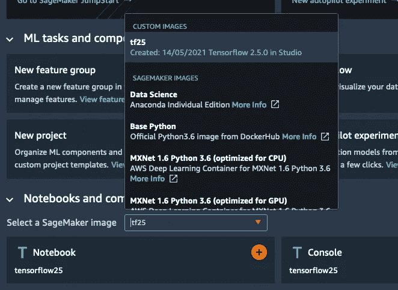

我们现在可以在 SageMaker Studio 中使用 Tensorflow 2.5.0 了！

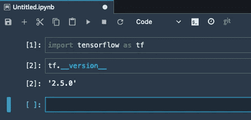

作者图片

# 结论

通过自定义图像，您可以在 Studio 中运行带有您最喜欢的库的笔记本。在这篇文章中，我们自动化了图像设置，这样 ML 平台管理员就可以自动创建、版本化和附加它们到一个 Studio 域。

为了进一步自动化设置，您还可以使用本博客中使用的 CloudFormation 模板创建一个[服务目录产品](https://service-catalog-tools-workshop.com/servicecatalog.html)。您还可以尝试 Lijo 的这个示例自定义图像。它允许 Studio 用户在他们的笔记本上本地运行 PySpark。