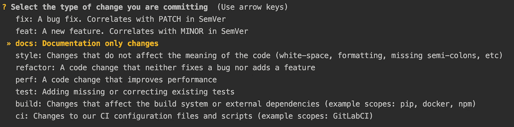

# 为您的 Python 项目自动化版本标签和变更日志

> 原文：<https://towardsdatascience.com/automating-version-tags-and-changelogs-for-your-python-projects-6c46b68c7139?source=collection_archive---------17----------------------->

## 基于项目的提交历史，使用 commitizen 实现版本标签和变更日志自动化的实践指南


由 [Yancy Min](https://unsplash.com/@yancymin?utm_source=medium&utm_medium=referral) 在 [Unsplash](https://unsplash.com?utm_source=medium&utm_medium=referral) 上拍摄的照片

厌倦了跟踪您的代码变更是否保证次要或主要版本增量？太忙而不能保持一个整洁的日志？尝试使用 [commitizen](https://commitizen-tools.github.io/commitizen/) ，这是一个命令行实用程序，它“强迫”您按照[常规提交](https://www.conventionalcommits.org/en/v1.0.0/)标准(或不同的用户定义格式)编写提交消息。配置完成后，commitizen 将根据您的提交自动调整代码的语义版本，并更新您的 changelog。

## 配置

Commitizen 通过五个简单的步骤进行配置。首先，您需要安装 commitizen:

```
pip install commitizen
```

第二，将代码当前版本号的引用添加到您的`__init__.py`文件中，或者添加一个单独的`__version__.py`文件，如下所示:

第三，更新你的`.pre-commit-config.yaml`以包含一个用于提交的预提交钩子(如果你不熟悉预提交钩子，[查看我之前的关于使用预提交钩子改进代码风格的博文](https://python.plainenglish.io/how-to-improve-your-python-code-style-with-pre-commit-hooks-e7fe3fd43bfa)):

第四，更新您的`pyproject.toml`文件以包含 commitizen，它引用您代码的当前版本以及代码中需要在提交时更新版本的其他位置(例如您的`setup.py`文件):

最后，运行`pre-commit install --hook-type commit-msg`来设置提交预提交挂钩。

## 在 git 工作流中使用 commitizen

现在我们已经安装并配置了 commitizen，让我们看看它在 git 工作流中的使用。

让我们假设您已经签出了一个新的(特性)分支，并且您已经做了一些您想要提交的更改。在添加(卸载)被跟踪的文件后，我们不使用传统的`git commit '<commit-message>'`命令，而是使用`commitizen commit`命令(简称为`cz c`)。使用该命令将提示一系列选项:



使用“cz c”提交时的不同提交选项(图片由作者提供)

使用选择菜单对您所做的更改进行分类(例如，错误修复或新功能)，并在提示时添加提交消息。这将为提交消息添加所选代码更改分类的前缀(如`feat`或`fix`)。例如，如果您添加了一个新特性，commitizen 生成的提交消息可能如下所示:

```
doc: update README
```

在您提交并推送您的分支、注册一个 PR 并合并到主分支(或“main”)之后，检查主分支并运行:

```
cz bump --check-consistency --changelog
```

这将检查您的 commitizen 配置(和代码)中版本的一致性，并生成或更新一个变更日志(见[这里](https://github.com/ngoet/es_demo/blob/main/CHANGELOG.md)是一个基于 commitizen 的变更日志的例子)。随后，运行以下命令来更新分支上的 changelog 和版本引用，并推送新的版本标记:

```
git push
git push --tags
```

就这样——现在，您已经为基于提交历史的 Python 项目的自动化版本和变更日志设置好了。感谢阅读！

*另外，如果这一切进行得有点太快，看看* [*这个回购*](https://github.com/ngoet/es_demo) *我为一个* [*不同的博客帖子*](https://medium.com/@ndgoet) *设置的，在那里我使用 commitizen 进行版本控制。*

[](https://medium.com/@ndgoet/membership) [## 用我的推荐链接加入媒体。

### 作为一个媒体会员，你的会员费的一部分会给你阅读的作家，你可以完全接触到每一个故事…

medium.com](https://medium.com/@ndgoet/membership) 

**如果你喜欢这篇文章，这里还有一些你可能喜欢的文章:**

[](https://python.plainenglish.io/how-to-improve-your-python-code-style-with-pre-commit-hooks-e7fe3fd43bfa) [## 如何用预提交钩子改进 Python 代码风格

### 实施代码风格是简化开发过程的关键，下面是如何实现自动化。

python .平原英语. io](https://python.plainenglish.io/how-to-improve-your-python-code-style-with-pre-commit-hooks-e7fe3fd43bfa) [](/automating-unit-tests-in-python-with-hypothesis-d53affdc1eba) [## 使用假设在 Python 中自动化单元测试

### 单元测试是产生高质量代码的关键。以下是如何自动化测试 Python 代码。

towardsdatascience.com](/automating-unit-tests-in-python-with-hypothesis-d53affdc1eba) [](/simplify-your-python-code-automating-code-complexity-analysis-with-wily-5c1e90c9a485) [## 简化您的 Python 代码:用 Wily 自动化代码复杂性分析

### 以下是如何让评估代码复杂性成为 Python 开发例程的一部分

towardsdatascience.com](/simplify-your-python-code-automating-code-complexity-analysis-with-wily-5c1e90c9a485) 

*在依赖* [*中的任何内容之前，请仔细阅读*](/@ndgoet) [*本免责声明*](https://medium.com/@ndgoet/disclaimer-5ad928afc841) *我关于 Medium.com 的文章* *。*