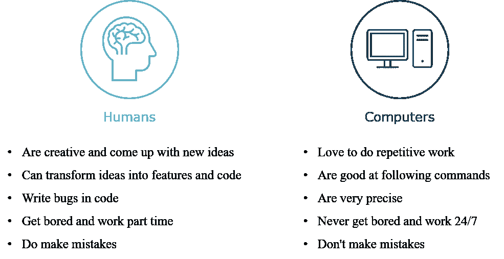
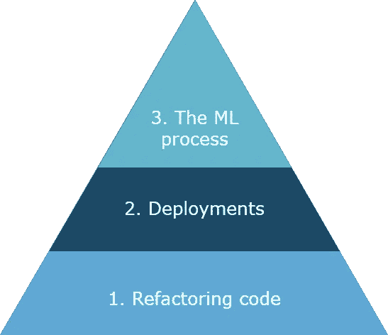
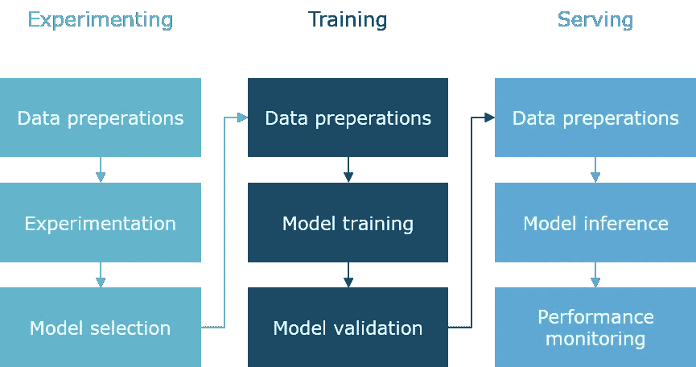

# 机器学习工程中的自动化

> 原文：<https://towardsdatascience.com/automation-in-machine-learning-engineering-c80220fa02da?source=collection_archive---------25----------------------->

## 机器学习自动化的原因、内容和时间

这篇博文关注的是机器学习工程中的自动化。尽管自动化源于软件开发，但这个概念变得越来越适用于机器学习。我分享了一些建议，关于你可以自动化哪些内容，以及你应该在什么时候自动化 T2。在其他博客中，我将向*展示如何*做到这一点。但是首先，让我们看看*为什么*你应该自动化。希望你能在这篇博客中找到一些灵感，开始让你作为机器学习工程师的生活变得轻松一些。

# 为什么是自动化？

作为数据科学家或者机器学习工程师，解决问题是你的任务。您通常通过开发一段符合特定标准、可读且不包含任何错误的代码来实现这一目标。您运行该代码和其他程序来获得结果。通常，您的最终产品会在其他地方运行。也许你只运行一次，但通常，这是一个重复的过程。然而，你应该记住，编写和运行代码或程序本身并不是目标——它只是实现你的目标的一种方式。

**专注于你擅长的事情** 在这个解决问题的过程中，你与计算机一起工作，在那里你编写代码、进行分析、进行计算并运行程序。充分利用这种合作是有意义的。为此，让我们来看看人类和计算机的长处。人类和计算机都有许多不同的风格，但一般来说，它们可以这样描述:

人类对计算机。图片作者。

那么这告诉我们什么呢？人类和计算机擅长不同的任务。由于人类在做重复性工作时会犯错误并感到无聊，我们应该使用计算机来做这件事。另一方面，人类应该尽可能地将时间花在解决问题上，并使用计算机来完成代码重构等详细任务。因此，我们应该自动化。

> 这就是软件开发和机器学习自动化的全部内容:使用计算机执行重复的任务。

## 提高质量

自动化的另一个好处是你的工作质量会提高。我们将研究增强代码的自动化代码重构。此外，通过自动化，您可以在开发过程的几个阶段强制运行测试。这样，您可以在早期发现错误。

其次，通过自动化任务，你不太可能不小心跳过任何任务。任务执行也很容易被记录。通过记录这些步骤，您可以验证所有必需的任务都已运行，并向其他人证明这一点。最后，您可以在开发过程的几个阶段强制运行测试。这样，您可以在早期发现错误。

## 节省时间

尽管您需要在项目开始时投资实现自动化，但最终，您将从中受益。增强你的代码会更快；随着质量的提高，花费在调试上的时间会减少，解决方案的部署会更快。

# 自动化什么？

你可以自动化机器学习中的许多事情，但一般来说，这都归结于机器学习自动化的这个金字塔:

机器学习自动化的金字塔。图片作者。

尽管并不相互排斥——有些任务可以被分配到多个类别中——但我确实认为这是引入自动化概念的好方法。让我们从基础做起，从我们自己做起，直到顶峰。

## **1。重构代码**

对于代码的重构，我的意思是坚持代码符合某些标准，而不改变代码中的逻辑。这是一个由计算机(部分)接管的完美任务，因此作为开发人员，您可以专注于构建逻辑。让我们看看林挺、格式化和检测质量和安全问题。

**Linters
通过这样做，你可以很容易地发现任何错误。棉绒的例子有[皮林特](https://pylint.org/)和[薄片 8](https://flake8.pycqa.org/en/latest/manpage.html) 。SonarQube 还提供一种叫做 [SonarLint](https://www.sonarlint.org/) 的棉绒。**

**格式化** 尽管 linters 只指出问题而不改变代码，格式化程序格式化代码，使其遵循一定的准则。它使您的代码对其他人来说可读性更好，因此更容易理解代码并为其做出贡献。此外，代码审查可以关注逻辑本身，而不是布局。文本文件，如 YAML 文件，也可以格式化。流行的 Python 格式化程序的例子有 [Black](https://pypi.org/project/black/) 和 [autopep8](https://pypi.org/project/autopep8/) 。

**检测质量和安全问题** 在人类和计算机的对比中我们已经看到，你会写 bug。您可以通过在每次提交时运行测试函数，或者当您合并到主代码分支时发现它们。使用 [Pytest](https://docs.pytest.org) 你可以自己设置，或者你可以使用像 [Jenkins](https://www.jenkins.io/) 这样的工具。

您编写的一些代码可能会导致安全问题。例如不正确的异常处理、硬编码的密码或误用正在运行的子流程。像 [Bandit](https://bandit.readthedocs.io/en/latest/index.html) 和 [SonarQube](https://www.sonarqube.org/) 这样的软件可以帮助你发现这些问题。

您很可能会使用 Python 包来解决您的问题。尽管您可能认为这些包使用起来是安全的，但是可能有一些包本身并不安全。快速浏览一下 Github 页面可以给出一个很好的提示；比如维护人员的数量，更新频率。接下来，T4 安全系统会根据允许清单检查你所有的进口商品。

Linters、formatters 以及 Pytest 和 Safety 之类的包可以手动运行，但是当然，自动化的思想就是使之自动化。使用 git 挂钩，您可以在提交之前运行格式化程序和包，或者您可以将它们添加到管道中，如下所述。Linters 和 formatters 也可以直接安装在您的 IDE 中。因此，当您自动化这些任务时，您的持续集成(CI)过程会得到改进，因为您在主代码分支上实施了代码质量。

## 2.部署

现在我们已经爬上了金字塔的地基，让我们把重点放在中间层。

一些机器学习问题通过对数据进行分析来解决，这可能是在您的机器上本地完成的事情。但是，您通常希望将代码发布到不同的环境中，例如其他数据可用的环境，或者更适合计算密集型运行的环境。另一个原因可能是您正在为用户构建一个应用程序。

将您的代码部署到该环境中称为部署。您需要采取多个步骤。您可以随心所欲地添加安全性检查，在开发环境中运行单元测试，或者在测试环境中运行集成测试，等等。基本步骤包括:

1.  定义上下文(比如应用程序的名称，或者目标环境)
2.  打包代码，例如通过压缩或创建工件
3.  发布代码
4.  在目标环境上构建应用程序，比如解压缩它，或者通过在 Kubernetes 上从源代码构建一个容器

当然，运行这些任务可以是手动工作。然而，自动化这些重复的任务是有意义的。通过自动化部署，您能够连续部署(CD)您的应用程序。您可以在 shell(如 Bash 或 Powershell)中通过命令行界面(CLI)使用脚本来自动化部署。另一种方法是使用管道。

脚本
使用命令行界面你可以给程序下命令。通过编写一个捕获这些命令的脚本，您可以一次性完成一系列任务。这里的好处是您也可以对脚本进行版本控制。此外，可以将日志打印到屏幕或日志文件中，以实现可追溯性。Bash 和 Powershell 可以用来创建目录、移动文件、读写纯文本文件等等。要与程序交互，您需要使用相应的程序 CLI。您也可以用这样的方式编写 Python 函数，即您可以使用 [argparse](https://docs.python.org/3/library/argparse.html) 通过输入参数调用它们。多个脚本可以组合在一个 Makefile 中。

下面是一个小例子，演示了如何通过[弹性 Beanstalk 客户端](https://docs.aws.amazon.com/elasticbeanstalk/latest/dg/eb-cli3-install.html)和 Bash 将 Docker 容器部署到 AWS Cloud。通过 AWS 控制台得到同样的结果需要我 3 分钟的点击和输入时间。

部署到 AWS Elastic Beanstalk 的示例

**管道** 管道建立在脚本之上。它们为这些脚本添加了额外的功能，从而增强了部署过程。所有这些功能当然都是有代价的。如果您需要管道，或者脚本就足够了，这取决于实际的用例。管道工具的例子有 [Azure 管道](https://docs.microsoft.com/en-us/azure/devops/pipelines/?view=azure-devops)、 [AWS CodeBuild](https://aws.amazon.com/codebuild/) 和 [Buildkite](https://buildkite.com/) 。这些功能的非详尽概述如下:

1.  它们提供了一个图形界面。这样更容易看到流动的样子；如果生成或部署成功；以及每个处理步骤的输出是什么；
2.  管道可以自动触发。虽然这也可以用脚本实现，但是管道往往是在有人合并开发或者主分支的时候触发的；
3.  所有的构建都有日志记录，所以很容易看到谁在什么时候触发了什么；
4.  用户管理已经就绪，因此您可以将部署限制在某些用户的生产环境中；
5.  以前的部署被保存，因此如果出现问题，您可以轻松地返回到以前的部署。

通常，代码的来源是一个 Git 库。管道的定义也存储在那里，或者如果您有多个管道，它可能存储在一个中央代码存储库中。这样，您可以防止管道定义随着时间的推移而发生分歧。

大多数情况下，YAML 被用作建立管道结构的语法，而任务是用 Bash 之类的语言编写的。此外，通常预定义的任务也是可用的。所有这些任务都需要一些计算实例来运行。这通常由提供商来管理。然而，您也可以自己托管管道，这样您的代码就不会被转移到您的组织之外。

## 3.机器学习过程

是时候移动到我们机器学习自动化金字塔的顶端了。现在，它变得非常有趣:除了重构代码和部署，您还可以自动化机器学习过程。我指的是如下所示的简化过程。

机器学习过程。图片作者。

在左侧，我们看到了模型实验的过程，在这里您可以对不同的模型进行特征工程和一些超参数调整。从这里，您选择最有希望的模型，该模型是图中间所示的模型训练过程的输入，在该过程中，您优化并验证最终的模型。在右边，我们看到服务于模型或推理过程的模型。

实验通常是用生产数据的子集“离线”完成的。在实验阶段投资自动化几个步骤可能是值得的，例如使用下面讨论的 AutoML。另一方面，实验特征可能使整个过程难以自动化。

**部署模型训练和服务的应用** 模型训练和模型服务通常不是在本地完成的，而是在单独的环境中完成的。出现这种情况的原因是您的机器在存储和计算方面的限制，或者因为不允许您在本地存储生产数据。在服务的情况下，速度(延迟)也是一个问题。

可以构建一个用于模型训练的微服务或应用程序，而不是像前面讨论的那样进行部署。这同样适用于用于模型服务的服务。

**自动训练** 该图显示了一般的训练过程，实际上还包括许多步骤。所有这些步骤可以紧密结合在一起。这可以像一个脚本一样简单，例如通过使用 [sklearn 管道](https://scikit-learn.org/stable/modules/generated/sklearn.pipeline.Pipeline.html)。如果运行这样的管道，数据作为输入被加载，并且在模型注册中心注册的经验证的模型是输出。

另一种方法是将流程分成不同的服务。对于每个服务，您可以优化主机。对于预处理，存储可能很重要，而对于训练，计算可能是决定性因素。AWS 正在使用这种方法，提供亚马逊 SageMaker 管道。

**Auto ML** 特别是有了监督学习，就有可能实现特征工程和超参数调整过程的自动化。通过强力结合巧妙的算法，该模型针对成功指标进行了优化。为此需要多次运行，因此专用的训练环境在这里可能会很有用。帮助你的工具有 [TPOT](http://epistasislab.github.io/tpot/) 、[特征工具](https://featuretools.alteryx.com/en/stable/)和[自动 sklearn](https://automl.github.io/auto-sklearn/master/index.html) 。云提供商也在这里提供工具，比如亚马逊 SageMaker Autopilot。

**自动再训练** 当数据静止时，这些过程是一次性的。然而，最有可能的情况是数据会随着时间的推移而改变(称为数据漂移)，这意味着模型性能也可能会随着时间的推移而降低。模型再培训是必要的，这是自动化的东西。这也称为持续培训(CT)，指的是 CI/CD。自动再训练中通常只涉及超参数调整，因为特征工程不太容易自动化，需要手工操作。再培训可以按时触发，比如每个周日晚上，或者由性能监控步骤触发。

所有主要的云提供商都提供自动化、管道和自动再培训的框架和工具:

*   Google 在这篇博文[中分享了他们对 MLOps 和自动化管道的观点](https://cloud.google.com/architecture/mlops-continuous-delivery-and-automation-pipelines-in-machine-learning)
*   AWS 在本博客中介绍了金融服务的最佳实践，但它也适用于其他行业
*   Azure 在这个博客中讨论了他们的模型再训练方法

# 何时实现自动化？

我们处于金字塔的顶端，我们已经涵盖了许多需要自动化的任务。然而，这需要花费时间和精力来设置我们到目前为止介绍的所有内容。因此，跳过自动化部分，专注于功能性需求可能很有诱惑力。此外，您的经理可能希望您关注新功能，而不是这些非功能性的自动化需求。尽管如此，现在应该很清楚自动化有很大的价值。

我列出了一系列标准来检查您是否应该将您正在处理的任务自动化:

1.  **任务的复杂程度** 如果是一个简单的任务，在执行的时候出错的机会就少，所以对自动化的需求就少。另一方面，当任务复杂时，执行它可能需要花费大量的时间和精力。
2.  **任务发生的频率** 如果你知道一个任务只运行一次，那么跳过自动化部分是有意义的。然而，根据我自己作为开发人员的经验，典型的任务很少是一次性的。
3.  自动化任务所需的时间和精力
    这更像是一种成本效益的权衡。设置自动化的成本与收益相比如何，比如以后提高质量和节省时间？

鉴于这些标准，在我看来，总是实现某种程度的自动化是有意义的。自动化的好处是您可以重用以前项目的一些工作，比如管道模板或预提交钩子定义。我经常使用的一种方法是，首先手动执行一项任务，比如运行测试功能，或者使用鼠标和键盘通过控制台界面进行部署。在我知道需要做什么之后，我会自动执行这些步骤。对于机器学习过程的自动化，如果需要自动(再)训练，则取决于项目要求。

# 结论

在这篇博文中，我解释了*为什么*你应该在你的机器学习项目中使用自动化。这是你作为机器学习工程师工作的一个重要部分。接下来，我们研究了*通过探索机器学习自动化的金字塔*你可以自动化什么:代码重构、部署和机器学习过程。最后，我简要地提到了一些需要记住的标准，以决定*何时*应该自动化。

在接下来的文章中，我将更深入地讨论如何自动化这些任务。

我要感谢我的同事[塞巴斯蒂安·坎德尔](https://www.linkedin.com/in/sebastiaancandel/)、[约斯特·德·泰耶](https://www.linkedin.com/in/joostdetheije/)和[朱莉娅·苏博特尼亚亚](https://www.linkedin.com/in/julia-subotniaya-371558b3/)的反馈和启发。