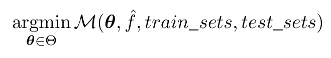
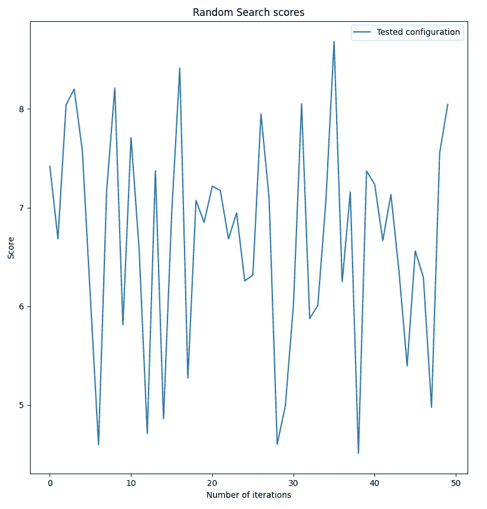
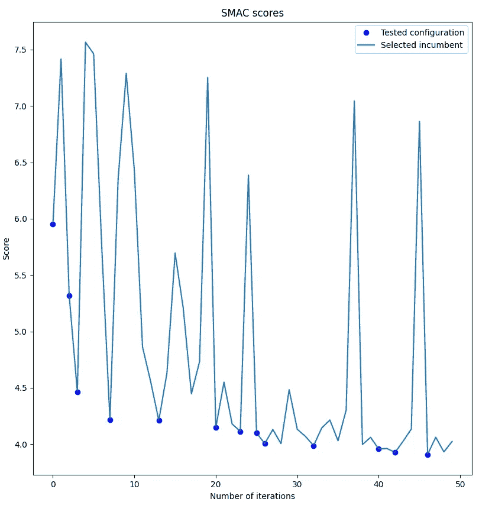

# SMAC:Python 中快速超参数调优的 AutoML

> 原文：<https://towardsdatascience.com/automl-for-fast-hyperparameters-tuning-with-smac-4d70b1399ce6?source=collection_archive---------19----------------------->

## 在高维空间中寻找出路

[蓝莓制作](https://unsplash.com/@yukkien?utm_source=medium&utm_medium=referral)在 [Unsplash](https://unsplash.com?utm_source=medium&utm_medium=referral) 上的照片

为给定的数据科学问题生成第一个模型可能非常简单。建立一个高效的模型，提供高水平的精确度，要困难得多。数据科学家必须清理数据，提炼特征，找到正确的指标，找到正确的验证策略，正确地构建测试和训练集，并微调所选模型的参数。

这些步骤大多受益于数据科学家的经验，很难自动化。幸运的是，超参数调优不是这样的，可以使用自动机器学习:AutoML。

在本帖中，我们将从数学上解释为什么超参数调整是一项复杂的任务，并展示 SMAC 如何帮助建立更好的模型。

# 超参数？你在说什么？

当尝试为给定数据集拟合模型时，必须定义两种参数:

*   用于配置模型的参数:决策树的深度、SVM 模型的内核、多项式的次数、神经网络的层数等等
*   模型本身的参数:决策树叶子的权重，SVM 核的参数，多项式的系数，每个神经元的权重，…

第一类参数被称为模型超参数，因为它们定义了模型的结构，而后者被附加到模型本身。

# 为什么需要 AutoML 进行超参数调整？

请记住，超参数调整，有时也称为超参数优化(HPO)，是一个通过根据您选择的指标确定模型的最佳配置来尝试充分利用模型的过程。

使用 AutoML 主要有两个原因:

1.  手动寻找最佳参数是一项非常繁琐的任务。配置空间的组合学可能相当大。对于随机森林，需要考虑的参数不少于 10 个。每个参数可以有 10 个不同的值。因此，探索配置空间需要评估 10 种⁰配置！
2.  绝对不能保证针对给定数据集优化的配置在另一个数据集上也同样有效。每次将模型应用到新的数据集时，优化超参数至关重要。

使用 AutoML 技术允许通过自动化配置空间探索来解决这两个限制。

# 用 AutoML 调整超参数:一项艰巨的任务

在进一步向您展示如何高效地自动调优超参数之前，让我们解释一下为什么这是一项复杂的任务。

让我们用一些数学来形式化什么是超参数优化。

从数学上来说，HPO 试图最小化一个或多个测试集上的评估指标，通常使用交叉验证来生成。这可以形式化为:

HPO 的数学公式。作者的公式。

其中 M 是我们希望使用给定的训练和测试集来优化模型 f_hat 的度量的评估。**θ**是用于配置模型的一组参数。数值取自配置空间**θ**。

通常，当面对这样的优化问题时，使用基于数值微分的方法。基本上，要优化的函数，即 M 与 f_hat 的组合，相对于参数**θ**是微分的。然后，使用牛顿-拉夫森法、梯度下降法或任何类似的方法迭代收敛到最优值。

然而，在超参数调谐的情况下，通常不可能计算这些梯度:

*   度量可以是非平滑的，例如 MAE。参见我关于这个主题的另一篇论文。因此，微分是不可能的。
*   模型本身可能很难区分，不仅在符号上，在数字上也是如此。想想所有基于树的方法，它们是分段常数的。
*   梯度可以消失。这是神经网络的情况，也是基于树的方法:随机森林，XGBoost，CatBoost，LightGBM，…
*   数值评估梯度是非常耗时的，因为对于每个参数方向上的每个变化，我们需要训练一个完整的模型。
*   模型超参数可能不连续。想想 XGBoost 的 *nb_estimators* 参数:它是一个整数值。分类参数也是如此。

请注意，自动微分在某些情况下会有所帮助，但在大多数情况下，您无法使用梯度导向方法进行优化。

正如您所看到的，在超参数调优的情况下，许多原因禁止使用标准优化方法。我们被迫仅仅依靠我们作为数据科学家的经验来选择最佳参数吗？

# 为什么不用网格搜索？

一种选择是使用暴力。毕竟，为 XGBoost、Random Forest 或任何其他模型寻找最佳超参数只需要评估每个可能配置的指标。

但是如上所述，配置空间可能是巨大的，即使计算机越来越强大，探索 10 ⁰配置仍然(远远)超出他们的能力范围。

所以这只能是你配置空间非常有限的时候的一个选项。

# 那么随机搜索呢

这是一种选择。但是有随机性在里面；)我们将在下面看到它是可行的，但是不能保证收敛到最佳配置，至少在给定的时间内。

# 使用 SMAC

库 [SMAC](https://www.automl.org/automated-algorithm-design/algorithm-configuration/smac/) 提出了蛮力和随机探索的替代方案:基于序列模型的算法配置。

这个库背后的想法是建立一个模型(因此 SMAC 的缩写是基于模型的),试图为一组给定的超参数估计度量值。使用这个内部模型，您可以随机生成配置，并使用这个估计器来猜测什么是最好的配置。

参见这篇非常好的开创性的[论文](https://ml.informatik.uni-freiburg.de/papers/11-LION5-SMAC.pdf)了解更多关于这个主题的细节。我还写了一篇关于如何使用模型创建自己的 HPO 引擎的完整文章:

</tuning-xgboost-with-xgboost-writing-your-own-hyper-parameters-optimization-engine-a593498b5fba> [## 用 XGBoost 调优 XGBoost:编写自己的 Hyper Parameters 优化引擎

towardsdatascience.com](/tuning-xgboost-with-xgboost-writing-your-own-hyper-parameters-optimization-engine-a593498b5fba) 

SMAC 使用随机森林模型来捕捉算法/模型的行为，以根据指标进行优化。

整个算法非常简单。运行第一次训练并计算指标。用这个第一输出训练随机森林模型。

然后生成随机配置，具有最佳估计分数的配置用于下一次训练。然后用这个新的结果重新训练模型，这个过程再次开始。

内部性能模型指导配置空间探索。如代码所示，受 SMAC [示例](https://github.com/automl/SMAC3/blob/master/examples/SMAC4HPO_rf.py)的启发，SMAC 从之前的运行中学习，并在每一步中提高自己的知识:

使用随机搜索和 SMAC 调整随机森林模型。

上面的代码使用 SMAC 和 RandomizedSearchCV 来调整 Hyper 参数。请注意，SMAC 支持连续实参数以及分类参数。支持分类参数是使用随机森林作为指导探索的内部模型的一个原因。

这段代码演示了如何使用 SMAC 和 Random Forest 作为模型进行微调，但是我一直将它用于 XGBoost 以及 SVM 或萨里玛模型，它非常有效。

下图比较了两种情况下的配置空间探索，即使用 SMAC 和随机搜索。他们根据超参数调整迭代次数绘制分数:

随机搜索(左)与 SMAC(右)超级参数探索。作者的图表。

在左侧，我们看到随机搜索不规则地探索配置空间。优化没有受益于以前的培训。另一方面，在右边的图中，可以清楚地看到 SMAC 从以前的试验中吸取了经验，并尝试了一些适合改进的构型。

结果是 SMAC 更快地收敛到更好的解。

# 结论

为一个模型寻找最佳的超参数是一项乏味但至关重要的任务。SMAC 是一个非常有效的库，它带来了自动 ML 并真正加速了精确模型的构建。任何类型的模型都可以从这种微调中受益:XGBoost，Random Forest，SVM，SARIMA，…

非常有趣的是，基于 ML 的方法可以用来帮助更好地训练 ML 模型。然而，这提出了一个问题:SMAC 内部随机森林模型的超参数是如何优化的？

你会在 [SMAC](https://github.com/automl/SMAC3) 代码或者学术[论文](https://ml.informatik.uni-freiburg.de/papers/11-LION5-SMAC.pdf)中找到答案:它们是硬编码的；)