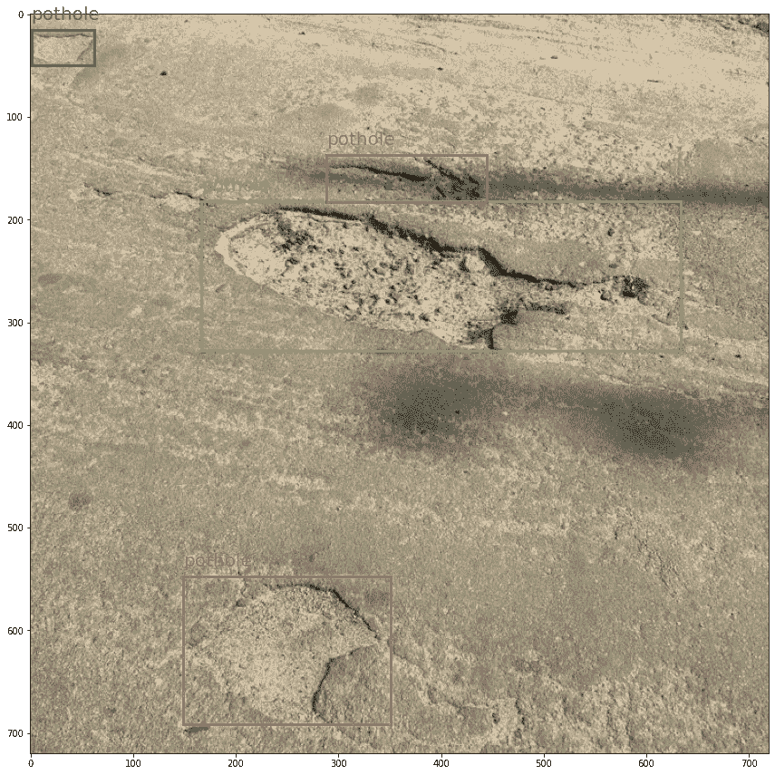
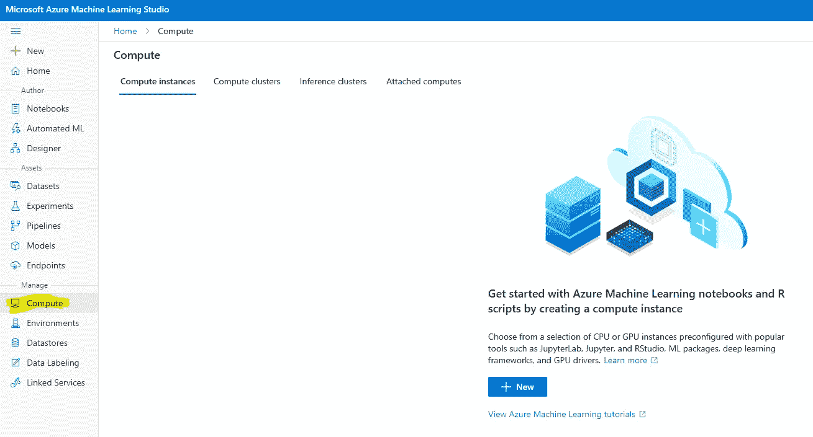
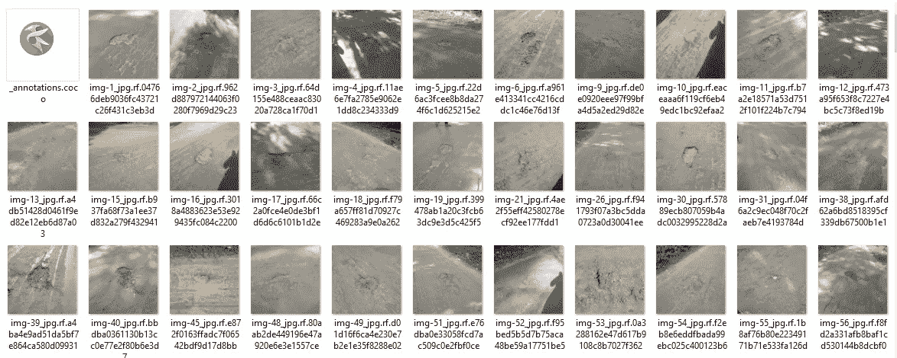
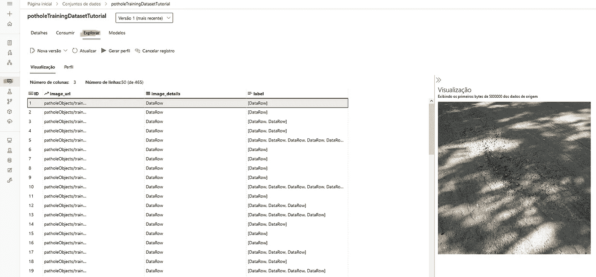
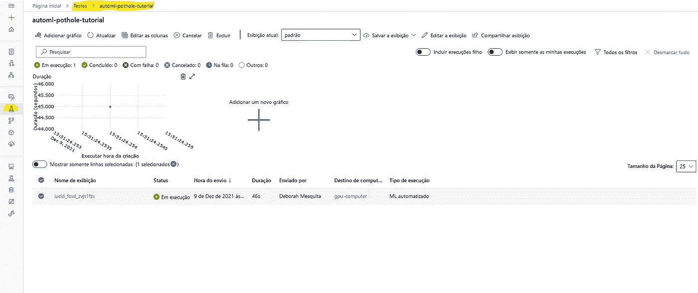
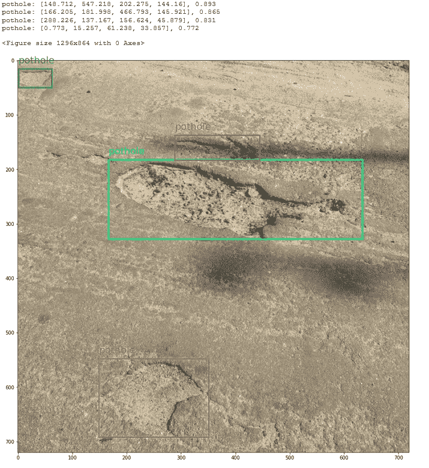

# 用于物体检测的 AutoML:如何训练模型以识别坑洞

> 原文：<https://towardsdatascience.com/automl-for-object-detection-how-to-train-a-model-to-identify-potholes-e22c3f4b774?source=collection_archive---------13----------------------->

## 如何使用新的 Azure 机器学习功能进行对象检测



来自我们训练的模型的坑洞预测和置信度得分-图片由作者提供

初始算法选择和超参数优化是我个人不喜欢做的活动。如果你像我一样，那么也许你会喜欢<https://docs.microsoft.com/en-us/azure/machine-learning/concept-automated-ml>****自动化机器学习，这是一种让脚本为我们完成这些耗时的 ML 任务的技术。****

****Azure Machine Learning (AML) 是一种云服务，它的一些功能使得准备和创建数据集、训练模型以及将它们部署为 web 服务变得更加容易。最近，反洗钱团队[发布了 AutoML for Images 功能供公众预览](https://techcommunity.microsoft.com/t5/azure-ai-blog/announcing-automated-ml-automl-for-images/ba-p/2843034)。今天，我们将使用该功能训练一个对象检测模型来[识别道路上的坑洞](https://public.roboflow.com/object-detection/pothole)。****

****在本文中，我将简要回顾一些 AML 和对象检测概念，因此您不需要完全熟悉它们就能理解。这个教程很大程度上基于 Azure 的这个例子，你可以在这里查看我编写的 Jupyter 笔记本。****

****酷，我们开始吧！****

# ****我们要做什么？****

****对象检测数据集很有趣，因为它们由表格数据(边界框的注释)和图像数据组成。png，。jpeg 等)。 [COCO 格式](https://cocodataset.org/#format-data)是对象检测数据集的流行格式，我们将下载[坑洞数据集](https://public.roboflow.com/object-detection/pothole) ( *坑洞数据集*)。分享者。阿提库尔·拉赫曼*奇托利安*。2020 年 11 月*。执照。ODbL v1.0)使用这种格式。Azure 机器学习使用 [TabularDataset 格式](https://docs.microsoft.com/en-us/azure/machine-learning/reference-automl-images-schema)，所以我们需要做的第一件事是从 COCO 转换到 TabularDataset。*****

*****转换后，我们将选择一个对象检测算法，最后训练模型。*****

## *****1-准备数据集*****

*****我从 [Roboflow](https://public.roboflow.com/object-detection/pothole) 得到了数据集。它有 665 张道路图片，上面标注了坑洞，是由[阿蒂库尔·拉赫曼·奇托里安](https://github.com/chitholian)创作并分享的，作为他本科论文的一部分。Roboflow 团队将这些图片重组为 70/20/10 的训练有效测试分割。*****

*****每次拆分都有两个主要部分:*****

*   *****`_annotations.coco.json`，一个 JSON 文件，带有`images`、`categories`和`annotations`元数据*****
*   *****图像本身(。jpg 文件)*****

*****这是 COCO 注释键的样子:*****

*   *****`images`:有关于数据集图像的信息(id，文件名，大小等。)*****
*   *****`categories`:边框类别的名称和 id*****
*   *****`annotations`:包含关于对象的信息，包括边界框坐标(在这个数据集中是绝对坐标)、对象的 image_id 和 category_id*****

*****现在是时候开始与 AML 合作了。你要做的第一件事就是创建一个 Azure 机器学习工作区。你可以使用 https://portal.azure.com 的网络界面来完成。*****

*****我们需要一个[计算实例](https://docs.microsoft.com/en-us/azure/machine-learning/concept-compute-instance)来运行笔记本，然后运行 train 实验，所以请在您的工作区内创建一个。图像任务的 AutoML 模型需要 GPU 计算实例。您也可以使用 web 界面创建一个计算实例。*****

**********

*****在哪里创建计算实例—按作者分类的图像*****

*****我已经下载并提取了。/potholeObjects 文件夹。每个分割都有它的文件夹，里面有图像和 JSON 文件。*****

**********

*****的内容。/火车坑洞图片—作者图片*****

*****您需要将图像和 JSON 文件上传到**数据库**，以便 AML 可以访问它们。[数据存储](https://docs.microsoft.com/en-us/python/api/azureml-core/azureml.core.datastore.datastore?view=azure-ml-py)是云数据源的抽象。创建 AML 工作区时，会创建一个[azureblobdastore](https://docs.microsoft.com/en-us/python/api/azureml-core/azureml.data.azure_storage_datastore.azureblobdatastore?view=azure-ml-py)并将其设置为默认值。我们将使用这个默认的数据存储并将图像上传到那里。*****

*****注释是 COCO 格式(JSON ),但是 TabularDataset 要求它在 JSON 行中。TabularDataset 具有相同的元数据，但是以不同的键组织。这是用于对象检测的 tabular 数据集的样子:*****

```
***{
   **"image_url"**:"AmlDatastore://data_directory/../Image_name.image_format",
   **"image_details"**:{
      "format":"image_format",
      "width":"image_width",
      "height":"image_height"
   },
   **"label"**:[
      {
         "label":"class_name_1",
         "topX":"xmin/width",
         "topY":"ymin/height",
         "bottomX":"xmax/width",
         "bottomY":"ymax/height",
         "isCrowd":"isCrowd"
      },
      {
         "label":"class_name_2",
         "topX":"xmin/width",
         "topY":"ymin/height",
         "bottomX":"xmax/width",
         "bottomY":"ymax/height",
         "isCrowd":"isCrowd"
      },
      "..."
   ]
}***
```

*****幸运的是，微软工程师编写了一个从 COCO 转换的脚本:[https://github . com/Azure/Azure ml-examples/blob/1a 41978d 7 DDC 1 D1 f 831236 ff 0 C5 c 970 b 86727 b 44/python-SDK/tutorials/automl-with-Azure ml/image-object-detection/COCO 2 jsonl . py](https://github.com/Azure/azureml-examples/blob/1a41978d7ddc1d1f831236ff0c5c970b86727b44/python-sdk/tutorials/automl-with-azureml/image-object-detection/coco2jsonl.py)*****

*****这个文件的 image_url 键需要指向我们正在使用的数据存储中的图像文件(默认的)。我们使用 coco2jsonl.py 脚本的 base_url 参数来指定。*****

```
***# Generate training jsonl file from coco file
!python coco2jsonl.py \
--input_coco_file_path "./potholeObjects/train/_annotations.coco.json" \
--output_dir "./potholeObjects/train" --output_file_name "train_pothole_from_coco.jsonl" \
--task_type "ObjectDetection" \
--base_url "AmlDatastore://**{datastore_name}**/potholeObjects/train/"***
```

*****我们将对验证集运行相同的命令。现在，下一步是将文件上传到数据存储，并在 AML 中创建 [**数据集**](https://docs.microsoft.com/en-us/azure/machine-learning/how-to-create-register-datasets) 。不要混淆**数据集**和**数据存储库**。数据集是版本化的打包数据对象，通常基于数据存储中的文件创建。我们将从 JSON 行文件中创建数据集。*****

*****对于培训和验证拆分，您也将这样做。如果一切顺利，你可以在 AML 中看到图片预览。*****

**********

*****AML 工作区内的数据集预览—按作者分类的图像*****

## *****2 —运行实验*****

*****在 AML 内部，你所做的一切都被称为**实验**。要使用 AutoML 训练模型，您将创建一个实验，指向它应该运行的计算目标，并提供 AutoML 参数的配置。*****

*****让我们首先创建实验，并从工作区获得计算机实例:*****

*****在这里，我将使用 yolov5 默认参数运行实验。您需要提供超参数、计算目标、训练数据和验证数据(正如[示例](https://github.com/Azure/azureml-examples/blob/1a41978d7ddc1d1f831236ff0c5c970b86727b44/python-sdk/tutorials/automl-with-azureml/image-object-detection/auto-ml-image-object-detection.ipynb)所说，验证数据集是可选的)。*****

*****现在我们终于可以提交实验了:*****

```
***automl_image_run = experiment.submit(automl_config_yolov5)***
```

*****您可以使用 Workspace web 界面监控实验:*****

**********

*****使用工作区用户界面监控实验——作者图片*****

*****在这里，我只使用一个单一模型的字典，并使用默认参数，但你可以探索参数和调谐设置。这里有一个来自[微软教程](https://github.com/Azure/azureml-examples/blob/1a41978d7ddc1d1f831236ff0c5c970b86727b44/python-sdk/tutorials/automl-with-azureml/image-object-detection/auto-ml-image-object-detection.ipynb)的例子:*****

## *****3 —可视化预测*****

*****这个 yolov5 模型是使用 Pytorch 训练的，所以我们可以下载这个模型并使用 Jupyter 笔记本来检查预测。我的花了 56 分钟训练。要获得模型，您需要做的第一件事是在工作空间中注册最佳运行，这样您就可以通过它来访问模型。*****

*****现在我们可以下载 model.pt 文件并运行推理。为此，我们将使用来自[azure ml-contrib-automl-dnn-vision](https://pypi.org/project/azureml-contrib-automl-dnn-vision/)包的代码:*****

*****我使用了微软教程[中的代码来可视化边界框。以下是测试图像的结果:](https://github.com/Azure/azureml-examples/blob/1a41978d7ddc1d1f831236ff0c5c970b86727b44/python-sdk/tutorials/automl-with-azureml/image-object-detection/auto-ml-image-object-detection.ipynb)*****

**********

*****来自我们训练的模型的坑洞预测和置信度得分-图片由作者提供*****

*****酷吧？*****

# *****最后的想法*****

*****Azure 机器学习是一个让你开始机器学习(嗯，在我们的情况下是深度学习)的好工具，因为它隐藏了很多复杂性。现在有了 AutoML 功能，你甚至不必考虑在不同的时刻训练不同的模型，因为调谐设置可以为我们做到这一点。*****

*****你可以在这里查看 Jupyter 笔记本的所有代码。*****

*****管道中的下一步是将模型部署为 web 服务。如果你很好奇，你也可以使用[微软教程](https://github.com/Azure/azureml-examples/blob/1a41978d7ddc1d1f831236ff0c5c970b86727b44/python-sdk/tutorials/automl-with-azureml/image-object-detection/auto-ml-image-object-detection.ipynb)来查看如何做到这一点。*****

*****感谢阅读！:D*****

# *****参考*****

1.  *****[*坑爹数据集*](https://public.roboflow.com/object-detection/pothole) 。分享者。阿提库尔·拉赫曼*奇托利安*。2020 年 11 月*。执照。ODbL v1.0 版******