# 时间序列的 AutoML:使用 FEDOT 框架的高级方法

> 原文：<https://towardsdatascience.com/automl-for-time-series-advanced-approaches-with-fedot-framework-4f9d8ea3382c?source=collection_archive---------2----------------------->

## [思想和理论](https://towardsdatascience.com/tagged/thoughts-and-theory)

## 使用 FEDOT 和其他 AutoML 库处理具有间隙和非平稳性的真实世界数据的示例

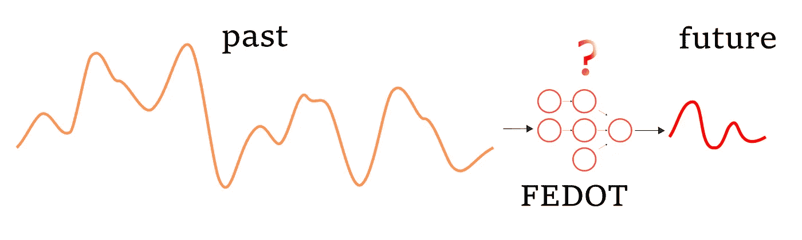

用于时间序列预测的 AutoML 框架 FEDOT(图片由作者提供)

正如我们在[之前的帖子](/automl-for-time-series-definitely-a-good-idea-c51d39b2b3f)中已经注意到的，大多数现代开源 AutoML 框架并没有广泛覆盖时间序列预测任务。在那篇文章中，我们已经初步演示了 AutoML 方法可以产生什么样的预测。

然而，我们可以更深入地研究一个 AutoML 框架 [FEDOT](https://github.com/nccr-itmo/FEDOT) ，它可以自动进行时间序列预测的机器学习管道设计。因此，我们将通过时间序列预测的实际任务详细解释 FEDOT 核心中正在发生的事情。

**FEDOT 框架和时间序列预测**

之前我们已经讨论过机器学习问题的流水线。管道是一个无环的有向图。用 FEDOT 的术语来说，这个图叫做链，或者复合模型，或者管道。

FEDOT 操作的基本抽象是:

*   操作是对数据执行的动作:它可以是对数据进行预处理(规范化、标准化、填补空白)的动作，也可以是给出预测的机器学习模型；
*   节点是放置操作的容器。一个节点中只能有一个操作。主节点只接受原始数据，次节点使用前一级节点的输出作为预测值；
*   链或管道是由节点组成的无环有向图。FEDOT 中的机器学习流水线是通过 Chain 类实现的。

给定的抽象可以在下图中看到:

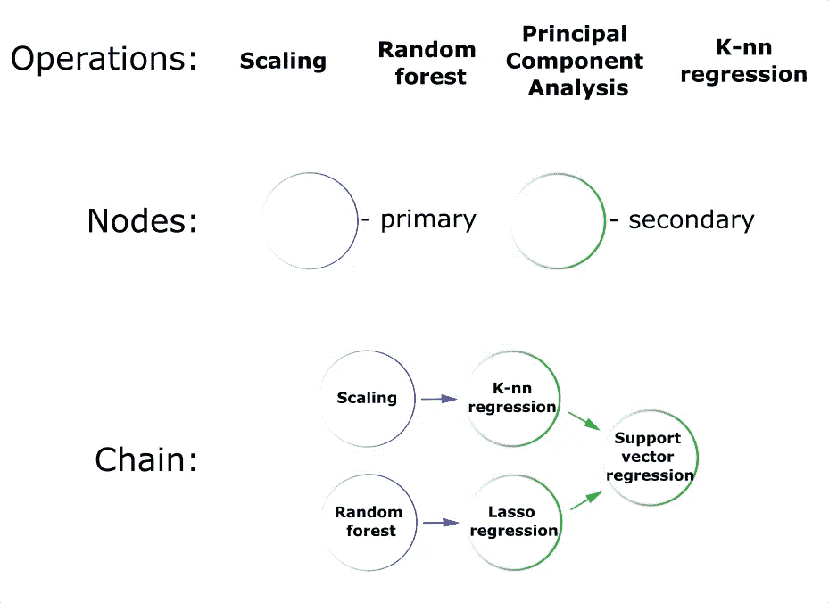

*FEDOT 框架中的操作、节点和链(管道)*

机器学习模型和经典模型，如时间序列的自回归(AR ),都可以插入到这种管道的结构中。

我们知道如何解决分类或回归问题。我们甚至知道如何在 FEDOT 制作一系列模型。但是我们如何进行时间序列预测呢？例如，我们如何使用决策树？特色在哪里？

特色就在这里！要构建具有特征的表，只需要用滑动窗口遍历时间序列，并准备一个轨迹矩阵。

值得一提的是，这不是我们的发明:你可以阅读使用这种转换的 [SSA](https://ru.wikipedia.org/wiki/SSA_(%D0%BC%D0%B5%D1%82%D0%BE%D0%B4)) 方法。这种方法也在 [H2O](http://docs.h2o.ai/driverless-ai/latest-stable/docs/userguide/time-series.html) 图书馆的一个版本中使用。几乎所有时间序列的机器学习模型的应用都是构造这样的矩阵。

让我们更详细地分析一下级数变换的这种方法。时间序列是一系列值，其中后续值通常依赖于之前的值。因此，我们可以使用时间序列的当前和先前元素来进行预测。假设我们希望使用当前值和一个先前值来预测前面一个元素的序列:

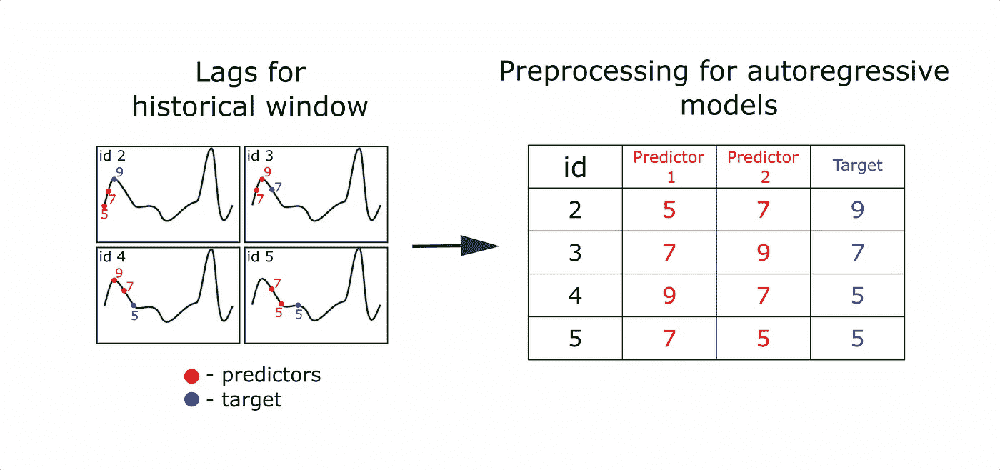

*制作时间序列预测特征表示例(作者图片)*

我们称这样的转换为时间序列的“滞后转换”。在 FEDOT 中，我们将它放在一个单独的操作“滞后”中。重要的超参数是滑动窗口的大小，它决定了我们将使用多少以前的值作为预测值。

下面是一个动画，展示了多步预测提前一个元素的示例。然而，可以一次对前面的几个元素执行一步预测。在这种情况下，解决了多目标回归问题。你可以看到从形成轨迹矩阵(或滞后表)到做出预测的整个预测过程:

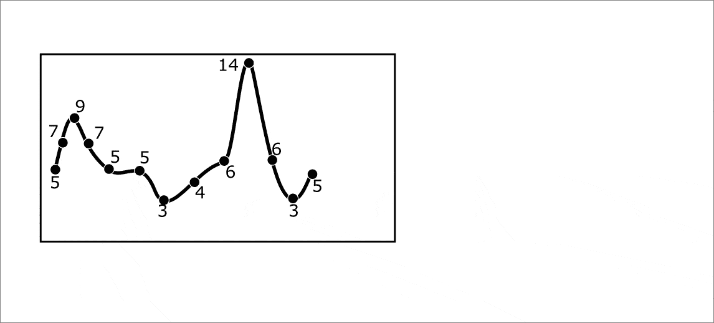

*动画。用滞后时间序列变换提前预测 3 个元素(作者制作的动画)*

任何机器学习模型都可以用作预测模型。但是我们也在 FEDOT 中实现了几个具体的时间序列预测模型(比如 AR 和 ARIMA)。此外，时间序列特定的预处理方法，如移动平均平滑或高斯平滑被添加。

这里还没有自动机器学习。当框架的智能部分 composer 启动时，它就“活了起来”。Composer 是制作管道的界面。在其中，它使用了一种优化方法，实现了 AutoML 的“自动”部分。默认情况下，该框架使用基于遗传编程原则的进化方法。但是，如果有必要，任何搜索算法都可以添加到合成器中，从随机搜索到贝叶斯优化。

AutoML 分两个阶段工作:

*   **组合**就是寻找管道结构的过程。默认情况下，进化算法用于该目的。在这个阶段，节点中的操作被改变，子树从一些解决方案中被删除，并“生长”到其他解决方案。节点中操作的超参数在这里也发生了变异；
*   **超参数调优**是管道结构不变，但节点中超参数在变化的过程。这个阶段在作曲完成后开始。

下面是在合成阶段对管道执行的突变转换的示例:

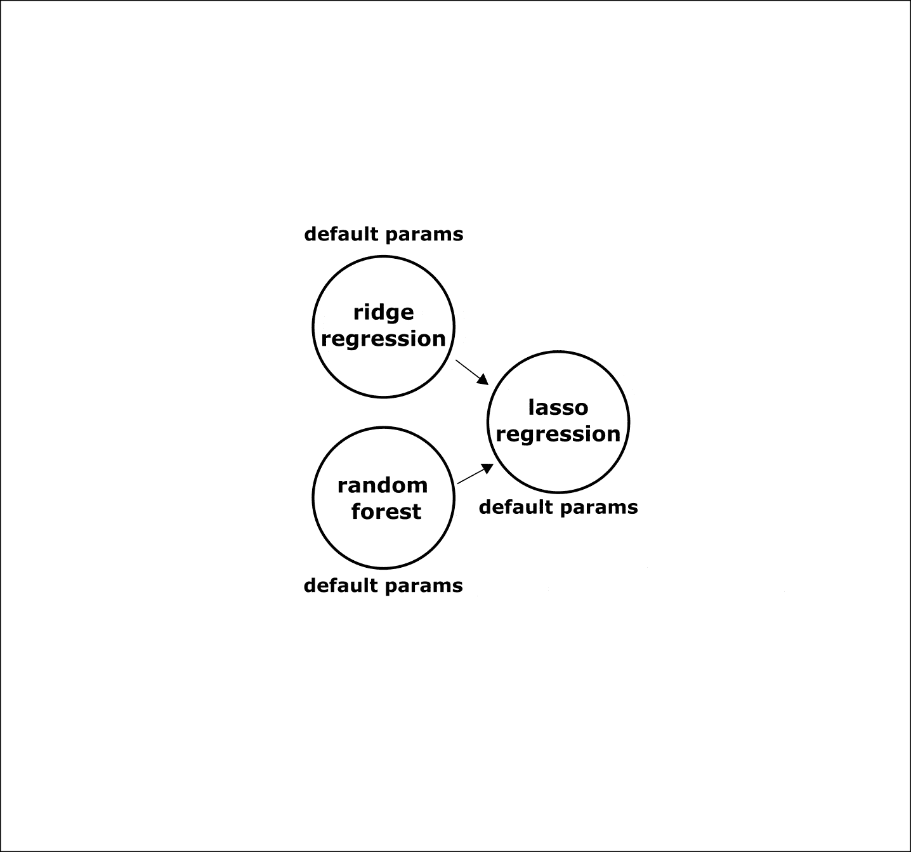

*动画。合成期间管道中的变化过程。显示了改变节点中超参数、替换操作、添加节点的各种变异操作符。交叉运算符未显示(由作者制作动画)。*

在进化过程中，选择最精确的模型。因此，在合成结束时，将有一个具有固定结构的管道，我们只需要在节点中配置超参数。

使用来自[hyperpt](https://github.com/hyperopt/hyperopt)库的优化方法，在管道的所有节点中同时调整超参数:

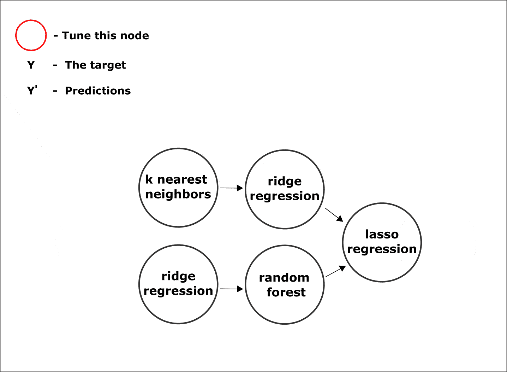

*动画。复合模型节点中参数调整的过程(作者制作的动画)*

完成所有阶段后，我们将获得最终的管道。

**数据我们有**

在机器学习(非科学)文章中，普遍使用相对简单的时间序列来证明算法的有效性。其中最受欢迎的是“[美国航空公司乘客](https://www.kaggle.com/chirag19/air-passengers)”，下面是剧情，展示了它的样子:

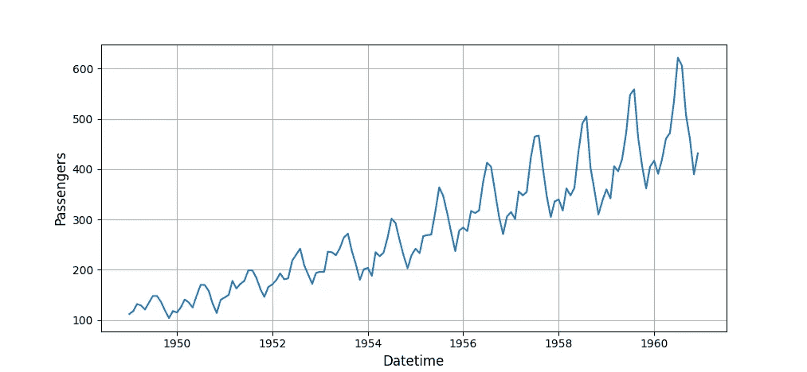

美国航空公司乘客数据集(*图片作者*

在这样的时间序列上展示图书馆的能力是非常诱人的——然而，大多数有点复杂的模型将能够提供足够的预测。我们决定从现实世界中获取一个数据集，以展示 AutoML 算法的所有功能。我们希望，这个例子对于演示来说足够好。

有两个时间序列:第一个是风电场的平均日发电量。第二个是柴油发电机的平均日发电量。这两个参数都以千瓦时为单位进行测量。

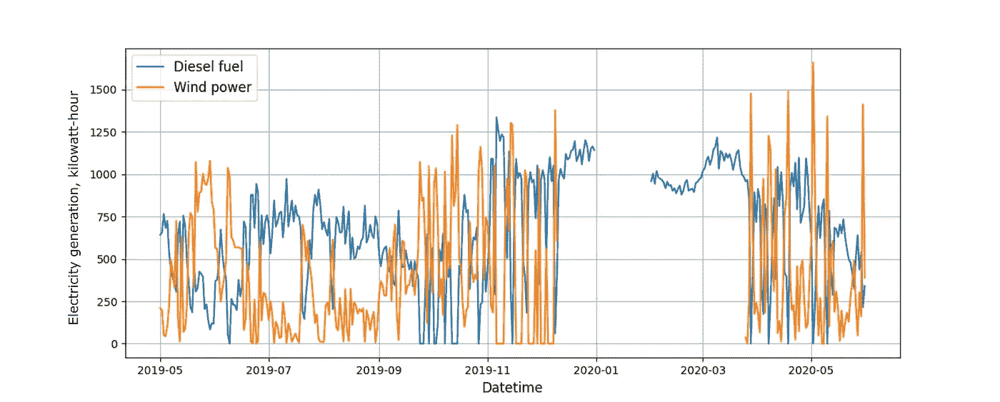

*柴油和风力发电机发电(图片由作者提供)*

风力发电机的发电量高度依赖于风速。如果风速降低，柴油发电机就会启动，以维持足够的发电量。因此，当风力涡轮机的功率输出下降时，柴油发电机的功率输出就会上升，反之亦然。同样值得注意的是，时间序列有缺口。

编程代码不会在这篇文章下面列出。不过为了更好的感知，我们准备了大量的可视化。编程代码的完整版本位于 jupyter 笔记本中，所有技术方面都有更详细的描述。

**任务**

任务是建立一个预测未来 14 天柴油发电量的模型。

**补缺**

出现的第一个问题是原始时间序列中存在间隙。在 FEDOT 中，有三组方法可用于时间序列间隙填充:

*   线性插值等简单方法；
*   使用单一时间序列预测模型的迭代预测方法:
*   填补空白的高级预测方案。

第一组方法工作速度快，但精度低。第二组的方法不考虑问题的细节，相当于简单地预测一个时间序列。最后一组方法考虑到了前面方法的缺点。所以我们将进一步应用第三组的方法。复合模型使用双向时间序列预测来填补空白。

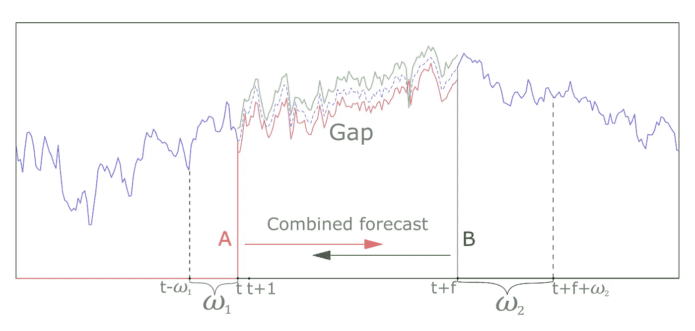

*组合预测的示例，其中使用了两个模型，并且使用加权平均值将它们的预测结果组合在一起(图片由作者提供)*

为了填补时间序列中的空白，我们创建了一个简单的高斯平滑、滞后变换和岭回归的管道。然后我们训练这条管道来预测“未来”。

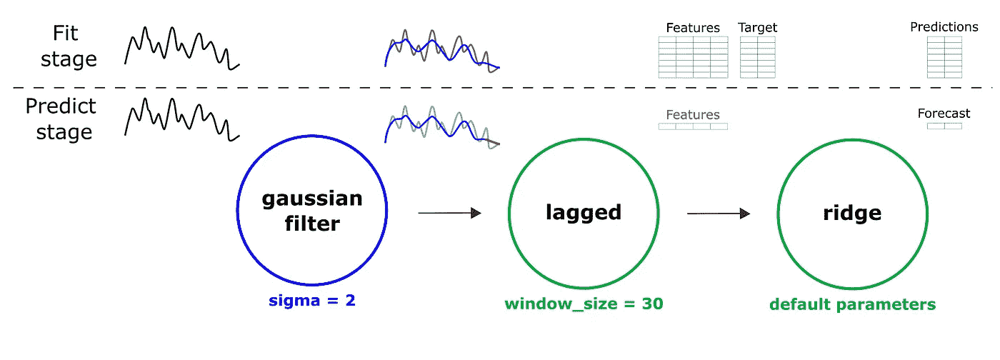

*所获得的用于修复时间序列中的间隙的管道的结构(图片由作者提供)*

然后反方向重复这个动作——训练管道预测“过去”。之后，我们可以使用平均法合并两个预测。

这种方法中的操作顺序可以描述如下。首先，使用位于间隙左侧的时间序列部分。在这一部分上训练一个复合模型，以给出对间隙中存在的前方元素数量的预测。之后，对右侧部分重复该程序。为此，反转时间序列的已知部分，训练模型，进行预测，并反转结果预测。使用加权平均值进行预测组合。因此，向量的值越接近作出预测的时间序列的已知部分，其权重就越大。也就是说，在平均时，红色预测(图中)将在通道的左侧部分具有更大的权重，绿色预测将在右侧部分具有更大的权重。

在应用间隙填充算法后，我们得到这样的结果:

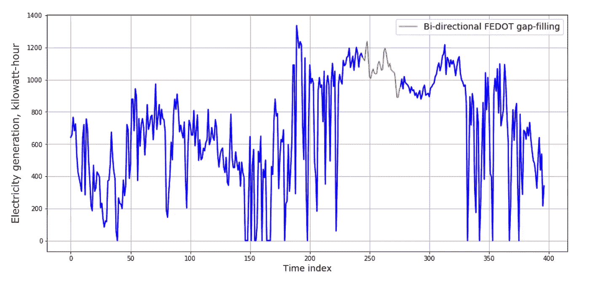

*柴油发电机发电量时间序列的填补空白(作者图片)*

很好，不是吗？但是第二个时间序列在它的中心部分仍然有一个缺口。我们也可以将前面的方法应用于这个缺口，但是存在另一种方法。我们使用成对回归来匹配两个时间序列的值，并使用具有柴油发电机的序列作为单一预测器来恢复风力涡轮机发电量(目标)的值。我们还将使用 FEDOT 框架解决这个回归问题。

在所有这些间隙填充过程之后，我们得到了以下结果:

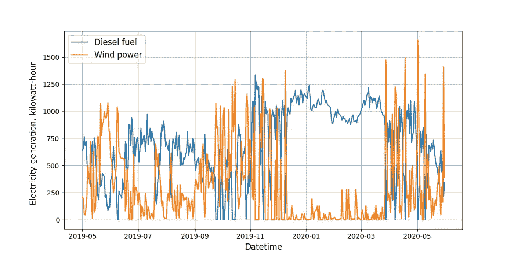

*还原的时间序列(可以看出它们走的是反相的——填充的通行证并不违反这个原则)——(作者图片)*

现在，两个时间序列都没有间隙，可以进一步使用了。

**预报**

让我们使用上面描述的所有 FEDOT 特性，并对我们的数据运行 AutoML 算法。我们已经使用 API 中的 *fit* 和 *predict* 方法启动了带有默认配置的 FEDOT 来进行时间序列预测。现在让我们来看看结果预测，并计算指标:平均绝对误差(MAE)和均方误差的根(RMSE):MAE-100.52，RMSE-120.42。

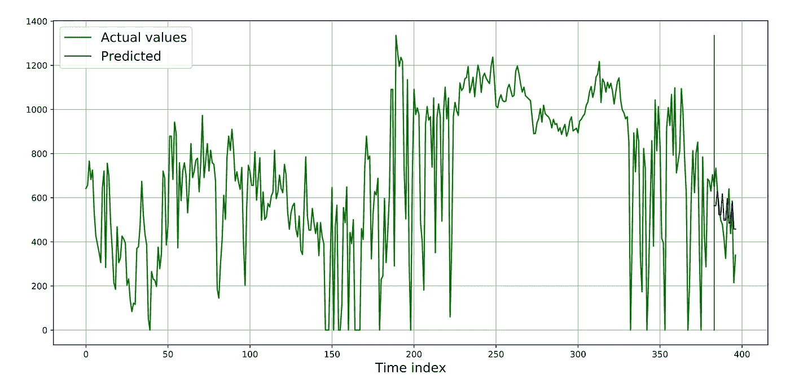

*时序预测示例(作者图片)*

如果我们看图表和度量值，问题就来了:这个模型好不好？

> 回答:很难搞清楚。最好不要在一个小样本上验证模型——那里只有 14 个值。最好至少计算几次指标。例如，三乘以 14(即 42)。为此，您应该使用样本内预测。

**高级验证**

下面的动画应该有助于您理解样本外预测和样本内预测的区别:

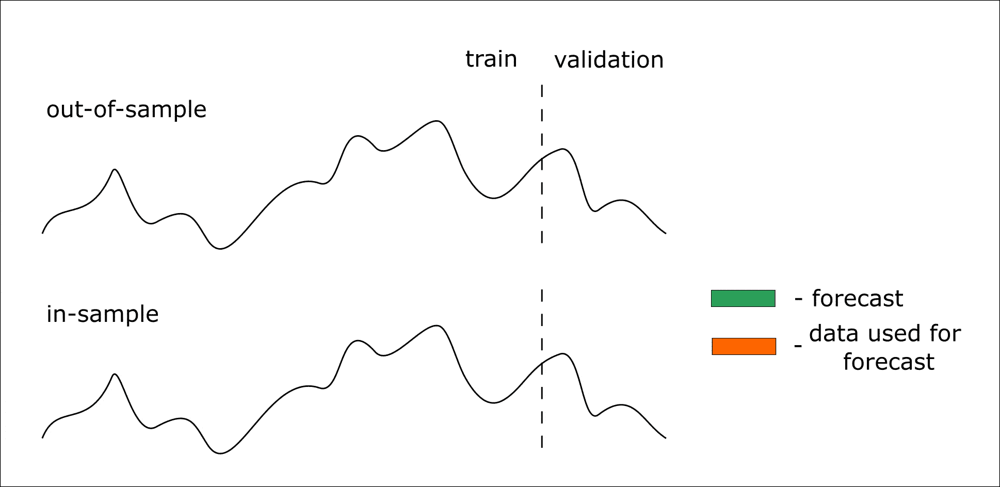

*动画。样本内和样本外预测流程(作者制作动画)*

因此，我们的模型可以预测未来的 14 个值。但是我们希望提前获得 28 个值的预测—在这种情况下，我们可以迭代两次预测 14 个元素。在这种情况下，第一次迭代中预测的值(样本外)将作为第二次预测的预测值。

如果我们想验证模型，我们将使用样本内预测。通过这种方法，我们预测了时间序列中已知的部分(测试样本)。然而，在迭代预测中，已知值用于形成下一步的预测值，而不是前一步的预测值。

在 FEDOT 中，也实现了这种方法，所以现在我们将在三个各有 14 个值的块上测试该算法。为此，我们将划分样本并再次运行 composer。预测结果如下图所示。重要的是澄清进化算法是随机的，因此 AutoML 模型的输出可能不同。

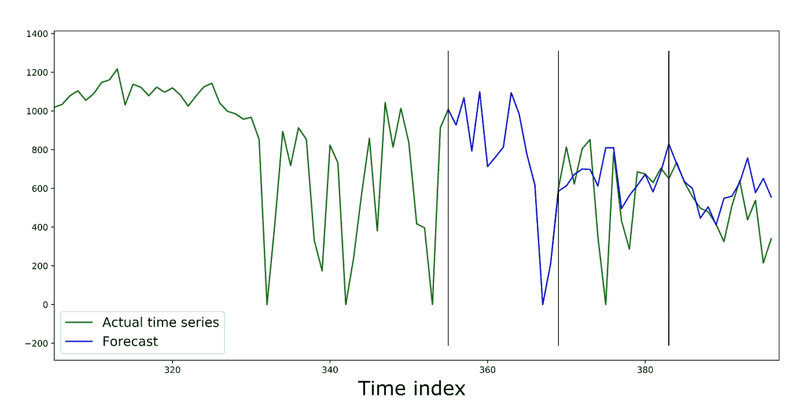

*在三个包含 14 个元素的区块上验证时间序列的复合模型。右侧显示的是原始时间序列(图片由作者提供)*

第一个验证块上的预测完美地重复了时间序列的实际值。这似乎很奇怪，但只要我们看看获得的管道的结构，一切都变得清楚了。

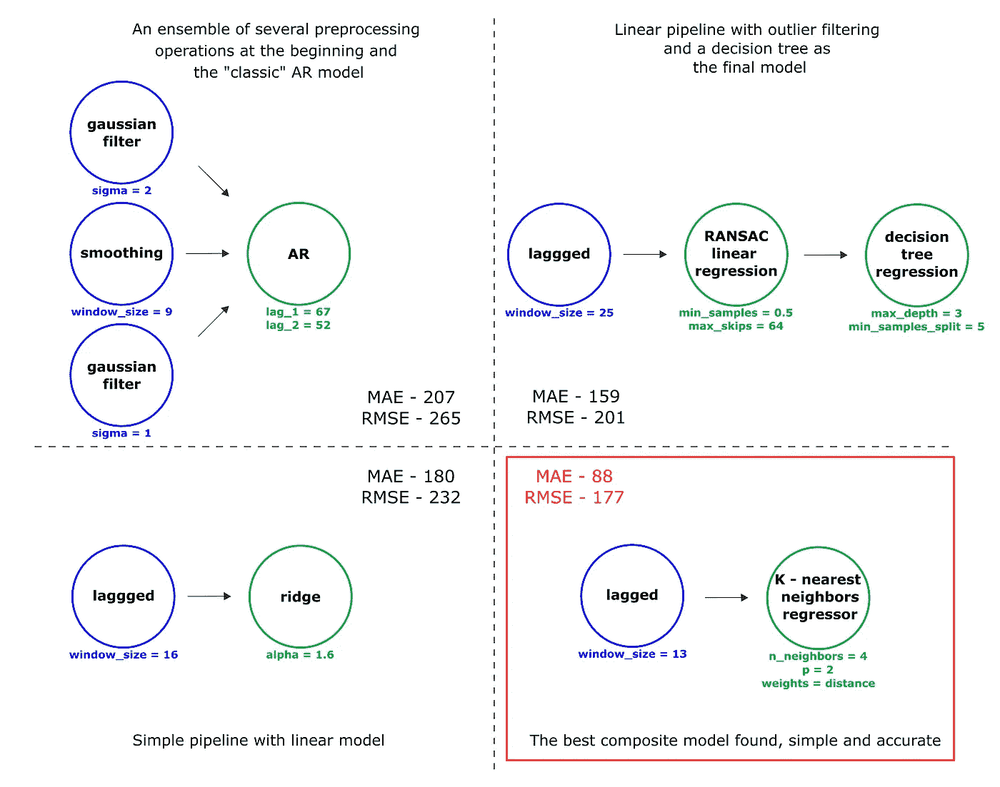

*合成过程中获得的管道实例(进化过程)。考虑了具有特定于时间序列的预处理操作的管道和表示线性关系的简单管道(图片由作者提供)*

从图中可以看出，更复杂的流水线并不总是提供最低的误差度量。因此，最佳发现的管道结果是短的，但是验证的误差值很小。基于此，我们得出结论，对于这个时间序列来说，这已经足够了。

由于最终模型是 K-最近邻算法，管道能够很好地重复来自训练样本的时间序列模式。这种模型可能会出现问题，例如，根据趋势，时间序列不是稳定的。在这种情况下，K-最近邻模型将不能从训练样本中充分推断依赖性。这个时间序列还有一个特点——方差非平稳。

但是，它的结构包含相对同质的部分，与执行验证的时间序列部分没有太大不同。

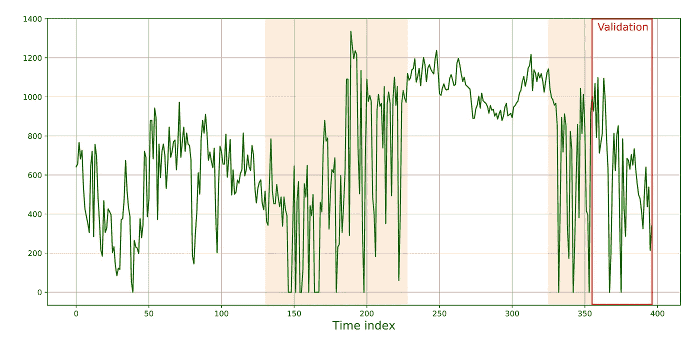

*时间序列中与验证部分“相似”的同质部分以橙色突出显示(图片由作者提供)*

在这些部分，有重复的模式，时间序列是趋势稳定的-值围绕平均值波动，然后上升到 1000 千瓦时以上的值，然后下降到 0。因此，为构建的管道复制这些模式的能力非常重要。但是没有必要去猜测时间序列的低频波动(例如趋势或季节性)。KNN 模式适合这些任务。链合成后获得的预测质量度量是 MAE-88.19 和 RMSE-177.31。

需要注意的是，我们已经在自动模式下准备了一个解决方案，并且没有向搜索算法添加任何额外的专家知识。这个任务在笔记本电脑上运行的框架只用了 5 分钟就解决了。毫无疑问，对于大型数据集，构建一个好的管道需要更多的时间。

**与竞争对手的比较**

D isclaimer:本节中的比较远非详尽无遗。为了证明一个框架比另一个框架更好或更差，您需要进行更多的实验。建议使用一个以上的数据源，应用交叉验证，对相同的数据和相同的参数运行算法几次(对指标进行平均)。在这里，我们有一个介绍性的比较:我们展示了如何替代解决方案可以应付这项任务。如果你对 FEDOT 与其他框架相比如何处理时间序列感兴趣，请关注 [ResearchGate](https://www.researchgate.net/project/Evolutionary-multi-modal-AutoML-with-FEDOT-framework) 的新闻。一篇科学论文中的全面比较将很快问世！

让我们试着比较一下 FEDOT 和其他开源的时间序列预测框架——[AutoTS](https://github.com/winedarksea/AutoTS)和 [pmdarima](https://github.com/alkaline-ml/pmdarima) 。Jupyter 笔记本的代码，以及情节，可通过[链接](https://github.com/ITMO-NSS-team/fedot_electro_ts_case/blob/main/case/ts_case_others.ipynb)获得。因为不是所有的库都在多个块上实现验证功能，所以决定只在时间序列的一个片段上进行这个小的比较。每个算法运行 3 次，并对误差指标进行平均。包含指标的表格如下所示(单元格显示 std —标准偏差):

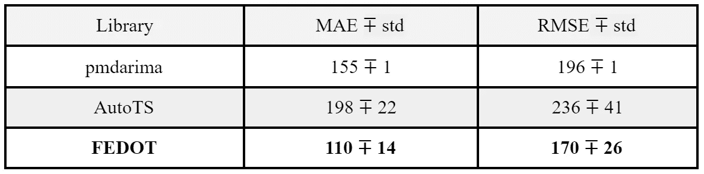

该图还显示了其中一个实验的预测:

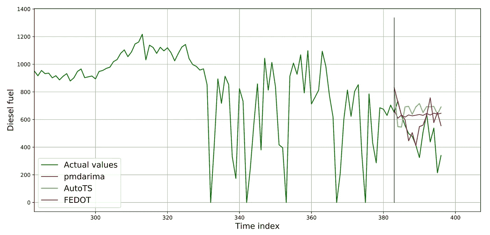

*通过竞争算法获得的预测示例(图片由作者提供)*

从图中可以看出，用 FEDOT 得到的预测更“接近实际数据”。

**结论**

所以，今天我们看到了像 AutoML 这样一个越来越受欢迎的机器学习领域。在本帖中，我们回顾了自动生成 ML 管道的现有解决方案，并指出它们如何用于时间序列预测任务。

我们还在使用 FEDOT 框架预测发电量序列的例子上尝试了 AutoML:我们恢复了丢失的值，使用进化算法构建了管道，并验证了解决方案。最后，演示了 FEDOT 与其他框架在这一任务上的简单比较。

这篇文章中的例子(代码和图表)可以通过[链接](https://github.com/ITMO-NSS-team/fedot_electro_ts_case)在 github 库中找到。

对于那些决定深入研究的人，有几个额外的链接:

*   带有 [FEDOT](https://github.com/nccr-itmo/FEDOT) 的 Github 存储库
*   为框架开发的 web 模块的 Github 存储库— [FEDOT。网络](https://github.com/nccr-itmo/FEDOT.WEB)
*   [聊天](https://t.me/FEDOT_helpdesk)为 FEDOT 讨论和解决问题

用 AutoML，试试 FEDOT！

米哈伊尔·萨拉法诺夫、[帕维尔·维楚查宁](https://github.com/J3FALL)和[尼古拉·尼基丁](https://github.com/nicl-nno)参与了这篇文章的工作。