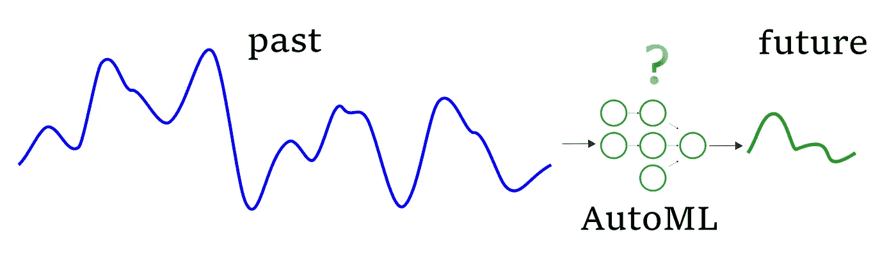
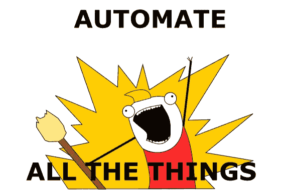
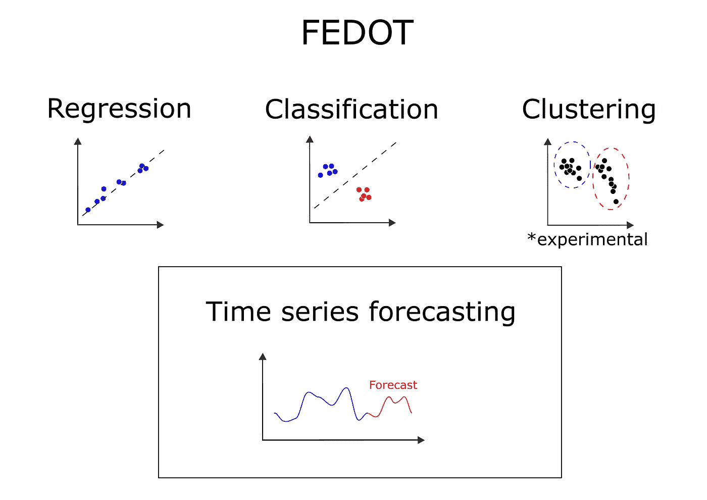
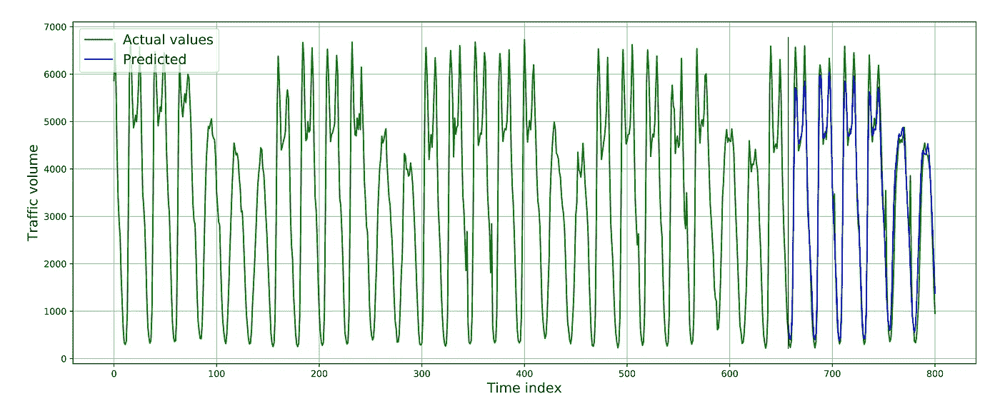
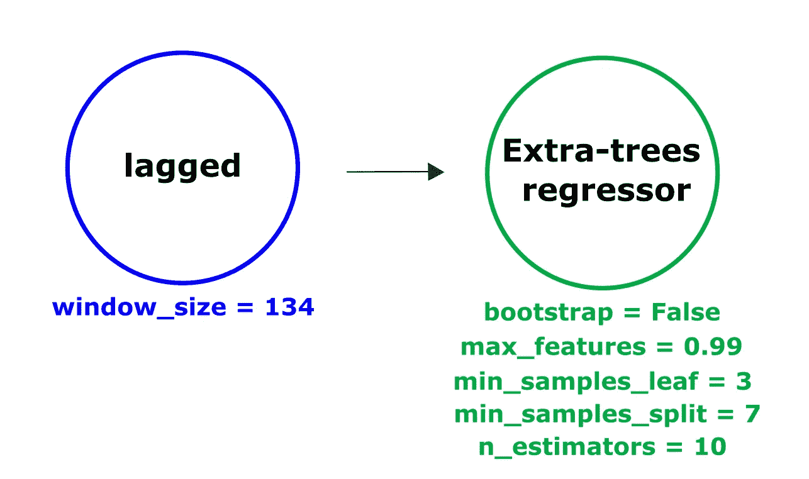

# 时间序列的 AutoML:绝对是个好主意

> 原文：<https://towardsdatascience.com/automl-for-time-series-definitely-a-good-idea-c51d39b2b3f?source=collection_archive---------3----------------------->

## 利用 AutoML 进行时间序列预测的方法及自动预测的实例



用于时间序列预测的 AutoML(图片由作者提供)

目前，数据科学已经成为 IT 行业的重要组成部分，并为业务提供了有用的功能。数据科学家收集和过滤数据。他们训练大量的 ML 模型，执行验证并选择最好的一个。而做这一切活动的主要原因是为了做一个面向商业的产品，这将是最有效的(带来更多的钱)。这些活动可以表示为机器学习工作流。

同时，一些阶段逐年深入自动化。首先，这种自动化触及工作流程中最枯燥的部分。因此，它允许数据科学家将节省下来的时间用于更令人兴奋的任务。


[http://memegenerator.net/](http://memegenerator.net/)

让我们假设我们有一个任务:建立一个机器学习模型，然后将其部署到一个 web 应用程序中。例如，这个模型必须预测顾客今天将在网上商店支付多少钱(或其他任何东西)。但是在我们开始训练我们模型之前，有必要克服几个步骤:

*   从各种来源收集数据；
*   执行预处理操作，如标准化、编码等。；
*   功能工程、移除功能或辛迪思新功能；
*   进行过滤，例如去除异常值；

**机器学习流水线** 这样的多步序列被称为“流水线”。由于管道的复杂结构，使用管道比使用单个机器学习模型更难。此外，对于这种多步结构，故障的概率变得更高。为了控制和管理包含多个 ML 操作的复杂系统，构建了特定的仪器— [MLFlow](https://mlflow.org/) 、 [Apache AirFlow](http://airflow.apache.org/) 。它们类似于数据科学和机器学习领域的工作流管理系统(WMS)。您使用它们的原因是为了简化 ML 管道的管理。



[http://memegenerator.net/](http://memegenerator.net/)

自动生成管道可能是一项更加雄心勃勃的任务。有几个框架可以做到这一点。开源库有 [TPOT](http://epistasislab.github.io/tpot/) 、[自动克隆](https://github.com/awslabs/autogluon)、 [MLJAR](https://github.com/mljar/mljar-supervised) ，或者 [H2O](https://www.h2o.ai/) 。这些框架正在尝试 toя解决的任务“生成管道，这将在最终预测上给出最低的误差”。在绝大多数情况下，管道的结构是固定的，只有超参数在变化。但是有几个框架能够自己找到管道结构。这种优化任务(寻找具有可变结构的流水线)通常使用进化算法来解决，例如，TPOT 和 FEDOT 框架。也有专有的 SaaS 产品，如 [DataRobot](https://www.datarobot.com/platform/automated-machine-learning/) 、 [GoogleAutoTables](https://cloud.google.com/automl-tables) 和 [Amazon SageMaker](https://aws.amazon.com/ru/sagemaker/) 。

通常，AutoML 库和服务只有效地解决广泛的任务:对表格数据的分类和回归。不太常见的是，AutoML 支持文本和图像处理、时间序列预测任务。在本文中，我们将不考虑 AutoML 库的优缺点，但是我们将分析它们在时间序列预测中的能力。

**时间序列的自动机器学习**

尽管事实上时间序列预测任务在科学和商业中是一个相当受欢迎的任务，但是大多数开源 AutoML 库并没有提供为时间序列处理生成流水线的工具。这可能有几个原因，其中之一是在不重构用于其他任务(分类和回归)的工具的情况下，很难使当前的库功能适应预测序列。

关键是时间序列数据的处理不同于解决回归问题时通常的一系列操作。差异从原始样本的划分开始:例如，以随机顺序混合数据来验证时间序列模型是没有意义的。对于时间序列，特征的形成是不同的:通常，机器学习模型不会在原始序列上训练，因为需要将其转换为另一种表示。在已经存在的具有自身特性的 AutoML 项目中实现这样的构造可能会有问题。最有可能的是，这就是为什么开发人员经常拒绝从时间序列(以便“不要一石二鸟”)和集中处理特定的数据类型:只有表格，或只有文本。

一些决定支持时间序列预测的研究人员受限于这种类型的数据。一个很好的开源例子是 AutoTS 框架。这类图书馆通常使用“经典”统计模型进行预测，例如 AR 或 ARIMA。在框架的“内部”,这些模型被调整，然后选择最好的一个(通过验证样本的误差度量),但是这里没有生成新的模型。此外，pmdarima 库基于相同的逻辑。

另一种方法是将现成的 AutoML 工具用于预测。回归模型非常适合这种情况。例如，这种逻辑被用于 H2O，在那里，在其商业版本的产品开发商提供了这样一种可能性。然而，从一些使用开源版本的例子来看，用户将不得不手动预处理原始系列。这样一个精简的工具包可能不足以完成整个工作。

我们希望 AutoML-toolkit 具有哪些功能？

虽然预测一维数组行为的任务看起来很琐碎，但工程师在处理时间序列时希望拥有各种工具。例如:

*   能够构建可解释的模型集合(例如，使得第一个模型再现时间序列的高频分量，第二个模型能够模拟低频分量，第三个模型组合它们的预测)；
*   能够调整时间序列管道中的超参数；
*   使用外生(辅助)时间序列；
*   应用特定的预处理方法(从移动平均平滑到 Box-Cox 变换)；
*   应用样本内和样本外预测；
*   如果时间序列包含间隙，如何修复它们？

在一个框架中考虑所有列出的可能性，而不仅仅局限于时间序列，这是一项相当困难的任务。

对 AutoML 的这些要求并不是偶然出现的。我们在[自然系统模拟](https://itmo-nss-team.github.io/) (NSS 实验室)工作，在过去的几年里，我们参与了几十个机器学习、数据驱动建模和优化方面的各种研究和商业项目。在实践中，我们经常要解决类似的问题，包括时空数据预测。

**我们是谁** **我们为什么担心 AutoML**

不久前，我们对 AutoML 研究产生了兴趣，团队也有了新的实验想法。最终，这些想法形成了一个成熟的开源 AutoML 框架，由我们在实验室中开发和维护。

我们还希望在单个管道中自动解决一个以上的问题，即回归问题和时间序列预测问题，或者同时解决回归和分类问题。例如，在信用评分任务中，即潜在借款人的二元分类中，您不仅可以使用问卷特征，还可以使用即将到来的现金流值，这些值可以作为时间序列进行预测。在我们看来，自动获得这些任务的基线是非常有希望的。

我们还对研究识别可变结构管道的方法感兴趣，并使用多标准优化来优化建模误差和找到的解决方案的复杂性(例如，可以通过管道中的总块数来估计)。

我们在其中一些问题上获得了有趣的结果，如果感兴趣，可以在这里[和这里](https://www.sciencedirect.com/science/article/pii/S1877050920324224)[找到关于它们的科学论文。下面，我们将重点讨论预测时间序列的问题，并讨论如何在此类任务中使用 AutoML，尤其是 FEDOT。](https://arxiv.org/abs/2103.01301)

**利用 FEDOT 框架进行时间序列预测**



FEDOT 可以解决的任务(图片由作者提供)

正如你从我们之前的[帖子](/how-automl-helps-to-create-composite-ai-f09e05287563)中所知，FEDOT framework 可以使用进化算法为各种任务自动生成 ML 管道。下面，我们以 FEDOT(版本 0.3.0)为例，演示如何使用 AutoML 工具预测交通量的时间序列。这个版本可以很容易地通过命令安装

```
pip install fedot==0.3.0
```

Jupyter 笔记本，通过[链接](https://github.com/ITMO-NSS-team/fedot_electro_ts_case/blob/main/case/traffic_example/simple_automl.ipynb)提供代码和图表。

我们有交通量的时间序列，它以客车为单位显示明尼苏达州明尼阿波利斯和圣保罗之间 94 号州际公路沿线的交通量。该数据包含每小时交通量值，每天有两个高峰:早上和晚上。此外，对于该数据，周末的流量通常会减少。

假设我们必须预测 144 个流量元素(我们随机选择了这个值，我们不希望预测范围太大或太短)。意思是需要搞清楚未来六天这条路上会有多少乘客经过。

进口

```
*# FEDOT api* **from** **fedot.api.main** **import** Fedot*# Tasks to solve* **from** **fedot.core.repository.tasks** **import** Task, TaskTypesEnum, TsForecastingParams*# Input data for fit and predict* **from** **fedot.core.data.data** **import** InputData*# Train and test split* **from** **fedot.core.data.data** **import** train_test_data_setup
```

首先，我们需要定义任务和预测范围

```
forecast_length = 144
task = Task(TaskTypesEnum.ts_forecasting,
            TsForecastingParams(forecast_length=forecast_length))
```

为模型准备输入数据

```
*# Load data from csv file and wrap it into InputData structure* input_data = InputData.from_csv_time_series(task, 'ts_traffic.csv', target_column='value')*# Divide into train and test* train_data, test_data = train_test_data_setup(input_data)
```

发布模型:拟合并做出预测

```
*# Init model for the time series forecasting* model = Fedot(problem='ts_forecasting',task_params=task.task_params)*# Run AutoML model design* chain = model.fit(features=train_data)*# Use model to obtain forecast* forecast = model.predict(features=test_data)
```

获得的预测可以在下图中看到:



AutoML FEDOT 模型预测(图片由作者提供)

从图中可以清楚地看出，获得的模型善于猜测数据中的模式，并且可以近似一天内的波动(早晚高峰时间)和周末交通流量的减少。而且只需要两分钟的计算就能得到这样的结果！

让我们来看看生产出来的管道:



机器学习管道，由 AutoML 框架 FEDOT 获得(图片由作者提供)

从图中可以看出，结果链由两个操作组成。“滞后”操作提供了时间序列的滞后(令人惊讶的)转换。我们将在下一篇文章中讨论这个问题。

**结论**

今天，我们已经讨论了几种自动机器学习技术。我们讨论了如何在自动模式下预测时间序列和识别预测模型。我们已经使用一个简单的例子检查了 AutoML 解决方案的功能。

在接下来的文章中，我们将仔细研究使用 AutoML 预测时间序列的所有困难。我们将详细分析 FEDOT 框架在真实世界数据上的能力。

一些有用的链接:

*   [采用 FEDOT 框架的 Github 知识库](https://github.com/nccr-itmo/FEDOT)
*   [带示例的笔记本](https://github.com/ITMO-NSS-team/fedot-examples)

米哈伊尔·萨拉法诺夫、[帕维尔·维楚查宁](https://github.com/J3FALL)和[尼古拉·尼基丁](https://github.com/nicl-nno)参与了这篇文章的写作。