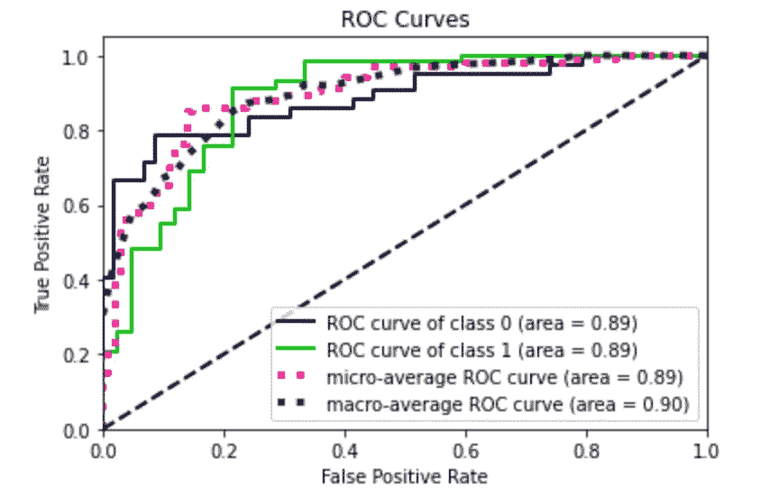
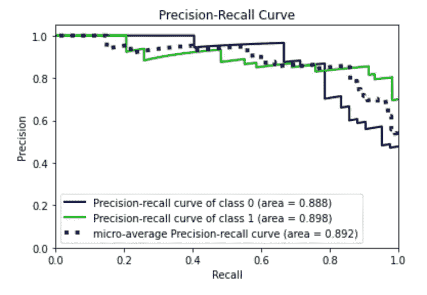
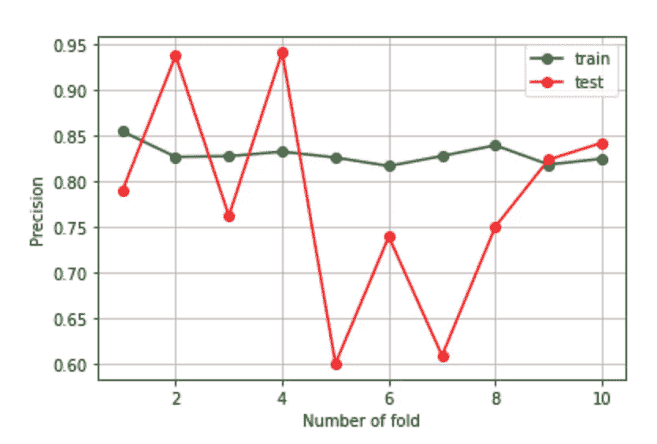
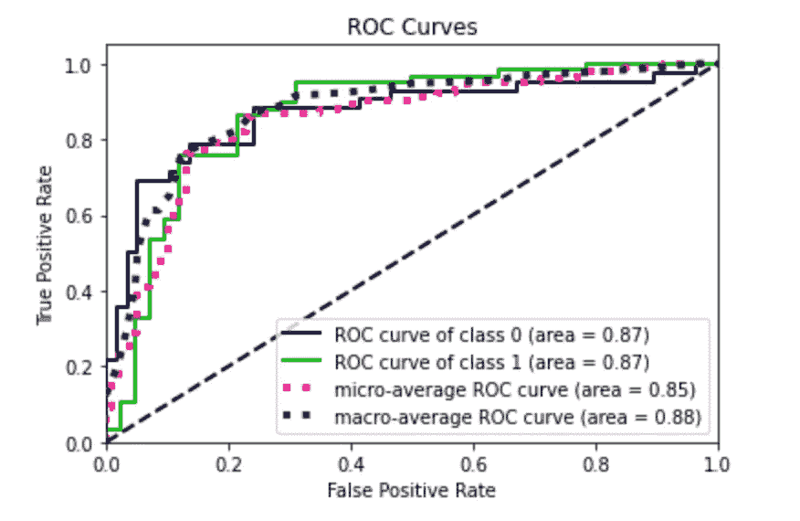
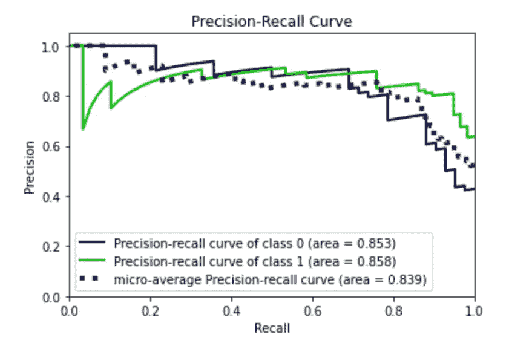
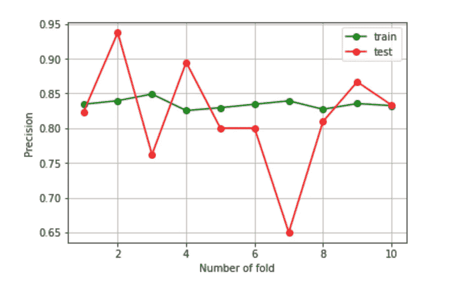

# Python 中的 AutoML:Hyperopt sk learn 和 TPOT 的比较

> 原文：<https://towardsdatascience.com/automl-in-python-a-comparison-between-hyperopt-sklearn-and-tpot-8c12aaf7e829?source=collection_archive---------27----------------------->

## 数据分析

## 两种流行的 Python AutoML 库的优缺点


图片来自 [Pixabay](https://pixabay.com/?utm_source=link-attribution&utm_medium=referral&utm_campaign=image&utm_content=6281625)

**自动化机器学习** ( **AutoML** )涉及将机器学习应用于现实世界问题的任务的自动化。AutoML 涵盖了从原始数据集到可部署的机器学习模型的完整管道。

Python 提供了一些提供 AutoML 的库。在本教程中，我比较了两个流行的库:Hyperopt Sklearn 和 TPOT。存在另一个库，名为 [AutoSklearn](https://automl.github.io/auto-sklearn/master/index.html) ，本文没有对其进行测试，因为它与一些操作系统不兼容。

这两个被分析的库都与 [scikit-learn](https://scikit-learn.org/stable/) 兼容，后者是著名的用于机器学习的 Python 库。

本教程的完整代码可以从[我的 Github 库](https://github.com/alod83/data-science/blob/master/DataAnalysis/AutoML.ipynb)下载。

作为本教程的用例，我利用了由 [Kaggle 库](https://www.kaggle.com/rashikrahmanpritom/heart-attack-analysis-prediction-dataset)提供的`heart.csv`数据集。数据集关注心脏病发作，包含 14 个输入特征，并提供二元分类作为输出(心脏病发作是或否)。

# 1.远视 Sklearn

这个库很容易安装，如文档中所解释的，并且使用起来非常简单。文档简单明了。它支持许多`scikit-learn`分类器、回归器和预处理模型。为了建立一个 AutoML 模型，创建一个`HyperoptEstimator()`的实例，配置一些参数(如估计类型)，然后拟合模型就足够了。`HyperoptEstimator`的`bestmodel()`返回一个包含完整`scikit-learn`管道的对象。

让我们假设`X`和`y`分别包含输入特征和目标。我们可以通过`scikit-learn`函数`train_test_split()`将它们分成训练集和测试集:

```
from sklearn.model_selection import train_test_splitX_train, X_test, y_train, y_test = train_test_split(X, y, test_size=0.33, random_state=42)
```

现在我们可以训练`HyperoptEstimator`搜索最佳分类器:

```
from hpsklearn import HyperoptEstimatorestim = HyperoptEstimator()
estim.fit( X_train, y_train )
```

我们可以得到最好的模型:

```
best_model = estim.best_model()
```

它给出了以下输出:

```
{'learner': ExtraTreesClassifier(criterion='entropy', max_features='sqrt', n_estimators=13,
                      n_jobs=1, random_state=4, verbose=False),
 'preprocs': (),
 'ex_preprocs': ()}
```

键/值对`learner`包含最佳模型，第二个模型(`preproc`)包含应用的预处理技术。在这种情况下，它是空的。

> Hyperopt Sklearn 库反映了机器学习的随机性质:事实上，如果我们试图在相同的训练集上再次运行分类器，我们会获得另一个结果。

使用相同的训练集运行相同的代码(不执行再次训练/测试分割)，我们获得以下最佳模型:

```
{'learner': GradientBoostingClassifier(learning_rate=0.00813591154617836, max_depth=None, max_features=0.6562885234780235, min_samples_leaf=11, n_estimators=63, random_state=0, subsample=0.68797222866341),
 'preprocs': (MinMaxScaler(feature_range=(-1.0, 1.0)),),
 'ex_preprocs': ()}
```

反正我们可以计算模型的性能。我们可以利用内置函数`score()`或者定义我们的性能指标。在最后一种情况下，首先，我们必须将获得的预处理(如果有的话)应用于测试集，并将预测结果与实际值进行比较:

```
X_test_norm = X_test
if len(best_model['preprocs']) > 0:
    preprocs = best_model['preprocs'][0]
    X_test_norm = preprocs.transform(X_test)
```

Hyperopt Sklearn 库不提供`predict_proba()`函数，因此我们必须手动计算:

```
model = best_model['learner']
y_score_hp = model.predict_proba(X_test_norm)
```

然后，我们可以绘制由`scikitplot`库提供的 ROC 曲线和精确召回曲线，如下所示:

```
import matplotlib.pyplot as plt
from sklearn.metrics import roc_curve
from scikitplot.metrics import plot_roc,auc
from scikitplot.metrics import plot_precision_recall# Plot metrics 
plot_roc(y_test, y_score_hp)
plt.show()

plot_precision_recall(y_test, y_score_hp)
plt.show()
```



作者图片



作者图片

我们还可以计算精确度、召回率和准确度:

```
y_test_pred = model.predict(X_test_norm)
accuracy = accuracy_score(y_test, y_test_pred)
precision = precision_score(y_test, y_test_pred)
recall = recall_score(y_test, y_test_pred)print('accuracy:  %s ' %(round(accuracy, 2)))
print('precision:  %s ' %(round(precision, 2)))
print('recall:  %s ' %(round(recall, 2)))
```

它给出了以下输出:

```
accuracy:  0.85 
precision:  0.85 
recall:  0.9
```

在我的 Github 存储库中可用的完整代码中，我还通过 10 重验证计算了所获得模型的精度、召回率和准确度。下图显示了折叠次数的精度趋势:



作者图片

我注意到模型没有过度拟合。

# 2.TPOT

TPOT 是 AutoML 的另一个 Python 库。它的[文档](http://epistasislab.github.io/tpot/)做得很好。然而，安装它并不简单，因为它是建立在其他库的基础上的，因此你必须先安装它们才能让 TPOT 工作和运行。个人觉得在正确安装之前遇到了很多问题。

一旦安装完毕，我们就可以创建一个评估器，或者是一个`TPOTClassifier()`或者是一个`TPOTRegressor()`。在我们的例子中，我们构建了一个 TPOT 分类器:

```
from tpot import TPOTClassifiertpot = TPOTClassifier(generations=5, population_size=50, random_state=42)
tpot.fit(X_train, y_train)
```

这个过程非常缓慢，需要一段时间才能完成。我们可以计算模型的精度、召回率和准确度:

```
y_test_pred = tpot.predict(X_test)
accuracy = accuracy_score(y_test, y_test_pred)
precision = precision_score(y_test, y_test_pred)
recall = recall_score(y_test, y_test_pred)
print('accuracy:  %s ' %(round(accuracy, 2)))
print('precision:  %s ' %(round(precision, 2)))
print('recall:  %s ' %(round(recall, 2)))
```

它给出了以下输出:

```
accuracy:  0.8 
precision:  0.84 
recall:  0.81
```

关于通过 Hyperopt Sklearn 获得的最佳模型，TPOT 表现较差。

TPOT 也提供了`predict_proba()`方法，可以用来计算 ROC 曲线和精确召回曲线。



作者图片



作者图片

我们可以通过`scikit-learn`管道访问最佳模型:

```
tpot.fitted_pipeline_
```

它给出了以下输出:

```
Pipeline(steps=[('logisticregression',
                 LogisticRegression(C=20.0, random_state=42))])
```

虽然在文档中提到模型可能在相同的数据集上产生不同的最佳模型，但是在我们的例子中，在相同的数据集上运行更多次相同的代码会返回相同的模型。

现在，我可以通过 10 重交叉验证来计算精确度、召回率和准确度。TPOT 本身提供了交叉验证。然而，在这种情况下，我们手动计算它，因为我们想要绘制度量相对于每个折叠的趋势。

下图显示了精度趋势。对于其他情节(回忆和准确性)，请检查我的 Github 库:



作者图片

关于 Hyperopt Sklearn 库，TPOT 似乎更稳定，有不同的数据集。

# 摘要

在本文中，我们比较了两个流行的用于 AutoML 的 Python 库:Hyperopt Sklearn 和 TPOT。

**远视 Sklearn**

*优点*

*   易于安装
*   快的
*   最佳模型达到高性能

*缺点*

*   相同(简单)数据集的不同最佳模型
*   简单和糟糕的文档

**TPOT**

*优点*

*   对于相同(简单)的数据集，总是相同的最佳模型
*   写得好的文件
*   最佳模型达到良好的性能

*缺点*

*   非常慢
*   难以安装

如果你想了解我的研究和其他活动的最新情况，你可以在 [Twitter](https://twitter.com/alod83) 、 [Youtube](https://www.youtube.com/channel/UC4O8-FtQqGIsgDW_ytXIWOg?view_as=subscriber) 和 [Github](https://github.com/alod83) 上关注我。

# 相关文章

[](/a-complete-data-analysis-workflow-in-python-and-scikit-learn-9a77f7c283d3) [## Python 和 scikit 中的完整数据分析工作流程-学习

towardsdatascience.com](/a-complete-data-analysis-workflow-in-python-and-scikit-learn-9a77f7c283d3) [](/how-to-deal-with-imbalanced-multiclass-datasets-in-python-fe0bb3f2b669) [## 如何在 Python 中处理不平衡的多类数据集

towardsdatascience.com](/how-to-deal-with-imbalanced-multiclass-datasets-in-python-fe0bb3f2b669) [](/how-to-check-if-a-classification-model-is-overfitted-using-scikit-learn-148b6b19af8b) [## 如何使用 scikit-learn 检查分类模型是否过度拟合

towardsdatascience.com](/how-to-check-if-a-classification-model-is-overfitted-using-scikit-learn-148b6b19af8b)