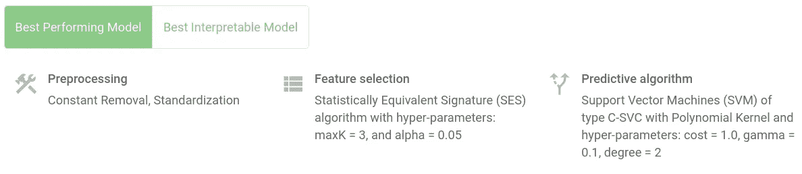
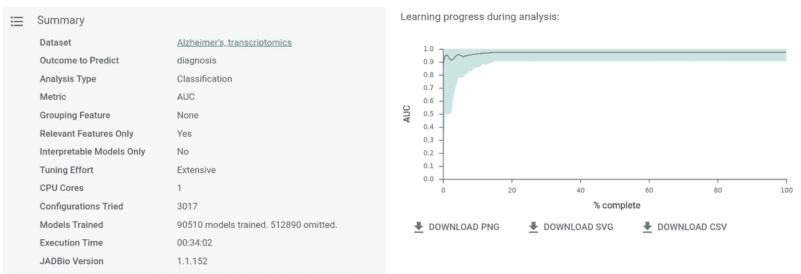
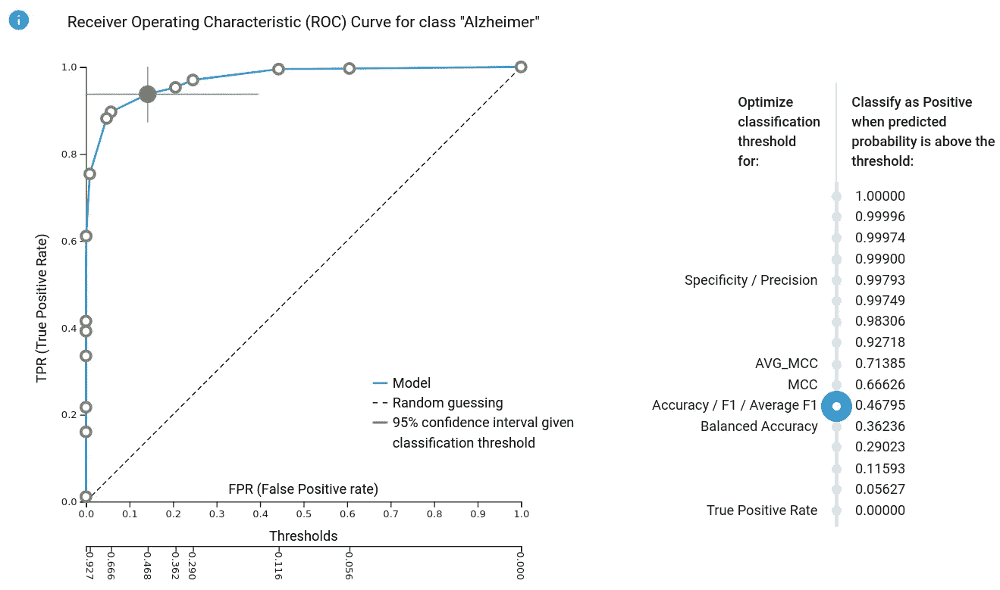
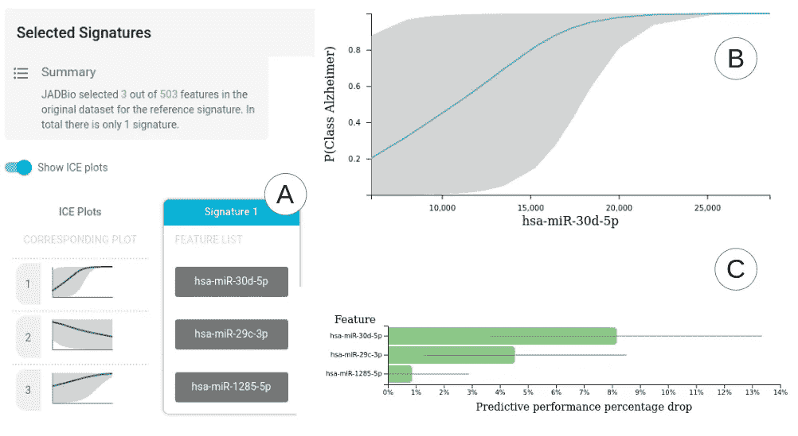

# 汽车 vs HPO vs 现金:有什么区别？

> 原文：<https://towardsdatascience.com/automl-vs-hpo-vs-cash-what-is-the-difference-38c8e0a9d93b?source=collection_archive---------35----------------------->

## AutoML 将逐渐取代人类专家分析师提供的**功能，但不仅仅是提供预测模型**

照片通过 Shutterstock

自动化机器学习，或简称为 **AutoML** 正在兴起。越来越多的商业产品出现在市场、学术工具和公共的开源 AutoML 库中。正如每一种新的、不清楚的、定义模糊的新技术一样，AutoML 被误解了。一方面，有浮夸的说法称它将把数据分析师送回家，另一方面，有极端的说法称它只自动化了分析的琐碎部分。这是因为不同的人对 AutoML 给出了不同的定义。让我们检查一下。

**(预测性)AutoML 的愿景**:AutoML 到底是什么？维基百科将其定义为端到端的机器学习过程的自动化。但是机器学习不是已经自动化了吗？我有一个数据集，我用默认的超参数值运行一个学习算法(例如，随机森林，SVM ),然后，我有了一个模型实例。那是自动的，不是吗？那么，有什么大惊小怪的？

AutoML 的目标是逐渐取代越来越多由人类专家分析师提供的**功能。**这些不仅仅是交付预测模型**。优秀的数据科学家会为您提供图表、视觉效果、解释、见解和建议。他们不仅会确定要尝试的适当分类算法，还会对数据类型进行专门的预处理，尝试数据或 ML 任务的各种表示，并应用特征提取方法。而且不止于此。模型投入生产后，数据分析师需要持续监控预测的健全性，以防数据统计分布漂移。如果是这种情况，则需要标记一个警报，并且需要对模型进行重新训练。最重要的是，一个好的分析师将帮助你基于你的模型做出最优决策，比如当你应用模型时，最优的分类阈值是什么，以及哪些因素(特征、变量)可能会影响你的订户的行为。这就是 AutoML 应该做的。AutoML 是最终目标，但我们还没有完全实现。**

**超参数优化**(**HPO**):AutoML 平台的一个子问题是在其处理的所有可用算法中提供最好的可能模型实例。这些算法中的每一个都可以使用超参数进行“调整”。超参数是修改其行为的算法的输入。**使用不同的超参数值运行相同的算法可能会导致完全不同的预测模型实例**。因此，出现的问题是如何调整它们的值并获得可能的最佳模型实例。超参数的解释通常与它们对检测模式和拟合数据的敏感性有关。例如， *K-* 最近邻中的 *K* 越低，或者岭逻辑回归中的权重惩罚λ*越低，模型将越复杂，模型将越好地拟合训练数据，并且过度拟合模型的概率越高。一些算法接受不止一个超参数，例如，XGBoost 算法接受大约 12 个与调整学习性能相关的超参数！**调整算法的超参数可以大大提高预测性能！**以我们的个人经验来看，**调优“几个好的算法”可以说比使用大量默认设置的算法更重要**。超参数优化(HPO)是自动调整给定算法的超参数的问题。几个基本的和先进的算法已经出现在 HPO 的文献中。HPO 算法尤其具有挑战性，因为它需要调整许多超参数。*

***组合算法和超参数选择(CASH): HPO** 通常用于优化单个算法的超参数。然而，预测建模算法的选择(例如，SVM 对随机森林)也可以被编码为数字超参数:1 表示 SVM，2 表示 RFs，等等。此外，可以在建模之前应用一系列分析步骤，例如预处理、缺失值插补和特征选择。因此，分析的每一步都需要考虑算法选择和超参数调整。当除了超参数值之外还进行算法选择时，使用的更具体的术语是**组合算法和超参数选择**算法，或**现金**。*

***汽车、现金和 HPO 的区别**。几个非常流行、特别有用、非常成功的免费软件库，像 **auto sklearn** 、 **TPOT** 和**Gamma**在我们看来更好的描述是 CASH 或 HPO 库，而不是 AutoML 。所以，这就是不同之处:*

********现金*** *自动搜索最优预测模型。******

****让我们用一个例子来说明不同之处。我们考虑了[1]测量 48 名阿尔茨海默病患者(病例)和 22 名年龄匹配的健康受试者(对照组)血液中 503 种 miRNA 表达的数据。任务是学习阿尔茨海默病状态的分类模型(二元分类)并估计其样本外预测性能。此外，还需要确定最佳预测所需的特征(在这种情况下是血液生物标志物),并了解它们的作用和重要性。我们在这个问题上应用了我们的 AutoML 平台，叫做 [**JADBio**](https://jadbio.com) 。可以在这里访问实际成绩[(https://app . jad bio . com/share/f 0 DCE 75d-612 c-4160-9256-55 b5 af 98 D2 d 2)。](https://app.jadbio.com/share/f0dce75d-612c-4160-9256-55b5af98d2d2)****

****首先， **JADBio** 解决了一个 **CASH** 问题，为预处理、特征选择和建模步骤选择算法，以及它们对应的超参数值，从而得到一个最佳预测模型。有 3017 种不同的算法和超参数值的组合被尝试(称为**配置**)来识别胜出者。每种配置都经过交叉验证，以评估性能和最终赢家，从而产生 90510 个经过训练的模型实例。获胜配置和分析报告如下图所示:****

****************

*****图 1: JADBio 对 lei dinger et al . 2013[1]48 名阿尔茨海默病患者和 22 名对照受试者的 miRNA 数据的分析报告。分析步骤的第一行显示了产生最佳模型实例的成功的 ML 管道(配置)。90510 个模型实例在 34 '内的 3017 个配置中被训练(适合)。*****

****到目前为止，你可以从任何其他的 **CASH** 算法，比如 auto sklearn，得到相似类型的输出。**这就是差异开始的地方**。下图显示了模型的样本外(即新的、未见过的样本)性能的估计值。相比之下，像 auto sklearn 这样的现金库不会为您自动进行性能评估。作者建议您省去一个保留集来评估性能。JADBio 强调精确的性能评估，即使是小样本。它在内部自动执行所有必要的交叉验证；它还调整了“赢家的诅咒”的性能估计，即，为了选择最佳配置，已经尝试了许多配置。“未经调整的估计值”是没有经过这种调整的交叉验证的估计值，是一种高估(参见[2]了解更多信息)。 **JADBio** 也输出 ROC 曲线。曲线上的圆圈表示不同概率分类阈值的模型的不同操作点。绿色圆圈对应于阈值 0.46。将具有高于 0.46 的模型概率的受试者分类为患有阿尔茨海默氏病使得该模型在 ROC 上的该点上运行，其中它实现了 0.15 的假阳性率和 0.93 的真阳性率。用户可以点击任何圆圈，并获得模型的假阳性率和真阳性率之间的相应权衡。这是**支持在模型操作环境**中使用的分类阈值优化的一种方式。****

********

*****图 2: JADBio 报告样本外接收操作特性(ROC)。它通过为阈值的不同选择提供估计来促进最佳分类阈值的优化。曲线上的每个圆圈对应于不同的阈值(底部 x 轴)以及假阳性率(x 轴)和真阳性率(y 轴)之间的不同权衡。例如，将任何概率高于 0.46(右侧摩天大楼点)的新样本分类为患有阿尔茨海默氏病，会导致选择 FPR 为 0.15、TPR 为 0.93 的绿色圆圈。每个轴上的置信区间显示为绿色十字。*****

******JADBio** 的配置还包括特性选择。因此，用户被告知测量和获得最佳性能所需的最小特征集。下图(子图(A))显示了 503 个特征中的 3 个特征被选择用于模型包含。大多数 CASH 库现在不同时执行特征选择和建模，尽管这可能会改变。无论如何， **JADBio** 的目标不仅仅是选择特性，还包括自动解释它们的作用和重要性。ICE 曲线[3]显示了每个特征，试图解释它们在预测中的作用。ICE 曲线显示，平均而言，作为特征值的函数，模型预测的成为阿尔茨海默病受试者的概率。在本例中，我们放大了第一个特征的 ICE 图(面板 B)。我们推断这一特征是疾病的*风险因素:其值越高，平均而言，阿尔茨海默氏症模型的概率输出越高。请注意，准确的预测取决于所有 3 个选定的特征，并且根据其他两个特征的值而变化。这种差异在 ICE 图中用灰色区域表示。为了便于解释重要性，它们的附加值显示在特征重要性面板中。它显示了当从模型中删除一个功能，并且只删除该功能时，预期的性能下降。总的来说，AutoML 为从业者提供了一套功能来决定测量哪些特性以及如何解释它们的作用。*****

********

*****图 3: A)最终模型的特征(所选特征), B)特征 hsa-miR-30d-5p 的 ICE 图，以及 C)如果特征被排除在特征之外，基于相对性能下降的特征重要性。*****

****还有其他的视觉和输出来促进解释和决策。这些包括自动识别可能错误标记的样本和“难以预测”的样本(当前可用)、可能损坏的样本(“脏数据”)、对单个预测的解释(尚不可用)等等。AutoML 正面处理问题的解释和说明。视角发生了转变:**当生产出一个模型实例时，HPO 和卡什就停止了。对于 AutoML 来说，这只是一个起点。******

*******由 Ioannis Tsamardinos(克里特岛和亚德比奥大学)、Zacharias Papadovasilakis(亚德比奥大学)、Giorgos Papoutsoglou(克里特岛大学)和 Vassilis Christophides(法国恩塞阿)研究和撰写*******

# ****参考****

****[1] P. Leidinger，C. Backes 和 S. Deutcer，“阿尔茨海默病患者的基于血液的 12-miRNA 标记。、“*基因组生物学，*第 14 卷第 7 期，R78 页，2013 年。****

****[2] I. Tsamardinos，E. Greasidou 和 G. Borboudakis，“引导样本外预测实现高效准确的交叉验证”，*机器学习，*第 107 卷第 12 期，第 1895–1922 页，2018 年。****

****[3] C. Molnar，“5.2 个人条件期望(ICE)”，载于*可解释机器学习。使黑盒模型变得可解释的指南。*，2021 年。****