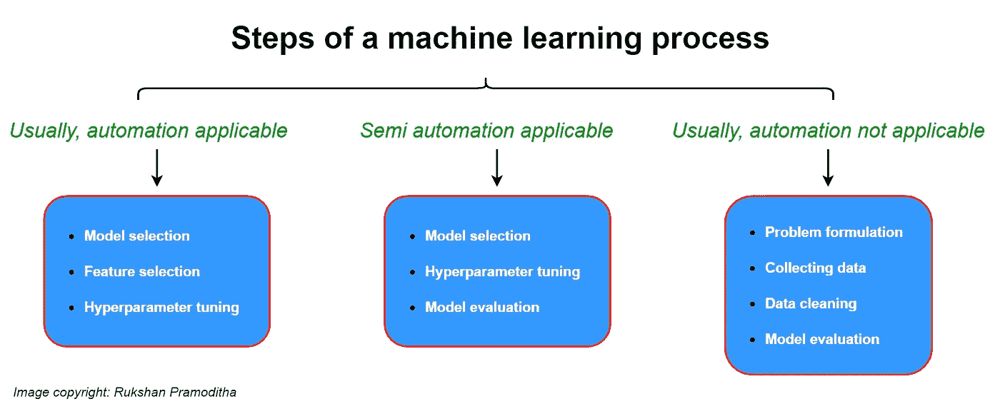

# AutoML 不会取代你的数据科学职业

> 原文：<https://towardsdatascience.com/automl-will-not-replace-your-data-science-profession-52753a4a53ed?source=collection_archive---------22----------------------->

## 让我们通过机器学习过程的步骤来找出“为什么？”


[亚历山大·奈特](https://unsplash.com/@agk42?utm_source=unsplash&utm_medium=referral&utm_content=creditCopyText)在 [Unsplash](https://unsplash.com/?utm_source=unsplash&utm_medium=referral&utm_content=creditCopyText) 上拍照

许多已经是数据科学家或数据科学领域新手的人正在寻找问题***“AutoML(自动机器学习)会取代数据科学家吗？”*** 问这样一个问题是非常合理的，因为*自动化*已经被引入到*机器学习*中，并且它在现代世界中发挥着关键作用。除此之外，想要成为数据科学家的人正在思考如何在就业市场中长期获得一席之地。

AutoML 会*而不是*取代你的数据科学职业。它只是为了让你的事情变得更简单，比如协助你完成枯燥的重复性任务，节省你的宝贵时间，协助你进行代码维护和一致性等！

让我们通过机器学习过程的步骤来找出“为什么 AutoML 不会取代你的数据科学专业？”。我们还将讨论一些可以应用于机器学习过程的流行自动化选项。在这篇文章的结尾，你会意识到 AutoML 将**而不是**取代你的数据科学职业。

# 让我们介绍一些关键的定义

基本上， ***机器学习*** 就是在没有明确编程的情况下，计算机从数据中学习的能力。它与传统编程有所不同。 ***自动化*** 是一个需要*最少人工投入*的过程。存在各种类型的自动化。只有 ***AI 自动化*** 使用机器学习。它是自动化和机器学习相结合的东西。人工智能自动化系统可以根据数据进行学习和决策。将自动化应用于机器学习意味着我们使用自动化选项，以最少的人力来实现机器学习过程中的一些重复任务。

# 机器学习过程的步骤

下图显示了机器学习过程的步骤，分为三个主要类别——通常为*，自动化适用*，*半自动适用*和*通常为，自动化不适用*。



(图片由作者提供)

让我们详细讨论每个步骤。

## 问题定式化

这才是真正需要数据科学家的地方。因为每个问题都是不同的，所以问题的表述不能自动化。它需要大量的*领域知识*。解决问题没有单一的方法。数据科学家应该根据给定的场景使用不同的策略。这是 AutoML 无法处理的事情。在这一步，AutoML 无法取代数据科学家。

## 收集数据

数据科学家或数据工程师应该决定需要收集的数据类型和数量。这取决于他们想要解决的问题。这些事情不能自动化。但是，他们可以使用相关的自动化选项进行数据挖掘，以避免重复的任务。因此，数据收集可以是半自动的！这一步仍然需要数据科学家，AutoML 不能完全取代数据科学家。

## 数据清理

数据科学家和数据工程师将 60–70%的时间花在数据清理上。这是因为每个数据集都是不同的，它需要特定领域的知识。这是机器学习过程中最重要的一步。数据清理包括处理缺失值、异常值检测、分类变量编码等。处理缺失值是数据科学家最耗时的部分。离群点检测涉及到很多领域知识。如果我们检测到一个异常值，我们下一步应该做什么？我们应该移除它吗？我们应该保留它吗？或者我们应该用一个相关的值来代替它？这取决于特定分析问题的领域知识。一个离群值背后可能有一个有趣的故事。这些事情是自动化系统无法完成的。所以，这里需要数据科学专业人才。

## 型号选择


(图片由作者提供)

*模型选择*是指选择一个合适的机器学习算法来解决你的问题。数据科学家或机器学习工程师应该做出多项决策，以选择最佳算法。这个要看你手里的问题类型和收集的数据量和类型。如果您的数据有标注(基础真值)，您可以选择像回归或分类(监督方法)这样的算法。如果标注是类值，则可以选择分类算法。如果标签是连续值，您可以选择回归算法。如果您有非线性数据，您可以选择非线性分类器或回归器(例如随机森林、决策树、XGboost)。如果您有线性数据，您可以使用线性回归器进行回归任务，使用具有线性核的支持向量机进行分类任务。如果您的数据不包含任何标签(基础真值)，您可以选择像降维或聚类(非监督方法)这样的算法。如果您仍然希望找到未标记数据背后的隐藏模式，可以在已知聚类数的情况下使用 KMeans 算法。如果聚类数未知，可以尝试 MeanShift 算法。如果你想降低数据的维数，你可以对线性数据使用 PCA 或 LDA 算法，对非线性数据使用核 PCA，t-SNE 算法。算法的选择也取决于你拥有的数据量。一般来说，算法的选择取决于各种标准。数据科学专家应该想出一个办法来自动化这些事情。现在也有一些 Python 框架可用。但是，他们不能完全自动化这一过程。

## 特征选择

所选择的算法应该能够通过考虑特征的重要性来选择特征。向后消除、向前选择和随机森林方法可用于特征选择。这些算法可以自动选择最佳特征，但数据科学家仍应在使用这些方法之前手动设置参数值。这意味着这里也需要数据科学家。

## 超参数调谐

模型参数在训练过程中从输入数据中学习它们的值。相反，模型超参数在训练过程中不学习它们的值。因此，数据科学专业人员应该在训练过程之前指定模型超参数的值。机器学习模型通常会包含许多超参数。数据科学家的任务是为每个超参数尝试不同的值，并找到超参数值的最佳组合。如果他们一个接一个地手工操作，将需要很长的时间。自动化选项，如*网格搜索*或*随机搜索*可用于此。大多数时候，超参数调整过程包含数百甚至数千次迭代，数据科学家无法手动处理。一些超参数包含从 0 到正无穷大的值。数据科学家的任务是使用领域知识缩小超参数值的范围，然后应用网格搜索或随机搜索来实现最佳调整过程！

## 模型评估

模型评估过程确保模型很好地符合训练数据，并且也可推广到新的未见过的数据。对于监督学习，模型评估过程很容易，因为标签(基础真值)是可用的。相比之下，在标签(基础真值)不可用的无监督学习中，模型评估具有挑战性。在无监督学习中，很难找到任何用于模型评估的自动化选项。

# 数据科学家的主要职责

现在，我们可以弄清楚数据科学家在机器学习过程中的一些关键职责。

*   数据科学家应该把问题公式化。
*   数据科学家应该指导算法如何从数据中学习。
*   他们应该确定特征(变量)之间的真实关系。
*   他们应该为算法提供准备充分的足够数量的数据。
*   在大多数情况下，他们应该能够解释模型及其最终输出。

当承担这些责任时，数据科学家可以对机器学习过程的某些部分使用自动化选项。但是，AutoML 不能完全取代数据科学家的这些职责。

# 可用于机器学习任务的自动化选项

在本节中，我们将介绍一些可以应用于机器学习过程步骤的自动化选项。一些方法还包含 Python 代码。

## 使用 **cross_val_score()** 进行交叉验证

我们可以通过交叉验证使用 sci kit-learn**cross _ val _ score()**函数进行*模型评估*。以下 Python 代码对基于“房价数据集”构建的回归模型执行交叉验证。

通过交叉验证进行模型评估的 Python 代码(等到加载！)


(图片由作者提供)

这里，我们用不同的数据折叠对模型进行了几次训练，然后得到了平均 RMSE 值。但是我们没有手动完成这个过程，而是使用 sci kit-learn**cross _ val _ score**函数自动完成了这个过程。因此，自动化可以用来处理*模型评估*中的重复性任务。

## 超参数调谐用 g ***rid 搜索***

我们可以使用 Scikit-learn**GridSearchCV()**函数进行*超参数调整*。以下 Python 代码为基于“房价数据集”构建的回归模型执行超参数调整。

超参数调优的 Python 代码(等到加载！)


(图片由作者提供)

这里，我们在***RandomForestRegressor****中调 3 个超参数***【max _ depth】******【min _ samples _ leaf】***和***【max _ features】***。因此，超参数空间是三维的，所以每个组合包含 3 个值。组合数为 192 (8 x 8 x 3)。这是因为 ***max_depth*** 包含 **8** 值，***min _ samples _ leaf***包含 **8** 值， ***max_features*** 包含 **3** 值。这意味着我们训练 192 个不同的模型！在 5 重交叉验证过程中，每个组合重复 5 次。因此，总迭代次数为 960 (192 x 5)。但是还要注意，每个 **RandomForestRegressor** 有 100 个决策树。所以，总计算量是 96000(960 x 100)！自动化流程让数据科学家的工作变得更加轻松。*

## *使用 **Pipeline()** 训练多个模型*

*通过使用 Scikit-learn**Pipeline()**，我们可以自动化多个复杂模型的训练过程。下图显示了构建多项式回归模型的一般工作流程。应该按照给定的顺序应用这些步骤。*

**

*多项式回归模型的一般工作流程(图片由作者提供)*

*流水线通过顺序地应用一系列转换器和最终预测器来自动化训练过程。在我们的工作流程中，*

1.  ***StandardScaler()** 是变压器。*
2.  ***PCA()** 是变压器。*
3.  ***多项式特性()**是变压器。*
4.  ***LinearRegression()** 是预测器。*

*以下 Python 代码将自动执行上述工作流。*

*多项式回归模型的一般工作流程的 Python 代码(等到加载！)*

*现在，您可以通过一个**来训练所有的估计器。**调用 fit()。*

```
*ploy_reg_model.fit(X,y)*
```

## *其他自动化选项*

*下面是本文中不会详细讨论的其他流行自动化选项的列表。*

*   ***PyCaret** —这是 r 中可用的 Caret 包的 Python 版本，PyCaret 中的大多数机器学习任务就像函数调用一样简单。你可以用几行代码训练和可视化多个机器学习模型。*
*   ***微软 Azure AutoML**——这将自动化应用于具有速度和规模的机器学习模型。如果将此与 Microsoft Power BI 相结合，您可以从数据中获取最大价值。*
*   ***TPOT** —这是一个 Python 库，通过应用自动化来处理机器学习任务。*
*   ***Google Cloud AutoML** —你可以用最少的努力训练出高质量的定制机器学习模型。*

# *关键要点*

*现在，你对 AutoML 以及它如何应用于机器学习任务有了清晰的理解。我们已经走过了机器学习过程的步骤，并找到了“AutoML 不会取代你的数据科学专业”的原因。我们还讨论了目前可用的一些自动化观点。你可以试试它们！在以后的文章中，我也会谈到其中的一些。*

*有两件明显的事情无法完全自动化机器学习过程:*

*   ***对领域知识的需求***
*   ***未标记数据的存在(在无监督学习中)***

*因为这些东西，AutoML 无法取代数据科学家。*

*除此之外，我想给你以下两条关于使用 AutoML 的建议:*

*   *如果你是数据科学或机器学习领域的新手，不要从像**微软 Azure AutoML** 或**谷歌云 AutoML** 这样易于使用的框架开始你的机器学习过程。与其这样，不如学习 Python(或者 R)及其相关包。在你对机器学习理论和那些包有了扎实的基础知识之后，你可以试试**微软 Azure AutoML** 或者**谷歌云 AutoML** 。这样做将为成为该领域的大师创造一条漫长而清晰的道路。*
*   *当你学习数据科学和机器学习时，更多地关注数据清理任务，如处理缺失值、离群点检测、特征编码和无监督学习方法。除此之外，更多地关注获取特定问题的领域知识，并用简单的英语解释你的结果，这样即使是非技术人员也能理解你的发现。这些都是自动化无法取代的。*

*最后，确实需要数据科学家！自动化让他们的事情变得更容易。*

*感谢阅读！*

*本教程由 [*鲁克山·普拉莫迪塔*](https://www.linkedin.com/in/rukshan-manorathna-700a3916b/)*[数据科学 365 博客](https://medium.com/data-science-365)作者设计创作。**

**在 https://rukshanpramoditha.medium.com[阅读我的其他文章](https://rukshanpramoditha.medium.com/)**

**2021–05–11**