# AutoNLP:基于 SOTA 模型的自动文本分类

> 原文：<https://towardsdatascience.com/autonlp-automatic-text-classification-with-sota-models-f4a0dd8bdbfa?source=collection_archive---------12----------------------->

## 从头开始理解和使用 AutoNLP 的分步指南

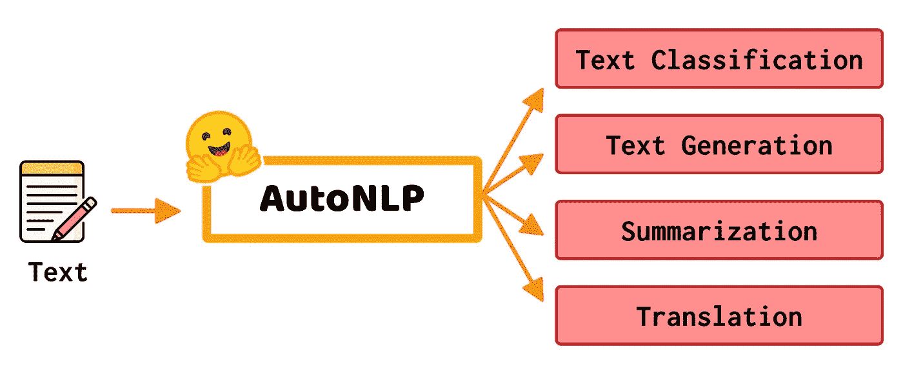

图一。AutoNLP |作者图片|取自 [freepick](https://www.freepik.com/) 的图标

开发一个端到端的*自然语言处理*模型并不是一件容易的事情。这是因为必须考虑几个因素，例如模型选择、数据预处理、训练、优化、模型服务的基础设施以及其他因素。出于这个原因，今天出现了一些有趣的替代方法来简化和自动化这些任务。这就是 **AutoNLP** 的情况，这是一个允许我们自动化 NLP 模型的端到端生命周期的工具。

在这篇博客中，我们将了解什么是 AutoNLP，以及如何在安装过程、项目创建、培训、指标、成本估算和模型服务中很好地使用它。因此，本博客将涵盖以下几个部分:

*   **什么是 AutoNLP？**
*   **实践中的 AutoNLP**

# 什么是 AutoNLP？

AutoNLP [ [1](https://huggingface.co/autonlp) ]是一个自动创建端到端 NLP 模型的工具。AutoNLP 是由[拥抱脸](https://medium.com/u/b1574f0c6c5e?source=post_page-----f4a0dd8bdbfa--------------------------------) [ [2](https://huggingface.co/) 团队开发的工具，于 2021 年 3 月推出测试阶段。AutoNLP 旨在自动完成构成 NLP 模型生命周期的每个阶段，从训练和优化模型到部署模型。

> “AutoNLP 是一种自动训练和部署最先进的 NLP 模型的方法，与拥抱脸生态系统无缝集成。”— AutoNLP 团队

AutoNLP 的一大优点是，它为*二进制分类*、*多级分类*和*实体识别*的任务实现了最先进的模型，支持 8 种语言，即:*英语*、*德语*、*法语*、*西班牙语*、*芬兰语*、*瑞典语*、同样，AutoNLP 负责模型的优化和微调。在安全和隐私部分，AutoNLP 实现了受 SSL 保护的数据传输，数据也是每个用户帐户的私有数据。

正如我们所看到的，AutoNLP 是作为一种工具出现的，它简化并加速了创建 NLP 模型的过程。在下一节中，将会看到使用 AutoNLP 创建文本分类模型时从头到尾的体验。

# 实践中的 AutoNLP

对于这个例子，我们将处理一个**二元分类**问题。该数据集来自 SEPLN (塔斯社)[ [3](http://tass.sepln.org/2020/) ]研讨会的*语义分析，由西班牙语的推文组成，标记为 3 类*负面*、*正面*和*中性*。出于这个例子的目的，我们将从*中性*类中移除样本，以得到一个适合二进制分类问题的数据集。你可以点击下载数据集[。在图 X 中，我们可以观察到训练和验证数据集的特征。](http://tass.sepln.org/2020/?page_id=74)*

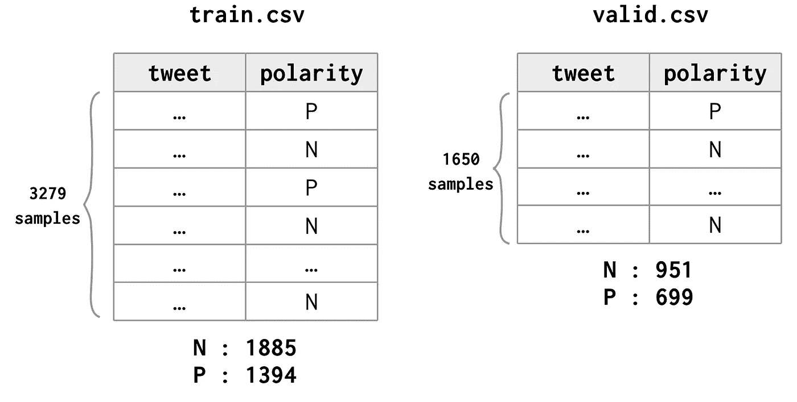

图二。训练和验证数据集|按作者分类的图像

现在，我们不必对数据集做任何其他事情。接下来就是开始使用 AutoNLP 了，那就加油吧！

# **安装 AutoNLP**

为了通过 AutoNLP 工具使用 Hugging Face 基础设施，我们需要注册并创建一个帐户，其中将包含我们的模型和数据集。此帐户将提供一个令牌，用于在 AutoNLP CLI 和 Hugging Face 基础架构之间建立通信。

可以通过`pip`从命令行直接安装 AutoNLP，如下所示:

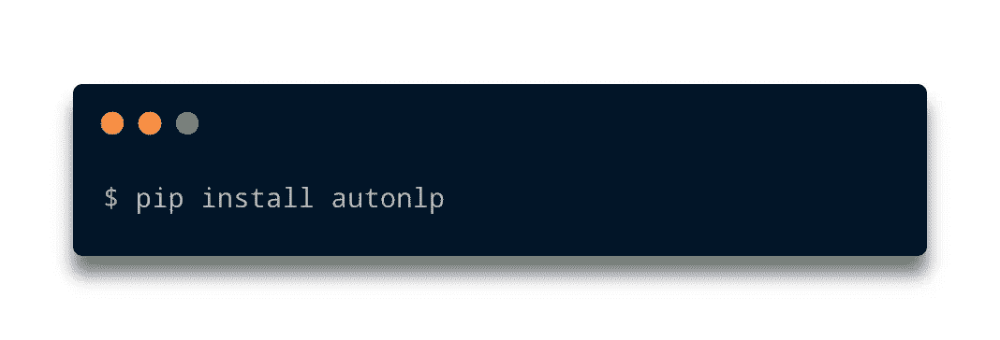

图 3。按作者安装 autonlp |图像

我们还将要求安装 *Git 大文件存储* (Git LFS)。在我的例子中，由于我在 macOS 操作系统上工作，我是这样做的:

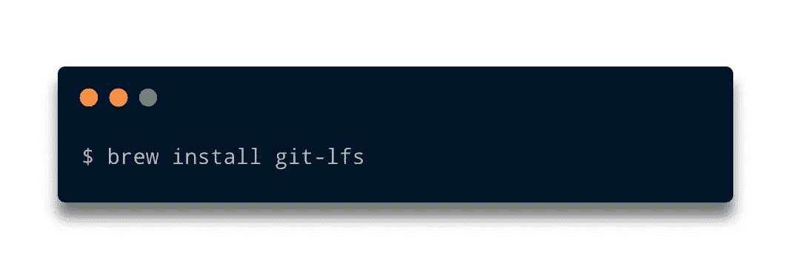

图 4。作者安装 git-lfs |图像

然后，为了设置`git-lfs`,您需要键入:

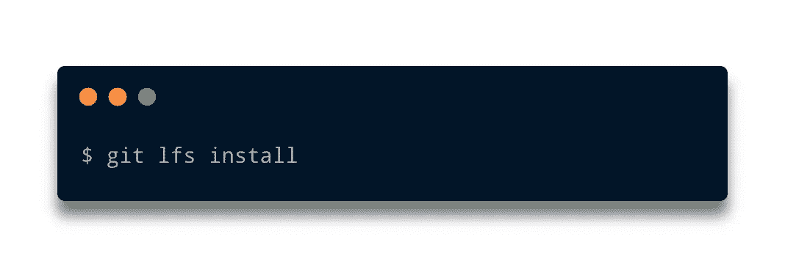

图 5。按作者设置 git-lfs |图像

一旦`autonlp`被安装，它的要求，我们继续创建一个项目，上传数据和训练我们的模型，让我们去做吧。

# 创建 AutoNLP 项目

创建项目的第一步是进行身份验证，为此，我们只需要您帐户设置中的令牌，使用`autonlp` CLI 键入:

图 6。记录|按作者分类的图像

一旦通过认证，我们就开始创建我们的项目。对于这个例子，我们的项目将被称为`polarity_detection`，它将用`spanish`语言处理数据，任务将是`binary_classification`，我们想要训练的模型的最大数量是`5`。然后，该命令如下图所示:

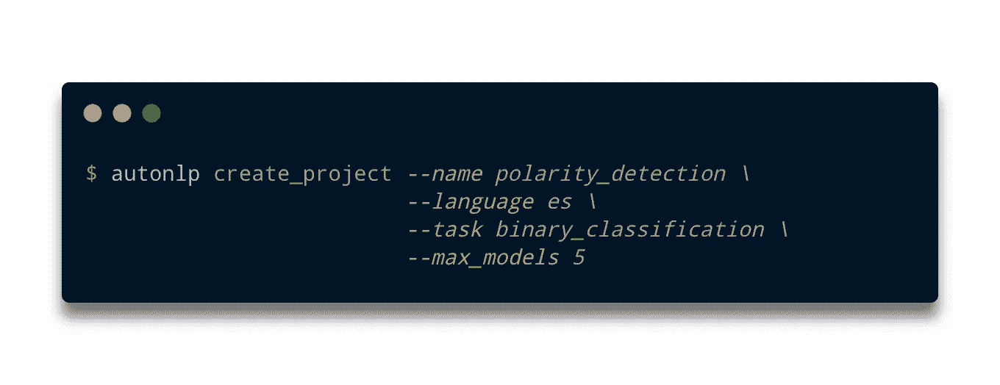

图 7。按作者创建项目|图像

当创建我们的项目时，终端将向我们显示关于我们创建的项目的信息。我们的示例项目的信息如图 8 所示。

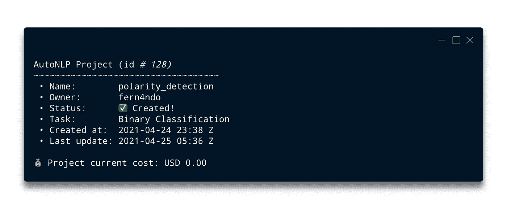

图 8。项目描述|作者图片

正如我们所看到的，这些信息向我们展示了一些细节，比如我们项目的标识符(在这个例子中是`128`),属性比如`name`、`owner`等等。但是，还显示了一条非常重要的信息，即成本。在这个阶段，成本仍然显示`USD 0.00`，因为我们还没有训练任何模型，因此，只有当我们的模型训练结束时，这个值才会改变，这一点我们将在后面详细介绍。

# 上传您的数据

一旦我们的项目被创建，我们将继续上传我们的数据集。建议分别上传训练数据集和验证数据集。要上传数据集，只需指定项目的名称(在我们的例子中是`polarity_detection`)、分割的类型(即`train`或`valid`)、列名的映射(在我们的例子中是`tweet`和`polarity`，它们分别映射到`text`和`target`以及数据集文件。下图显示了这些命令的外观:

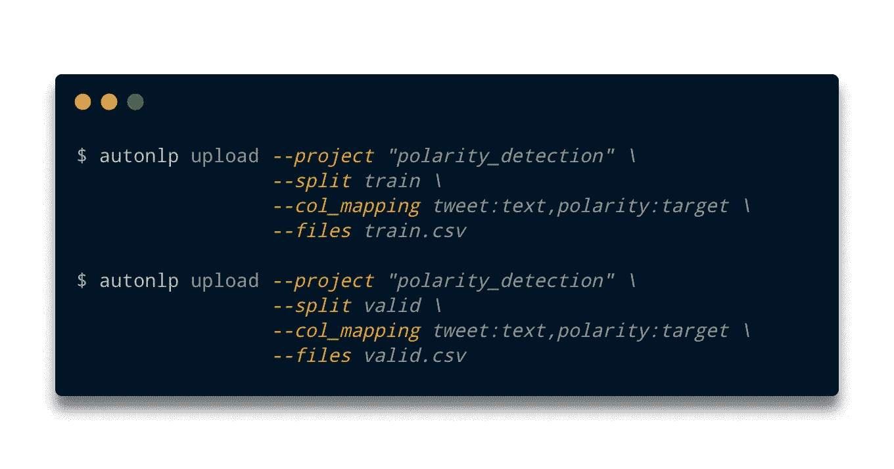

图 9。上传数据集|按作者上传图像

与项目的创建一样，在终端上传数据集时，我们将看到与我们的流程相关的信息，在这种情况下，我们的数据集信息如下图所示:

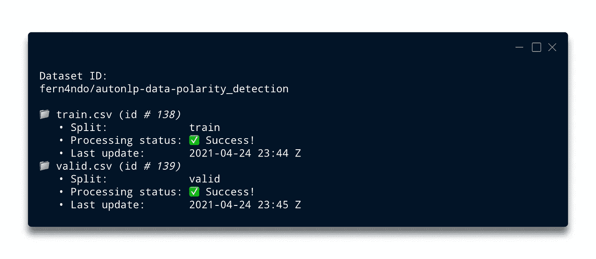

图 10。数据集信息|作者提供的图像

一旦数据集上传完毕，我们就可以开始训练了。然而，要考虑的一个重要方面是成本。AutoNLP 为我们提供了一个命令，根据训练数据集中的样本数量来估计项目的成本。为了获得估计值，我们使用下图所示的命令:

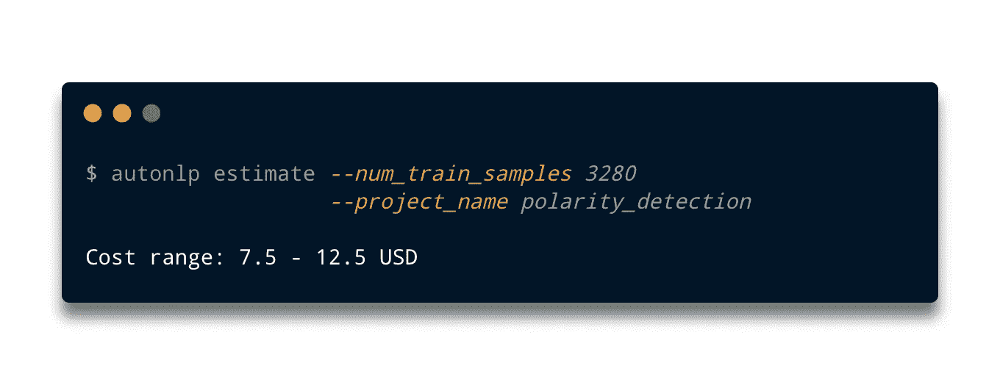

图 11。成本估算|作者图片

我们可以看到，成本是在一个范围内提供的，对于这个例子，成本估计为`7.5`到`12.5 USD`。培训结束后会提供最终费用，我们将在下面看到。

# 培养

从模型的训练开始，我们只需要使用`train`参数和项目名称，如下图所示:

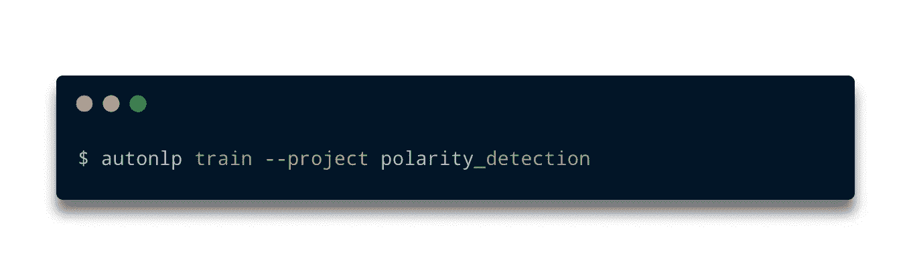

图 12。培训|作者图片

培训开始后，我们将会看到一个问题，询问我们是否同意估计的成本(即我们在上一节中看到的成本范围)，在接受估计的成本时，我们将观察每个模型的状态，如下图所示:

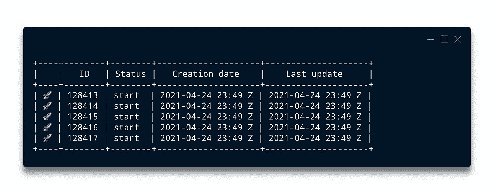

图 13。培训状态|作者图片

根据我们推出的模型数量以及数据集的特征，训练时间会有所不同。但是，我们可以使用`project_info`参数来监控模型的状态，如下图所示:

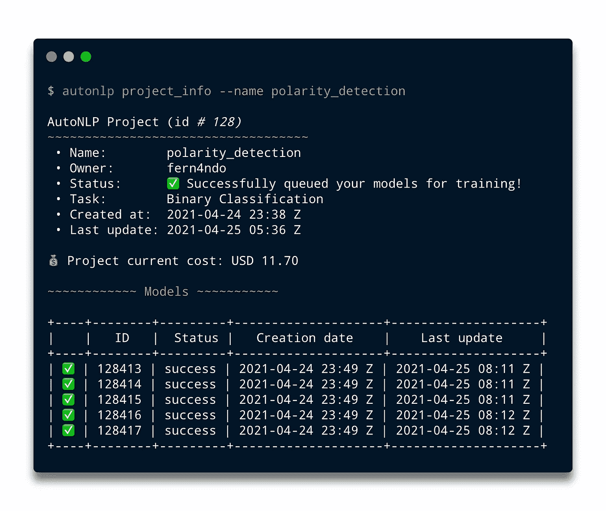

图 14。项目信息|作者图片

从上图可以看出，每一款推出的车型都有令人满意的结局(记住我们只推出了 5 款)。还显示了更新后的最终成本，即`11.70 USD`。

在每个模型的训练过程中，我们可以监控一些指标，出于本例的实际目的，我们只显示在所有模型的训练结束时获得的指标。因此，为了形象化度量，我们使用了`metrics`参数和项目名称，如下所示:

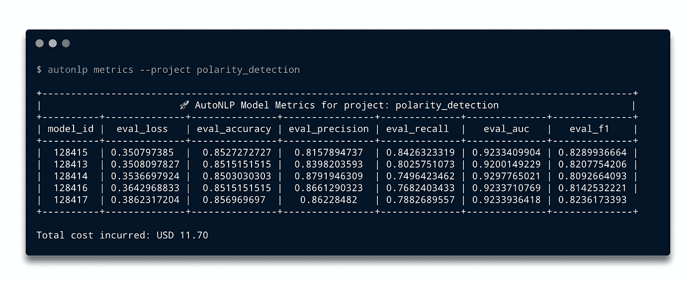

图 15。指标|作者图片

对于每个训练模型，报告的度量是`loss`、`accuracy`、`precision`、`recall`、`AUC`和`f1-score`。在我们的例子中，我们看到平均来说`accuracy`是`0.85`，考虑到数据集的特征，这可能是一个可接受的值。我们还可以看到，它再次显示了我们培训的总成本。

# 推断

一旦我们的模型经过训练，它们就可以做预测了。为了进行预测，我们将使用`predict`参数以及模型标识符、项目名称和要预测的短语，如下图所示:

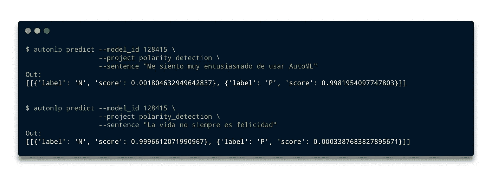

图 16。预测|作者图片

正如我们在前面的图中看到的，这个句子假装是肯定的，实际上，这个模型为肯定的类产生了一个得分`0.99`。在第二个例子中，句子假装是否定的，实际上，该模型为否定类产生了得分`0.99`。

同样，AutoNLP 允许通过 cURL 请求和 Python API 进行预测，分别如图 17 和 18 所示。

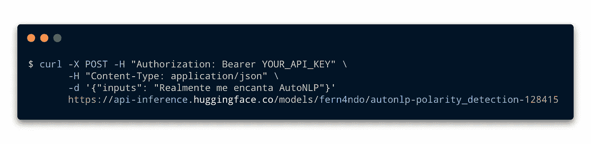

图 17。按请求预测|按作者分类的图片

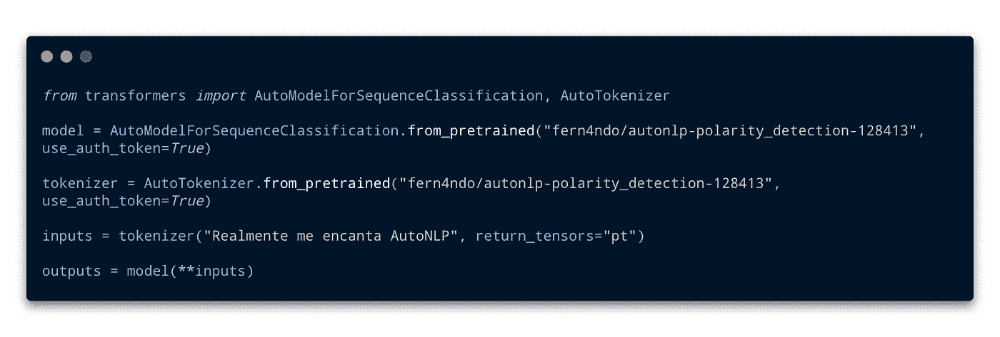

图 18。通过 Python API 预测|作者图片

# 结论

在这篇教程博客中，我们看到了什么是 AutoNLP，它的组件，以及它是如何工作的。

值得一提的是，一旦我们通过 AutoNLP 使用了 Hugging Face 基础设施，我们将会收到一张发票，上面的金额显示在命令行上。

我测试 AutoNLP 的经历很愉快。我第一次训练时遇到了一些问题，但是他们提供的支持是有效的。

# 参考

[1] [AutoNLP](https://huggingface.co/autonlp)

[2] [抱紧脸](https://huggingface.co/)

[3][SEPLN 语义分析](http://tass.sepln.org/2020/)