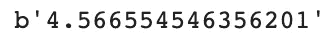
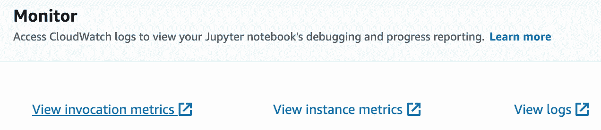
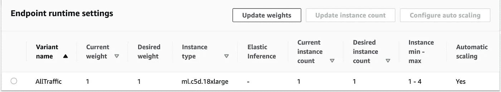
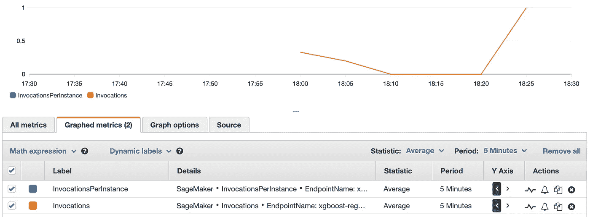
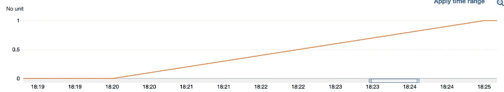
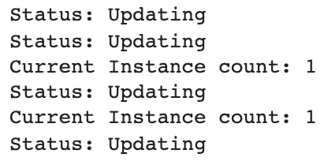
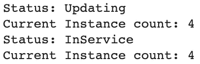

# 自动缩放 SageMaker 实时端点

> 原文：<https://towardsdatascience.com/autoscaling-sagemaker-real-time-endpoints-b1b6e6731c59?source=collection_archive---------10----------------------->

## 将您的 ML 工作负载投入生产

图片来自[阿尔普·杜兰](https://unsplash.com/@alpduran)的 [Unsplash](https://unsplash.com/photos/vLuj--T3Fp8)

让一个端点启动并运行以进行推断是一回事。确保端点能够处理您预期的流量是另一回事。有了 [SageMaker 实时端点](https://docs.aws.amazon.com/sagemaker/latest/dg/realtime-endpoints.html)，在生产中推出模型时需要考虑许多因素。您用于端点的实例类型是什么？对于这个用例来说，更重要的是，**您有多少实例**支持端点？

在本帖中，我们将研究[自动缩放 SageMaker 端点](https://docs.aws.amazon.com/sagemaker/latest/dg/endpoint-auto-scaling.html)来处理流量。最简单的形式是，您可以拥有一个由一个实例支持的 SageMaker 实时端点。有时，该实例可能会超负荷工作，这可能会导致您的端点出现故障和推断错误。为了解决这个问题，您可以创建一个自动扩展策略，帮助您的实例根据 [CloudWatch 指标](https://docs.aws.amazon.com/sagemaker/latest/dg/monitoring-cloudwatch.html)展开，比如每个实例的调用次数或 CPU 利用率。

对于今天文章中的例子，我们将从一个 [Amazon XGBoost](https://docs.aws.amazon.com/sagemaker/latest/dg/xgboost.html) 部署的端点构建一个自动伸缩策略。要获得部署 Amazon XGBoost 算法的演练，请先阅读本文[和](https://aws.plainenglish.io/end-to-end-example-of-sagemaker-xgboost-eb9eae8a5207)。

**注意** : 对于那些刚接触 AWS 的人来说，如果你想继续下去，请确保在下面的 [**链接**](https://aws.amazon.com/console/) 中进行登记。**本文假设读者对 AWS 和 SageMaker 具有中级知识水平。**

# 目录

1.  自动缩放选项
2.  部署 XGBoost 端点
3.  自动缩放端点
4.  其他资源和结论

## 1.自动缩放选项

有几种不同的方法可以扩展您的端点；不同的自动缩放策略选项定义如下。

[**目标跟踪缩放**](https://docs.aws.amazon.com/autoscaling/ec2/userguide/as-scaling-target-tracking.html) :通过目标跟踪，您可以指定要监控的指标。对于 SageMaker，请查看受支持的 [CloudWatch 指标](https://docs.aws.amazon.com/sagemaker/latest/dg/monitoring-cloudwatch.html)，您可以从中选择一个并监控它。您可以为此指标设置阈值，如果达到阈值，它可以按照您的定义进行扩展。请注意，您还可以使用 SageMaker 定义定制指标。

[**计划缩放**](https://docs.aws.amazon.com/autoscaling/ec2/userguide/schedule_time.html) :通过计划缩放，您可以设置自己的缩放计划。例如，如果您知道一周中某一天的流量会比较高，那么您可以构建自己的策略，在这一天扩大流量。

[**步进缩放**](https://docs.aws.amazon.com/autoscaling/ec2/userguide/as-scaling-simple-step.html) :步进缩放变得更加具体，您可以定义触发策略的具体阈值。步进缩放的强大之处在于，它根据警报破坏的程度进行缩放。如果在更大程度上违反了阈值，将应用更大的缩放。

对于我们的具体例子，我们将与目标跟踪缩放工作。要了解所有其他可用的缩放选项，请查看[文档](https://docs.aws.amazon.com/autoscaling/ec2/userguide/as-scaling-simple-step.html)。

## 2.部署 XGBoost 端点

让我们快速演练部署 Amazon 提供的算法之一:XGBoost。我们将把它用于带有[鲍鱼数据集](https://archive.ics.uci.edu/ml/datasets/abalone)的回归用例。要更深入地了解每个步骤，请查看我的[上一篇文章](https://aws.plainenglish.io/end-to-end-example-of-sagemaker-xgboost-eb9eae8a5207)，这篇文章更深入地介绍了如何使用算法进行训练和部署。在本节中，我们将快速浏览一下模型部署，跳过培训过程。

我们将使用 Boto3 Python SDK 与 SageMaker 客户机一起进行模型部署。第一步是获取我们的模型数据并创建我们的 SageMaker 模型。

SageMaker 模型创建

接下来，我们可以使用 SageMaker 模型来定义我们的端点配置。

端点配置创建

我们指定只从一个实例开始支持我们的端点。然后，我们可以使用此端点配置来创建端点，这需要几分钟时间。

端点已创建

现在我们已经创建了端点，我们可以输入一个样本数据点来测试调用模型进行推理。

调用端点

样本结果(作者截图)

## 3.自动缩放端点

我们现在可以专注于定义一个扩展策略来处理流量。我们将使用目标跟踪策略，我们关注的指标将是 InvocationsPerInstance。我们可以为每个实例设置 10 次调用的阈值。我们可以使用 [Boto3 Python SDK](https://aws.amazon.com/sdk-for-python/) 和自动缩放客户端来定义这个策略。

自动缩放策略

注意，我们将**的最大容量**定义为**的 4 个实例**，在我们的端点之后至少有 1 个实例。现在，我们可以定义阈值、目标指标，以及在和**横向扩展**时间内的**规模。这两个时间将是我们的实例向外扩展，然后在每个实例的调用没有达到阈值的情况下再向内扩展所需的时间。**

目标跟踪缩放

现在我们可以用一些压力测试来测试这个策略。我们将使用 invoke 端点 Boto3 调用，并在一定时间内发送请求。请记住，我们的横向扩展期需要 60 秒。

测试终点

端点应该被调用 250 秒，我们可以在 SageMaker 控制台上通过特定端点的 CloudWatch 调用度量来监控这一点。

SageMaker 的 CloudWatch 指标(作者截图)

实例最小值-最大值设置为 1-4(作者截图)

现在，我们可以监控 CloudWatch 图表，因为我们的端点在这 250 秒内受到了压力。

调用指标(作者截图)

我们可以放大到特定的区间来观察我们的终点变得越来越紧张。

调用指标(作者截图)

在我们的端点受到压力之后，我们可以使用 Boto3 来监控我们的端点描述更新，以反映我们的实例向外扩展。

监控端点实例

端点更新(作者截图)

过一会儿，您应该会看到端点已经更新为有四个实例。

更新的端点(作者截图)

## 4.其他资源和结论

**参考博客**:[https://AWS . Amazon . com/blogs/machine-learning/configuring-auto scaling-inference-endpoints-in-Amazon-sage maker/](https://aws.amazon.com/blogs/machine-learning/configuring-autoscaling-inference-endpoints-in-amazon-sagemaker/)

**代码举例**:[https://github . com/RamVegiraju/sage maker-Deployment/blob/master/advanced functionality/auto scaling/XGBoost-ASG/XGBoost-鲍鱼. ipynb](https://github.com/RamVegiraju/SageMaker-Deployment/blob/master/AdvancedFunctionality/AutoScaling/XGBoost-ASG/XGBoost-Abalone.ipynb)

SageMaker AutoScaling 帮助您以多种方式将模型投入生产。通过大量的扩展选项，以及详细的 CloudWatch 监控，您可以根据您对流量的预期来定义您的策略。

另一个值得一试的功能是 [SageMaker 推理推荐器](https://aws.amazon.com/about-aws/whats-new/2021/12/amazon-sagemaker-inference-recommender/)，这个新功能有助于负载测试并为您的端点选择最佳实例类型。如果对更多 SageMaker 相关内容感兴趣，我在下面附加了一些资源。

*   [SageMaker 自带容器/定制框架](/bring-your-own-container-with-amazon-sagemaker-37211d8412f4)
*   [在亚马逊 SageMaker 上部署定制 TensorFlow 模型](/training-and-deploying-custom-tensorflow-models-with-aws-sagemaker-72027722ad76?source=list-6e49569edd2b----72027722ad76----17-------42b81fcfe143------------------------)
*   [SageMaker 多模型端点](/deploy-multiple-tensorflow-models-to-one-endpoint-65bea81c3f2f)
*   [SageMaker 推理范例库](https://github.com/RamVegiraju/SageMaker-Deployment)

*如果你喜欢这篇文章，请在*[*LinkedIn*](https://www.linkedin.com/in/ram-vegiraju-81272b162/)*上与我联系，并订阅我的媒体* [*简讯*](https://ram-vegiraju.medium.com/subscribe) *。如果你是新手，使用我的* [*会员推荐*](https://ram-vegiraju.medium.com/membership) *报名。*