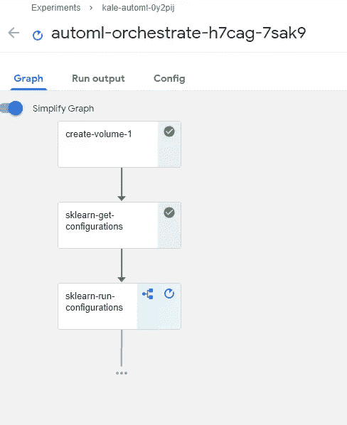
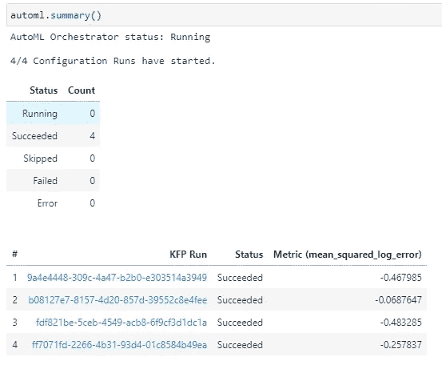

# 使用 Kubeflow 和羽衣甘蓝进行大规模 AutoSklearn

> 原文：<https://towardsdatascience.com/autosklearn-at-scale-with-kubeflow-and-kale-bfd51f57a54f?source=collection_archive---------36----------------------->

## 如何使用 Kale 和 AutoSklearn 在 Kubeflow 上运行 AutoML 实验


照片由 [Goh Rhy Yan](https://unsplash.com/@gohrhyyan?utm_source=unsplash&utm_medium=referral&utm_content=creditCopyText) 在 [Unsplash](https://unsplash.com/s/photos/car-tableau?utm_source=unsplash&utm_medium=referral&utm_content=creditCopyText) 上拍摄

给定一个任务、一个度量、一个训练数据集以及一个资源预算，AutoML 系统可以自动地在一个测试数据集上产生一组预测。预算可能涉及计算资源，例如 CPU 和/或挂钟时间和内存使用。

上一段是对 AutoML 的定义。简单地说，当您启动 AutoML 实验时，您提供了训练数据集和您期望的最终目标。用简单的英语来说，最终目标可能是这样的:给我找一个模型，当你将它用于这个训练数据集时，它可以在那个测试数据集上产生最佳的分类精度性能。此外，在半小时内完成。

你会如何解决这个问题？最简单的方法是获取适用于该任务的每个 Scikit 学习预测器(例如，每个分类器)，对其进行拟合，并在半小时内返回产生最佳结果的预测器。

然而，这种简单的方法是不够的。每个分类器都接受几个超参数，这些超参数可能会使其性能变好或变坏。此外，在拟合可能显著改变预测器性能的模型之前，您可以使用数十个数据处理函数。测试每一种可能的组合是不可能的。

但是有一个更好的方法，包括元学习，我们最喜欢的 Scikit Learn 机器学习(ML)框架和 Kubernetes。让我们把大枪拿出来！

> [Learning Rate](https://www.dimpo.me/newsletter?utm_source=medium&utm_medium=article&utm_campaign=automl) 是一份时事通讯，面向那些对 AI 和 MLOps 世界感到好奇的人。你会在每周五收到我关于最新人工智能新闻和文章的更新和想法。订阅[这里](https://www.dimpo.me/newsletter?utm_source=medium&utm_medium=article&utm_campaign=automl)！

# 元学习

在深入研究代码之前，让我们先停止使用第一个术语。什么是元学习？我可以解释为学会学习，但对我来说听起来更困惑。所以，让我们再试一次:

元学习方法将数据集和任务(例如，分类或回归)作为输入，并返回应用于该数据集的一组算法，其超参数是预先填充的。

现在，我认为这个高层次的解释做得更好。但是元学习是如何做到的呢？第一步，生成输入数据集的描述性模型。我说的模型，不是指 ML 模型。它只是一组数字，以某种方式捕捉数据集的各种核心特征。这也称为元特征向量。

这些元特征可以是数据集代表值，例如维度、基数、维度之间的相关性、熵、互信息和稀疏性相关统计。

这个向量旨在提供足够的信息，以便元学习系统可以计算数据集之间的相似性。这意味着，你可以将两个数据集转换成这些向量，比较这些向量，并找出数据集在某种意义上是否相似。

在第二步中，元学习系统接收生成的数据集模型，并试图发现过去已经处理过的类似数据集。关于过去的数据集、对这些数据集执行的算法以及评估结果的信息存储在存储库中。

最后，通过计算手边的数据集和储存库中的其他数据集之间的相似性，系统可以检索一组算法及其超参数，这些算法在过去表现最好。

# 简单的例子

既然我们已经解决了各种流行词汇，您将从您的 Jupyter 笔记本开始创建一个 AutoML 工作流。此外，您将在 Kubeflow 上这样做，以便可以利用 Kubernetes 集群的强大功能。

## 你需要什么

首先，您需要一个正在运行的 Kubeflow 实例和一个 Jupyter 笔记本服务器。不要担心，我们将使用 MiniKF，我们将立即拥有所有这些。要设置 Kubeflow 并启动笔记本服务器，请遵循以下指南:

</kubeflow-is-more-accessible-than-ever-with-minikf-33484d9cb26b>  

如果您更喜欢使用 AWS，我们将为您提供:

</mini-kubeflow-on-aws-is-your-new-ml-workstation-eb4036339585>  

在文章中，您将看到要创建一个笔记本服务器，您需要选择`jupyter-kale:v0.5.0–47-g2427cc9` Kale 图像(注意图像标签可能不同)。然而，在我们的例子中，让我们选择`gcr.io/arrikto/jupyter-kale-py36:kubecon21eu-automl-nightly`图像，因为这个特性仍然处于早期阶段。

我们准备好了。让我们建立我们的第一个例子！

## 卡格尔推土机比赛

推土机蓝皮书是 8 年前举办的一场 Kaggle 竞赛。在这次比赛中，参与者被要求预测在拍卖会上出售的推土机的销售价格。

我们将使用这个数据集，因为同一个数据集用于测试流行的 ML 框架的性能，例如`fastai`。`fastai`有一个很棒的`tabular`模块，专门解决结构化数据集(如 CSV 文件)的挑战。

他们在课程和书本上都使用推土机数据集来测试这个模块。他们实现了实际拍卖价格和预测拍卖价格之间的 RMSLE(均方根对数误差)为 0.226[。这是使用神经网络实现的。](https://github.com/fastai/fastbook/blob/master/09_tabular.ipynb)

为了将我们的方法与`fastai`的方法进行比较，我们需要使用相同的输入。因此，我们使用预处理管道`fastai`来扩充数据集并转换分类值。

具体来说，我们使用`add_datepart`方法来扩展数据集的`saledate`字段。这意味着我们使用该字段中给出的信息创建新字段(例如，“今天是星期几？”，“是周末吗？”，“放假了吗？”等。).

最后，我们使用`TabularPandas`类将分类值转换成数字。在我们的例子中，我们没有在预处理管道中使用`FillMissing`方法，因为我们期望我们的系统建议一个相关的估算器。

要获得示例，克隆 Kale repo 并检查相关分支:

```
git clone https://github.com/kubeflow-kale/kale -b kubecon21eu
```

克隆的存储库包含一系列带有数据和注释笔记本的精选示例。在侧边栏中，导航到文件夹`kale/examples/bulldozers-kaggle-competition/`并打开笔记本`[blue-book-bulldozers.ipynb](https://github.com/kubeflow-kale/kale/blob/kubecon21eu/examples/bulldozers-kaggle-competition/blue-book-bulldozers.ipynb)`。

## 进行实验

跟着笔记本的单元格跑实验。神奇的事情发生在下面的命令中:

```
automl = kale_ml.run_automl(dataset,
                            kale_ml.Task.REGRESSION,
                            metric=metrics.mean_squared_log_error,
                            number_of_configurations=4,
                            max_parallel_configurations=1,
                            tuner=tuner)
```

您可以看到，我们调用了 Kale 提供的`run_automl`函数，给出了一个数据集、一个任务和一个指标。`number_of_configurations`参数指示系统将尝试多少 ML 管道配置。

让我们在这里暂停一下。我们之前说过，元学习返回一组应用于该数据集的算法，并填充了它们的超参数。然而，在我们的例子中，我们得到的不仅仅是一组算法。Kale 在底层使用了 [AutoSklearn](https://automl.github.io/auto-sklearn/master/) ，所以我们得到了一组完整的 ML 管道配置，数据和特征处理功能以及 ML 模型在顶层。这就更厉害了！

接下来，`max_parallel_configurations`参数定义了并行运行的管道数量。最后但同样重要的是，调优器将在性能最佳的配置上运行超参数调优实验。

您可以通过观察协调一切的管道来监控实验的进度:



AutoML 编排管道—按作者分类的图像

或者，您可以在笔记本上完成:



自动监控—图片由作者提供

仅仅经过四次尝试，并且没有对我们的选项做太多改动，我们得到了大约 0.26 的分数。几乎什么都不做也不错。我们至少可以用这个结果作为我们的基准！

# 结论

在这个故事中，您创建了一个从原始数据开始自动发现和训练完整 ML 管道的机制。

您了解了什么是 AutoML 和元学习，然后，从数据集开始，您使用 Kale API 实例化了一个流程，该流程将为输入数据搜索最合适的模型。然后，您使用最佳配置中的模型自动启动了超参数优化实验。

有关您需要的所有步骤的更详细的指南，请在此处进入代码实验室:

<https://codelabs.arrikto.com/codelabs/minikf-kale-automl/index.html?index=..%2F..index#0>  

# 关于作者

我的名字是[迪米特里斯·波罗普洛斯](https://www.dimpo.me/?utm_source=medium&utm_medium=article&utm_campaign=automl)，我是一名为[阿里克托](https://www.arrikto.com/)工作的机器学习工程师。我曾为欧洲委员会、欧盟统计局、国际货币基金组织、欧洲央行、经合组织和宜家等主要客户设计和实施过人工智能和软件解决方案。

如果你有兴趣阅读更多关于机器学习、深度学习、数据科学和数据操作的帖子，请关注我的 [Medium](https://towardsdatascience.com/medium.com/@dpoulopoulos/follow) 、 [LinkedIn](https://www.linkedin.com/in/dpoulopoulos/) 或 Twitter 上的 [@james2pl](https://twitter.com/james2pl) 。

所表达的观点仅代表我个人，并不代表我的雇主的观点或意见。