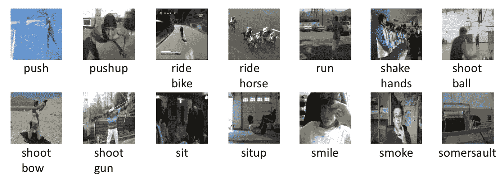
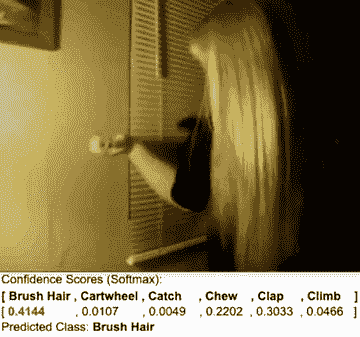
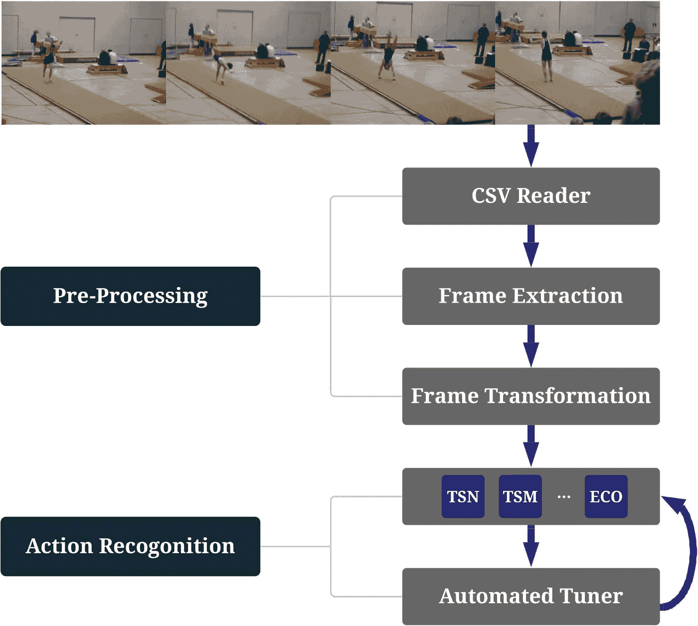
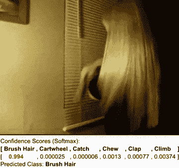

# AutoVideo:一个自动视频动作识别系统

> 原文：<https://towardsdatascience.com/autovideo-an-automated-video-action-recognition-system-43198beff99d?source=collection_archive---------12----------------------->

## 利用神经网络和自动化机器学习识别人类行为，如刷牙、坐着和跑步



视频动作识别管道可以使用 AutoVideo 预测的一些常用动作来源: [HMDB](https://serre-lab.clps.brown.edu/wp-content/uploads/2012/08/HMDB_snapshot2.png) (CC BY 4.0)

在这篇文章中，我将介绍我们如何建立一个神经网络来自动识别人类的行为。虽然这对于人类来说似乎是一项简单而琐碎的任务，但对于人工系统来说却很难做到。基于视频的动作识别旨在通过从视频片段中识别不同的动作来解决这个问题。这是视频理解的一项重要任务，在各个领域都有广泛的应用，如安全[(孟、Pears 和 Bailey 2007)](https://www.researchgate.net/publication/226868093_Motion_History_Histograms_for_Human_Action_Recognition) 、医疗[(高等 2018)](https://arxiv.org/pdf/1909.06423.pdf) 、行为分析 [(Poppe 2010)。](https://www.researchgate.net/publication/220611909_Poppe_R_A_Survey_on_Vision-based_Human_Action_Recognition_Image_and_Vision_Computing_286_976-990)视频动作识别的实际应用包括老年人行为监控以增强辅助生活、自动视频监控系统等等。


[https://github.com/datamllab/autovideo](https://github.com/datamllab/autovideo)。图片作者。

本文的目的是为我们的开源项目 AutoVideo ( [GitHub](https://github.com/datamllab/autovideo) )提供一个教程，这是一个全面且易于使用的视频动作识别工具包。在本教程中，您将学习:

> *(1)如何训练一个可以预测人类动作的神经网络；*
> 
> *(2)如何使用自动调优工具节省你调优超参数的努力；*
> 
> *(3)如何在你定制的数据集上训练模型。*

你将能够使用你训练过的模型来识别任何新的视频剪辑，就像下面检测刷毛的演示一样。



预测演示视频上的动作(刷牙)。图片作者。

# 概观

AutoVideo 是一个高度模块化和可扩展的系统，它用标准管道语言包装了数据加载、数据处理和最先进的动作识别模型。因此，从业者可以很容易地添加新的动作识别模块或其他模块，如其他视频理解任务。AutoVideo 还引入了数据驱动的搜索器来自动调整不同的模型和超参数，以减少人工工作量。



图一。系统概述。AutoVideo 中的每个模块都被包装成一个带有一些超参数的原语。流水线由从预处理到动作识别的一系列原语组成。AutoVideo 配备了调谐器来搜索模型和超参数。图片作者。

# 入门指南

让我们从教程开始吧，它将帮助您熟悉这个包，并在自定义/基准数据集上执行动作识别。

# 安装:

要安装该软件包，请确保您的 Linux/MacOS 系统上安装了 Python 3.6 和 pip。首先安装以下软件包:

```
pip3 install torch
pip3 install torchvision
```

然后，只需使用以下命令即可安装 AutoVideo 软件包:

```
pip3 install autovideo
```

# 准备数据集:

数据集必须遵循 D3M 格式，由一个 csv 文件和一个媒体文件夹组成。csv 文件应包含三列，用于指定实例索引、视频文件名和标签。下面是一个示例 csv 文件:

```
**d3mIndex,video,label**
0,Brushing_my_waist_lenth_hair_brush_hair_u_nm_np1_ba_goo_0.avi,0
1,brushing_raychel_s_hair_brush_hair_u_cm_np2_ri_goo_2.avi,0
2,Haarek_mmen_brush_hair_h_cm_np1_fr_goo_0.avi,0
3,Haarek_mmen_brush_hair_h_cm_np1_fr_goo_1.avi,0
4,Prelinger_HabitPat1954_brush_hair_h_nm_np1_fr_med_26.avi,0
5,brushing_hair_2_brush_hair_h_nm_np1_ba_med_2.avi,0
```

媒体文件夹应该包含视频文件。你可以参考我们在 [Google Drive](https://drive.google.com/drive/folders/13oVPMyoBgNwEAsE_Ad3XVI1W5cNqfvrq) 中的例子 hmdb6 数据集。我们还在 Google Drive 中准备了 hmdb51 和 ucf101 进行基准测试。要试用这个教程，你可以从[这里](https://drive.google.com/drive/folders/13oVPMyoBgNwEAsE_Ad3XVI1W5cNqfvrq)下载 hmdb6 数据集。然后，您可以解压缩一个数据集，并将其放入[数据集](https://github.com/datamllab/autovideo/blob/main/datasets)。

# 进行实验:

这个界面基于 Axolotl，我们对 D3M 的高级抽象。下面给出了使用预训练权重(在子采样 hmdb6 数据集上训练)在样本视频上运行动作识别任务的最小示例。我们开始吧！

## 加载数据集:

如上所述，以 D3M 格式准备数据集，并将其放在数据集文件夹中。在这个例子中，我们使用了 hmdb-6 ( [Google-Drive](https://drive.google.com/drive/folders/13oVPMyoBgNwEAsE_Ad3XVI1W5cNqfvrq?usp=sharing) )(来自 HMDB-51 的子样本，仅包含 6 个类)。我们使用实用函数 ***set_log_path()*** 为实验设置日志记录系统。***train _ table _ path***是带有视频文件名和标签信息的训练 csv 文件的路径。***train _ media _ dir***表示包含视频文件的媒体文件夹，而 ***target_index*** 指定包含输出标签信息的列的索引

## 预处理:

在读取火车 csv 文件后，接下来我们通过从 ***火车 _ 媒体 _ 目录*** 中的视频中提取帧并将它们存储在文件夹目录 ***帧中来预处理数据集。*** 为了实现这一点，我们从 **autovideo** 包中使用***extract _ frames***实用函数如下:

## 构建模型:

我们的软件包支持 7 种动作识别模式。在这个例子中，我们使用 TSN 作为视频识别模型。***build _ pipeline()***函数返回由端到端可训练模型组成的 ***管道*** 。下面是一个构建管道的示例。

## 调整超参数:

在上面的函数中，用户可以在***build _ pipeline()***函数中自定义配置字典 ***(config)*** ，用不同的超参数训练不同的算法。我们已经指定了一些超参数值(如学习率、时期数。等等)来演示用法。支持的超参数的完整列表可在[这里](https://gist.github.com/zaidbhat1234/b0519ed39aaa3ee8ac0045634ce9ac06)找到。AutoVideo 中的每个模型都被包装成一个图元，其中包含一些超参数。TSN 的一个例子是这里的。所有的超参数都可以在构建管道时指定，方法是在上面的`config`字典中传递它们。

## 火车:

可以使用上面指定的配置对模型进行端到端训练。这里我们使用 ***拟合*** 函数，该函数将训练模型并返回拟合的管道/模型。这可以保存下来供将来使用。下面是一个适合管道的示例:

上述函数在训练集上进行训练，并在验证集上进行验证，以将最佳执行模型保存在验证集上用于推理阶段。fit 函数的输出如下所示:

```
**Confidence Scores:** 
[[0.0692555  0.06158188 0.02618745 0.05211503 0.10426781 0.68659234]...[0.00917702 0.01555088 0.00744944 0.00688883 0.02226333 0.9386706 ]]
```

上面的输出是在上面已经在训练集上训练之后的验证集中的视频的置信度分数。

最后，你可以在 [examples/fit.py](https://github.com/datamllab/autovideo/blob/dd10cd61e2271455d335e3ac79cfebc82a8ac338/examples/fit.py#L1) 找到上述代码片段的完整示例代码。要使用 fit()函数训练模型，只需运行:

```
python3 examples/fit.py
```

## 推论:

我们可以加载使用 ***fit()*** 函数获得的训练模型权重，以检测样本视频上的动作或计算测试集上的准确度。可点击[此处](https://drive.google.com/drive/folders/1j4iGUQG3m_TXbQ8mQnaR_teg1w0I2x60?usp=sharing)下载一段演示视频和预训练的重量。在演示视频中检测动作的示例如下:

下面是演示视频输出的 GIF 图:



图片作者。

或者，我们可以使用经过训练的模型来计算测试集的准确性。这里我们使用 autovideo 的 ***produce()*** 函数从测试集中获得 ***预测*** ，然后使用***compute _ accuracy _ with _ preds()***实用函数计算准确度。

这里***test _ table _ path***表示包含视频文件路径及其标签信息的测试 csv 文件，而***test _ media _ dir***表示包含视频文件的媒体目录。

在测试集上计算精确度的完整代码可以在 [examples/produce.py](https://github.com/datamllab/autovideo/blob/dd10cd61e2271455d335e3ac79cfebc82a8ac338/examples/produce.py#L1) 中找到。您可以使用以下命令运行此示例:

```
python3 examples/produce.py
```

# 搜索器模块:

除了用指定的配置拟合模型之外，用户还可以使用调谐器以数据驱动的方式自动搜索管道(即，模型和超参数)。我们当前的系统支持两种类型的调谐器，包括随机搜索和 Hyperopt。要使用自动搜索，您需要安装 ray-tune 和 hyperopt 以及:

```
pip3 install 'ray[tune]' hyperopt
```

运行搜索器模块的示例界面如下。

## 加载数据:

让我们通过在 ***train_table_path*** 和 ***valid_table_path 中指定 csv 文件路径来加载训练和验证数据集。*** 搜索器使用 ***train_dataset*** 使用搜索器在每个样本中绘制的一组超参数来训练模型。搜索结束时超参数的最佳配置是在***valid _ dataset***上具有最佳准确度的那些。

## 初始化搜索器模块:

在这里，用户可以使用 **RaySearcher** 为上面指定的数据集初始化搜索器模块。除了指定搜索算法(随机 v/s 超点)之外，用户还可以定义搜索空间(支持连续和离散空间)。在下面的例子中，我们使用了远视搜索。

## 搜索:

然后，调谐器将在搜索空间中搜索最佳超参数组合，以提高性能。下面是一个使用指定配置进行搜索并返回最佳超参数集的示例:

搜索器的完整代码可以在 [examples/search.py](https://github.com/datamllab/autovideo/blob/dd10cd61e2271455d335e3ac79cfebc82a8ac338/examples/search.py#L1) 中找到，可以使用以下命令运行:

```
python3 examples/search.py
```

# 总结:

要了解这个项目的更多信息，请点击查看。该团队正在积极开发项目的更多功能，包括带有可视化工具的图形用户界面，并添加更多的视频理解任务。我们的目标是让视频识别对每个人来说都更容易使用。我希望你喜欢阅读这篇文章。