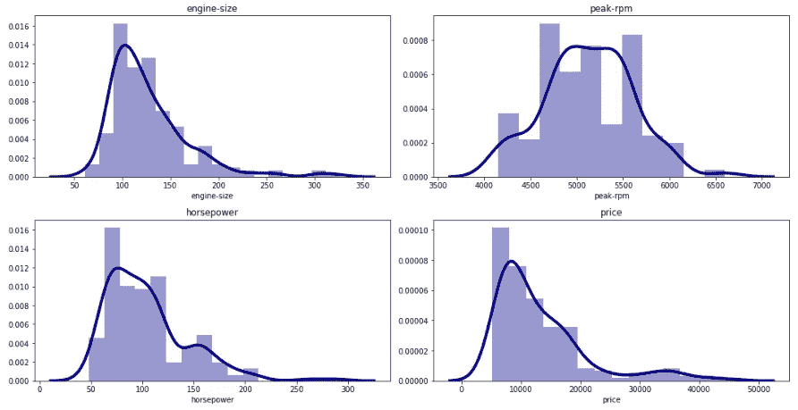
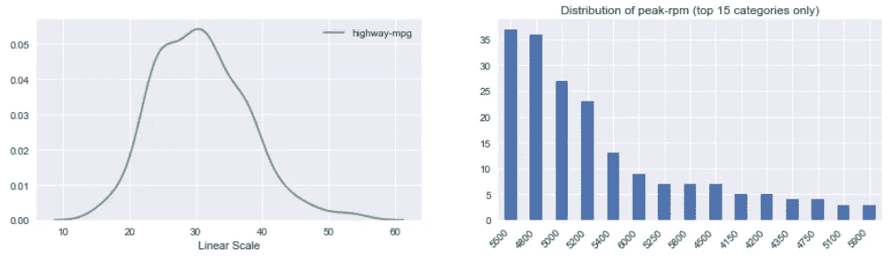
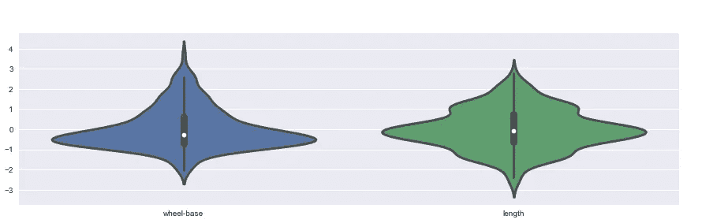
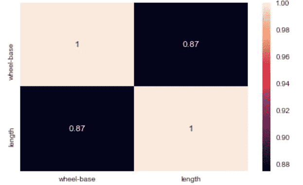
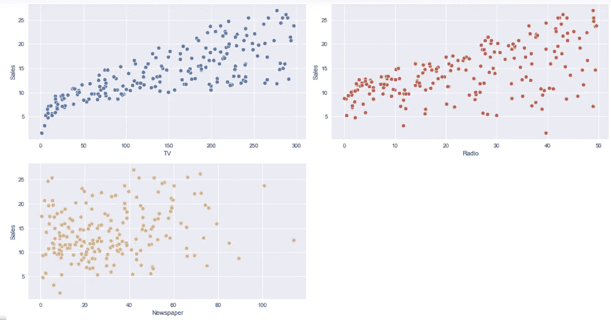

# Autoviz:自动可视化任何数据集

> 原文：<https://towardsdatascience.com/autoviz-automatically-visualize-any-dataset-75876a4eede4?source=collection_archive---------8----------------------->

## 只需一行代码即可可视化任意大小的数据集



来源:作者

可视化是一种使用不同的图形和绘图来可视化数据的技术。在数据科学中，我们通常使用数据可视化技术来理解数据集和发现数据之间的关系。可视化还有助于发现数据集中的模式，用于进一步分析。

python 中有不同的技术/库用于数据可视化，如 Matplotlib、Seaborn、Plotly 等。但是在使用所有这些库的时候，我们需要定义我们想要可视化的图形类型和我们需要可视化的参数。

在本文中，我们将了解一个 python 库 **AutoViz** ，它可以在一行代码中自动化整个数据可视化过程。

AutoViz 只需一行代码就可以对任何数据集进行自动可视化。AutoViz 可以找到最重要的功能，并只使用那些自动选择的功能来绘制有影响力的可视化效果。此外，AutoViz 非常快，可以在几秒钟内创建可视化效果。

让我们借助一些数据集开始探索 AutoViz。在使用 AutoViz 之前，我们需要安装它。

此外，请查看我的 Youtube 频道，了解更多关于数据科学的有趣内容。

# 安装 AutoViz

像任何其他 python 库一样，我们可以使用下面给出的 pip install 命令来安装 AutoViz。

```
pip install autoviz
```

# 加载数据集并进行分析

在这里，我将使用不同的数据集来可视化/探索 AutoViz 可以生成的不同类型的图表/绘图。你可以从 [Github 库查看并下载所有的数据集。](https://github.com/hmix13/AutoViz)

1.  **汽车设计数据集**

这个数据集包含不同汽车制造商的不同属性。让我们用 AutoViz 可视化这个数据集。

AutoViz 可以通过下面给出的 3 个简单步骤来实现。

```
#importing Autoviz class
from autoviz.AutoViz_Class import AutoViz_Class#Instantiate the AutoViz class
AV = AutoViz_Class()
```

这些步骤将导入 AutoViz 类并实例化它。最后一步是创建可视化。仅仅这一行代码就将创建所有的可视化效果，包括计数中的所有属性。

```
df = AV.AutoViz('car_design.csv')
```

a.所有连续变量的直方图(KDE 图)



来源:作者

b.连续变量的小提琴图



来源:作者

c.连续变量的热图



来源:作者

正如您在上面看到的，这些是使用 AutoViz 在一行代码中生成的不同图表。

让我们再分析一个数据集，在这个数据中，有 4 个属性描述了公司的广告支出和销售额。我们将通过创建上面使用的步骤来分析这一点，只是改变数据集。

**2。广告数据集**

在这里，我们将传递另一个参数 depVar，它是因变量，以便 AutoViz 相应地创建可视化。在这个数据集中，我们知道“销售额”是因变量。

```
df = AV.AutoViz('Advrtising.csv', depVar='Sales')
```

a.变量与销售额的散点图



来源:作者

来源:作者

“销售”取决于

同样，您将看到它将创建直方图、violin 图、热图等。将“销售额”作为因变量。

在调用 AutoViz 时，我们可以传递的其他一些参数有:

1.  sep，是分隔数据的分隔符，默认为'，'。
2.  target，它是数据集中的目标变量。
3.  chart_format 是显示的图表的格式。
4.  max_row_analyzed 用于定义要分析的行数
5.  max_cols_analyzed 用于定义要分析的列数。

在本文中，我们看到我们可以用一行代码可视化数据集，并且我们可以相应地找到数据集中的模式。

AutoViz 能够适应任何数量的不同数据环境，例如回归、分类甚至时间序列数据。继续使用不同的数据集探索这个库，并在回复部分分享您的经验。

# 在你走之前

***感谢*** *的阅读！如果你想与我取得联系，请随时通过 hmix13@gmail.com 联系我或我的* [***LinkedIn 个人资料*** *。*](https://www.linkedin.com/in/himanshusharmads/) *您也可以在我的**[***Github 中查看我在这里使用的代码和数据。***](https://github.com/hmix13/AutoViz)*