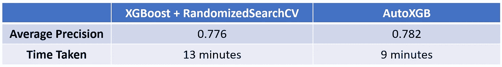

# 利用 AutoXGB 进行金融欺诈检测

> 原文：<https://towardsdatascience.com/autoxgb-for-financial-fraud-detection-f88f30d4734a?source=collection_archive---------8----------------------->

## AutoXGB 与标准 XGBoost 在检测欺诈性信用卡交易方面的对比


由 [CardMapr](https://unsplash.com/@cardmapr?utm_source=medium&utm_medium=referral) 在 [Unsplash](https://unsplash.com?utm_source=medium&utm_medium=referral) 上拍摄的照片

[XGBoost](https://xgboost.readthedocs.io/en/latest/tutorials/model.html) 由于其通用性和令人印象深刻的性能，已经成为最重要的机器学习算法之一。

在以前的项目中使用过 XGBoost 之后，我一直乐于让它的**实现更快、更好、更便宜。**当我遇到 **AutoXGB** 时，我的好奇心被激起了，它声称是一个自动化工具，用于简化 XGBoost 模型的训练和部署。

鉴于我在金融服务行业的工作，欺诈是一个很大的问题，这将是一个利用信用卡欺诈数据来评估 AutoXGB 相对于通常使用的标准 XGBoost 设置的表现的绝佳机会。

# 内容

> ***【1】****[*数据采集与理解*](#67fd)***【2】****[*处理类不平衡*](#5bd5)***【3】****[*选择性能指标*](#4c26) [*让 AutoXGB 经受考验*](#47a3)***【6】***[*最终裁决*](#133e)***

**点击 [**此处**](https://github.com/kennethleungty/Credit-Card-Fraud-Detection-AutoXGB) 查看该项目的 GitHub 回购**

# **(1)数据获取和理解**

## **概观**

**这个项目使用了来自 Worldline 和[机器学习小组](http://mlg.ulb.ac.be)(布鲁塞尔大学)在欺诈检测方面的研究合作的[信用卡交易数据](https://github.com/Fraud-Detection-Handbook)(在 [*GNU 公共许可证*](https://github.com/Fraud-Detection-Handbook/fraud-detection-handbook/blob/main/LICENSE) 下使用的*)。***

**该数据集是真实世界信用卡交易的现实模拟**并且被设计为包括复杂的欺诈检测问题。****

**这些问题包括**类别不平衡**(只有< 1%的交易是欺诈性的)、数字和(高基数)分类变量的**混合**，以及**与时间相关的**欺诈事件。**

## **数据转换**

**我们将使用 [**转换后的**数据集](https://github.com/Fraud-Detection-Handbook/simulated-data-transformed)，而不是原始数据集，以符合项目目标。基线特征工程的细节不在讨论范围之内，因此这里有一个简短的总结:**

*   **注明交易是发生在**日还是**夜*(I)*；在工作日或周末。 *这样做是因为欺诈模式根据一天中的时间和一周中的日期而不同***
*   **使用 **RFM** (近期、频率、货币价值)指标描述客户**的消费行为**(例如，平均消费、交易数量)**
*   **通过计算一个时间窗口内欺诈案件的平均数量，对与每笔支付**终端**相关的**风险**进行分类**

****

**[拍摄于](https://unsplash.com/@claybanks?utm_source=medium&utm_medium=referral) [Unsplash](https://unsplash.com?utm_source=medium&utm_medium=referral) 上的粘土堤**

## **预测器和目标特征**

**在完成特征工程后，我们有一个具有以下特征的数据集:**

*   ****TX_AMOUNT** :美元交易金额 *float***
*   ****TX_DURING_WEEKEND** :交易是否发生在周末 *boolean***
*   ****TX_DURING_NIGHT** :交易是否发生在夜间 *boolean***
*   ****CUSTOMER _ ID _ NB _ TX _***DAY _ WINDOW**:每个客户最近 1 天、7 天、30 天的交易笔数[ *整数***
*   ****CUSTOMER _ ID _ AVG _ AMOUNT _***DAY _ WINDOW**:每位客户在过去 1 天、7 天、30 天的平均消费金额(美元) *float***
*   ****TERMINAL _ ID _ NB _ TX _ * DAY _ WINDOW**:终端最近 1、7、30 天的交易笔数*整数***
*   ****TERMINAL _ ID _ RISK _ * DAY _ WINDOW**:过去 1 天、7 天、30 天终端上欺诈交易的平均数量[ *整数***
*   ****TX_FRAUD:** 指示交易是合法( **0** )还是欺诈(**1**)【*布尔*】**

**转换后的信用卡欺诈数据集示例**

**从目标变量 **TX_FRAUD** ，**，**我们可以看出，我们正在处理一个**二元分类任务**。**

## **具有延迟期的列车测试分离**

**欺诈检测中要考虑的一个重要方面是**延迟期**(又名**反馈延迟**)。在现实世界中，欺诈交易只有在投诉或调查发生后一段时间**才会为人所知。****

**因此，我们需要引入一个连续的**延迟期**(例如，一周)来分离训练集和测试集，其中测试集应该在训练集的最后一个事务之后至少一周**发生。****

**列车测试划分如下:**

*   ****车组** : 8 周(2018 年 7 月 1 日至 2018 年 8 月 27 日)**
*   ****延迟期** : 1 周(2018 年 8 月 28 日**至 2018 年 9 月 3 日**)**
*   ****测试集** : 1 周(2018 年 9 月 4 日至 2018 年 9 月 10 日)**

****

**列车和测试设备之间的延迟时间图|图片由作者提供**

# **(2)处理阶层失衡**

**欺诈交易不会经常发生，所以我们手上有一个严重不平衡的数据集也就不足为奇了。**

**从目标变量的值计数来看，在 550，000+交易中，只有 4，935 个欺诈案例 **(0.9%)** 。**

****

**原始类的值计数:1 =欺诈；0 =合法|作者提供的图片**

**我们可以使用**合成少数过采样技术(SMOTE)** 来处理这种类别不平衡。[原始 SMOTE 论文](https://arxiv.org/pdf/1106.1813.pdf)的作者在他们的实现中结合了 SMOTE **和**随机欠采样，所以我在这个项目中使用了这种组合。**

**具体采样策略如下:**

1.  ****进行过采样**以将少数类增加到总数据集的 5%(从最初的 0.9%增加 500%)，**然后****
2.  ****随机欠采样**使多数类**的规模为少数类**的两倍(即少数类为多数类规模的 50%)**

***尽管*[*SMOTE*](https://arxiv.org/pdf/1106.1813.pdf)*作者表明不同的组合给出了可比较的结果，但我选择了 500%/50%组合，因为该论文表明它在石油数据集中的少数样本上给出了最高的准确性。***

**经过这次采样后，数据集更加均衡，占整个数据集的**少数类从 0.9%增加到** **33.3%。****

****

**样本类的值计数:1 =欺诈；0 =合法|作者提供的图片**

# **(3)性能指标的选择**

**在我们开始建模之前，我们必须决定评估模型性能的理想指标是什么。**

**典型的是基于**阈值的**指标，如准确性和 F1 分数。虽然他们可以评估错误分类的程度，但他们依赖于**特定决策阈值的定义，**例如，概率**>**0.5 =欺诈。**

**这些指标对决策阈值的依赖使得**对**比较不同的模型提出了挑战。因此，更好的选择是**无阈值指标**，如 **AUC ROC** 和**平均精度**。**

****平均精度**将[精度-召回曲线](https://scikit-learn.org/stable/auto_examples/model_selection/plot_precision_recall.html)总结为每个阈值达到的精度的加权平均值，权重为召回从前一阈值的增加。**

**虽然 AUC-ROC 更常见，但平均精确度被选为该项目的主要报告指标，原因如下:**

*   **对于**不平衡**数据集，平均精度为 [**比**](https://journals.plos.org/plosone/article?id=10.1371/journal.pone.0118432) 更具信息量。虽然我们已经应用了抽样来平衡我们的数据，但我觉得仍然存在一定程度的剩余不平衡(67:33 而不是 50:50)**
*   **过多的**假阳性**会使欺诈调查团队不堪重负，因此我们希望在低 **假阳性率(FPR)值**时评估**召回(又名敏感度)。使用 PR 曲线(和 AP)相对于 ROC 的[优势在于 PR 曲线可以有效地突出**低** FPR 值的模型性能。](https://fraud-detection-handbook.github.io/fraud-detection-handbook/Chapter_4_PerformanceMetrics/ThresholdFree.html)****

****

**照片由 [Christiann Koepke](https://unsplash.com/@christiannkoepke?utm_source=medium&utm_medium=referral) 在 [Unsplash](https://unsplash.com?utm_source=medium&utm_medium=referral) 上拍摄**

# **(4)基线— XGBoost 和随机搜索 CV**

**基线模型的设置(XGBoost with[RandomizedSearchCV](https://scikit-learn.org/stable/modules/generated/sklearn.model_selection.RandomizedSearchCV.html))是我倾向于使用的分类任务的第一线方法。**

**以下是基线模型的测试集预测结果，其中**平均精度**的关键度量是 **0.776** 。训练所用的时间是 **13 分钟**。**

****

**测试集基线 XGBoost 模型的性能指标|作者图片**

# **(5)测试 AutoXGB**

**与最近兴起的 AutoML 解决方案一致，AutoXGB 是一个库，它从 CSV 格式的表格数据中自动训练、评估和部署 XGBoost 模型。**

**使用 [Optuna](https://github.com/optuna/optuna) 自动完成超参数调整，使用 [FastAPI](https://github.com/tiangolo/fastapi) 进行部署。**

**AutoXGB 由拥有世界首位 4x Kaggle 特级大师头衔的 HuggingFace 研究员 Abhishek Thakur 开发。用他自己的话说，AutoXGB 是一个建立 XGBoost 模型的简单工具。**

**因此，我热衷于利用他的专业知识来探索和改进我的 XGBoost 模型通常的实现方式。**

**要安装 AutoXGB，请运行以下命令:**

```
**pip install autoxgb**
```

**AutoXGB 框架大大简化了设置 XGBoost 训练和预测所需的步骤。下面是用于为二进制分类任务设置 AutoXGB 的代码:**

**下面是 AutoXGB 的测试集结果，其中**平均精度**的关键指标是 **0.782** 。训练时间为 **9 分钟**。**

****

**测试集 AutoXGB | Image 按作者的性能指标**

# **(6)最终裁决**

## **结果比较**

****

**性能和速度比较|图片由作者提供**

**与基准分数 0.776 相比，AutoXGB 的平均精度分数**略高，为 0.782** 。**

**AutoXGB **培训**所花费的时间比基准的 13 分钟大约缩短了**30%**9 分钟**。****

**AutoXGB 的另一个关键优势是，我们距离将模型作为 FastAPI 端点只差**一个命令行**。这种设置减少了建模部署的时间，这是培训时间之外的一个关键因素。**

**以下因素可能是推动 AutoXGB 获得更好性能的原因:**

*   **使用**贝叶斯优化**和 **Optuna** 进行超参数调整，这比随机搜索更快，因为它使用来自先前迭代的信息，在更少的迭代中找到最佳超参数**
*   **根据作者丰富的数据科学经验，仔细选择 XGBoost **超参数**(类型和范围)的**进行调优****
*   ****优化内存使用**，通过特定的[类型转换](https://github.com/abhishekkrthakur/autoxgb/blob/main/src/autoxgb/utils.py)减少内存使用，例如，将数据类型为`int64`的值转换为`int8`(消耗的内存减少了 8 倍)**

## **重要警告**

**虽然性能指标给了 AutoXGB 一个优势，但它最重要的问题之一是参数设置中**粒度控制**的损失。**

**如果您一直密切关注，您可能会意识到，我们没有引入我们为交叉验证申请的训练/测试分割**的顺序延迟期(我们[应该已经完成](https://fraud-detection-handbook.github.io/fraud-detection-handbook/Chapter_5_ModelValidationAndSelection/ValidationStrategies.html#prequential-validation))。****

**在这种情况下，AutoXGB 不允许我们**指定我们想要用作交叉验证(CV)一部分的验证折叠**，因为唯一与 CV 相关的参数是`n_folds`(CV 折叠数)。**

**这种缺乏控制的另一个问题是，我们不能为 XGBoost 分类器指定**评估度量**。**

**在基线模型中，我能够将`eval_metric`设置为`aucpr`(PR 曲线下的 AUC)，这与我们的平均精度的主要指标一致。但是，对于二进制分类，AutoXGB 的 XGBoost 分类器中的硬编码评估度量是`logloss`。**

**归根结底，虽然 AutoXGB 等解决方案在简化(并可能改进)XGBoost 实现方面做得很好，但数据科学家需要通过了解幕后发生的事情来了解其局限性。**

**随意查看 GitHub repo [**中的代码，点击**](https://github.com/kennethleungty/Credit-Card-Fraud-Detection-AutoXGB) 。**

# **在你走之前**

**欢迎您**加入我的数据科学学习之旅！**关注我的 [Medium](https://kennethleungty.medium.com/) 页面和 [GitHub](https://github.com/kennethleungty) ，了解更多精彩的数据科学内容。同时，享受在你的 ML 任务中使用 AutoXGB 的乐趣！**

**[](https://medium.com/geekculture/using-ensemble-regressors-to-predict-condo-rental-prices-47eb7c3d5cd9) [## 用集合回归预测公寓租金

### Python 中集成学习和多元线性回归在公寓租金预测中的应用

medium.com](https://medium.com/geekculture/using-ensemble-regressors-to-predict-condo-rental-prices-47eb7c3d5cd9) [](/automatically-generate-machine-learning-code-with-just-a-few-clicks-7901b2334f97) [## 只需点击几下鼠标，即可自动生成机器学习代码

### 使用 Traingenerator 轻松创建 PyTorch 和 scikit-learn 模板代码，用于机器学习模型培训

towardsdatascience.com](/automatically-generate-machine-learning-code-with-just-a-few-clicks-7901b2334f97) [](/key-learning-points-from-mlops-specialization-course-deeplearning-ai-andrew-ng-5d0746605752) [## MLOps 专业化认证的关键学习点—课程 1

### 面向生产的机器学习工程课程 1 的主要课程(包括课堂讲稿)

towardsdatascience.com](/key-learning-points-from-mlops-specialization-course-deeplearning-ai-andrew-ng-5d0746605752) 

## 资源

*   [用于信用卡欺诈检测的机器学习—实用手册](https://fraud-detection-handbook.github.io/fraud-detection-handbook/Foreword.html)
*   [AutoXGB — GitHub](https://github.com/abhishekkrthakur/autoxgb)
*   [sci kit-Learn:Precision-Recall](https://scikit-learn.org/stable/auto_examples/model_selection/plot_precision_recall.html)**