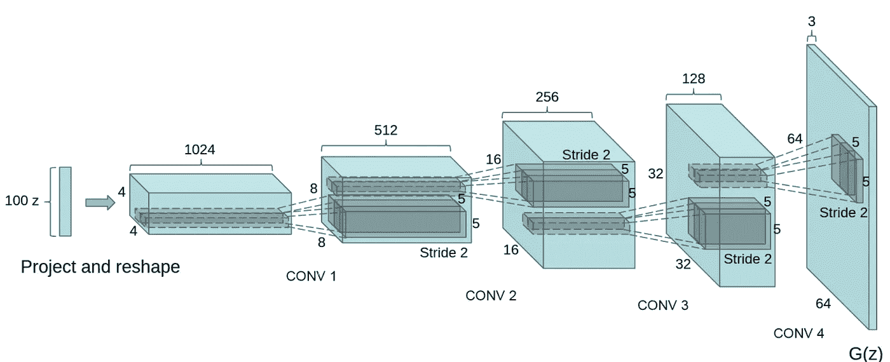

# AvatarGAN —使用 GAN 生成卡通图像

> 原文：<https://towardsdatascience.com/avatargan-generate-cartoon-images-using-gan-1ffe7d33cfbb?source=collection_archive---------5----------------------->

## 有没有想过如何生成不属于任何人脸的 bitmoji？看看 GAN 是如何创建这些图像的。

我们大多数人都创建了自己定制的 bitmoji，并在不同的社交媒体应用中使用。这些 bitmoji 是为特定用户定制的。但你有没有想过如何生成不属于任何人脸的 bitmoji？好吧，让我们探索一下甘斯是如何为我们完成这项工作的。


作者对 AvatarGAN 图像的预测

生成对抗网络是当今计算机科学中最有趣的想法之一。GANs 可以从垃圾数据集生成图像。甘是由[伊恩·j·古德菲勒](https://arxiv.org/abs/1406.2661)于 2014 年开发的。它由两个神经网络组成，这两个网络相互竞争，以使预测更加准确。

生成模型找出输入数据中的特征，能够分析、捕获和复制数据集中的变化，并以无监督的方式生成看起来与输入集相似的新图像。例如，GANs 可以创建类似人脸照片的图像。


来源:https://www.thispersondoesnotexist.com/

所有这些由甘生成的图像都有一个共同的模式。每张脸的眼睛都在同一个坐标上。背景只是一个模糊的随机纹理。如果有多个面，第二个面的形状会非常扭曲。

在我们开始训练之前，让我们先了解一下 GANs 是如何工作的。

**生成**顾名思义就是试图生成看起来像真图像的假图像。它学习特征的概率 *X* 。发生器将噪声(随机特征)作为输入噪声。

**鉴别器**是一个二元分类器，试图区分真实图像和生成器生成的图像。它学习类 *Y* (真或假)给定特征 *X* 的概率。概率是生成器的反馈。

> 发电机学会制造看起来像真的假货。鉴别者学会辨别真假。

训练 GANs 的步骤:

1.  定义发生器和鉴别器网络架构
2.  训练生成器模型以生成可以欺骗鉴别器的假数据
3.  训练鉴别器模型以区分真实数据和虚假数据
4.  继续训练几个时期，并保存发电机模型

本质上，我们把随机噪声通过发生器。生成器生成假图像。该输出图像连同来自真实图像数据集的图像流一起被传递到鉴别器。真实和伪造的图像都被提供给鉴别器，鉴别器返回图像真实性的概率。然后，我们从鉴别器输出计算成本函数，并更新两个模型的权重。

> 噪声→发生器→特性→鉴别器→输出→成本(输出)


甘建筑—作者图片

# 甘的训练

现在，我们已经完成了 GAN 的基础知识，是时候进行繁重的工作并训练模型了。


GIF via [Giphy](https://giphy.com/gifs/olympics-shaun-the-sheep-aardman-xT8qBmSnYDXS21ZvHO)

## 1.资料组

我们将在[卡通场景](https://google.github.io/cartoonset/)上训练我们的甘，这是一组随机的二维卡通化身图像。这些漫画有 10 个艺术类别、4 个颜色类别和 4 个比例类别，所以我们有很多可能的组合。我们将使用包含 100，000 个随机选择的卡通图像的数据集。

下一步是读取所有图像。由于我们有许多图像要读取和处理，这项任务可能需要一段时间。因此，我们将读取所有的图像，将其转换为 JPG 格式，调整其大小，将其规范化，并将预处理后的图像存储为二进制文件。只执行一次这一系列步骤会更有效。这样我们可以简单地读取处理过的图像数据并快速使用它。我们将为所有图像创建一个 Numpy 数组，并将其保存为一个. npy 文件。我们使用 Numpy 二进制而不是 Pickle，因为该文件非常大，可能会导致某些版本的 Pickle 出现问题。

现在，为了在内存中保存图像，我们将使用 tensor flow[TF . data . dataset](https://www.tensorflow.org/api_docs/python/tf/data/Dataset)。Dataset 对象用于编写描述性的高效输入管道。迭代以流的方式发生，因此完整的数据集不需要适合内存。

## 2.建立模型

这两个模型都使用 Keras 顺序类。

**发电机**

生成器需要上采样层来从噪声(即种子)生成图像。我们可以使用 *UpSampling2D()* 和 *Conv2DTranspose()* 进行上采样。

***UpSampling2D*** 只是利用一些上采样技术对图像矩阵进行简单的放大。我们通常使用最近邻法或双线性上采样法。所以没有机器在这里学习。向上采样 2D 的好处是它很便宜。而 ***Conv2DTranspose*** 层是一个卷积运算，学习几个类似于常规 Conv2D 层的滤波器。转置层简单地交换向后和向前传递，保持其余的操作相同。Conv2DTranspose 也将对其输入进行上采样，但关键的区别在于，该模型应该了解什么是该作业的最佳上采样功能。

第一层是密集层，其输入是种子噪声。然后我们对其进行多次上采样，直到尺寸为*28*x*28*x*1*。对于生成器，我们将使用 LeakyReLU 激活函数，对于最后一层，我们将使用 tanh。



来源: [DCGAN](https://arxiv.org/pdf/1511.06434.pdf)

让我们尝试绘制生成器神经网络生成的图像。


训练前由生成器根据随机噪声生成的图像—作者提供的图像

**鉴别器**

鉴别器网络是一种简单的卷积神经网络图像分类器。

让我们检查一下我们的鉴别器模型的输出。

输出: *tf。张量([0.50059265]]，shape=(1，1)，dtype=float32)*

它返回概率得分。

## 3.损失函数

我们将使用二元交叉熵损失函数。BCE 成本函数有两个部分，一个与每个类相关。当标签和预测相似时，该值接近零，但当标签和预测不同时，该值接近无穷大。


二元交叉熵损失函数—作者图片

让我们分解方程，分析每一部分。


作者图片


作者图片

鉴别器损失量化了鉴别器模型能够区分真实和伪造图像的程度。它将鉴别器对真实图像的预测与 1 的数组进行比较，并将鉴别器对虚假图像的预测与 0 的数组进行比较。

发电机损耗量化了它欺骗鉴别器的能力。直观地说，如果生成器运行良好，鉴别器会将假图像分类为真实图像(或 1)。这里，我们将把鉴别器对生成图像的判定与 1 的数组进行比较。

生成器和鉴别器模型都使用 Adam 优化器和相同的学习速率和动量。它们的优化器是不同的，因为我们分别训练两个不同的网络。

## 4.培训渠道

现在，我们已经定义了培训渠道的主要组成部分，让我们转到培训部分。下面的函数就是神奇之处。

注意 *tf.function* 注释的使用。这可以完善功能并提高性能。

这两个神经网络必须在两个单独的过程中独立训练。因此我们为梯度定义了两个独立的损失函数和独立的更新。在鉴别器模型的反向传播期间，有必要仅应用鉴别器的梯度来减少鉴别器的损耗，并且仅更新该模型的权重。如果创成式模型的权重也同时更新，模型将不会学习。

## **5。训练模型**

训练数据集应该被规范化。两个类别的样本数量必须相等。对于鉴别器训练集，输入图像将是 x 和 y，对于真实图像包含值 1，对于生成的图像包含值 0。而对于生成器训练集，x 包含随机噪声(种子), y 总是 1。这里，生成器的目的是生成如此好的图像，以至于鉴别器被愚弄，并给它们分配一个接近 1 的概率。

既然一切都准备好了，我们开始训练吧。


GIF via [Giphy](https://giphy.com/gifs/season-15-the-simpsons-15x9-l0G18BkChcRRctMZ2)

```
train(train_dataset, EPOCHS)
```

查看正在被训练生成卡通图像的模型。


作者图片

拍拍背！我们的模型终于被训练好了，现在是时候保存它了，以便我们将来可以使用它。

```
generator.save(os.path.join(DATA_PATH, "face_generator.h5"))
```

# 氮化镓的应用

现在我们知道了 GAN 的功能，是时候检查它的迷人应用了。在研究中有大量关于 GAN 的用法。

## 图像到图像的翻译

在 GANs 的帮助下，我们可以进行照片的翻译。 [Phillip Isola](https://arxiv.org/abs/1611.07004) 在论文中展示了 pix2pix 方法用于许多图像到图像的翻译任务。例如，使用 GANs，我们可以将马的图像转换成斑马，从草图创建彩色照片，彩色黑白图像，等等。


来源: [CycleGAN](https://arxiv.org/abs/1703.10593)

## 甘斯安保公司

随着人工智能的兴起，欺诈和网络威胁的风险也在增加。网络威胁会泄露大量机密信息。GANs 可以用来防止*【对抗性攻击】*。这些对抗性攻击使用各种技术来欺骗深度学习架构。GAN 可以创建更多这样的假样本，我们可以通过在假生成的样本上训练模型来轻松地标记它们。


来源: [SSGAN](https://arxiv.org/pdf/1707.01613.pdf)

[SSGAN](https://arxiv.org/abs/1707.01613) 用于执行隐写分析，并检测图像中不应该出现的隐藏编码。GANs 还可用于生成监督用的合成数据。

## 照片修复

GANs 可用于执行照片修补或斑点填充，即，填充由于某种原因被移除或被破坏的照片的缺失区域。论文[上下文编码器:通过修补的特征学习](https://arxiv.org/abs/1604.07379)已经描述了使用上下文编码器来执行照片修补。


来源:[结合上下文注意的生成式图像修复](https://openaccess.thecvf.com/content_cvpr_2018/papers/Yu_Generative_Image_Inpainting_CVPR_2018_paper.pdf)

## 用于 3D 对象生成的 GAN

吴家俊提出了一种 GAN，可以用来生成三维物体，如枪、椅子、汽车、沙发和桌子。


来源:[通过 3D 生成-对抗建模](http://3dgan.csail.mit.edu/papers/3dgan_nips.pdf)学习物体形状的概率潜在空间

# 结论

生成器的目标是欺骗鉴别器，而鉴别器试图区分真假。两个模型都从彼此的竞争中学习。最后，假的看起来像真的。生成数据的想法开启了新的潜力，但不幸的是也带来了巨大的危险。

如果你坚持了这么久…谢谢！我希望这对你来说是一次学习经历。如果你喜欢这篇文章，请与你的朋友和同事分享。如果你觉得有用或有任何后续问题，请给我留言。

对于那些没有阅读或者没有亲自完成教程的懒人，这里有一个源代码的链接。

[](https://github.com/aakashjhawar/AvatarGAN) [## aakashjhawar/AvatarGAN

### 深度卷积 GAN 是一种生成式对抗网络架构。它使用了几个准则，特别是…

github.com](https://github.com/aakashjhawar/AvatarGAN)