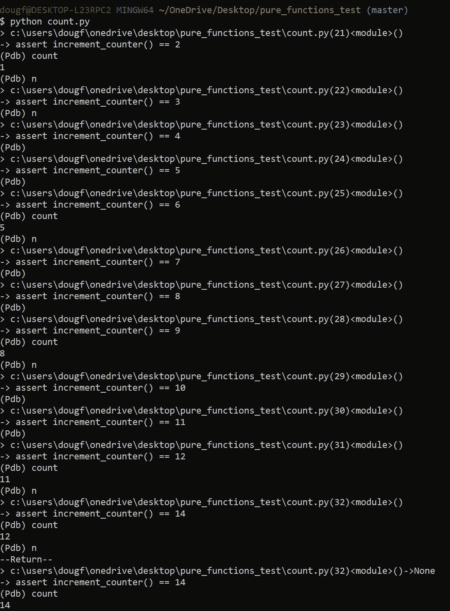
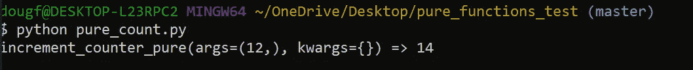

# 避免使用函数式编程的调试器

> 原文：<https://towardsdatascience.com/avoid-debuggers-with-functional-programming-43ea379605dd?source=collection_archive---------30----------------------->

## 用纯函数和跟踪器调试你的代码

作者:[爱德华·克鲁格](https://www.linkedin.com/in/edkrueger/)和[道格拉斯·富兰克林](https://www.linkedin.com/in/dougaf/)。

照片由 Fotis Fotopoulos 在 Unsplash 上拍摄

# 介绍

我们的目标是有一个纯函数的代码库，我们可以用一个 tracer 来修饰它。通过将这个装饰器应用到纯函数，我们可以在不使用笨重的调试器的情况下调试代码。这减少了开发人员的痛苦，因为调试器通常是乏味且难以使用的。

# 什么是纯函数？

严格地说，在一个**函数式编程**范例中，所有函数都是**纯函数**。它们是什么，我们如何编码它们，它们为什么有用？

在此之前，让我们回顾一下数学函数。

# 数学函数

数学函数，如`cos(x),`返回单个值。给它一个`x`，它返回`x`的余弦值。相同的`x`值将总是返回相同的结果。

Python 函数不同于数学函数。Python 函数不仅仅计算值；它可以改变程序的状态。

Python 函数可以设置影响不同函数结果的全局变量。例如，一个函数可以改变另一个函数使用的列表。这种突变是该功能的副作用。

副作用使得编程和调试更加困难。你不需要仅仅考虑一个特定的功能在做什么；您还必须考虑其他函数之前可能做了什么，这会影响程序的状态。

纯函数消除了一些意想不到的副作用。

## 纯函数

纯函数是数学函数的计算模拟。这意味着当你传递一个值给一个函数时，它将总是产生相同的结果，没有任何副作用。

让我们用一个非纯计数器和一个纯计数器来说明这个概念。这个计数器是迷信的，所以它将跳过 13。

带测试的不纯计数器

对于非纯函数——为了测试 13 的条件跳过，我们必须注意`count .`的全局状态。为了检查这种行为，我们必须运行计数器 13 次，看看它是否工作。每次我们调用`increment_counter()`都会有将`count`增加 1 的副作用。因此，我们必须运行`increment_counter()` 12 次，让它进入一种状态，在这种状态下`count = 13`触发我们正在测试的条件行为。

注意，我们将在本文后面的第 20 行讨论调试器代码`breakpoint()`。

当我们将计数器实现为一个纯函数时，测试我们的计数器是否跳过 13 要简单得多。

带测试的纯计数器

对于纯计数器，我们需要做的就是检查我们的条件情况，看看计数器是否跳过 13。不存在需要留意的全球状态，也不存在需要担心的副作用。

如果您只使用纯函数编写项目代码，计算将通过嵌套或组合函数调用进行，而不会改变状态或可变数据。这将允许更容易的调试。此外，因为纯函数对于相同的参数有相同的返回值，所以它们非常适合**单元测试。**

# 什么是调试器？他们很差劲吗？

调试器的目标是在受控条件下运行目标程序，允许程序员跟踪正在进行的操作并监控变化。

下面我使用 Python 调试器 pdb 运行了非纯计数器代码。第 20 行上的`breakpoint()`触发程序暂停，并向我们显示下一行的代码。我调用`count`来查看这个全局变量的状态，并使用`n`来运行下一行代码。在这种情况下，我们可以看到每次调用`increment_counter`时`count` 都会增加。

使用调试器检查上述非纯计数器的状态

我们可以看到`count`比我们的下一个断言落后了一个，这是意料之中的。此外，我们可以观察到计数从 12 跳到 14。注意计数状态是如何随着每次断言测试而增加的。这看起来像是好的软件设计吗？

像这样一行一行地遍历程序是很慢的。使用调试器重新创建一个状态来测试某个行为可能会很痛苦。

## 传统的调试器在几个方面都很糟糕。

*   你花了很多时间试图在本地重现错误，这样你就可以附加你的调试器。
*   当您反复缩小原因范围时，您必须多次重现问题。
*   人工调试环境将创建一个与错误最初出现时不同的状态。
*   调试器不跟踪数据或控制流，也不记得过去发生了什么。

开发人员有时会发现自己在为调试器编写代码来解决特定的问题。应该为手边的应用程序编写代码，而不是为正在其上使用的调试器编写代码！

各地的软件开发人员都应该对此感到不安。有更好的调试方法。如果您没有使用调试器，那么您可能通过添加日志记录代码并重新运行程序来进行调试。

这类似于我们的解决方案，使用带有跟踪器的纯函数，以获得更优雅和可重用的调试方法。

纯函数结合跟踪器对于生产中的日志记录非常有用，因为您可以确切地看到什么输入值产生了错误。对于纯函数，如果我们知道我们的输入和输出，我们就知道修复代码中的错误所需要的一切。

# 使用追踪器调试你的软件

应用跟踪装饰器，而不是使用调试器。

## 为什么要追踪？

**跟踪**是模拟程序的执行，一行一行地遍历程序，显示变量是如何变化的。有经验的程序员使用跟踪来调试程序，通常作为调试器的替代品。

> *“干杯，爱！骑兵来了！”—示踪器*

当您知道一个纯函数的输入和输出时，您就知道了调试所需的一切。

# 跟踪装饰者:@tracefunc

这是作为装饰器编写的跟踪程序，我们将把它应用于我们感兴趣的函数。

tracer.py

这个装饰器打印出传递给`tracefunc()`的函数的轨迹。在第 10 行，`result` 存储了`func(*args, **kwargs).`的值，之后生成一个打印语句。此语句报告`func.__name__`，args 和 kwargs。

这个装饰器将允许我们看到我们装饰的函数的名字和它的参数，kwargs 和 result。

通过用`tracefunc` 修饰我们的纯函数，我们生成了调试程序所需的所有日志信息。

# 对纯函数应用 tracefunc

让我们用我们的 tracer 来装饰这个纯计数器，看看输出。

用 tracefunc 装饰的纯计数器

我们在第 3 行使用`@`语法将`tracefunc` 应用到`increment_counter`。

增量 _ 计数器 _ 纯的跟踪

现在，当我们运行这个文件时，我们在第 11 行的测试生成了上面的输出。我们可以看到`func.__name__`，12 作为自变量，14 作为结果。

通过对这个纯函数应用追踪器，我们生成了我们想要测试的行为的清晰日志。专柜确实很迷信。

# 结论

通过用追踪器装饰纯函数，您获得了一个优雅的、可重用的模式来调试您的程序。装饰是增强功能行为的有力工具。有了好的代码(纯函数)和跟踪器，您可以避免使用调试器和管理状态来调试程序的痛苦。

请随意将`tracefunc`复制到您的代码库中，或者您可以尝试编写自己的跟踪装饰器！