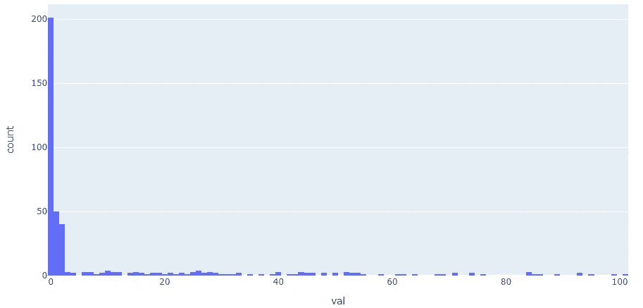
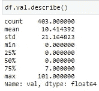
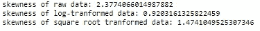

# 避免带有偏斜计数数据的机器学习模型中的错误

> 原文：<https://towardsdatascience.com/avoid-mistakes-in-machine-learning-models-with-skewed-count-data-e3512b94d745?source=collection_archive---------10----------------------->

## [入门](https://towardsdatascience.com/tagged/getting-started)

## 一些常见警告和解决方案的介绍


由[卢克·切瑟](https://unsplash.com/@lukechesser?utm_source=medium&utm_medium=referral)在 [Unsplash](https://unsplash.com?utm_source=medium&utm_medium=referral) 上拍摄的照片

# 1.背景

计数数据到处都是**。计数数据**听起来很容易**处理:它们只是无限的整数，没什么特别的。如果你这样认为，那么你很可能会把它们处理得* **错误*** 。为什么本博客旨在为您提供一些在 **机器学习(ML)** 中使用**计数数据的技巧，帮助您避免一些您以前可能从未注意到的常见错误。****

**先说**一个简单的问题**。**

**假设我们正在开发关于电影观看的 ML 模型，并且有一个名为“**用户在最近 6 个月观看的卡通电影计数**”的字段。由于每个人对电影的口味不同，所以我们看到的是 0，1，2，3…101 这样的值(没错，看了 101 电影的用户一定是个超级粉丝)。**

**现在我有个问题要问你:**

> **这个计数数据可能遵循什么统计分布？**

**如果你的答案是“正态分布”或者“我不知道”，那么恭喜你！我相信这个博客会帮助你。**

**如果你没有太多的统计学知识，那也没关系。这个博客旨在提供**实际操作的 ML 技术**，尽管我也为好奇的读者提供一些统计数据的细节。**

**首先我们来看看这个计数数据(一个为了演示而创建的玩具数据)的剧情和数据汇总。正如我们所知，进入一个全新的数据集最快的方法是绘制一些图表。所以我们开始吧:**

```
import numpy as np
import pandas as pd
import plotly.express as px
count = np.concatenate((np.zeros(202),np.repeat(1, 50),np.repeat(2, 40)))
np.random.seed(1)
a=np.random.choice(range(3, 60),90)
b=np.random.choice(range(61, 100),20)
df = pd.DataFrame(np.concatenate((count, a, b, [101])),columns=['val'])
fig = px.histogram(df, x='val',nbins=200)
fig.show()
```

****

**作者图片**

****

**作者图片**

**现在我确信你不会再假设这是一个正态分布。你可能会注意到数据是…**

****…高度歪斜右边有一条长尾巴，带着一堆 0 的****。****

****事实上，如果我们看看中间值，他们中的一半是 0，这表明一半的用户在过去 6 个月中没有看过任何卡通电影。你可能开始同意我的观点(如果你以前不同意),这种数据可能需要在你的 ML 模型中得到适当的处理。是的，这种类型的数据在统计中有一个特定的类别:**零膨胀**，表示计数数据的分布是稀疏的，有许多 0(本例中为 50%)。****

****接下来，在第 2 节中，我们将讨论新手在处理作为建模特征(即自变量)的偏斜计数数据时的常见错误。然后在第 3 节中，我们将看到当预测偏斜计数数据是您的目标(即响应变量)时的注意事项。如果你准备好了，那我们就开始吧！****

# ****2.作为独立变量的偏斜计数数据****

## ****常见错误 1:根据数据的统计数据移除异常值****

****我们都知道在数据探索之后要做的第一件事是数据清理，其中离群点去除是一个重要的部分。但是，在应用一些常见的异常值剔除方法时，如**标准差法和四分位差法**，请务必小心。正如您从下面看到的，您可能最终会删除大部分不是异常值的值，因为在这个倾斜的数据中，中值是 0。****

*   ******错误:**使用标准差法- >计算出的异常值百分比为:96.5%(该方法将大部分数据作为异常值)****

```
**# Mistake 1: Standard Deviation Method
# calculate summary statistics
data_mean, data_std = np.mean(df.val), np.std(df.val)
# identify outliers
cut_off = data_std * 3
lower, upper = data_mean - cut_off, data_mean + cut_off# remove outliers
outliers_removed = [x for x in df.val if x > lower and x < upper]
print('the calculated percentage of outliers is:',100*len(outliers_removed)/df.shape[0])**
```

*   ******错误:**使用四分位差法- >计算出的异常值百分比为:19.7%(好于标准差法，但异常值仍然过多)****

```
**# Mistake 2: Interquartile Range Method
# calculate interquartile range
q25, q75 = np.percentile(df.val, 25), np.percentile(df.val, 75)
iqr = q75 - q25
# calculate the outlier cutoff
cut_off = iqr * 1.5
lower, upper = q25 - cut_off, q75 + cut_off# identify outliers
outliers = [x for x in df.val if x < lower or x > upper]
print('the calculated percentage of outliers is:',100*len(outliers)/df.shape[0])**
```

******剔除异常值的解决方案:**
谨慎使用基于数据分布统计的方法，如均值或中值。我们可以考虑使用像**百分点封顶**这样的方法(删除大于某个阈值的点，比如 99%)。****

## ****常见错误 2:不做任何事情就将有偏差的计数数据投入线性回归****

****在执行线性回归模型时，人们通常会忽略使用 OLS 模型的基本假设，比如所有自变量建模后的误差应该服从正态分布。因此，如果你对有偏差的计数数据什么都不做，OLS 模型不会给你可靠的结果。****

******如果你感兴趣，这背后的一些统计数据(或者你可以跳过这个):**
你不需要让自变量遵循正态分布进行线性回归，但为什么你仍然关心你的自变量是否偏斜？原因是:****

1.  ****尽管在实际绘制残差图之前很难判断，但有偏差的数据很可能会违反我们上面提到的假设(残差/同方差的正态性)，并牺牲模型的准确性。****
2.  ****重尾可能会增加高杠杆的概率，从而影响回归模型的性能。****
3.  ****运行线性回归后计算 t 统计量和 p 值是很常见的，线性回归旨在评估估计系数是否与 0 有显著差异。为了使推论有效，估计系数的分布必须遵循正态分布。****

****那该怎么处理呢？有些人可能会考虑使用一些数据转换方法。嗯，这是正确的方向，但请务必避免下一个错误:****

## ****常见错误 3:使用 Box-Cox 方法进行数据转换****

****Box-Cox 是转换数据的一种很好的方法，但它不应该在这里应用，因为它有一个假设:数据必须全是负数或正数。由于我们的数据中有大量的 0，Box-Cox 不能再用了。****

******数据转换的解决方案:**
1)给这个字段的所有值加一个小数字(我建议 0.5)，做对数转换。为什么要加 0.5？因为你不能对 0 做对数运算，这在数学上是没有定义的。****

****2)通过取值的平方根进行平方根变换。****

****这两种方法都有助于改善偏斜度，如下面的输出所示。****

```
**print('skewness of raw data:', df['val'].skew())
# log transformation
df['log_trans'] = np.log(df.val+0.5)
print('skewness of log-tranformed data:', df['log_trans'].skew())
# square root transformation
df['sqr_trans'] = np.sqrt(df.val)
print('skewness of square root tranformed data:', df['sqr_trans'].skew())**
```

********

****作者图片****

******附加提示:**
1。如果您的数据非常稀疏，例如> 60%都是 0，我建议您将其更改为二进制变量:****

```
**df['binary'] = np.where(df.val>0, 1, 0)**
```

****2.如果您正在使用非线性 ML 方法，比如树模型，您可能不需要太担心有倾斜的数据。然而，由于多种原因，如可解释性、立法要求等，线性回归模型在工业中被广泛使用。****

# ****3.作为响应变量的偏斜计数数据****

****当偏斜计数(零膨胀)数据是响应变量时，我们可能会面临一些类似的问题，如异常值去除，您可以参考第 2 节中的解决方案。就不对称计数数据的建模而言，我们希望避免以下错误:****

## ****常见错误 4:将数据作为一般的连续响应变量来处理****

****许多人用线性回归(OLS)拟合数据，发现模型性能不好。这是可以理解的，因为数据不是来自正态分布(如第 1 节所述)，所以 OLS 不会很好地估计它(尽管这样做是有效的)。****

****为了获得更好的模型性能，我们需要理解数据分布的本质。回到我们一开始的问题:“**这个计数数据可能遵循什么统计分布？**答案是:****

> ****与其用单一分布来描述，不如用二项式(看不看)和泊松分布(如果看了也算)来描述。****

****理论表明，多余的零是通过与计数值(即正值)分开的过程产生的(参考文献 1)。1).因此，我们可以认为数据有两部分:第一部分是一个二进制变量，表示值是否为 0。在第二部分，我们看到数据来自计数数据的**泊松分布**。****

****有两种方法可以尝试符合模型:****

## ****3.1 机器学习方法****

*   ******如果你有*一些* 0(<30%):******

****您可以尝试使用 Python 库“scikit-lego”(参考文献 2)中的零膨胀回归器来拟合一个模型的数据****

*   ******如果您有多余的 0:******

****虽然你仍然可以使用上面提到的 Python 库“scikit-lego ”,但我个人会对这么多零感到有点担心，因为这表明数据有明显的分段/分离。正如我们讨论的数据来自两个过程，我会考虑为这种类型的数据创建两个 ML 模型:
-第一个模型将预测值是否等于 0。在博客的例子中，我们使用第 2 节中创建的 df['binary']作为第一步的响应变量。
-其次，我们过滤掉所有的 0，并为大于 0 的值开发一个模型。****

****在我们的“观看卡通电影”的例子中，我们可以像“用户细分”一样考虑这个过程，通过预测:
1) **如果**用户观看了卡通电影，****

****2)关注观看过**卡通电影**的用户，并预测他们观看了多少部。****

## ****3.2 统计建模****

****有许多研究讨论零膨胀数据。这里有几个你可以尝试的模型(参考。1):****

*   ******零膨胀泊松回归******
*   ******零膨胀负二项式回归** —负二项式回归更适用于过度分散的数据，即方差远大于平均值。****
*   ******普通计数模型** —如果没有多余的零，泊松或负二项式模型可能更合适。****

# ****4.摘要****

****计数数据很常见，但如果有多余的零，就很难处理了。这篇博客为您提供了清理、操作和建模偏斜计数数据时的四个常见错误。我希望你能从这个博客中学习，这样你会对你的机器学习之旅更有信心！****

****注意:我在这个例子中创建的正值不一定遵循泊松分布，因为它只是用于演示目的的玩具数据。在现实中，这种正计数数据应该遵循泊松分布。****

## ****💖喜欢这个故事吗？请随意[订阅 DS 和 ML 粉丝的邮件列表](https://mingjie-zhao.medium.com/subscribe)，并且[成为会员](https://medium.com/@mingjie-zhao/membership)！🤩****

## ****这篇博客最初发表在我的个人网站上。****

## ****参考文献
1。[https://stats.idre.ucla.edu/r/dae/zip/](https://stats.idre.ucla.edu/r/dae/zip/)2。[https://scikit-lego.netlify.app/meta.html](https://scikit-lego.netlify.app/meta.html)****