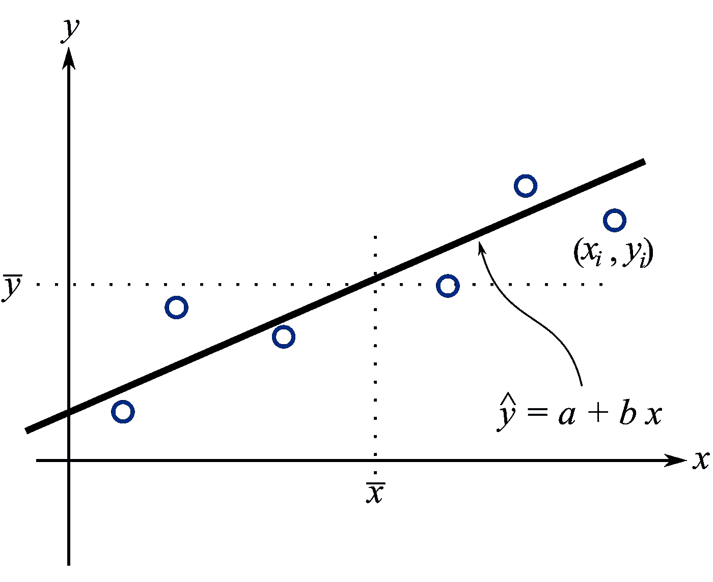
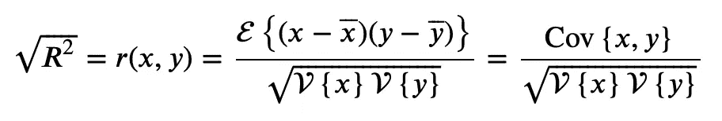
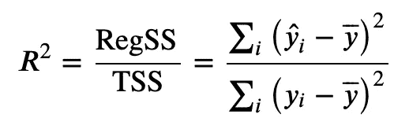
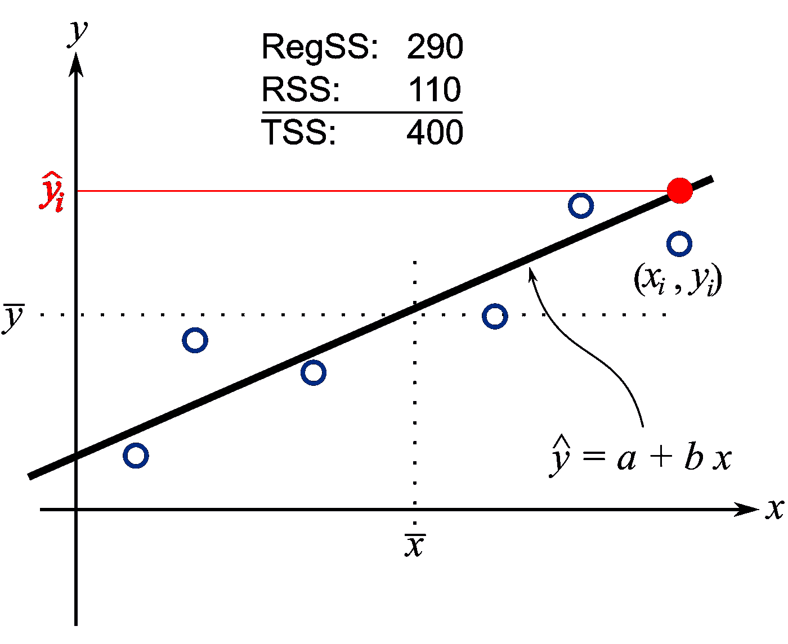
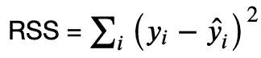
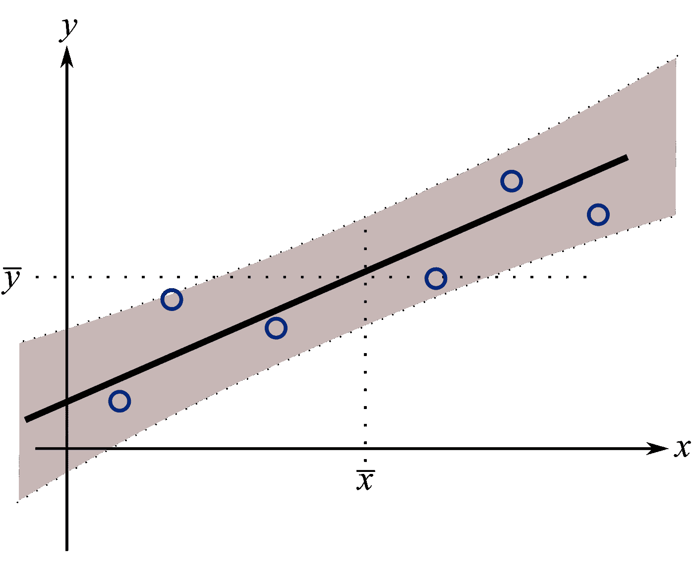

# 避免用 R 平方来判断回归模型的性能

> 原文：<https://towardsdatascience.com/avoid-r-squared-to-judge-regression-model-performance-5c2bc53c8e2e?source=collection_archive---------3----------------------->

## 依靠 R 来判断一个回归模型的表现是被误导的

**总结**

r 可以在 之前计算 ***甚至拟合一个回归模型，这没有意义然后用它来判断预测能力。如果你翻转输入和输出，你会得到相同的 R 值。同样，这对于预测指标来说是没有意义的。***

您的回归模型的**意图**是选择合适度量的重要因素，合适的度量可能是 ***而不是*** R。

本文解释了存在哪些更好的替代方案:标准误差、置信区间和预测区间。

# 1.我们为什么要建立线性回归模型？

收集历史数据并计算输入𝑥和输出𝑦之间的关系。这种关系往往是线性回归模型，写成𝑦 *=a+* 𝑏𝑥，其中截距为 *a* ，斜率为 *b* 。

最常见的目的是使用计算出的关系，并预测一些未来的输出，称为𝑦̂，给定一个新的输入:𝑦̂=和+𝑏𝑥.

以下是建立线性回归模型的两个最常见的原因:

1.  向**了解更多**关于投入与产出的关系；
2.  到目前为止，最常见的用法是**根据输入获得输出的预测**。

让我们依次来看一下每一项。

## 了解更多关于关系的信息

线性回归𝑦= *a+bx* 的系数𝑏显示了投入𝑥.每增加一个单位对产出𝑦的平均影响这叫做“了解我们的系统”。



回归模型的斜率和截距提供了对系统的学习或洞察。该图还显示了这里使用的术语。【来源:[自己的作品](https://github.com/kgdunn/figures/tree/master/least-squares)

例如，如果您在系统(输入)的摄氏温度𝑥=temperature 和𝑦=pH(输出)之间建立了一个回归模型，您可能会得到一个回归模型: **𝑦=4.5+0.12𝑥** ，从中您可以了解到两点:

*   温度每升高 1 度，平均会导致 pH 值增加 0.12
*   当使用𝑥=0 摄氏度的温度时，预期或预测的 pH 是 4.5 单位的输出 pH。

但是考虑两种情况:如果我告诉你这个模型的 R 是 0.2，或者是 0.94 呢？这对你的学习有什么影响？我们将在下一节中讨论这个问题，在这里我们将对 R 测量的内容有更多的了解。

## 使用模型的预测

这个场景是大多数人都熟悉的。继续上述内容，它询问对于给定的新的温度输入值𝑥.，预测的 pH 值是多少例如，在我们从未使用过的 13°C 新温度下，我们预计输出 pH 值为 4.5+0.12×13=6.06 pH 单位。

同样，当模型的 R 值在 0.2 左右，或者模型的 R 值为 0.94 时，我们赋予这样的预测什么样的价值呢？

# 2.背景:R 实际衡量的是什么？

注意:搜索类似“[](http://www.google.com/search?q=R2+interpretation)*”或类似的短语，会返回许多推理错误的网站。*

*最简单的形式是，R 只不过是两个变量相关程度的度量。它是𝑥和𝑦.之间相关系数的平方*

**

*其中花式“E{…}”是“的期望值”运算，花式“V{…}”是“的方差”，Cov{ *x* ， *y* }是“的协方差”运算。𝑥和𝑦上方的水平线告诉您使用这些数据列的平均值。*

*A **第二种解读**是 R 是回归平方和(RegSS)与平方和总和(TSS)的比值。任何“平方和”值都只是一个重新调整的方差，因此这里的公式显示 R 只是两个方差的比值:*

**

*r 值为 1.0 意味着分子和分母完全相同，或者换句话说，预测值𝑦̂ *ᵢ* 与原始值𝑦 *ᵢ* 完全相同。相反，要使 r 的值为 0.0，分子必须等于零，这意味着预测只是等于一条平线，即𝑦的平均值，而不管𝑥.的输入值是多少这是你能得到的最差的模型:它说在 R =0 的情况下，你能对𝑦做出的最好预测只是返回训练𝑦值的平均值。*

*R 的一般解释来自于这个等式:这就是解释的百分比变化。分母与总变化量成比例，分子是解释的变化量，导致 0 和 1 之间的分数(百分比)。*

**

*开放圆用于计算(建立)模型；而单个闭合圆圈显示了该模型如何在稍后被用于进行预测。RegSS、RSS 和 TSS 是根据空心圆表示的数据点计算的。【来源:[自己的作品](https://github.com/kgdunn/figures/tree/master/least-squares)】。*

*与之前的解释相关的是 R = 1.0 RSS/TSS，因为对于简单的回归模型，我们有 TSS = RegSS + RSS。*

*RSS 是残差平方和(RSS)，或者从数学上讲*

**

*这清楚地表明，要得到 R =1，你必须没有残差(RSS = 0)；R =0 意味着 TSS = RSS，换句话说，残差与原始数据的方差相同。*

*更多的细节和说明在我的免费书中:[https://learn che . org/PID/least-squares-modeling/least-squares-model-analysis](https://yint.org/least-squares)*

## *到目前为止的总结*

*理解上面的公式并尝试用简单的语言解释它们是非常有益的。一开始这并不容易，但理解如何使方程的每一部分变大变小，以及如何获得 0.0 和 1.0 的极值是值得的。*

# *3.为什么 R 不足以判断模型的回归性能*

*综上所述，这里有两个非常简单的原因，说明为什么 r 几乎不是判断根据新的输入𝑥:预测新的输出𝑦的正确度量*

1.  *如果你把历史数据调换一下，把𝑦变成𝑥，让𝑥变成𝑦，那么你得到的 ***和*** R 值完全一样。这有什么意义呢？模型预测能力的度量标准**必须**取决于什么是输入，什么是输出。*
2.  *如果我告诉你在 计算模型的斜率和截距之前，我可以告诉你 R 值会是什么 ***会怎么样？同样，这没有意义。在拟合预测模型之前，如何计算预测性能的良好度量？****

*这相当于在拟合神经网络之前计算它的预测能力；或者翻转神经网络的输入和输出，得到相同的性能指标。*

*那么我们如何做出这两个关于 R 的强有力的陈述呢？回头看看第一个公式:*

**

## *把𝑥和𝑦调换一下*

*分子是对称的。如果你交换𝑥和𝑦的角色，你会得到相同的分子值。这也适用于分母。请用 Python，Excel，R，MATLAB，或者任何你用来做线性回归的工具自己确认一下。下面是一些拟合线性模型的 R 代码(`lm`):*

```
*x = c(10, 8, 13, 9, 11, 14, 6, 4, 12, 7, 5)
y = c( 8, 7,  8, 9,  8, 10, 7, 4, 11, 5, 6)
summary(lm(y ~ x))  # R^2 = 0.657 
summary(lm(x ~ y))  # R^2 = 0.657*
```

## *能够在拟合模型之前计算 R*

*再来看一下上面的公式。它是否取决于:*

*   *模型的残差？ ***否****
*   *模型的任何系数，如斜率或截距？ ***否****

*因此，即使不拟合回归模型，也可以计算 R。该公式仅依赖于原始数据，而不依赖于任何模型！这不是什么数学把戏，因为事情以某种特殊的方式抵消或简化了。这只是一个 r 被设计用来测量的事实:𝑥和𝑦.两个序列之间的相关程度*

*很简单，最后一句话指出了何时应该使用 R:仅作为两个序列之间相关性的度量。*

# *4.好吧，我已经被说服了。但是应该使用哪些指标呢？*

*让我们回头看看这两个用例:*

1.  *从模型中学习*
2.  *根据模型进行预测*

## *从模型中学习*

*如果你的目标是解释斜率或截距，那么使用一个与之相关的度量，而不是 R。在这种情况下，斜率和截距的**置信区间**是信息性的。置信区间是两个数字，一个是**范围**。在此范围内，您可以预期，在指定的置信度下，它包含参数的真实值(如斜率)。让我们回到温度和 pH 值的例子，只考虑斜率。同样的想法也适用于截击。*

*请记住，𝑦=4.5+0.12𝑥意味着温度每升高 1 度，平均会导致 pH 值增加 0.12 个单位。真实(但未知)斜率的 95%置信区间可能是[0.09；0.15]，这意味着我们有 95%的可能性这个范围包含真实的斜率。注意， ***不是*** 真实斜率在这个范围内的概率；一个微妙但重要的区别。有 ***没有概率*** 与真值相关联；概率**与包含真实斜率的范围**相关，真实斜率是一个固定但未知的值。*

***为什么使用置信区间？**主要原因是数值都是你关心的单位，而不是两个方差的抽象比值，比如 R，其次，范围越宽，模型越差。假设斜率的置信区间是[0.09；0.15]或[0.03；0.21];你想要哪个？*

*在间隔的宽度和 R 的值之间存在直接的关系，但是这种关系是非线性的，并且对于不同的模型具有不同的形状。*

*这里有一些你可能会用到的 R 代码。类似的代码在 Python 中也是可行的:*

```
*x = c(10, 8, 13, 9, 11, 14, 6, 4, 12, 7, 5)
y = c( 8, 7,  8, 9,  8, 10, 7, 4, 11, 5, 6)linmod = lm(y ~ x) # predict y from x
summary(linmod)
confint(linmod) # confidence interval*
```

## *根据模型进行预测*

*如果您想要判断模型的预测，请使用**标准误差** (se)或预测区间，而不是 R。为什么使用 SE？*

*标准误差是残差的标准偏差。这听起来比 R 更复杂，但事实并非如此。首先，标准误差有输出变量的单位。换句话说，它有你真正关心的量的单位，预测的单位！如果您的残差呈正态分布(使用 [q-q 图](https://en.wikipedia.org/wiki/Q–Q_plot)进行快速简单的检查)，那么您知道大约 70%的残差位于范围[SE；+SE]，95%的残差在 2SE+2SE]。这是我个人使用最多的方法:计算 se 并乘以 4，以了解我的典型残差的“带宽”。不确切，但足以判断“我的预测模型够好吗？”如果您认为预测值的范围在 2SE+2SE]，那你就可以对你的模型满意了。*

*你会在无数的博客和教科书上读到 R 低不一定不好，R 高也不一定好。没错。这是因为我见过 R 超过 0.99 的情况，但标准误差仍然太大，对最终用户的要求没有用处。*

*比使用构建(训练)模型时计算的标准误差更好的方法是使用全新测试数据集上预测的残差的标准偏差。这是相同的指标，但只是从测试数据中计算出来的，或者如果您不能将测试数据放在一边，则通过交叉验证来计算。*

*与标准误差相关的另一个选项是使用**预测区间**。这就像是一个置信区间，但对于一个全新的预测。在上面的例子中，我们可能有:*

*   *一个新的温度测量，𝑥=10 摄氏度，导致预测的 pH 值为 5.7±0.4*
*   *换句话说，预测的 pH 值位于从[5.3 到 6.1]的范围内，置信度为 95%。*

**

*预测区间(为了说明而放大)是阴影区域。它在训练数据的中心最窄，并且随着距离的增加而变宽。【来源:[自己的作品](https://github.com/kgdunn/figures/tree/master/least-squares)*

*这样的时间间隔非常有用；我们马上得到一个范围，用我们关心的单位，也就是输出变量𝑦.的单位预测区间是图中的阴影区域，并且是非线性的。离模型中心点越远，它就越宽。虽然在一些软件包(如 Excel)中并不总是容易获得这个区间，但作为一个近似规则，您可以使用阴影区域覆盖 2SE。*

```
*x = c(10, 8, 13, 9, 11, 14, 6, 4, 12, 7, 5)
y = c( 8, 7,  8, 9,  8, 10, 7, 4, 11, 5, 6)linmod = lm(y ~ x) # predict y from x# Get the prediction interval for 3 new values of x:
newdata = data.frame(x=c(1, 8, 15))
predict(linmod, newdata, interval="predict")*
```

*如前所述，R 值越高，预测区间宽度越小，这直观地证明了 R 越高越好，但您无法提前推导出什么是“好 R”的截止界限，因为它取决于测量的数据，当然也取决于您的目的可接受的范围。*

## ****收尾****

*问问自己为什么要建立线性回归模型:*

*   *“我想更多地了解我的斜率或截距”。对它们使用置信区间，而不是 R。较高的 R 与较小的置信区间相关。*
*   *“我希望能够从我的模型中判断预测”。使用预测间隔或模型的标准误差。较高的 R 与较小的预测区间和较低的标准误差相关。*

*所有描述的选择都比 R 更容易理解，并且是你关心的单位。如果你已经做到这一步，并想阅读更多，请查看我的[免费书籍](https://yint.org/least-squares)。*