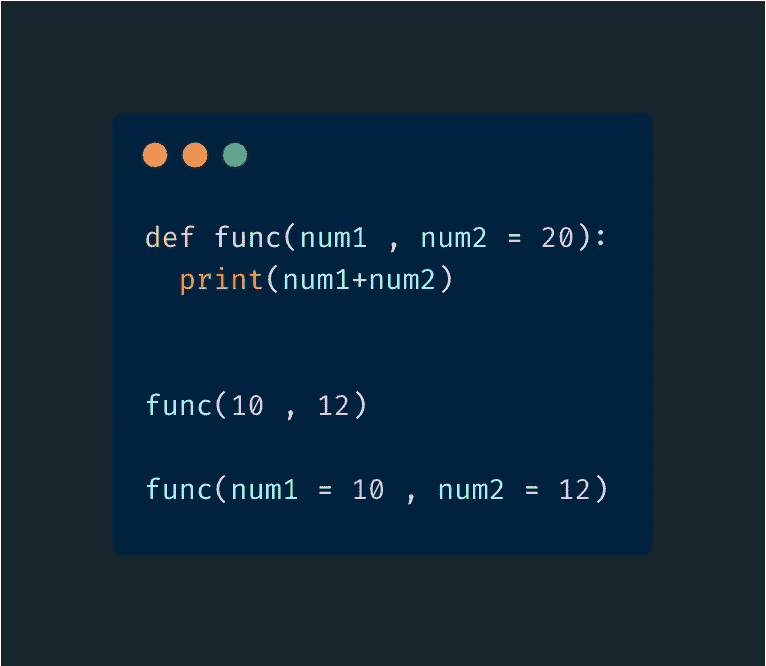
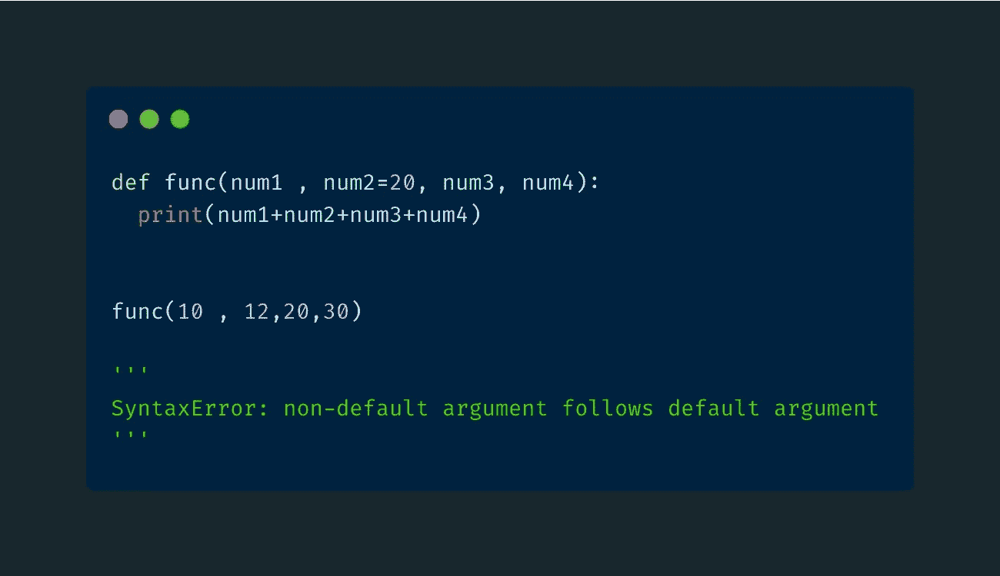
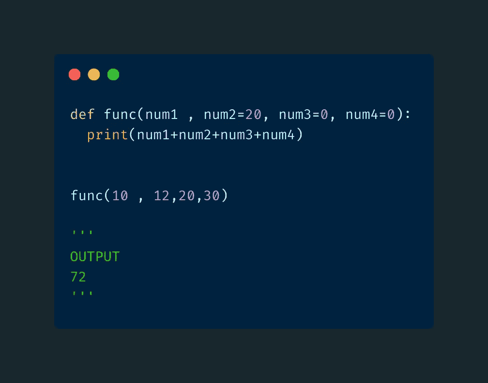
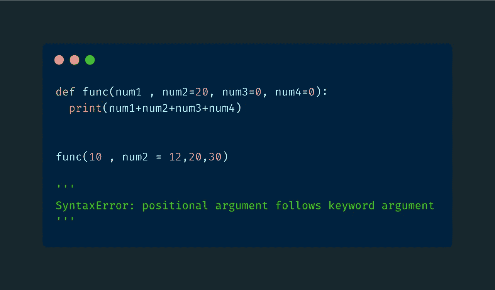
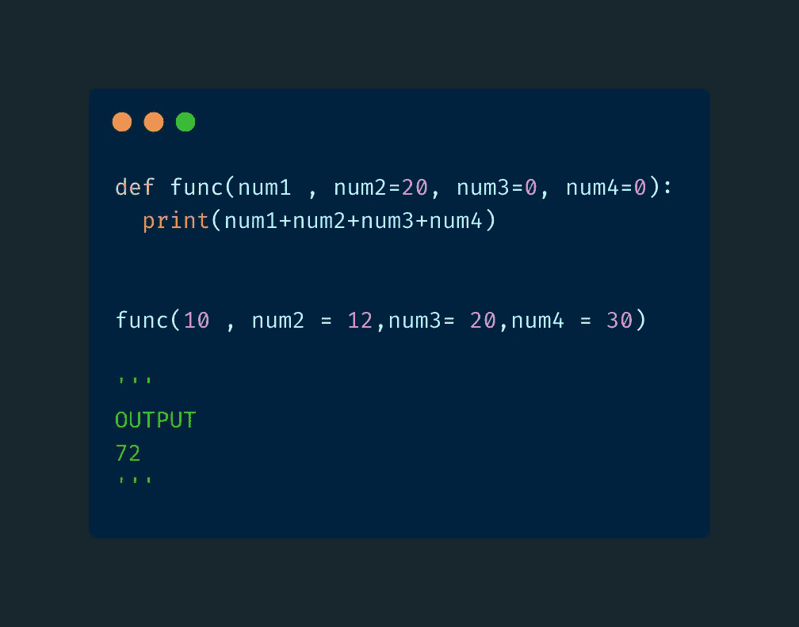
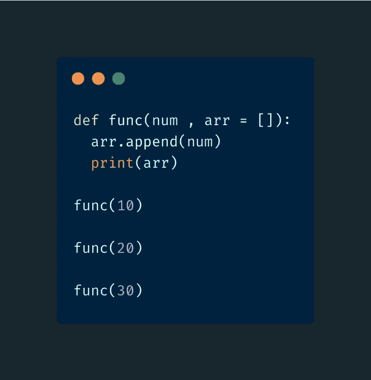
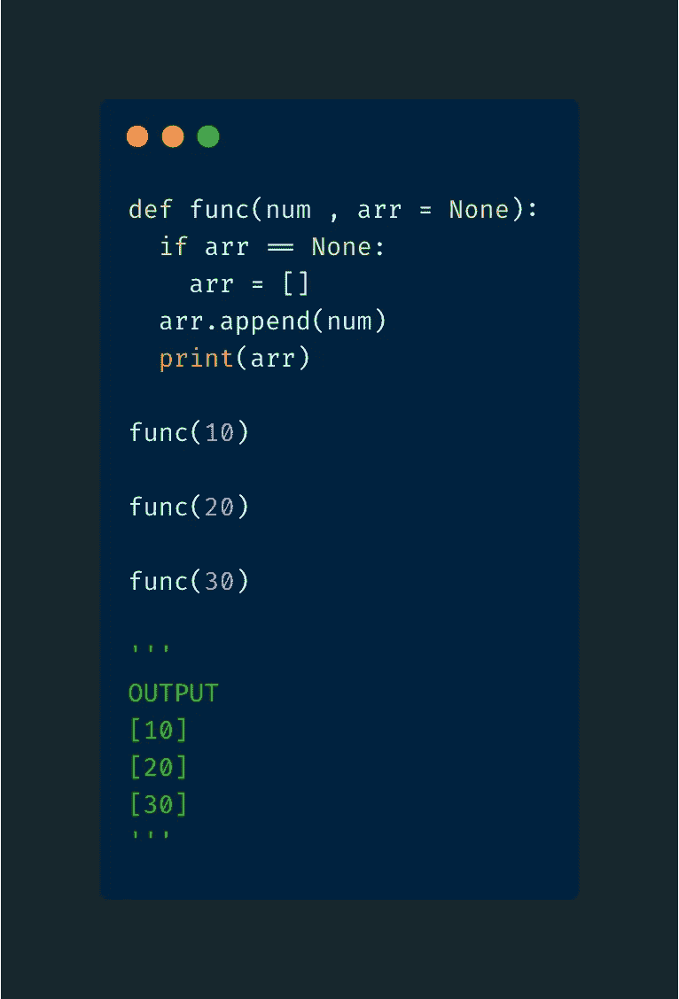

# 避免这些与 Python 中的参数和自变量相关的陷阱/错误

> 原文：<https://towardsdatascience.com/avoid-these-gotchas-errors-related-to-parameters-and-arguments-in-python-6bf4dbec9183?source=collection_archive---------27----------------------->

## 我们将讨论几个错误和一个与 Python 参数相关的问题。


麦克斯韦·尼尔森在 T2 的照片

在继续之前，让我们讨论几个术语。查看下面的代码片段。这是一个简单的函数，打印其参数的总和。



代码片段

*   **参数** -它们是函数定义中列出的名称。例:在上面的代码片段中， **num1** 和 **num2** 是参数
*   **参数**——它们是我们在调用函数时传递的值。例如:在上面的代码片段中，在对函数 **10** 和 **12** 的两次调用中，参数都被传递给了函数
*   **位置实参**——当我们将实参传递给一个函数而没有显式地将它们赋给参数时。在上面的代码片段中，我们在第一次调用 **func** 时使用了位置参数
*   关键字参数 -当我们通过显式地将参数赋值给形参来传递参数给函数时。在上面的代码片段中，我们在第二次调用 **func** 时使用了关键字参数
*   **默认值** -在功能定义期间分配给参数的值。例:在上面的代码片段中， **20** 是赋给参数 **num2** 的默认值

# 默认参数的顺序

> 规则:如果在定义函数时有一个带默认值的参数，那么它后面的所有参数也必须有默认值

## 错误的



代码片段

在上面的 **func** 的函数定义中，一对没有默认值的参数( **num3，num4** )跟在一个有默认值的参数( **num2** )后面。这将导致语法错误。

## 正确的



代码片段

这不会导致任何错误，因为我们已经为变量 **num3** 和 **num4** 指定了默认值

# 关键字参数的顺序

> ULE:当调用一个函数时，一个关键字参数必须跟在一个关键字参数之后。因此，位置参数不能跟在关键字参数后面。

## 错误的



代码片段

**12** 作为关键字参数传递。然而，它后面的自变量( **20** 和 **30** )作为位置自变量被传递。这将导致语法错误。

## 正确的



代码片段

这次，我们将参数( **20** 和 **30** )作为关键字参数进行传递。因此，不会引发任何错误。

# 默认参数值

> 误解:在每个函数调用期间，默认值被分配给参数
> 
> 正确:默认值只分配一次。在将来的函数调用中，使用以前的值

当你遵循下面的例子时，这将更有意义



代码片段

该函数有两个参数 **num** 和 **arr** 。 **arr** 有一个空列表的默认值。该函数不做任何花哨的事情。它只是将参数 **num** 插入到数组 **arr** 中，然后打印该数组。

## 预期

```
'''OUTPUT[10][20][30]'''
```

所以基本上每次我们调用函数的时候， **arr** 都被设置为一个空列表的默认值，并且 **num** 被插入其中。

> **但这不是正确的输出**

## 实际的

```
'''OUTPUT[10][10, 20][10, 20, 30]'''
```

嗯，很奇怪吧？🤯

基本上，默认值是在第一次函数调用时设置的。在下面的函数调用过程中，不会再次分配默认值。而是使用以前的值。

## 解决办法



代码片段

不将空列表指定为默认参数，而是将 **None** 指定为默认值，并在函数内指定空列表。

# 结论

我希望你今天学到了新东西。参数和实参看起来是简单的概念，但实际上，它们比你想象的要稍微复杂一些。现在你知道要避免的错误和误解。

> *在*[*LinkedIn*](https://www.linkedin.com/in/rahulbanerjee2699/)*，* [*Twitter*](https://twitter.com/rahulbanerjee99) 上跟我连线

*原载于 2021 年 5 月 2 日 https://www.realpythonproject.com*<https://www.realpythonproject.com/avoid-these-gotchas-errors-related-to-parameters-and-arguments-in-python/>**。**