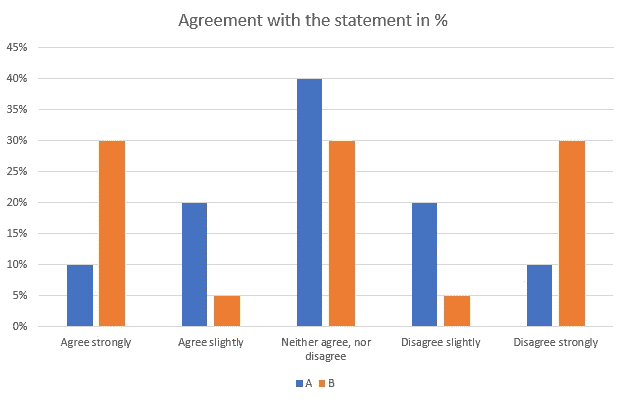
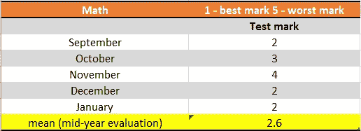
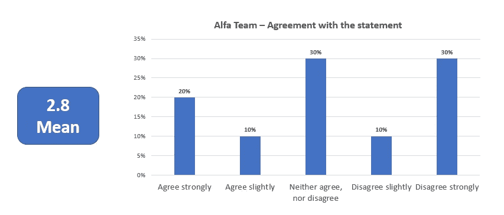

# 用平均避免麻烦

> 原文：<https://towardsdatascience.com/avoid-troubles-with-average-923012d1cd3e?source=collection_archive---------39----------------------->

## 平均值是最常见的显示值，但经常会产生误导

由 Charles Deluvio 在 Unsplash 上拍摄的图像

平均反应是积极的。平均值是 3。对于这个话题，普遍的看法是中立的。平均而言，女性比男性更赞同。你一直都在阅读和听到这样的陈述。是什么样的信息？

平均值可以是多个值。它是一组数据中的典型值(按照牛津语言的定义)。使用统计词汇，平均值可以是:

1.  **Mode** 是一个数据集中出现频率最高的数字，意思是被挑选最多的选项。
2.  **Median** 当你从最小到最大排序你的值时，把你的数据集从中间分开。
3.  **Mean** 是一种将所有数字相加并除以数值个数的计算方法。

都有一些优点。然而，平均值是最常用的值。但是我们用得好吗？

# 卑鄙可以是卑鄙

注意您的平均值，并根据您的数据对其进行评估，以防止误解。这里我们有一个问题和一个分析师的笔记:

*Q1。您对以下陈述的同意程度如何:您的经理定期与您一起评估您的目标。*

*   *非常同意(5)*
*   *稍微同意(4)*
*   *既不同意也不反对(3)*
*   *略微不同意(2)*
*   *强烈反对(1)*

分析师:对 Q1 的平均反应是 3.00。我们的受访者既不同意也不反对这一说法。

如果我们只看平均值，我们就看不到全貌。我们可以使用平均分数来比较其他语句和我们的 Q1，但是这样做值得吗？每当我们有一个平均值时，我们需要掩盖它背后的东西。我们来看看下面的数据:

Ivona Fikejzlova 提供

这里我们有选项 A 和 b，它们的平均值都是 3.00。然而分布是不同的。如果我们有选项 A，3 的平均值也是它的众数和中位数。在这种情况下，大多数受访者既不同意也不反对。

但是当我们有选项 B 时，反应是两极化的:30%的人同意，30%的人中立，30%的人不同意。

均值不适合捕捉两极分化的数据或极端情况。意思是可以隐藏信息。所以，不要让刻薄的人对你刻薄，要经常检查你的数据分布。平均值并不是任何时候都有用，所以在有意义的时候使用它。

# 小数字的平均值

许多学生确实打算从课堂上评估他们的最终评价。这样，他们知道会发生什么。

Ivona Fikejzlova 提供

在这里，我们的学生知道，如果他想得到 2 分，他需要在期末考试中表现出色，得到 1 分。否则，他会得 3 分。这是计算平均值的一种简单而有用的方法，

在其他情况下，当我们从一小部分人那里收集数据时意味着是多余的。假设我们有一份 10 人的问卷，最终呈现的数据如下所示:

Ivona Fikejzlova 提供

它让数据变得更加复杂。当我们有像这样的小数字时，它足以呈现计数。我们不必为平均值或百分比而烦恼。毕竟 10% = 1 人。

在这种情况下，这种方法不能提供有用信息。这会分散观众的注意力。在这种情况下，我们会做更多的定性分析。我们关注个体而不是平均水平。

# 干净数据的平均值

许多数据收集调查都有逃避性的回答，比如“我不知道”或“我不想回答”。

在准备平均值时是否应该考虑这些因素？而完全不填数据的人呢？他们应该参与计算吗？

只有相关的数据才能提供你的平均数据。你的平均分数)。所以，小心错误的选择。从数字数据中得出平均值是很容易的。当你必须将书面数据转换成数字时，你可能会面临一个潜在的问题。

所以，在计算平均值之前，你必须清理你的数据。清洁过程正在检查这些:

1.  **数据范围**:如果我们有一个刻度，比如 1-5，就不应该有 6、7、8 等等。如果我们把错误留在那里，平均值将是错误的。
2.  **空数据**:我们经常会遗漏一些数据。这就是为什么该项目不应该进入计算，因为平均将再次是错误的。
3.  **非数字数据**:需要填写数字。但是他们写的不是 2，而是 2。您需要将所有文本值更改为数字，以便能够计算平均值。此外，任何其他不相关的文本应该相应地编码。

干净的数据易于处理和操作。您可以选择感兴趣的平均值——众数、中位数或平均值。这取决于你分析的范围。

# 最终平均音符

无论何时你要提出一个平均值，不要想当然。想想为什么要呈现，怎么呈现。

平均值适用于比较，但不适用于分析数据分布。您有三个选项——众数、中位数和平均数。

所有数据应该是干净的，没有错误的值，以达到正确的平均值。

**注意，如果数据样本很小，平均值可能不是最合适的值。最后，一定要提到你是如何计算平均值的。每个人都应该清楚你在说什么，你是怎么做到的。**

附注:你应该会收到我的邮件。 [***做到这里*** *！*](https://ivonahirschi.medium.com/subscribe) *如果你自己喜欢体验媒介，可以考虑通过注册会员 *来支持我和其他成千上万的作家* [**。每月只需 5 美元。**](https://ivonahirschi.medium.com/membership)*