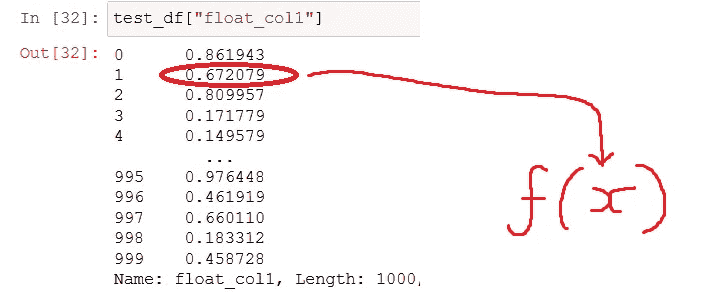
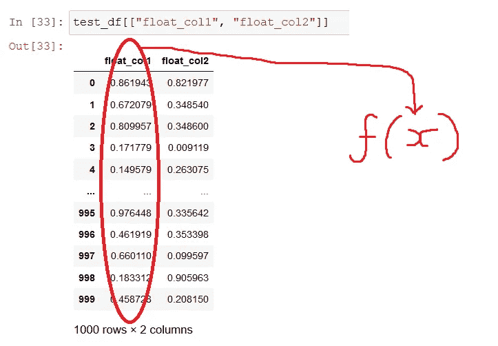
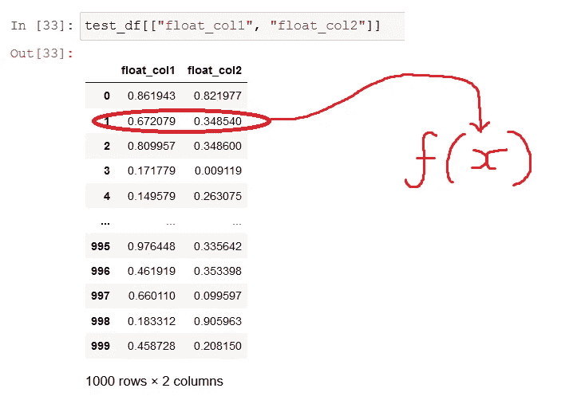
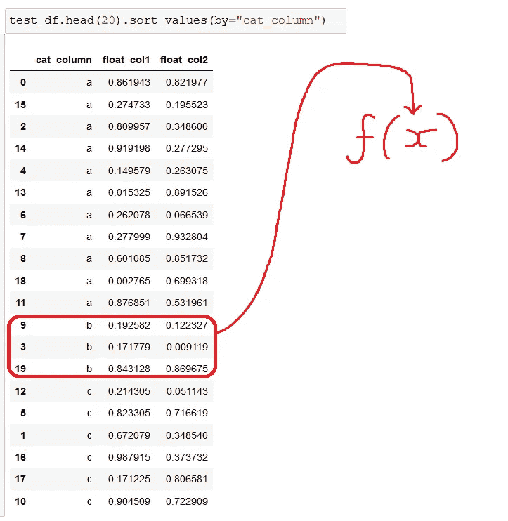

# 如何以及为什么停止使用熊猫。申请()(这么多)

> 原文：<https://towardsdatascience.com/avoiding-apply-ing-yourself-in-pandas-a6ade4569b7f?source=collection_archive---------3----------------------->

## 理解为什么确定。apply()的工作很好，为什么有些人表现不佳。

如果您正在阅读这篇文章，我猜您已经在某个时候使用过流行的 python 数据处理库 pandas 中的`.apply(…)`方法。如果你没有，那么你可能会迷失，你可能不会从这篇文章中得到很多(但无论如何，如果你读了它，还是值得称赞的)…

如果这篇文章写得好，并且你成功地阅读和理解了它，你可以希望；

*   更好地了解`.apply(…)`在不同场景中的作用(剧透一下，它可能不总是你想的那样)；
*   知道什么时候`.apply(…)`可能是一个好的选择，什么时候使用替代品可能更好；

> “当你只有一把锤子时，一切看起来都像钉子”

我将在这篇文章中指出，最好少用`.apply()`，当你把手放在`.apply()`瑞士军刀上时，可能会有其他更合适的工具。


由我用 Microsoft Paint 专业绘制

# 有什么关系？apply() do？

在一个非常高的层次上，`.apply()`允许我们以不同的方式调用 pandas 对象上的 python 函数。这使得第一次使用 pandas 库时变得非常容易，因为你可以用一种非常熟悉的方式编写 Python 代码，然后使用`.apply()`将其转换到你的系列或数据帧上。

# 什么(在我看来)是有效的熊猫？

关于这方面的文章有很多很多，所以我就不赘述了，但这里有一些关于“有效的熊猫”(或一些人喜欢称之为“可漫游的熊猫”)的重要特征的观点:

*   尽可能有效利用矢量化运算的代码(这几乎总是可能的)
*   对于我们原始的大脑来说，代码是容易阅读和理解的(当然这不仅仅是熊猫的代码)

如果你想了解更多关于这些事情，请去做吧(但是之后一定要回来)。关于 pandas 性能的一个关键要点是，在 pandas 数据帧中对每一行进行操作通常很慢，但使用列作为序列对其进行矢量化操作(一次处理一整列)通常很快。

# 申请什么？

**在熊猫中使用** `**.apply(…)**` **的时候，这大概是最需要问自己的问题。你可能会合理地认为，每当你在熊猫身上做** `**.apply(…)**` **动作时，它都会以大致相同的方式动作，不幸的是事实并非如此！**

你有一个 python 函数和一个 pandas 对象，你想把你的 python 函数应用到你的 pandas 对象，但是这个函数实际上会收到什么参数(它会得到一个 int，一个 series，一个 dataframe)以及这对代码的行为有什么影响？

答案是，这取决于你正在应用的对象的类型(我们将查看`pd.Series`、`pd.DataFrame`和`pd.GroupBy`)，以及你如何调用**、**。

我们将创建一个简单的测试数据框架，并进行一些探索…

```
import pandas as pd
import numpy as np

df_len = 1000

test_df = pd.DataFrame(
    {
        "cat_column": np.random.choice(["a", "b", "c"], size=df_len),
        "float_col1": np.random.random(size=df_len),
        "float_col2": np.random.random(size=df_len),
    }
)
```

这里我们有一个具有 3 列的数据帧，一个对象列包含“ *a”、“b”或“c”*，两个浮点列包含 0 和 1 之间的值。

# 警察。系列.应用

好了，这是更有趣的地方(因为我们已经完成了预华夫饼，我们正在运行一些代码)。现在，请耐心等待，我们将把内置的`type`函数作为一个系列应用到我们的一个专栏中。

输入:

```
print(f"Applying on {type(test_df['float_col1'])}")
test_df["float_col1"].apply(type)
```

结果:

```
Applying on <class 'pandas.core.series.Series'>0      <class 'float'>
1      <class 'float'>
2      <class 'float'>
3      <class 'float'>
4      <class 'float'>
            ...       
995    <class 'float'>
996    <class 'float'>
997    <class 'float'>
998    <class 'float'>
999    <class 'float'>
Name: float_col1, Length: 1000, dtype: object
```

酷，谁在乎？这告诉我们什么？嗯，第一行简单地告诉我们，在这种情况下，我们正在`.apply`到一个`pd.Series`。输出的其余部分告诉我们什么？它告诉我们一些事情:

*   当我们对`pd.Series`应用函数时，函数接收序列中的**值**作为参数，而不是一次性接收整个序列。我们正在使用的`type`函数接收每个“单元格”中的浮动对象。
*   我们应用的函数在序列中每行被调用一次(在本例中被调用 1000 次)

如前所述，每行调用一个函数会有性能损失，所以当您在一个`pd.Series`上调用`.apply`时，您并没有向量化您的操作，如果可以的话，请避免使用这种`.apply`。



系列应用的调用模式图，应用的函数 f 是用系列中的单个值调用的。

## 例子

例子的问题是它们总是做作的，但是相信我，在大多数情况下，这种`pd.Series.apply`是可以避免的(请至少试一试)。因此，在这种情况下，我们将采用示例数据帧中的一个浮动列的`log(cos(x) + 5)`,只是因为它看起来有点复杂，我们可能会在这种情况下使用 apply。

```
def trig_transform(x):
    return np.log(np.cos(x) + 5)
```

**使用 pd。**

```
test_df["float_col1"].apply(trig_transform)
```

时机

```
3.25 ms ± 119 µs per loop (mean ± std. dev. of 7 runs, 100 loops each)
```

**忌 pd。Series.apply:**

因为大多数常见的数值运算在 numpy 中都有一个矢量化的实现，可以接受标量或数组，所以在某些情况下(比如这样),您可以简单地直接在`pd.Series`上调用函数，而不是将它应用于每个元素。

```
trig_transform(test_df["float_col1"])
```

时机

```
264 µs ± 11.3 µs per loop (mean ± std. dev. of 7 runs, 1000 loops each)
```

我不会喋喋不休地说它快了多少，但在这个基准测试中，它看起来快了大约 12 倍，但您应该亲自尝试一下，因为性能有许多因素。

非数字示例可能需要对我们在 pandas 对象上调用的函数进行一些更改，我建议您查看一下`pd.Series.str`访问器和`pd.Series.dt`以了解字符串和日期时间类型上的常见操作。

# 警察。数据框架.应用

## 警察。DataFrame.apply(轴=0)

好了，让我们对之前的代码做一个很小的改动，来观察 apply 在`pd.DataFrame`而不是`pd.Series`上的行为。我们使用相同的测试数据帧，但是这里选择相关的列作为列表`["float_col1"]`而不是单个字符串`"float_col1"`。

输入:

```
print(f"Applying on {type(test_df[['float_col1']])}")
test_df[["float_col1"]].apply(type)
```

输出:

```
Applying on <class 'pandas.core.frame.DataFrame'>float_col1    <class 'pandas.core.series.Series'>
dtype: object
```

我们可能期望在这里得到类似的结果，但事实并非如此，我们可以看到我们的函数只被调用了一次，而不是 1000 次，并且在我们应用的函数中收到了一个`pd.Series`。

当您在`pd.DataFrame`上调用 apply 时，(默认轴=0)，应用的函数在每列被调用一次**。这对调用函数的行为有很大的影响。**



dataframe apply 的调用模式图示在 axis=0 的情况下，使用 dataframe 中的列系列调用应用的函数 f。

## 例子

这是另一个人为的例子。这一次，我们将对示例数据帧中的每个浮点列应用上一个示例中的相同函数。

```
def trig_transform(x):
    return np.log(np.cos(x) + 5)
```

**使用 pd。DataFrame.apply (axis=0)**

在我们的示例数据框架中，我们只将这些应用于数字列，否则我们会遇到一些错误。

```
test_df[[“float_col1”, “float_col2”]].apply(trig_transform)
```

时机

```
2.74 ms ± 367 µs per loop (mean ± std. dev. of 7 runs, 100 loops each)
```

如果你回到前面的例子，你可以看到它在 2 列上比`pd.Series.apply`在 1 列上运行得更快。

**避免 pd。DataFrame.apply (axis=0)**

等等，为什么我们要避免使用`pd.DataFrame.apply`？看起来性能还不错。好吧，我要给出的原因与性能无关，你可以不同意；每次你使用`.apply()`时，它都要求代码的读者/维护者知道它是如何被使用的，以及它将如何运行；因为`.apply()` *可能有许多行为方式，这增加了代码的复杂性，而(在大多数情况下)没有增加价值。*

*同样值得注意的是，这种`.apply()`非常罕见，因为您很少想要在数据帧中的每一列上单独调用同一个函数。*

```
*trig_transform(test_df[[“float_col1”, “float_col2”]])*
```

*时机*

```
*1.1 ms ± 45.6 µs per loop (mean ± std. dev. of 7 runs, 1000 loops each)*
```

*在这种情况下，就像 Series 示例一样，我们可以直接在 DataFrame 上调用我们的函数，因为 numpy 函数适用于所有不同形状的数组(wow numpy 很好)。在这种情况下，速度快了两倍，而且我认为更容易理解。如果你想念`.apply()`给你的链接风格，考虑在这里使用`.pipe()`，这有一个更简单的使用模式，并且和直接函数调用一样快。*

```
*test_df[["float_col1", "float_col2"]].pipe(trig_transform)*
```

## *警察。DataFrame.apply(轴=1)*

*在应用于`pd.DataFrame`时，您可能会经常看到 axis=1 参数。这给出了另一种不同的行为；该函数每行调用一次，而不是每列调用一次。*

*输入:*

```
*print(f"Applying on {type(test_df[['float_col1']])}")
test_df[["float_col1"]].apply(type, axis=1)*
```

*输出:*

```
*Applying on <class 'pandas.core.frame.DataFrame'>0      <class 'pandas.core.series.Series'>
1      <class 'pandas.core.series.Series'>
2      <class 'pandas.core.series.Series'>
3      <class 'pandas.core.series.Series'>
4      <class 'pandas.core.series.Series'>
                      ...                 
995    <class 'pandas.core.series.Series'>
996    <class 'pandas.core.series.Series'>
997    <class 'pandas.core.series.Series'>
998    <class 'pandas.core.series.Series'>
999    <class 'pandas.core.series.Series'>
Length: 1000, dtype: object*
```

*在本例中，与`pd.Series` apply 不同，调用函数不接收单个单元格元素，而是接收包装在`pd.Series`中的行，其中索引是列名，值是列值。*

*再次考虑性能，您可能希望避免使用 **axis=1** applys，因为每行都有一个函数调用，并且我们通常在对列进行矢量化操作时获得最佳性能。*

*axis=1 应用程序可能很常见，通常很慢，并且通常易于矢量化。*

**

*dataframe apply 的调用模式图示在 axis=1 的情况下，对 dataframe 中的每一行调用一系列应用函数 f。*

## *例子*

*axis=1 apply 是在 pandas 数据框架中的不同列之间进行比较或操作时可能会遇到的一种情况。这种模式(或者反模式)相当常见，因为您编写的应用于数据帧的函数看起来非常 pythonic 化(您得到一行，像字典一样对其进行索引，并对值进行处理)。*

*这一次，我们将对数据帧应用以下函数。*

```
*def row_trig_transform(row):
    return np.sin(row["float_col1"]) * np.sqrt(row["float_col2"])*
```

***使用 pd。DataFrame.apply (axis=1):***

```
*test_df.apply(row_trig_transform, axis=1)*
```

*时机*

```
*34.2 ms ± 1.39 ms per loop (mean ± std. dev. of 7 runs, 10 loops each)*
```

***避免 pd。DataFrame.apply (axis=1):***

*在这种情况下，我们实际上不需要**改变调用函数，尽管我们打算这样做，因为这将提高代码的质量。***

```
*def calculate_series_trig_transform(ser_1, ser_2):
    return np.sin(ser_1) * np.sqrt(ser_2)*
```

*为什么这样更好？现在，您可以轻松地在任何其他列或系列中重用该函数。*

```
*calculate_series_trig_transform(
    ser_1=test_df[“float_col1”], 
    ser_2=test_df[“float_col2”],
)*
```

*时机*

```
*290 µs ± 12 µs per loop (mean ± std. dev. of 7 runs, 1000 loops each)*
```

*我们得到了相同的结果，我们的代码更具可重用性，并且由于我们使用了矢量化运算，最终速度提高了约 90 倍，这是一个很大的提高。*

# *警察。GroupBy.apply*

*这是我们在这篇文章中要看的最后一个`.apply()`(我们不会触及`pd.Series.map`或`pd.DataFrame.applymap`，它们也在这个空间中)。你可以说`pd.GroupBy.apply`是一个特例，但我认为既然所有这些`.apply()`的行为都不同，那么它们都是特例。*

*所以让我们来看看当我们执行`pd.GroupBy.apply`时，我们的调用函数接收到了什么…*

*投入*

```
*test_df.groupby("cat_column").apply(type)*
```

*输出*

```
*cat_column
a    <class 'pandas.core.frame.DataFrame'>
b    <class 'pandas.core.frame.DataFrame'>
c    <class 'pandas.core.frame.DataFrame'>
dtype: object*
```

*在这种情况下，我们没有得到标量，没有得到一系列的列，也没有得到一系列的行，我们实际上得到的是整个数据帧。这些数据帧包含特定组中的所有行(一个函数调用使用数据帧调用所有行，其中一个调用使用数据帧调用`cat_column=="a"`，一个调用使用数据帧调用`cat_column=="b"`，一个调用使用数据帧调用`cat_column=="c"`)。我们可以推断，只要组的数量不太大，这里的性能就会相当不错(如果每一行都在一个唯一的组中，性能就会很差，而且分组也没有什么意义)。*

**

*groupby-apply 调用模式的图示，应用的函数 f 被称为每个组的数据帧(在这种情况下，将“cat_column”作为分组变量)。*

## *例子*

*这里我们将假设我们想要得到数据帧中所有`sin`的总和(我不知道为什么我们可能想要这样，但我们可能会这样)。*

```
*def sum_all_sins(df):
    return np.sin(df).sum().sum()*
```

*该函数将每个数据帧中的所有值的`sin`转换成一个序列，然后`sum`转换该序列的值，得到一个标量。值得一提的是，你不一定要返回一个标量，你也可以返回一个序列或一个数据帧，但我们不打算深入讨论。*

***使用 pd。GroupBy.apply:***

```
*test_df.groupby("cat_column").apply(sum_all_sins)*
```

*时机*

```
*6.08 ms ± 316 µs per loop (mean ± std. dev. of 7 runs, 100 loops each)*
```

***避免 pd。GroupBy.apply:***

*在我看来，使用`pd.GroupBy.apply`很好。*

*为什么这个没问题？一个原因是在 groupby 对象中将函数应用于组的其他方法不多(有`agg`和`transform`，但是它们的用途更具体，或者在组上循环，这不太优雅并且有性能成本)。从这个意义上来说，这个组合就是习语熊猫自己的组合。这也很难出错，应用的函数接收一个数据帧，所以你可以让它快速处理数据帧。*

# *摘要*

*最后，我将快速回顾一下这些应用程序是如何工作的，以及我是否认为这是一个好的实践(当然这些事情是主观的，这是一个自由的世界)。你可能已经知道了，我的观点是尽可能避免使用 apply。*

***pd。Series.apply***

*   *应用的函数每行调用一次，值在该行中*
*   ***通常最好避免——你的列上可能有矢量化操作或内置熊猫操作，这样会更快一些***

***pd。DataFrame.apply (axis=0)***

*   *每个列调用一次应用函数，使用列系列的值*
*   ***通常最好避免——如果应用的函数使用了系列运算，则速度会相对较快，但您很可能不需要这种应用，您可以在数据帧上直接调用函数(或通过管道传递它),这可能会使代码更具可读性。***

***pd。DataFrame.apply (axis=1)***

*   *每行调用一次应用函数，在每个函数调用中获取一系列行*
*   ***通常最好避免——很可能有一种矢量化的方法可以实现更好的性能。***

***pd。GroupBy.apply***

*   *每组调用一次应用函数，每次函数调用获得一个数据帧(如果只选择一列，也可以是系列)*
*   *典型的好选择——只要你没有太多的组，因为你的函数每个组调用一次。*

# *结论*

*在你从工具箱中拿出`.apply()`之前，考虑一下你是否有合适的箱子。有时“通常很慢”的使用是难以避免的，也许如果你正在使用一些不可避免的棘手的`object`类型(比如一列不同长度的列表),这些类型需要不容易矢量化的操作。尽管在大多数情况下有更好的选择。*

> *如果实现很难解释，这是一个坏主意。*

*这是直接引用自 python 的禅宗(你可以通过在 python 解释器中运行`import this`来阅读)。我认为`.apply()` API 很难解释(因此有了这篇文章),所以我个人认为最好少用，特别是当经常有其他选项对我们的灵长类大脑来说更容易理解的时候。*

*希望你从这篇文章中学到了什么，或者如果没有，至少喜欢阅读它！快乐的熊猫！*