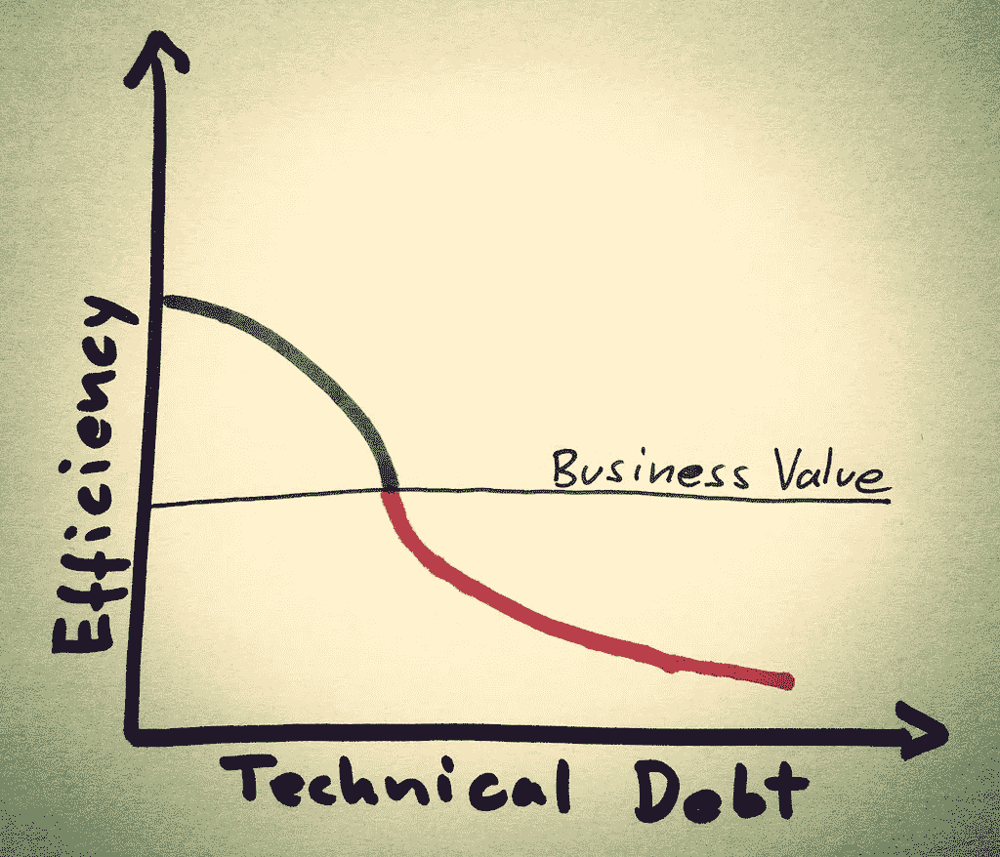

# 避免 ML 管道的技术债务

> 原文：<https://towardsdatascience.com/avoiding-technical-debt-with-ml-pipelines-3e5b6e0c1c93?source=collection_archive---------28----------------------->

## 在快速结果和高质量编码之间取得平衡。


机器学习中的技术债务可能很难管理。来源: [Unsplash](https://unsplash.com/photos/Olki5QpHxts)

好吧，首先让我们弄清楚:这篇文章不是为那些做一次性的孤立项目的人准备的，比如参加 Kaggle 竞赛或者在 Jupyter 笔记本上做爱好项目来学习交易。抛弃、快速、肮脏的脚本代码的价值是显而易见的——并且有它的位置。相反，它是为在*生产*环境中工作的 ML 从业者设计的。因此，如果你在一个 ML 团队中工作，在生产 ML 模型的同时努力管理技术债务，这一个适合你。

# 典型的工作流程



*图片来源:* [*迈克尔·迈耶上 Flickr*](https://www.flickr.com/photos/michael_mayer/8701850930) *|找到归属许可* [*这里*](https://creativecommons.org/licenses/by/2.0/)

这里有个前提:你是一名在初创公司/中小企业/企业工作的 ML/DL/AI 工程师/分析师/科学家。你的工作是从所有地方获取一堆随机数据，并产生价值。你是做什么的？您坐下来，以某种方式将数据传输到您的本地机器上，并且不可避免地要做一些类似以下的事情:

```
jupyter notebook
```

或者你可以去一个实验室，如果你喜欢并且你的团队的隐私规则允许的话。

下面是一个我以前看过很多次的故事——当然是伪代码。

```
import pandas **as** pd
import xyzlibraryforml***# CELL 1: Read***
df = pd.read_*("/path/to/file.*")
df.describe()*# INSERT HERE: a 100 more cells deleted and updated to explore data.****# CELL 2: Split***
train, eval = split_the_data()  *# basic**# INSERT HERE: trying to figure out if the split worked****# CELL 3: Preprocess***
*# nice, oh lets normalize*
preprocess(train)
preprocess(eval)*# exploring preprocessed data, same drill as before****# CELL 4: Train***
model = some_obfuscated_library.fit(train, eval)  *# not being petty* *# if youre lucky here, just look at accuracy. otherwise:****# CELL 5: Evaluate***
complicated_evaluation_methods(model)*# INSERT HERE: do this a 1000 times****# CELL 6: Export (i.e. pickle it)***
export_model()
```

你说完了，对吧？就是这样——嘣。测试集结果非常好。让我们把它交给运营部的人在生产中部署。午休和 Reddit 一整天！

好吧，我是不是太夸张了？**是**。对于一些企业来说，这是否非常接近事实？**也是的**。

# 那么，有什么问题呢？

问题是，上面的笔记本电脑是一个技术债务球，如果不及早剔除，它将继续增长。让我们来分析一下它出了什么问题:

# 没有朝着更大的方向前进

当您将可概括的逻辑放入无版本的、一次性的笔记本块中时，您的团队就无法利用它了。例如，从静态数据源加载/提取数据的逻辑。当然，现在使用`pd.read_json`很容易，但是如果格式改变了会发生什么呢？更糟糕的是，如果数据增长并被分割成多个文件，会发生什么？更糟糕的是，如果它不再适合内存会发生什么？如果你的同事遇到同样的问题，会发生什么——她可能会经历同样的循环，而你甚至不知道这是一个已经解决的问题。当然，所有这些问题都有解决方案，但是你会一直在你的本地笔记本上解决它们吗？

答案很可能是否定的([除非你是网飞或者其他什么](https://netflixtechblog.com/open-sourcing-polynote-an-ide-inspired-polyglot-notebook-7f929d3f447))。通常，合乎逻辑的做法是将加载提取到一个逻辑上独立的服务中。通过这种方式，您可以将实际的数据提取抽象出来，放到一个对每个人都透明的可维护层中。例如，这可能是某种形式的`feature store`,它将组织中所有不同的数据流收集到一个点，然后团队中的每个人都可以在定义的 API 中使用它。

这同样适用于上述脚本的预处理、训练和评估部分。

# 在本地构建逻辑(因此一次又一次)

就像上面的例子一样，当您编写代码来探索数据时，您会生成大量的好东西——可视化、统计数据框架、经过清理和预处理的数据等等。Jupyter 笔记本执行的随机、任意顺序确保了实现这些工件的路径永远消失在被覆盖的局部变量和自发的内核重启中。更糟糕的是，这种逻辑在代码本身的深处嵌入了复杂的、容易被覆盖的配置——这使得重新创建工件变得更加困难。

听着，我明白——我一直都这么做。数据争论是一个随机的、痛苦的过程，而且会很混乱。但是建立一些框架来跟踪您的数据探索管道将会带来巨大的回报。类似于评论你的代码，跟踪的最大受益者将是你自己。此外，如果这些工件和问题的迷你答案对每个人都是自动透明和清晰的，您的团队将会更快，并避免多余的工作。

# 不拥有部署

这本笔记本的最后一部分可能是最令人沮丧的。我真的不相信写那个笔记本的人的工作会以导出 ops 的模型而结束。这没有任何意义。

首先，`preprocessing_fn()`函数必须与它一起使用，否则 training-serve skew 将从一开始就破坏你的模型。第二，运营人员如何知道您在构建模型时采用了哪些假设？您是否要编写大量的文档，说明输入什么数据、应该如何预处理数据，以及在部署到端点时数据应该是什么形状？我的意思是，现在已经有了自动化的方法来实现这一点，所以拥有部署吧！

上述脚本中缺少的一个方面是忽略了对模型性能的度量。我认识的大多数数据科学家并不关心模型有多大，它为预测消耗了多少内存，以及它在部署中有多快/多高效。如果不满足最终应用程序的性能标准，模型就不会产生价值。同样，开发模型的人应该拥有其最终部署的所有权。

# 建议

解决上述问题的最简单的方法是开发一个框架，在这个框架中，ML 团队可以用可维护的、易于共享的代码来平衡一次性的探索性代码开发。如果您要这样做，您可能需要记住以下几点:

# 创建定义良好的接口(即分解成管道)

您的工作流的`split`、`transform`、`train`、`evaluate`、`deploy`组件是逻辑上独立的实体/服务。从具体的实现中抽象出 ML 工作流的单个组件。这可以通过定义面向对象风格的实际接口来实现，或者简单地确保您的 repo 具有某种形式的结构，便于每个人参与和扩展。这不一定一开始就是火箭科学，但它会有巨大的帮助。

这就是 ML 管道的概念发挥作用的地方:管道是定义一系列数据处理任务的抽象表示。在`pipelines`中思考将帮助你的团队在他们的工作流程中分离出逻辑实体，并让数据独立地流过它。这将不可避免地产生更健壮、可维护的代码库。此外，像这样定义 ML 管道可以确保您可以在新数据到来时自动对旧模型进行连续训练。但是，您还需要为此跟踪您的数据元数据(见下文)。

# 为你的 ML 元数据制定一个计划

你运行的每一个实验都会产生 ML 元数据:谁运行的，什么时候运行的，输入了什么数据，结果存储在哪里等等。请务必标出这些内容，并提供一种方便的方式来添加到该商店。重要的是要注意:我也不只是在谈论实验跟踪。有许多很棒的库可以帮助跟踪以模型为中心的元数据，例如度量等。然而，经常被忽视的是以数据为中心的元数据——尤其是当数据不断变化时。像数据版本控制、统计、可视化、随机分割时使用的种子之类的东西。应该有一种简单的方法来跟踪数据在开发过程中的各种路径。

# 确保您的工作负载可以在任何环境中运行

在一台机器上运行一个工作负载总是比在任意环境下运行相同的代码要容易。我知道 Docker 对于很多 ML 的人来说是无敌的，也是辛苦的，但是至少做一个`requirements.txt`加一个`__init__.py`！理想情况下，将您的代码容器化，并在某种形式的编排框架上运行实验。现在做这一步，当您扩展和自动化整个事情来处理更大的数据时，将会省去很多麻烦。

# 不要将部署与培训分开

这可能是迄今为止最没脑子的建议了。20 年前，端到端所有权导致了整个 DevOps 革命，这在 ML 开发中也没有消失。提供一个平滑的机制来将一个训练好的模型转移到一个端点，并且确保操作人员和你的 ML 开发人员坐在同一个房间里(并不总是这样)。制定流程，让每个人都了解生产的最终目标。尽可能实现自动化。

# 不要在可重复性和可追溯性上妥协

你知道当人们开始用 Python 编码，然后转向 C++或 Java 时，他们不理解像指针和静态类型这样的概念吗？他们认为:“给变量一个类型有什么用，**我**知道它是什么，为什么我**被迫**这么做？”很抱歉打断你，但是指针和静态类型有一个目的——了解它们可以保护你的代码免受你自己的错误，并确保高质量的健壮输出。终极灵活性可能是一件坏事，尤其是对于那些容易犯懒惰错误的开发人员(像我一样)。

在 Jupyter 笔记本中也发生了非常类似的事情——以任何顺序运行任何任意代码的自由带来了自由，但也让你失去了非常重要的可重复性和可追溯性的概念，这是任何健壮的、生产就绪的工程学科的两个基石。请至少确保您的笔记本是自上而下可执行的，并且是可重复的。杂乱无序的 Jupyter 笔记本应该受到像代码审查会议上这样的长篇大论的惩罚。

确保这两种特性的一种方法是从实现中提取代码的`settings` 。这就引出了我的下一个观点…

# 将配置与实施分开

将配置与实际代码实现分开绝对是一件痛苦的事情。然而，这是另一种“长期回报”的事情。[我们在](https://blog.zenml.io/declarative_configs_for_mlops/)之前已经写过了，但是总结一下:分离你的配置允许你自动化重复的任务，增加结果的可预测性，并且确保可再现性。理想情况下，配置应该被视为代码、版本和维护。管理这一点的一个好方法是将代码写成管道——我已经[写了很多关于管道的内容](https://blog.zenml.io/technical_debt/),并且在这篇 [Neptune.ai 博客文章](https://neptune.ai/blog/reducing-pipeline-debt-great-expectations)中受到了极大的启发。

# 结论

许多组织中的 ML 从业者都被强烈地激励着快速取胜以产生早期的结果。然而，这导致了累积的技术债务，随着时间的推移，最终会减慢团队的速度。解决方案是从一开始就遵循适当的软件工程原则，并依靠指南在快速结果和高质量软件开发之间取得平衡。

以上想法是我在过去 4 年中在生产中部署模型时学到的非常个人的经验。它们绝不是一个详尽的列表，欢迎您将它用作基准测试您的产品架构的样板，或者作为设计您自己的产品架构的蓝图。如果你正在寻找一个实用的教程

我们将这些因素作为我们开源 MLOps 框架 [ZenML](https://github.com/maiot-io/zenml) 的指导原则。所以在你从头开始之前，请在 GitHub 上查看 ZenML:[https://github.com/zenml-io/zenml](https://github.com/maiot-io/zenml)，如果你喜欢你所看到的，别忘了给我们一颗星！