# 每个数据分析师都应该知道的出色 AWS-Quicksight 视觉效果

> 原文：<https://towardsdatascience.com/awesome-aws-quicksight-visuals-every-data-analyst-should-know-e4e9302b2711?source=collection_archive---------9----------------------->

## 使用这些视觉效果创建引人入胜的仪表板

图片由 [MBWA 公关](https://www.flickr.com/photos/mbwa_pr/)在 [Flickr](https://www.flickr.com/photos/mbwa_pr/8811776454) 上发布

答几乎每个以分析数据为生的人都会使用这样或那样的可视化工具。有数百种可视化数据的工具。无论是在带有 Matplotlib、Plotly 和 Bokeh 等包的 Python 编程环境中，还是在带有 SAP Lumira、Tableau 甚至 Excel 等内置软件的环境中，我们拥有的工具都比我们可能使用的工具多。

那你怎么选择最好的呢？事实上，几乎所有这些都是非常好的实现。您的选择取决于您的用例。

到目前为止，我在大多数用例中使用 Tableau，因为在服务器上共享仪表板便于终端用户使用。但是当我们需要创建某些类型的视觉效果时，它却缺乏能力。例如，您将不得不经历一个乏味的仪式来创建甚至简单的流程图。祝你好运，记住最后所有的聚合和数据乘法。

在这种情况下，Plotly 当然会有所帮助，但是你必须忍受为每一个需要的可视化对象从头创建一个好的数据框架的痛苦。

我最近遇到的一个工具消除了上述几个限制。

它将众多可视化软件的精华结合到一个基于云的商业智能服务中。它叫做 **Quicksight** ，作为亚马逊网络服务(AWS)的一项服务提供。您可以在以下文档中了解更多信息:

[亚马逊 QuickSight —商业智能服务—亚马逊网络服务](https://aws.amazon.com/quicksight/)

在 Quicksight 上工作了几天后，我发现那里有几个作为标准提供的可视化，否则在其他工具中需要花费很长时间才能构建。

对于不熟悉 AWS 和 Quicksight 的人来说，有大量的[文档](https://docs.aws.amazon.com/quicksight/index.html)可供使用。如果您愿意，在我们进入视觉效果之前，您可以快速浏览一下如何在 Quicksight 中连接数据的概述:

[使用新数据源创建数据集— Amazon QuickSight](https://docs.aws.amazon.com/quicksight/latest/user/creating-data-sets-new.html)

在这篇文章中，我将带你浏览我非常喜欢在 Quicksight 中使用的 7 个视觉效果，这是我最喜欢的倒计时。我为什么喜欢他们？因为:

*   数据准备的简单性
*   提供给最终用户的直观性
*   使用频率(基于我的使用案例)

我将带您了解所需的基本数据结构以及结果可视化。有了这些视觉效果的知识和组合，你也可以创建引人入胜的仪表板！

## 7.瀑布图

当我们需要显示一段时间内值的累积增加或减少时，可以使用瀑布图。虽然有许多工具可以创建这些图表，但 Quicksight 提供了最简单的一种。考虑公司收入和费用的下列累积数据:

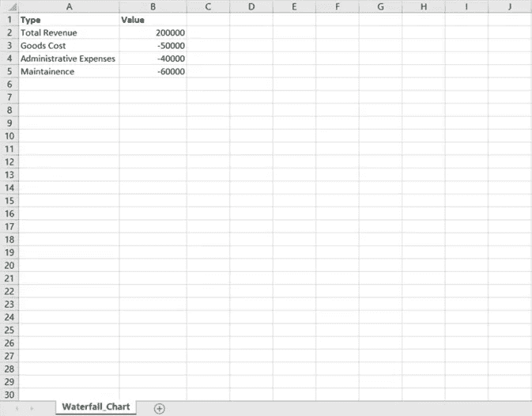

作者截图

你需要做的就是在 Quicksight 中导入 Excel 数据。数据导入后，从左下角的*视觉类型*选择区域选择瀑布图。

你会看到一个图表的空白区域和一个叫做*油田井*的区域。

创建瀑布图所需的油田井有:

*   种类
*   价值
*   分解(可选)

将*字段列表*中的**类型**和**值**列分别拖动到*和*字段井的类别和值中。

好了，图表准备好了！

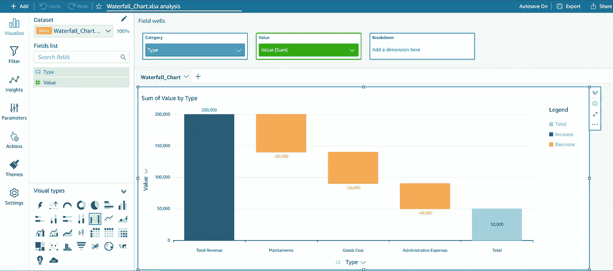

作者截图

## 6.漏斗图

漏斗图基本上用于显示任何业务流程的流程，最常用于销售。因为。例如，在这些图表的帮助下，我们可以看到在流程的每个步骤中用户数量的下降(这给出了特有的漏斗形状)。

考虑以下图书销售过程的累积数据，从估计的市场规模到售出的总册数:

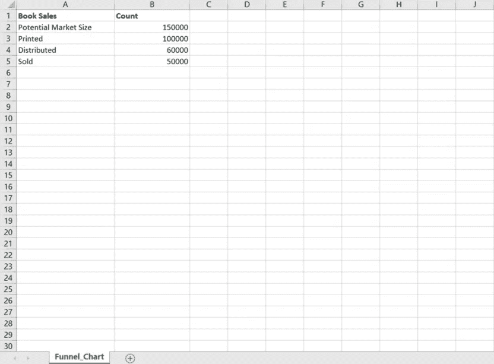

作者截图

将数据导入 Quicksight 后，从视觉类型部分选择漏斗图。所需的油田井有:

*   分组依据
*   价值

将字段列表中的**图书销售**和**计数**列拖至字段井的类别和值中。

作者截图

## 5.树形地图

在我们到目前为止经历了 2 个简单的图表之后，让我们走向更复杂和有趣的图表。一种这样的视觉类型是树形图，这是我在几个用例中使用的图表之一。它用于以嵌套矩形的形式表示分层数据。这种图表中的节点以大小和颜色两个维度进行分类，为我们提供了一个非常紧凑和数据丰富的可视化。

考虑以下由产品项目、数量和总价组成的虚拟数据:

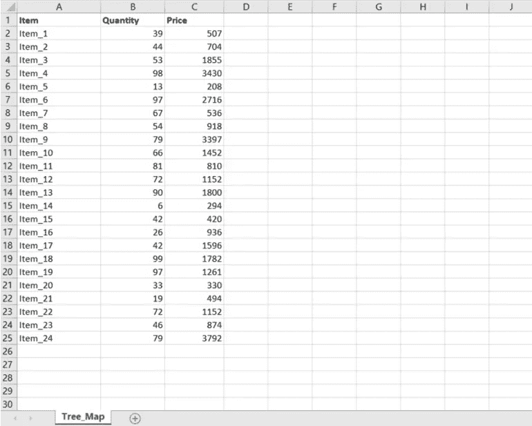

作者截图

数据导入后，从视觉类型部分选择树形图。所需的油田井有:

*   分组依据
*   大小
*   颜色

将字段列表中的**项目、数量、**和**价格**栏分别拖动到字段井的分组依据、大小和颜色中。

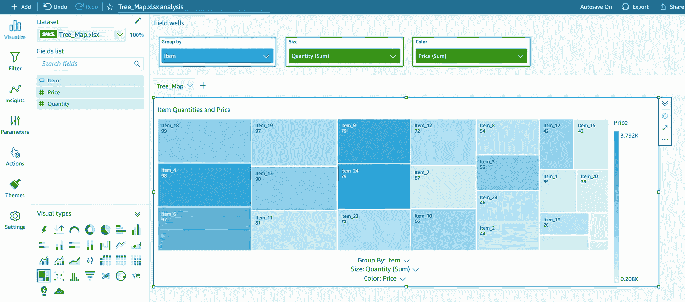

作者截图

正如您所看到的，图中的每个图块根据数量和价格来量化数据中的给定项目，数量和价格分别用图块的大小和颜色来表示。当分类涉及两个维度时，这使得它成为一种非常方便的视觉类型。

## 4.热图

这是一种数据可视化技术，以颜色显示事件的大小。通常，颜色强度的变化用于向最终用户提供关于事件如何聚集的明显视觉提示。因此，热图的一个常见用途是可视化自然环境现象。此外，它还用于可视化流体流动动力学、表面变形等。

考虑到这一点，有什么数据比城市的温度数据更适合可视化为热图呢？在本例中，我从[这里](https://www.meteoblue.com/en/weather/archive/export/berlin_germany_2950159?daterange=2021-03-26%20-%202021-04-06&domain=NEMSAUTO&params%5B%5D=temp2m&min=2021-04-02&max=2021-04-09&utc_offset=2&timeResolution=hourly&temperatureunit=CELSIUS&velocityunit=KILOMETER_PER_HOUR&energyunit=watts&lengthunit=metric&degree_day_type=10%3B30&gddBase=10&gddLimit=30)下载了柏林的天气数据，并做了一些数据工程处理，以获得日期、一天中的时间和温度(以摄氏度为单位)。因此，在 Quicksight 中导入的最终数据如下所示:

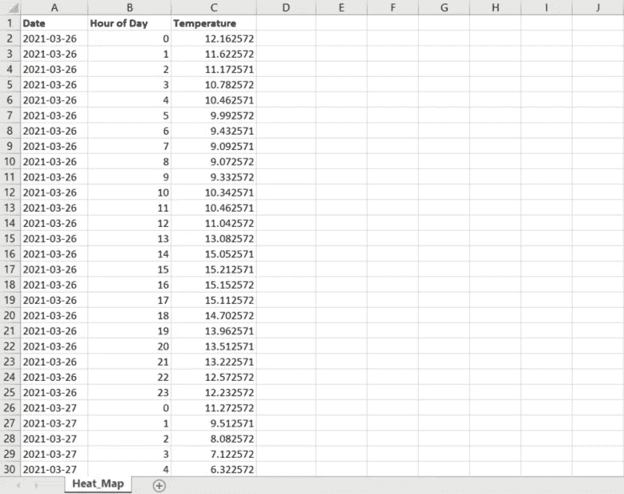

作者截图

数据导入后，从视觉类型部分选择热图。所需的油田井有:

*   行
*   列
*   价值观念

将*字段列表*中的**日期、一天中的小时、**和**温度**列分别拖动到字段井的行、列和值中。

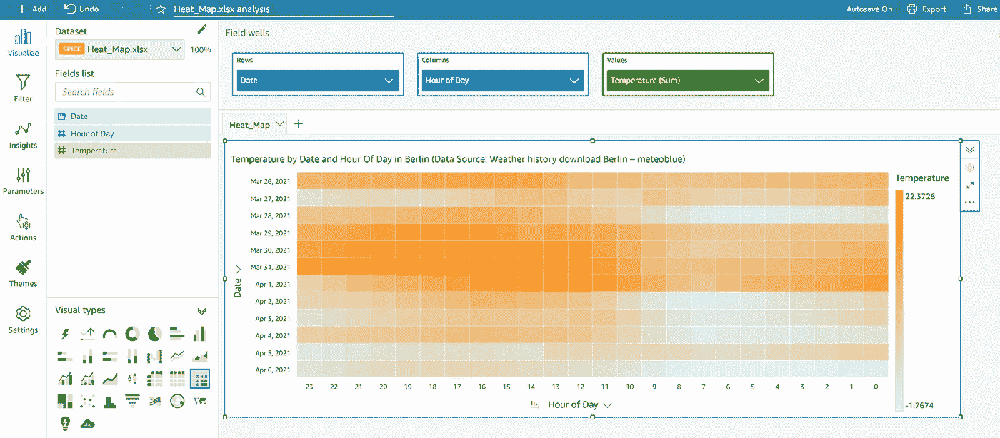

作者截图

瞧啊。几秒钟之内的惊人热图。这绝对是我最喜欢的可视化类型之一，但是还有更多的。

## 3.地图上的点

如今这是一个相当普遍的可视化。它被用来可视化国家的人口，疫情疫情，空中交通路线，供应链，等等。很有可能，无论你在哪个行业工作，你都很可能会在你的公司仪表盘中使用或看到这种视觉类型。因此，将它作为标准的可视类型才是可行的。

在 Quicksight 中，这种实现称为地图上的点，它可以理解基于纬度、经度、城市名称甚至邮政编码的数据！(尽管根据您所在的地理位置，您可能需要等待它的上市，但它刚刚在欧洲上市)。

为了演示它是如何工作的，我使用了来自德国城市数据库的人口数据，我在这里找到了。

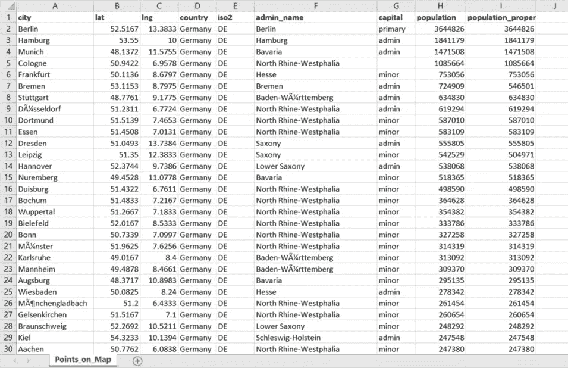

作者截图

导入数据后，从视觉类型部分选择地图上的点。所需的油田井有:

*   地理空间(纬度、经度、城市名称等。)
*   大小
*   颜色

将*字段列表*中的 **lat & lng** 列拖到地理空间中，并将**人口**拖到 Size 字段中。如果需要指示另一个参数，例如人口密度，您也可以使用颜色。

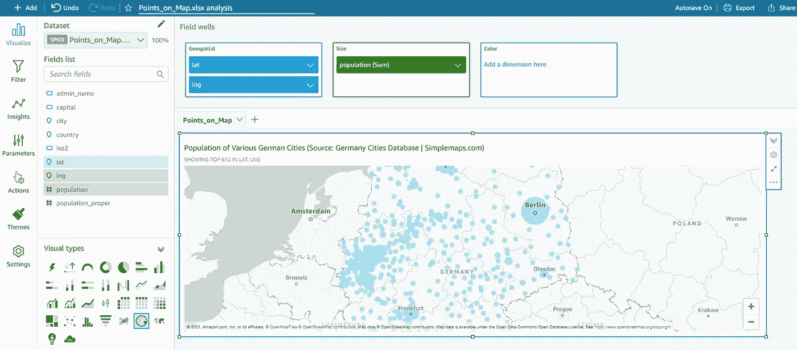

作者截图

现在你知道了。有一个惊人的地图可视化是如此容易！

## 2.词云

词云被用作文本数据的可视表示，其可以或可以不按照任何特定的顺序或次序。也是一个随着社交媒体和文本分析领域的兴起而变得非常普遍的图表。它们特别受欢迎，可以直观地显示所使用的词频，例如标签、关键词，甚至可以分析网页或书籍中的文本。

有许多在线工具可以免费构建单词云。但是 AWS 环境中的这种实现使它变得强大。您可以使用 python 分析数据，并创建输出数据集以便在 Quicksight 中导入。这为高度灵活的文本可视化提供了广泛的可能性！

为了在这里进行演示，我创建了一个虚拟数据集，其中包含来自一项调查的成员及其母语列表:

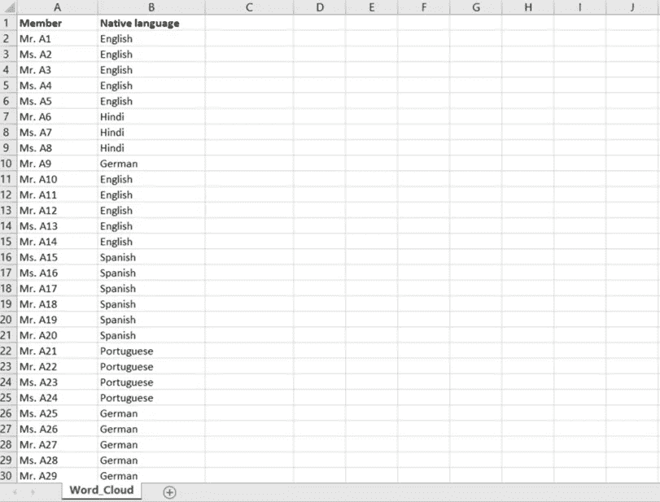

导入数据后，从视觉类型部分选择单词 Cloud。所需的油田井有:

*   分组依据
*   大小

将*字段列表*中的**本地语言**列拖入分组依据。它会根据计数自动生成云！如果数据的结构不同，字数在不同的列中，也可以使用大小指示器。

我唯一怀念的是没有一个色域，用不同的颜色显示不同的单词。这将使可视化更加吸引人(我真的希望在未来的更新中实现这一点)。

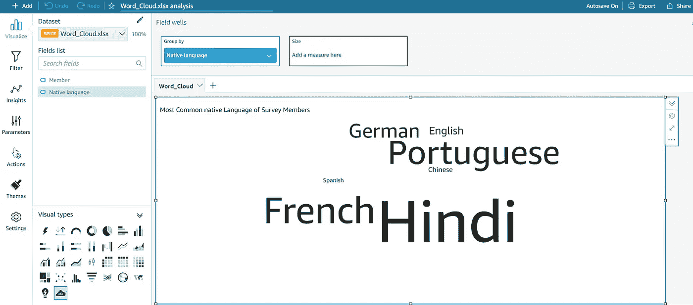

作者截图

## 1.桑基图

最后，我最喜欢使用的视觉类型，因为它灵活、直观。桑基图本质上是流程图，其中流程表示与流量(或速率，或流量中的任何其他度量)成比例。

这使得 Sankey 图成为业务运营中的能量流、材料流、网络、流程链等用例中的绝对宝藏。

到目前为止，它们缺乏普遍性的唯一障碍是缺少一个简单的实现。我们可以在舞台上做到，但只能用一千种迂回的方法。或者我们可以自己编写这样的代码。所有这些都可以通过迄今为止我在商业智能软件中发现的最简单的实现来避免。

考虑下面的数据(来自德国的能源流程图— 2018，我在这里找到了):

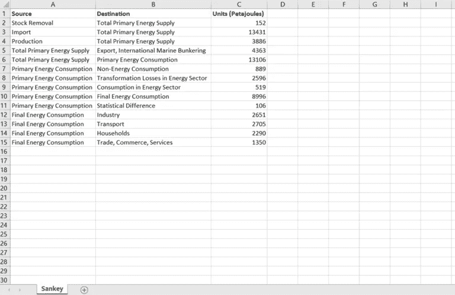

作者截图

所有你需要的是一个来源，目的地，和两者之间的流量。让我们看看这是如何工作的。

导入数据后，从视觉类型部分选择 Sankey 图。所需的油田井有:

*   来源
*   目的地
*   重量

将*字段列表*中的**源、目的、**和**单位(千万亿焦耳)**列分别拖到字段井中的源、目的和重量中。

几秒钟内，你就拥有了魔力！基于数据的流的可视化表示。实现会根据给定的数量自动调整自己，这意味着值中的任何错误都会使图表看起来有点笨拙(例如，如果流出的比流入的多)。

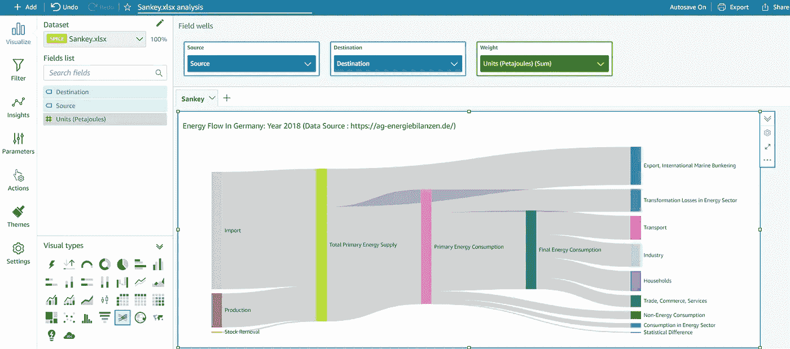

作者截图

其实现的简单性使它成为这个列表中最好的可视化工具！

这是 AWS Quicksight 中 7 种视觉类型的列表！有了这些以及更多提供的和持续升级的组合，我相信你已经可以成为一个令人惊叹的视觉故事讲述者了！你喜欢哪一个？是只有我，还是你也有一些经常使用的可视化类型？我肯定想知道和学习更多。欢迎在评论中告诉我！