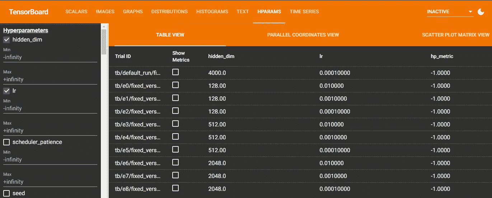
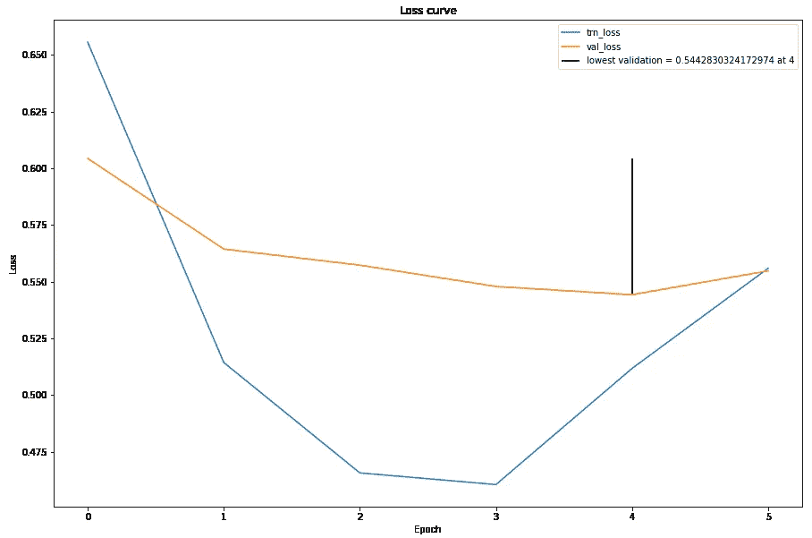
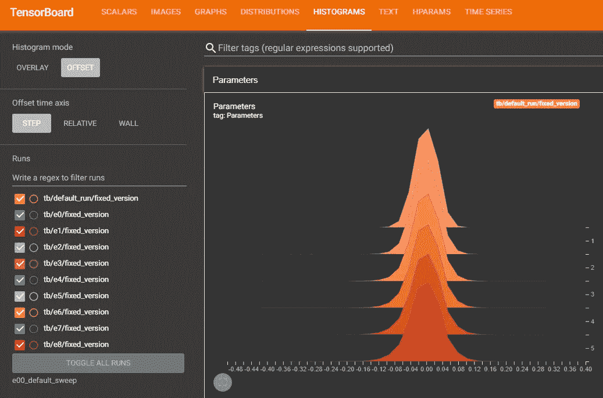
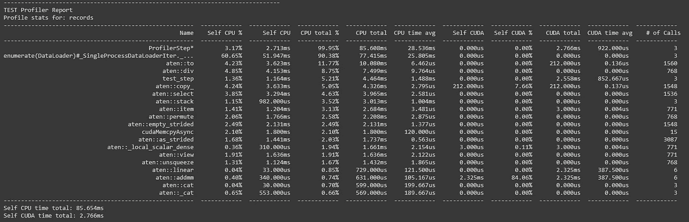
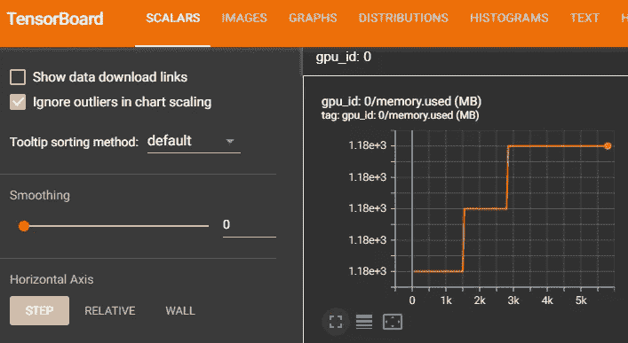
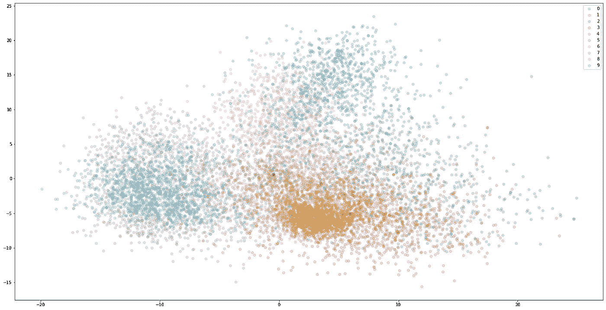

# 真棒 PyTorch 闪电模板

> 原文：<https://towardsdatascience.com/awesome-pytorch-lightning-template-485a75c2f47e?source=collection_archive---------13----------------------->

## TLDR:py torch Lightning 模板，包含了很多特性。[链接到谷歌实验室这里](https://colab.research.google.com/drive/17CtsJtGCjp4YkykIpIoY0Kdb9nCadeFT?usp=sharing)。

*认知状态:这个模板是几周学习的结果，而不是多年的经验。把这当成你朋友的课堂笔记，而不是老师的讲义。为了让你知道我是多么的不合格和固执己见，只要看看我没能解决的问题列表就知道了。如果你知道如何解决它们，请告诉我。*

可怕的闪电照片。Marc Szeglat 在 [Unsplash](https://unsplash.com/s/photos/lightning-fire?utm_source=unsplash&utm_medium=referral&utm_content=creditCopyText) 上拍摄的照片

你是否曾经困惑过 [PyTorch](https://pytorch.org/) 的最佳实践是什么？比如，什么时候把你的张量发给 GPU？或者什么时候打电话给 zero_grad？或者，您是否尝试过做一些新的事情，比如添加一个类似 SimCLR 的管道，并且因为写得太差而不得不重写大部分代码？又或许，你在想别人的管道是什么样的？他们的效率是 100%的吗？有哪些你一直缺失的简单小技巧和窍门？也许不是你，但我有。PyTorch 闪电 (PL)前来救援。它基本上是一个关于你的代码应该如何构造的模板。

PL 在他们的文档中有很多特性，比如:

*   [测井](https://pytorch-lightning.readthedocs.io/en/latest/common/loggers.html)
*   [检测坡度](https://pytorch-lightning.readthedocs.io/en/latest/common/debugging.html#inspect-gradient-norms)
*   [剖析器](https://pytorch-lightning.readthedocs.io/en/latest/advanced/profiler.html)
*   等等。

他们还有很多模板，例如:

*   最简单的例子叫做[对无聊模型](https://github.com/PyTorchLightning/pytorch-lightning/blob/master/pl_examples/bug_report_model.py)进行调试
*   [用于快速成型的划痕模型](https://pytorch-lightning.readthedocs.io/en/latest/starter/rapid_prototyping_templates.html)
*   [基本例子](https://github.com/PyTorchLightning/pytorch-lightning/tree/master/pl_examples)像 [MNIST](https://github.com/PyTorchLightning/pytorch-lightning/blob/master/pl_examples/basic_examples/simple_image_classifier.py)
*   类似[生成性对抗网络](https://github.com/PyTorchLightning/pytorch-lightning/blob/master/pl_examples/domain_templates/generative_adversarial_net.py)的高级例子
*   甚至更多的东西在 PL [螺栓](https://www.pytorchlightning.ai/bolts) ( [github](https://github.com/PyTorchLightning/lightning-bolts) )

问题是所有这些例子都很简单。这对于演示或作为模板来说非常好。但是缺少一个更完整的例子来展示所有这些特性是如何集成的。尤其是对于深度学习领域的第一个编码项目的人来说，这就是:

# 模板

**点击此处链接至 Google Colab。**

# 特征

## 记录

[张量板](https://pytorch.org/docs/stable/tensorboard.html) HPARAMS 选项卡。出于某种原因， [hp_metric](https://pytorch-lightning.readthedocs.io/en/stable/extensions/logging.html#logging-hyperparameters) 不工作，我无法修复它 T_T(黑暗模式 ftw！).(*图片作者*)。

*   记录到 [TensorBoard](https://pytorch.org/docs/stable/tensorboard.html) 和 [stdout](https://en.wikipedia.org/wiki/Standard_streams) 用于冗余(这是我自己做的，^^).我还是不能什么都抄。一些信息只放入标准输出。这是一个问题，因为如果您使用超级计算集群，输出文件有难以描述的名称，这使得查找实验细节更加困难，特别是在遥远的未来。(我也在考虑登录到 [WandB](https://wandb.ai/site) )。
*   正确使用 [hp_metric](https://pytorch-lightning.readthedocs.io/en/stable/extensions/logging.html#logging-hyperparameters) 以便我们可以在 TensorBoard 中选择最佳的超参数(还没有运行 T_T。作为一个临时解决方案，它保存到一个. json 中，该文件将被加载到 pandas 数据帧中)。

显示最低验证的损失曲线。该图是[诊断培训](https://machinelearningmastery.com/learning-curves-for-diagnosing-machine-learning-model-performance/)中的问题的一种方式。(*图片作者*)。

*   [损失曲线](https://machinelearningmastery.com/learning-curves-for-diagnosing-machine-learning-model-performance/)(这是我自己做的^^).
*   整个脚本计时(如果你使用超级计算集群，用于估计 WALLTIME)(这是我自己做的，^^).
*   [检查坡度规范](https://pytorch-lightning.readthedocs.io/en/latest/common/debugging.html#inspect-gradient-norms)以防止[消失或爆炸坡度](https://en.wikipedia.org/wiki/Vanishing_gradient_problem)。

我们可以看到参数分布的演变(文字权重和偏差，而不是品牌)。(*图片作者*)。

*   将参数以直方图的形式记录到 TensorBoard(这是我自己做的，^^).记录单个参数可能不现实，每个时期会有数百万个参数。
*   [打印照明模块的摘要](https://pytorch-lightning.readthedocs.io/en/latest/common/debugging.html#print-a-summary-of-your-lightningmodule)。这是一个打印输出的例子，我不能重定向到 TensorBoard 文本。
*   [记录系统(硬件和软件)信息](https://raw.githubusercontent.com/PyTorchLightning/pytorch-lightning/master/requirements/collect_env_details.py)。

你能在这幅图中找到这只虫子吗？很好！现在发现我的模板中的错误，需要帮助！[玄阮](https://unsplash.com/@darthxuan?utm_source=unsplash&utm_medium=referral&utm_content=creditCopyText)在 [Unsplash](https://unsplash.com/s/photos/bug?utm_source=unsplash&utm_medium=referral&utm_content=creditCopyText) 上拍照。

## 排除故障

PyTorch 号侧写员报告。(*图片作者*)。

*   [剖析器](https://pytorch-lightning.readthedocs.io/en/latest/advanced/profiler.html#pytorch-profiling) ( [PyTorch](https://pytorch.org/docs/master/profiler.html) )找出哪些层/操作是一直在窃取你的时间和内存的瓶颈。请注意，这会减慢速度。差很多！因此，在进行超参数调整之前，请务必关闭此功能。
*   [健全性检查](https://pytorch-lightning.readthedocs.io/en/latest/common/debugging.html#set-the-number-of-validation-sanity-steps)是默认开启的功能。很高兴知道这个存在。(我是吃了苦头才知道的)

GPU 内存日志。为什么会涨？(*图片作者*)。

*   有两种方法来监控 GPU。第一个只是[监控内存](https://pytorch-lightning.readthedocs.io/en/latest/common/debugging.html#log-gpu-usage)，而第二个可以[监控多个统计数据](https://pytorch-lightning.readthedocs.io/en/latest/extensions/generated/pytorch_lightning.callbacks.GPUStatsMonitor.html#pytorch_lightning.callbacks.GPUStatsMonitor)。我的模板就用第一个。
*   有两种方法可以缩短纪元。第一种是通过[限制批次数量](https://pytorch-lightning.readthedocs.io/en/latest/common/debugging.html#shorten-epochs)。而第二个是 [fast_dev_run](https://pytorch-lightning.readthedocs.io/en/latest/common/debugging.html#fast-dev-run) ，它限制了后台的批处理数量。我的模板直接调用限制参数。
*   [对数据子集进行模型过拟合](https://pytorch-lightning.readthedocs.io/en/latest/common/debugging.html#make-model-overfit-on-subset-of-data)

(错误:探查器与缩短时期冲突。)

想象一下这崎岖不平的地形。格拉汉姆·斯潘塞在 [Unsplash](https://unsplash.com/s/photos/rugged?utm_source=unsplash&utm_medium=referral&utm_content=creditCopyText) 拍摄的照片。

## 最佳化

*   [提前停止](https://pytorch-lightning.readthedocs.io/en/latest/common/early_stopping.html)因为当模型已经收敛时，我们不要浪费资源。
*   [渐变裁剪](https://pytorch-lightning.readthedocs.io/en/latest/advanced/training_tricks.html#gradient-clipping)
*   说到优化器，我过去只是简单地使用 [Adam](https://arxiv.org/abs/1412.6980) ，使用 [ReduceLROnPlateau](https://pytorch.org/docs/stable/generated/torch.optim.lr_scheduler.ReduceLROnPlateau.html) ，然后就到此为止(我甚至不为 betas 优化)。但这让我晚上睡不着觉，因为我总是怀疑自己，怀疑自己是否错过了巨大的进步。我知道这是一个非常活跃的研究领域。但是另一种选择是优化器超参数的维数灾难。这就是 PL 拯救我的地方。现在，我可以简单地将 PL 视为一个行业标准，使用所有提供的优化工具，睡得稍微轻松一些。这里有两个工具:[学习率查找器](https://pytorch-lightning.readthedocs.io/en/latest/advanced/lr_finder.html)，和[随机加权平均](https://pytorch.org/blog/pytorch-1.6-now-includes-stochastic-weight-averaging/)。

激活分析:MNIST MLP 隐藏层激活的前 2 个主成分。(*图片作者*)。

## [保存和加载重量](https://pytorch-lightning.readthedocs.io/en/latest/common/weights_loading.html)

*   [保存最佳模型](https://pytorch-lightning.readthedocs.io/en/latest/common/weights_loading.html#automatic-saving)和[测试它](https://pytorch-lightning.readthedocs.io/en/latest/common/test_set.html)。
*   一旦你完成了你的超参数搜索，你可能想要在会话结束后[加载一个检查点](https://pytorch-lightning.readthedocs.io/en/latest/common/weights_loading.html#checkpoint-loading)来对最佳模型做类似[残差分析](https://www.qualtrics.com/support/stats-iq/analyses/regression-guides/interpreting-residual-plots-improve-regression/)或[激活分析](https://arxiv.org/pdf/1506.02078.pdf)(看上面漂亮的图)。
*   (跟踪训练期间激活如何变化可能也有帮助，但我没有在这个模板中实现这一点。)

## 超参数调谐:

*   在我的 Google Colab 模板中有一个网格搜索的例子。是的，我知道[随机搜索更好](https://dl.acm.org/doi/pdf/10.5555/2188385.2188395)，但这只是为了演示。
*   出于某种原因，我无法让 TensorBoard 上的 hp_metric 工作，所以我做了一个. json 来解决这个问题。还包括一个代码片段来聚合。来自不同实验运行的 json 文件。
*   我还需要一个超参数优化器库，实现良好的算法，从离线文件读取和写入(因为我正在使用 HPC)。目前为止最好的解决方案是 [Optuna](https://optuna.org/) ，因为离线很容易[并行化](https://optuna.readthedocs.io/en/stable/tutorial/10_key_features/004_distributed.html#) [。](https://optuna.readthedocs.io/en/stable/tutorial/20_recipes/001_rdb.html)

# 从这里去哪里？

显然，我在谷歌上的模板还没有检查过。但是你可能想在 [Bolts](https://www.pytorchlightning.ai/bolts) 中检查现有的模型，并为你自己的数据集制作你自己的 [LightningDataModule](https://pytorch-lightning.readthedocs.io/en/latest/extensions/datamodules.html) 。祝你好运！

# 参考

所有的图片，除了标题中注明的，都是我的。