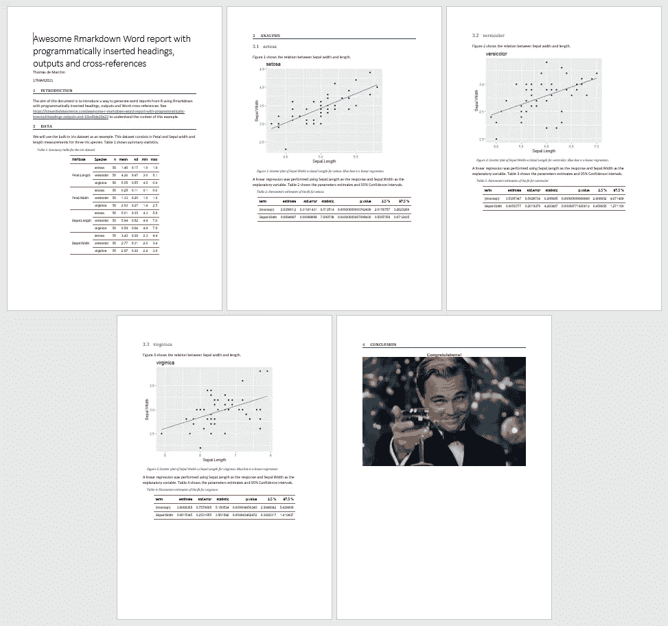

# Awesome R Markdown Word 报表，带有以编程方式插入的标题、输出和交叉引用

> 原文：<https://towardsdatascience.com/awesome-r-markdown-word-report-with-programmatically-inserted-headings-outputs-and-19ad0de29a22?source=collection_archive---------18----------------------->

## 如何在 Word 中自动生成报告，以便专注于解决具有挑战性的问题

*Thomas de March in(pharm Alex 统计和数据科学高级经理)和 Milana Filatenkova(pharm Alex 统计和数据科学经理)*


照片来自[马丁·范登赫维尔](https://unsplash.com/@mvdheuvel)在 [Unsplash](https://unsplash.com/photos/8EzNkvLQosk)

**什么是 R:** R 语言被统计学家和数据挖掘者广泛用于开发数据分析软件。

**什么是 R Markdown** : R Markdown 是一个工具，旨在帮助使用 R 创建可再现的动态报告。R Markdown 文档是以 Markdown(一种易于编写的纯文本格式)编写的，包含大量嵌入式 R 代码。

**为什么使用 R and R 降价**:作为数据科学家，我们经常需要重复进行分析(例如:分析方法的验证)。自动化这样的例程可能是一种很好的方法，可以减少在执行大量重复任务时经常出现的人为错误的可能性，并将资源从枯燥的复制/粘贴类型的练习转移到具有挑战性的问题解决上。

**本帖面向谁:**本帖面向希望使用 R Markdown (Rmd)脚本创建 Word (docx)文档并希望以编程方式插入标题、输出和 Word 交叉引用的 R 用户。

**不包括的内容:**这篇文章不会介绍 R and R 降价。如果您刚刚开始使用这些工具，有许多优秀的教程可供参考。另外，安装 R 和 MS-Word 是继续本教程的先决条件。

当用 R 生成报告时，PDF 和 HTML 给出了更好的结果。但是，在职业语境中，Word 是无法避免的。

有几个包可以用来从 r 生成 Word 文档，最流行的是 *rmarkdown* 。Markdown 的美妙之处在于它使纯文本文档(代码)可读性更好，没有杂乱的标签。另一方面，缺点之一是 Word 的功能非常有限。例如，不能调整样式、添加表格和图表标题以及使用单词交叉引用。在其他旨在自动生成报告的软件包中，值得一提的是*官员*。这个软件包提供了许多在 *rmarkdown* 中没有的 Word 功能。但是，*官*码非常难读。在*官*里，单词交叉引用也不行。还值得一提的是，一些 R 包已经开发出来管理表格，数字编号和标题，如*标题*或*预订。*但是，这些软件包输出常规文本，无法生成动态标题和引用(即，您无法点击这些引用或生成图表目录)。后者带来了交叉引用的问题:当内容更新时，引用保持静态。

最后，让我们提一下最近令人敬畏的 *officedown* 包，它将一些 *officer* 特性引入 R Markdown 文档。 *officedown* 的一个关键特性是为引用和标题添加 Word 计算字段的选项。换句话说，这是第一个支持真正单词交叉引用的 R 包！

最后，关于 R 生成的输出(图、表……)在报告中的出现——使用 *rmarkdown* ，可以通过编程将它们插入 Word 报告中，这实际上是 *rmarkdown* 包的中心目的。但是，如果您事先不知道报告将包含多少表格、数字和章节，该怎么办呢？一个典型的例子是对多个属性执行重复分析的脚本或应用程序。让我们设想这样一种情况，当用户选择上传具有任意数量属性的数据，5、10、20、100……在这种情况下，为了以编程方式从 R 中插入标题和输出，解决方案是在 *rmarkdown* 中设置 chuck 选项‘results = " asis’”。该选项将使用循环的*从 R 创建 R 降价代码。*

那么，这篇文章的目的是什么呢？嗯，即使有可能以编程方式插入输出和标题，并通过 *officedown* 包获得正确的单词交叉引用，我也从未设法使这两者一起工作……当我试图在循环的*中使用交叉引用时，它从未产生想要的输出(引用不起作用，图形重复……)。我猜这个问题会在 *officedown、*的未来版本中得到解决，但我就是等不及了。我需要为我的客户完成这项工作。然后，我花了很多时间在互联网上寻找解决办法，并提出了一些解决方案，最终完成了它！我并不认为我的方法是自动编译功能 Word 报告所独有的，当然还有其他方法可以达到同样的目的。这里的困难是文档的缺乏和许多与 Markdown 相关的 R 包的不成熟。这篇文章是我尝试与大家分享我的发现，这样你就不会迷失在无休止的试错过程中，试图从你的 Rmarkdown 中得到一个好的 Word 文档。*

这是要点列表。

交叉引用由以下人员创建:

1.使用 *run_autonum* 函数创建书签

2.使用 *block_caption* 函数添加标题

3.文本中的引用是使用 *run_reference* 函数完成的

通过使用 *result='asis'* chunk 选项，以编程方式创建分析部分中的子部分。这个选项告诉 knitr 不要把文本输出打包在逐字的代码块中(就像普通的代码块一样)，而是“按原样”处理，输出原始的减价内容。在这些类型的块中:

1.使用*cat(' \ n # # heading name \ n ')*创建标题。请注意' \n '是使其工作所必需的。

2.绘图输出为:*打印(绘图)*

3.必须使用 *knit_print* 和 *cat* 功能输出弹性工作台

4.标题( *block_caption* )和引用( *run_reference* )需要封装到 *knit_print_block* 函数中

下面是一个例子。请注意，下面的代码以及它生成的 Word 报告和所有必要的文件都可以在我的 Github 上找到:[**https://github.com/tdemarchin/AwesomeRmarkdownWordReport**](https://github.com/tdemarchin/AwesomeRmarkdownWordReport)

# 结论

虽然直到最近，从 R 生成定性的 Word 报告仍然具有挑战性，但是已经开发了新的包，使得在业务环境中生成报告成为可能。本文中描述的方法证明了手工编写 R 输出的报告已经没有用武之地了。

# 例子

**输出**



自动生成 Word 报告的示例

**代号**

```
---
title: "Awesome Rmarkdown Word report with programmatically inserted headings, outputs and cross-references"
author: "Thomas de Marchin"
date: "17MAR2021"
output:
  word_document:
    reference_docx: "template.docx"
---```{r setup, include=FALSE}
# Let's setup a few things.rm(list=ls())
library(knitr)
library(officedown)
library(officer)
library(ggplot2)
library(tidyverse)
library(broom)
library(flextable)# set chunks defaults
knitr::opts_chunk$set(
  echo       = FALSE,
  message    = FALSE,
  warning    = FALSE
)# set flextable defaults
knitr::opts_chunk$set(echo = TRUE, fig.cap = TRUE)
  set_flextable_defaults(
  font.family = "Arial", font.size = 9, 
  theme_fun = "theme_vanilla",
  big.mark="", table.layout="autofit")

# formatting properties for specific paragraphs
centeredP <- fp_par(text.align = "center")```# IntroductionThe aim of this document is to introduce a way to generate word reports from R using Rmarkdown with programmatically inserted headings, outputs and Word cross-references. See [https://towardsdatascience.com/awesome-r-markdown-word-report-with-programmatically-inserted-headings-outputs-and-19ad0de29a22](/awesome-r-markdown-word-report-with-programmatically-inserted-headings-outputs-and-19ad0de29a22) to understand the context of this example.# DataWe will use the built-in iris dataset as an example.
This dataset consists in Petal and Sepal width and length measurements for three iris species.
Table `r run_reference("summaryTable")` shows summary statistics.```{r data, echo = FALSE}
# this chunk is a normal chunk compared to the next one# create the bookmark for the summary table
tab_num <- run_autonum(seq_id = "Table", pre_label = "Table ", bkm = "summaryTable")
# add the caption
block_caption(label= "Summary table for the iris dataset",
              style = "caption", autonum = tab_num)# create the summary table and output it with flextable()
summaryData <- iris %>% gather(value="value", key="Attribute", -Species) %>% group_by(Attribute, Species) %>% summarise(n=n(), mean=mean(value), sd=sd(value), min=min(value), max=max(value)) 
summaryData %>% flextable() %>% merge_v(j = "Attribute") %>% colformat_double(j=c("mean", "sd"), digits = 2)
```# Analysis```{r analysis, echo = FALSE, results = 'asis'}
# this chunk will programmatically generates Markdown code (results='asis')# split the data by specie to simulate different attributes to analyze, it is here 3 here but it could be any number.
data <- split(iris, iris$Species)
uniqueSpecies <- levels(iris$Species)# for loop
for(i in 1:length(uniqueSpecies)){

  dataSubset <- data[[uniqueSpecies[i]]]

  # print the heading
  cat("\n##", uniqueSpecies[i], "\n")

  # print an empty line
  cat("\n  <br>  \n")

  # print some text
  cat("Figure ")
  # reference the figure below (note the use of knit_print_run function in 'asis' chunks)
  knit_print_run(run_reference(paste0("pData", uniqueSpecies[i])))
  cat(" shows the relation between Sepal width and length.")

  # plot the data 
  pData <- ggplot(aes(x=Sepal.Length, y=Sepal.Width), data=dataSubset) + 
    geom_point() + geom_smooth(method='lm', se=F) + labs(title=uniqueSpecies[i])

  # output the plot (note the use of the print function in 'asis' chunks)
  print(pData)

  cat("\n") # sometimes you need to add this to make things work

  # Add the figure numbering and caption (note the use of the knit_print_block function in 'asis' chunks)
  fig_num <- run_autonum(seq_id = "Figure", pre_label = "Figure ", bkm = paste0("pData", uniqueSpecies[i]))
  knit_print_block(block_caption(paste0("Scatter plot of Sepal Width vs Sepal Length for ", uniqueSpecies[i], ". Blue line is a linear regression."),
              style = "caption", autonum = fig_num))

  # print some text
  cat("A linear regression was performed using Sepal.Length as the response and Sepal.Width as the explanatory variable. Table ")
  knit_print_run(run_reference(paste0("tabRegression", uniqueSpecies[i])))
  cat(" shows the parameters estimates and 95% Confidence intervals.")

  cat("\n") # sometimes you need to add this to make things work

  # do a regression generate the fit summary table
  regression <- lm(Sepal.Length ~ Sepal.Width, data=dataSubset)
  tabRegression <- tidy(regression)
  tabRegression <- cbind(tabRegression, confint(regression, level=0.95))

  # Add the table numbering and caption (note the use of the knit_print_block function in 'asis' chunks)
  tab_num <- run_autonum(seq_id = "Table", pre_label = "Table ", bkm = paste0("tabRegression", uniqueSpecies[i]))
  knit_print_block(block_caption(paste0("Parameters estimates of the fit for ", uniqueSpecies[i]),
              style = "caption", autonum = tab_num))

  # output the summary table (note the use of knit_print and cat functions in 'asis' chunks)
  tabRegression %>% flextable() %>% knit_print() %>% cat()

  cat('\n')
}# Add a page break
run_pagebreak()
```# Conclusion`r fpar(ftext("Congratulations!", fp_text(font.size = 12, bold = TRUE, color = "#C32900")), fp_p = fp_par(text.align = "center"))`
```

# 参考

[https://R Markdown . R studio . com/](https://rmarkdown.rstudio.com/)

[https://bookdown.org/yihui/bookdown/](https://bookdown.org/yihui/bookdown/)

[https://ardata-fr.github.io/officeverse/](https://ardata-fr.github.io/officeverse/)

[https://science loft . com/technical/programmably-create-new-headings-and-outputs-in-R Markdown/](https://scienceloft.com/technical/programmatically-create-new-headings-and-outputs-in-rmarkdown/)

[https://www.r-bloggers.com/](https://www.r-bloggers.com/)