# 解释 AWS 应用程序迁移服务架构

> 原文：<https://towardsdatascience.com/aws-application-migration-service-architecture-explained-2947348ef194?source=collection_archive---------12----------------------->

## 了解流程

图片由[杰洛特](https://pixabay.com/users/geralt-9301/?tab=latest)来自 [Pixabay](https://pixabay.com/)

AWS 应用程序迁移服务(AWS MGM)是一项提升和转移 AWS 服务，任何人都可以通过 AWS 管理控制台进行访问。在这篇文章中，我将回顾 AWS MGN 服务和网络架构。AWS MGM 是一种灵活、可靠、高度自动化的提升和移位解决方案。

塞缪尔·马丁斯的图片

您可以使用它来帮助简化、加快和降低将应用程序迁移到 AWS 的成本。您还可以使用 AWS NGN 将物理、虚拟或云服务迁移到 AWS，而不会出现兼容性问题、性能问题、中断或长时间切换窗口。您可以从运行受支持操作系统的任何源基础架构中迁移应用程序和数据库。这包括 Oracle 和 SQL server 等常见数据库、SAP 等任务关键型应用程序以及自主开发的应用程序。AWS MGN 支持最常见的 windows 和 Linux 操作系统，并在数据块级别持续复制它们的数据。

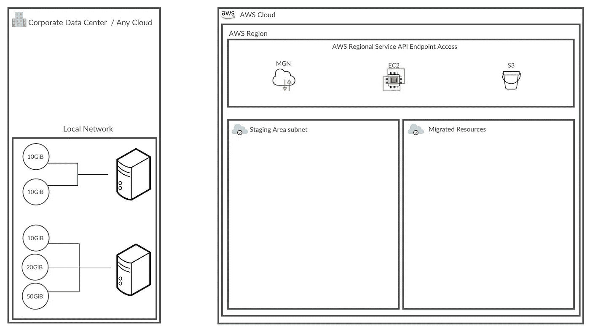

塞缪尔·马丁斯的图片

左侧是源环境。它可以包括物理、虚拟或云服务器的组合。在此示例中，源环境有两台服务器，其中两个磁盘连接到顶层服务器，三个磁盘连接到底层服务器。在右侧，您可以看到服务器将被迁移到的 AWS 区域。在本例中，已经定义了子网。

首先，在源服务器上安装 AWS 复制代理。代理可以以无人值守的方式安装，不需要重新启动。

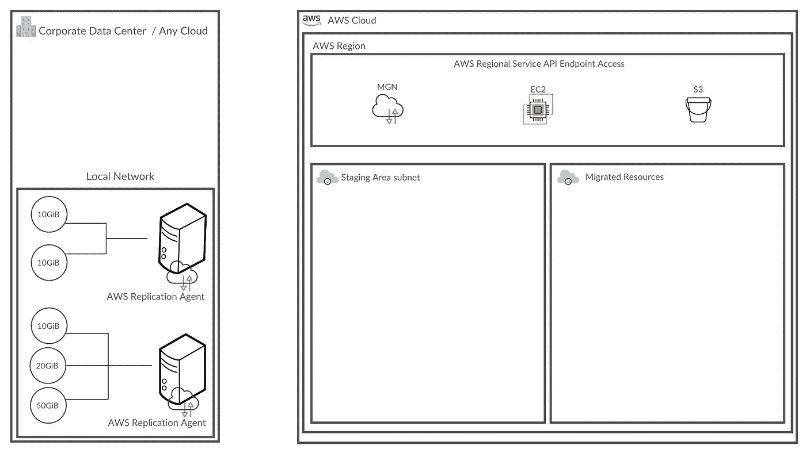

塞缪尔·马丁斯的图片

安装时，代理会对使用 TLS 1.3 加密的 AWS MGM API 端点执行身份验证握手。这将向服务注册代理，而服务又会自动提供临时区域子网资源。

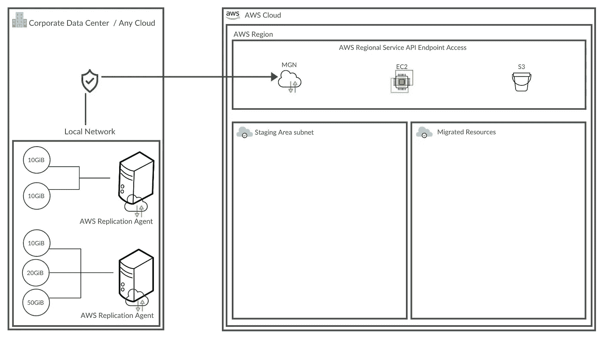

塞缪尔·马丁斯的图片

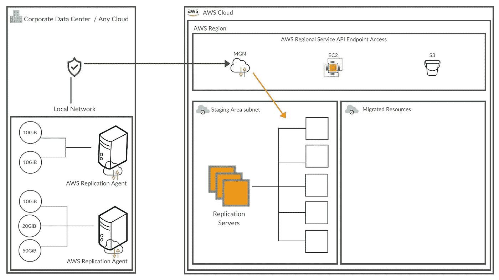

塞缪尔·马丁斯的图片

临时区域子网使用低成本计算和存储来保持源环境中的数据在 AWS 上同步。临时区域子网由以下资源组成:

*   复制服务器。这些是轻量级、Amazon elastic、云计算或 Amazon EC2 实例。
*   暂存卷。这些是低成本的亚马逊弹性块商店，或亚马逊 EBS 卷。
*   亚马逊 EBS 快照。这些是增量 EBS 快照。

对于复制的每个源磁盘，AWS MDN 都会在临时区域子网中创建一个大小相同的 EBS 卷，以便进行数据同步。在此示例中，五个复制源磁盘导致五个等效的 EBS 卷连接到登台区复制服务器。

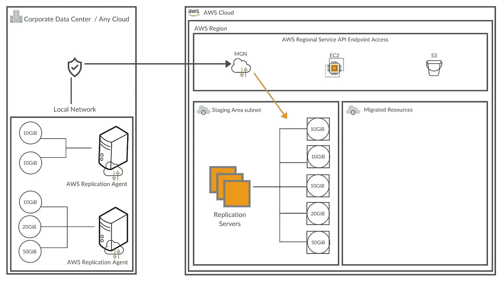

塞缪尔·马丁斯的图片

安装代理并创建临时区域子网资源后，复制开始。数据经过加密，并直接从源服务器传输到复制服务器卷。用户控制复制路径，在复制路径中，他们可以使用专用连接选项，如 AWS direct connect 或 VPN。

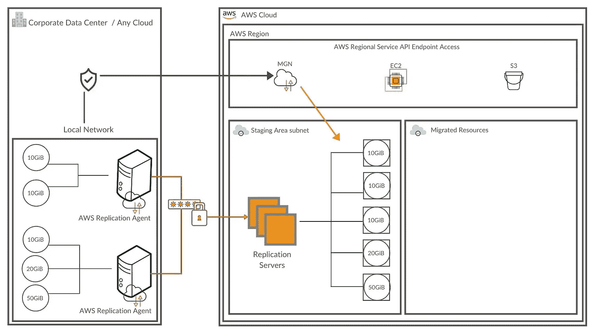

塞缪尔·马丁斯的图片

该服务自动管理临时区域子网资源，根据并发复制的源服务器和磁盘按需扩展或缩减资源。因此，用户无需维护操作即可管理中转区子网。AWS MGN 服务器是短暂的资源，由服务不时自动轮换。

需要注意的重要信息包括:

*   默认情况下，复制服务器使用 T3.small Linux 实例，启用 T3 无限制定价。
*   一般经验是，一台复制服务器最多可以处理 15 个并发复制的磁盘。
*   默认情况下，数据在传输过程中使用 AES 256 位加密密钥进行压缩和加密。也可以在您的 AWS 区域使用 Amazon EBS 加密对其进行静态加密。

复制从初始同步开始。在初始同步期间，代理将源磁盘上的所有内容复制到分段区域子网中的 EBS 卷。同时，代理会在数据权限发生时跟踪并持续复制数据权限，并将数据异步复制到临时区域子网中的相关资源。初始同步完成后，连续复制将无限期继续。

安装代理并开始复制后，检查启动设置。启动设置是服务、特定配置和易于启动的模板的组合。启动设置定义了迁移实例的启动位置和方式，包括子网安全组、实例类型、卷类型和标记。配置启动设置后，等待初始同步完成。当源服务器被标记为可以测试时，您可以选择 test and cutover 按钮并启动实例。然后，AWS MGN 将发出一系列 API 调用来启动启动过程，并根据您配置的启动设置在 AWS 上自动启动实例。

在启动过程中，该服务会自动启动转换服务器。转换过程包括对驱动程序、网络和操作系统许可证的更改，以便实例可以在 AWS 上本地引导。

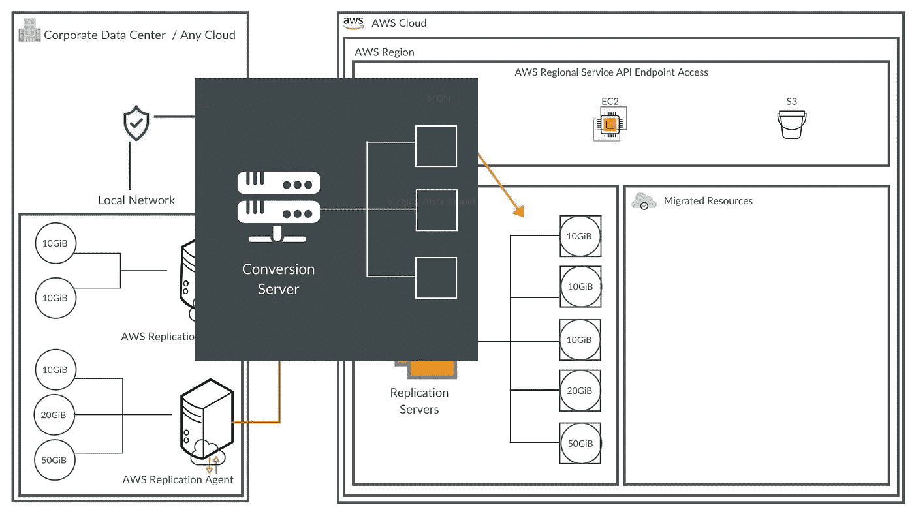

塞缪尔·马丁斯的图片

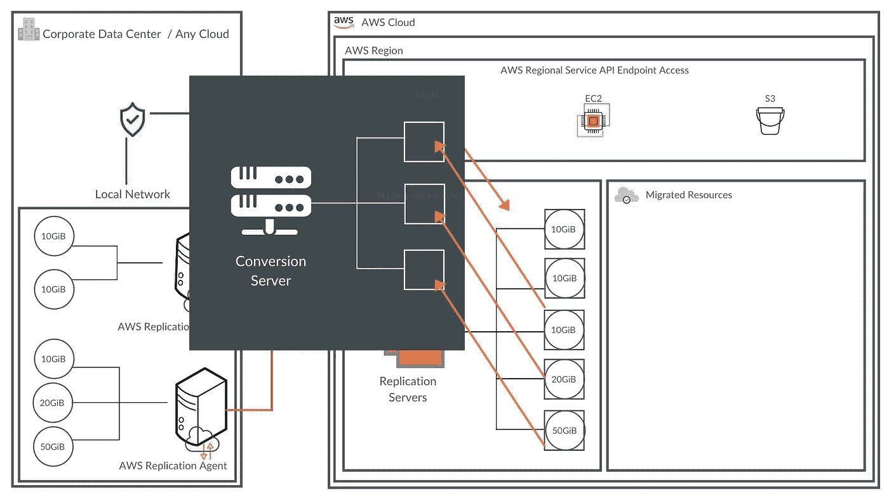

塞缪尔·马丁斯的图片

塞缪尔·马丁斯的图片

与复制服务器(只要复制处于活动状态，复制服务器就处于活动状态)不同，转换服务器仅在启动过程中出于转换服务器的特定目的而启动，然后立即终止。转换完成后，新的实例在 AWS 上启动并准备好使用。请注意，连接到已启动实例的卷代表启动时源服务器的状态。

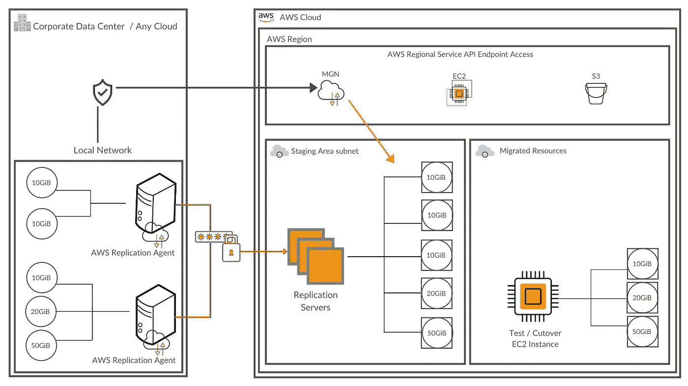

塞缪尔·马丁斯的图片

启动后，新创建的卷不再与源服务器保持同步。对源服务器所做的任何更改仍然会由 AWS 复制代理不断复制到临时区域卷，但是这些更改不会应用到已启动的实例。每次启动新的测试或转换实例时，它都会反映从源服务器复制到临时区域子网的数据的最新状态。使用这种设计，您可以快速测试启动的实例，而不会中断源服务器或复制过程。您还能够按需启动源服务器的最新拷贝。为同一个源服务器启动新实例将自动清理并覆盖该服务器以前的副本(如果以前启动过的话)。这有助于最小化成本，并避免未使用资源的积累。

要准备运行 AWS MGN 的网络，请设置以下连接:

*   源服务器和 AWS MGN API 端点之间的连接。允许源服务器上的 AWS 复制代理和 AWS MGN 端点之间的端口 443 上的连接。这种连接的目的是身份验证、配置和监控。对于 AWS 复制代理安装，并且只要源服务器正在复制，就必须有这种连接。因为这是一个 HTTPS 连接，所以可以使用源服务器上的标准设置通过 web 代理进行重定向。您还需要允许源服务器和 S3 之间的连接。设置此连接，以便 AWS 复制代理可以从 S3 存储桶中检索必要的软件组件。

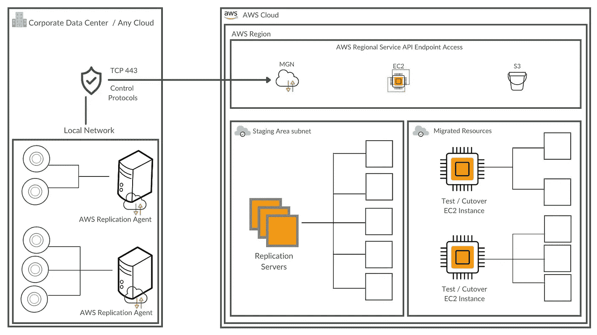

塞缪尔·马丁斯的图片

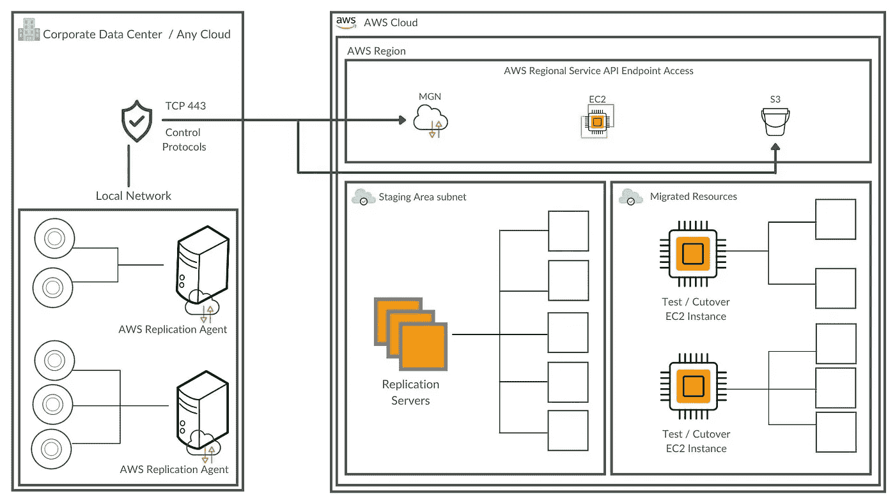

塞缪尔·马丁斯的图片

*   源服务器和临时区域子网之间的连接。AWS 复制代理将数据从源服务器直接发送到端口 1500 上的复制服务器。因此，必须允许通过端口 1500 进行连接，以实现连续数据复制。

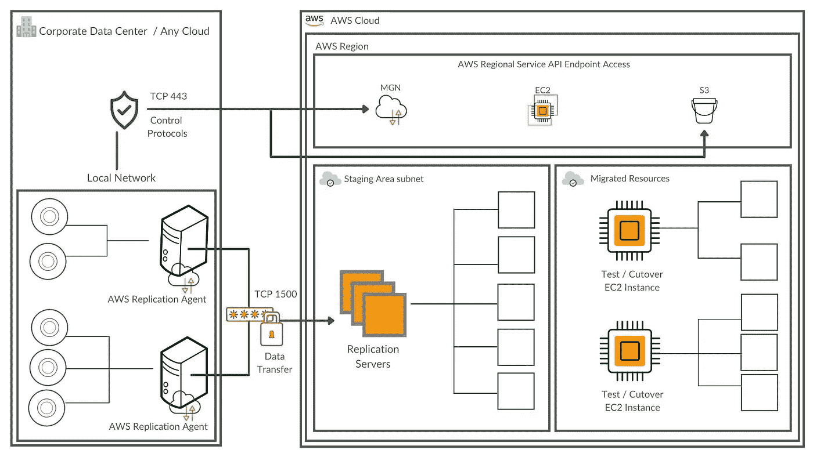

塞缪尔·马丁斯的图片

*   中转区之外的连接。在临时区域子网中启动的 AWS MGN 复制服务器和转换服务器必须在端口 443 上持续与 AWS MGM 端点通信，以便进行身份验证、配置和监控。

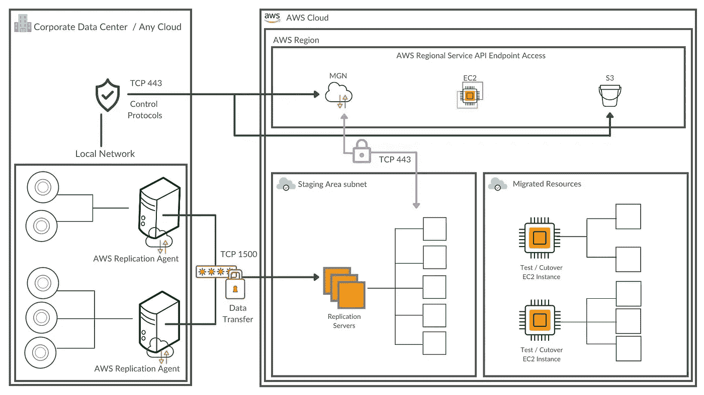

塞缪尔·马丁斯的图片

只要复制正在进行，这种连接就必须存在。此外，必须允许与 S3 的连接。当复制或转换服务器启动时，它连接到 S3 存储桶以下载软件和配置文件。

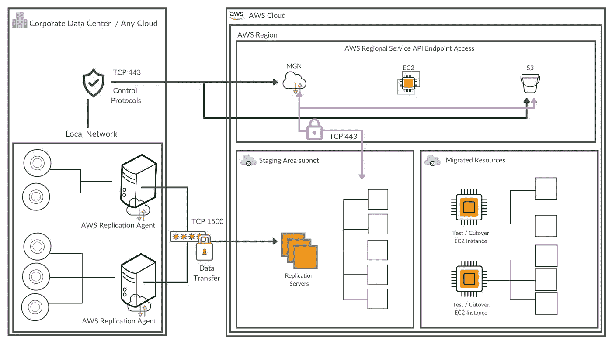

塞缪尔·马丁斯的图片

*   最后，复制服务器的角色之一是发出 API 调用，以便在复制期间拍摄分段 EBS 卷的快照。为此，还必须在端口 443 上建立到 EC2 API 端点的连接。

塞缪尔·马丁斯的图片

感谢您花时间来看这个架构。我希望这有助于你理解 AWS MGN，因为它帮助了我，因为我正在研究它。