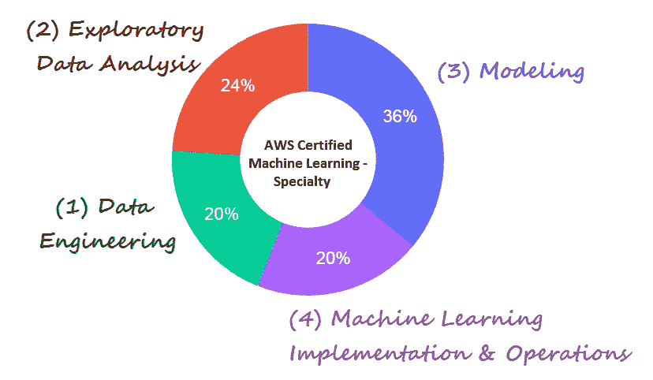
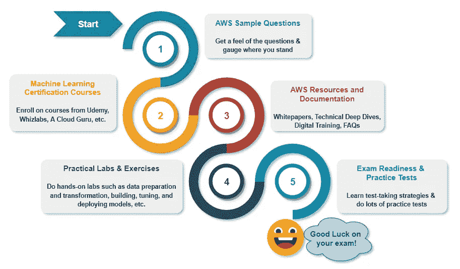
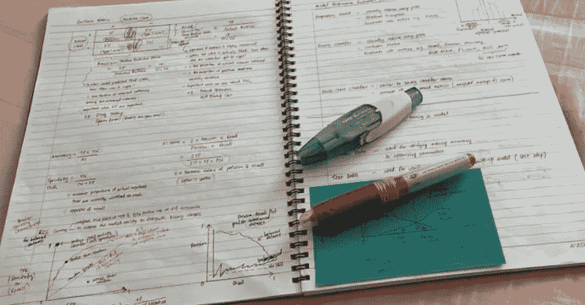
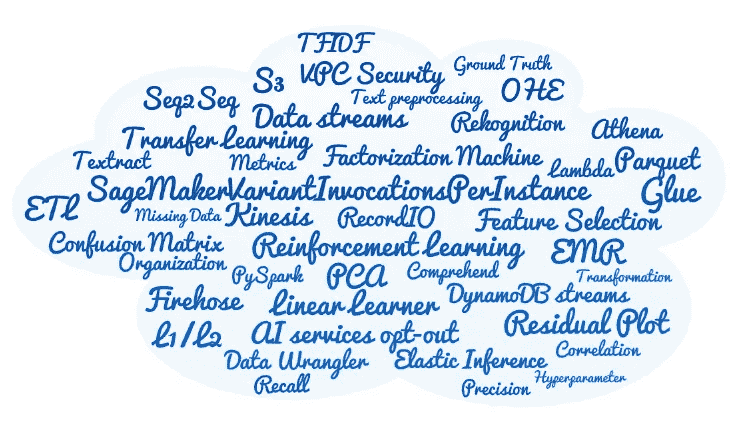

# AWS 认证机器学习—专业

> 原文：<https://towardsdatascience.com/aws-certified-machine-learning-specialty-97eacbd1a0fe?source=collection_archive---------11----------------------->

## 关于如何准备和通过考试的提示和建议

穆罕默德·阿里·皮克在 [Unsplash](https://unsplash.com?utm_source=medium&utm_medium=referral) 上拍摄的照片

相信很多人都听说过 AWS 的这个认证。我了解到 [**AWS 认证机器学习—专业**](https://aws.amazon.com/certification/certified-machine-learning-specialty/) 是一个艰难的认证考试，我非常同意。

我上周 10 月 1 日参加了这次考试。在阅读和回答前几个考试问题时，我立即意识到这并不容易通过。但是不要沮丧，因为如果你付出努力并做好充分的准备，你一定能做到。相信自己，努力是有回报的。

经历并通过这次考试对我来说是一次伟大的学习之旅。

> 我很高兴我设法达到了这个里程碑。既满足又有收获。

# 关于考试

> “AWS 认证机器学习-专业认证面向从事开发或数据科学工作的个人。它验证候选人针对给定业务问题设计、实施、部署和维护机器学习(ML)解决方案的能力”——来源: [AWS](https://aws.amazon.com/certification/certified-machine-learning-specialty/)

考试时间为 3 小时。总共有 65 个问题，这意味着您平均有大约 2.7 分钟的时间来回答每个问题。你会得到多项选择或多项回答问题。

这 65 个问题中，有 15 个是未评分的问题。AWS 使用它们来评估候选人的表现，以及将来是否将它们作为评分问题。可惜的是，考试上不公开。

结果以 100 到 1，000 的标度分数报告。最低及格分数是 750 分。

这项考试的费用是 300 美元。如果您之前通过了 AWS 认证考试，您可以从您的 AWS 认证帐户获得 50%的折扣券。

# 测试域

有 4 个领域的候选人将被测试。下图总结了这些领域及其权重。

AWS 认证机器学习的测试领域-专业。作者图片

对于每个领域的完整细节和范围，您可以从 AWS 下载的[考试指南](https://d1.awsstatic.com/training-and-certification/docs-ml/AWS-Certified-Machine-Learning-Specialty_Exam-Guide.pdf)中阅读它们。下面是一个简短的总结:

*   **数据工程** —了解存储介质(S3、EFS 等)、数据摄取(Kinesis 等)、数据转换(ETL、Glue、EMR、AWS Batch、Lambda)
*   **探索性数据分析**—涵盖数据准备(地面实况、牧马人等)、特征提取和工程(OHE、PCA 等)、分析和可视化(相关性、残差图等)
*   **建模** —了解与监督/非监督学习、迁移学习、强化学习、类型(分类、回归、预测、聚类、推荐)、优化、超参数、正则化(L1/L2、辍学)、模型评估(欠拟合/过拟合)、度量(准确度、精确度、召回率、RMSE、F1 评分、AUC-ROC)、混淆矩阵等相关的各种算法。
*   **机器学习实现&操作** —监控和日志(CloudTrail、CloudWatch)、ML & AI 服务(Lex、understand、Transcribe、Rekognition、Textract 等)、IAM、安全、带 API 网关的端点、批量转换、A/B 测试、BYOC、物联网 Greengrass、SageMaker Neo、增强 AI 等。

# 学习选项

考试前你可以选择很多学习方法。我已经在下图中列出了可用的可能性。

AWS 认证机器学习的学习选项-专业。作者图片

根据你的经验和知识水平，你可能需要也可能不需要全部。我将在下一节解释每一个问题。

# 📑 1.AWS 示例问题

首先，我会推荐你从 AWS 下载[样题](https://d1.awsstatic.com/training-and-certification/docs-ml/AWS-Certified-Machine-Learning-Specialty_Sample-Questions.pdf)。它由 10 个带答案的问题组成。还提供了每个答案背后的解释和理由。

试着不看答案回答这些问题。然后，对照提供的答案检查您的答案。这会让你感觉到问题的难度。它还能让你大致判断自己的状况，你是否做得很好，或者需要进一步的培训和学习。

# 💡 2.机器学习认证课程

如果你觉得你需要更多的培训和学习，你可以在 Udemy，Whizlabs，A Cloud Guru 等网站上找到几个 AWS 机器学习认证课程。

我参加了钱德拉·林根的 Udemy 课程 [AWS 认证机器学习专业(MLS-C01)](https://www.udemy.com/course/aws-machine-learning-a-complete-guide-with-python/) 。这是一门 AWS SageMaker 实践课程，包括模拟测试。除此之外，它还涵盖了许多基本的机器学习概念和重要的算法。

我对这门课程的质量印象深刻。我特别喜欢展示具体概念或实现的许多动手实验和用例。讲师还积极维护和更新课程材料。我实际上在今年 3 月下旬完成了课程，但我推迟了参加考试的计划。当我在 9 月份再次浏览该课程时，我惊讶地发现增加了新的主题，我发现这些主题都是相关和有用的。

根据学生们的说法，这位老师反应很快，很有帮助。甚至还有有组织的团体直播问答环节。简而言之，这是一门不容错过的精彩课程。

# 📚 3.AWS **资源和文档**

您可以从 AWS 找到许多辅助学习材料和资源。AWS 为其所有服务和产品维护大量文档。我提供以下所有主要链接。

## [AWS 上的机器学习](https://aws.amazon.com/machine-learning/)

这是 AWS 机器学习的主页，它包含了 AWS 人工智能服务、ML 服务、框架、基础设施、用例解决方案、博客、学习资源、客户故事等的所有链接。

## [AWS 文档](https://docs.aws.amazon.com/)

在这里，您可以找到用户指南、开发人员指南、API 参考、教程和项目、SDK 和工具包。

亚马逊 SageMaker 开发者指南特别有用。它包含关于 SageMaker 特性的非常详细的信息和教程，以及所有内置的算法。

## [**AWS 白皮书**](https://aws.amazon.com/whitepapers)

*   [公共部门组织的机器学习最佳实践](https://d1.awsstatic.com/whitepapers/machine-learning-best-practices-for-public-sector-organizations.pdf)【新】
*   [机器学习镜头——AWS 架构良好的框架](https://docs.aws.amazon.com/wellarchitected/latest/machine-learning-lens/welcome.html)
*   [增强人工智能:人类和机器的力量](https://d1.awsstatic.com/whitepapers/augmented-ai-the-power-of-human-and-machine.pdf)

## [亚马逊 SageMaker 技术深潜系列](https://www.youtube.com/watch?v=uQc8Itd4UTs&list=PLhr1KZpdzukcOr_6j_zmSrvYnLUtgqsZz)

这个[亚马逊 SageMaker 技术深潜系列](https://www.youtube.com/watch?v=uQc8Itd4UTs&list=PLhr1KZpdzukcOr_6j_zmSrvYnLUtgqsZz)在 YouTube 上有 16 个视频。了解如何使用 Amazon SageMaker 构建、培训、调整、部署和优化模型。

## [AWS 数字培训](https://aws.amazon.com/training/digital/)

通过 [AWS 数字培训](https://aws.amazon.com/training/digital/)在自己的时间和计划内学习。从[学习库](https://www.aws.training/LearningLibrary)中浏览并选择相关课程。

## [AWS 产品&技术常见问题解答](https://aws.amazon.com/faqs/?ep=sec&sec=spec_ml)

FAQ 是浏览特定产品或服务要点和功能的另一个很好的资源。

仅列举几个:[亚马逊 SageMaker FAQ](https://aws.amazon.com/sagemaker/faqs/?ep=sec&sec=spec_ml) 、[亚马逊 S3 FAQ](https://aws.amazon.com/s3/faqs/) 、 [AWS Glue FAQ](https://aws.amazon.com/glue/faqs/) 、[亚马逊 Kinesis 数据流 FAQ](https://aws.amazon.com/kinesis/data-streams/faqs/) 、[亚马逊 Kinesis 数据消防软管 FAQ](https://aws.amazon.com/kinesis/data-firehose/faqs/?nc=sn&loc=5) 、 [AWS 湖泊形成 FAQ](https://aws.amazon.com/lake-formation/faqs/) 、[亚马逊领悟 FAQ](https://aws.amazon.com/comprehend/faqs/) 、[亚马逊 Rekognition FAQ](https://aws.amazon.com/rekognition/faqs/) 等。

# 💻 4.实践实验和练习

如果您没有使用 AWS 的经验，请尝试在 AWS 中进行动手实验，例如数据准备和转换，以及构建、调优和部署模型。

这一步是可选的，但它有一个额外的好处，可以帮助您熟悉 AWS 服务和产品，以及它们如何相互集成。

注册一个 AWS 帐户，你将能够探索、体验和开始构建 AWS。新账户持有人可以享受[免费等级](https://aws.amazon.com/free/)下的大部分产品和服务。查看 AWS 的[免费等级](https://aws.amazon.com/free/)产品，它们可以归入以下三个类别之一:*短期免费试用*、 *12 个月免费*或*永远免费*。

下面提供了示例笔记本、SDK 和 AWS CLI 的链接:

*   [亚马逊 SageMaker 示例笔记本](https://sagemaker-examples.readthedocs.io/en/latest/index.html)
*   [亚马逊 SageMaker Python SDK](https://sagemaker.readthedocs.io/en/stable/index.html) 是一个开源库，用于在亚马逊 SageMaker 上训练和部署机器学习模型。
*   [Boto3](https://boto3.amazonaws.com/v1/documentation/api/latest/index.html) 是用于 Python 的 AWS SDK，您可以使用它来创建、配置和管理 AWS 服务。
*   [AWS 命令行界面](https://docs.aws.amazon.com/cli/index.html) (AWS CLI)是一个统一的工具，为与亚马逊 Web 服务的所有部分进行交互提供了一致的界面。

如果你感兴趣，你可以点击下面的链接来阅读我写的关于如何用 Amazon SageMaker 因子分解机构建和训练推荐引擎的文章。

<https://pub.towardsai.net/building-a-product-recommendation-engine-with-aws-sagemaker-321a0e7c7f7b>  

## *📝记下自己的笔记*

由于这次考试的覆盖范围非常广，我建议你在浏览学习资料的时候自己记笔记。

作者图片

开始时你可能觉得没有必要。随着你的进步，深入研究章节，查阅成堆的文献和阅读材料，你很快就会发现自己被信息过载所淹没，无法记住你之前学过的特征或东西。

照片由[sumet B](https://unsplash.com/@pixel_is_fun?utm_source=medium&utm_medium=referral)在 [Unsplash](https://unsplash.com?utm_source=medium&utm_medium=referral) 上拍摄

如果你正在上课，它们通常会附带 PowerPoint 幻灯片。但是，自己做笔记会帮助你更好地记住对你来说重要的关键点和概念，并在期末复习时快速回忆起相关的想法和观点。

# 5.最后的准备

在你完成所有必要的主题和材料后，这个 [**考试准备:AWS 认证的机器学习-专业**](https://www.aws.training/Details/eLearning?id=42183&ep=sec&sec=spec_ml) 课程是一个必须要做的。这是一门 4.5 小时的免费在线电子学习课程。你将学到宝贵的**关键应试策略**和翻译试题的技巧。

当面对你没有信心的问题时，你需要知道如何解决它们。你将学会识别重要的关键词，消除不相关或干扰选项，缩小到可能的答案选择。

因为大多数问题都是基于场景的，所以你也需要学会注意问题中指定的要求。例如，您可能会被要求"*选择最具成本效益的解决方案"*或"*选择管理和开销最小的* *解决方案"*。

本课程将贯穿 4 个高级考试领域。对于每个领域，您将回答几个测验问题。

最后你还会发现另外 35 个学习问题。这些问题模拟了实际考试中出现的问题类型。但是，我还是觉得实际考试题的难度水平更高。但我也收到了一些简单的问题。

[绿色变色龙](https://unsplash.com/@craftedbygc?utm_source=medium&utm_medium=referral)在 [Unsplash](https://unsplash.com?utm_source=medium&utm_medium=referral) 上拍摄的照片

在最后阶段，尽可能多地做模拟测试或模拟问题。你需要这样做，以便熟悉问题的风格，并在规定的时间内自如地回答问题。

即使你觉得你已经准备好了，也要这样做。通常你会惊讶地发现，仍然有一两个问题需要你进一步研究才能找到答案！

同样，你可以在像 Udemy 这样的平台上找到练习测试，或者参加 AWS 的官方练习考试，费用是 40 美元。如果您之前已经通过了 AWS 认证考试，您可以利用您的 AWS 认证帐户中的练习考试优惠券免费参加 AWS 练习考试。

更新:AWS 取消了免费实践考试的福利。2021 年 11 月 19 日起，每个人都可以在 [***上免费访问***](https://explore.skillbuilder.aws/learn) **[*AWS 认证官方练习题集*](https://explore.skillbuilder.aws/learn/course/external/view/elearning/9153/aws-certification-official-practice-question-sets-english)*【AWS 技能构建器*** *】。如果您获得了免费的模拟考试作为考试福利，您仍然可以在 2022 年 6 月 30 日之前通过 PSI 申请、激活和使用模拟考试。*

给你一点奖励，考试中出现的题目。这些是我能回忆起的一些零碎的东西，但并不详尽。作者图片

# 摘要

在这篇文章中，我简要介绍了 AWS 认证机器学习专业的考试形式和考试领域。

我介绍了在参加考试之前可以选择的各种学习方法。我还提供了各种 AWS 资源和文档的链接摘要，可以帮助您准备考试。

我建议你在浏览学习资料的时候自己做笔记。当你做最后几轮复习时，这些笔记会很方便。

为了做好最后准备，请参加 AWS 考试准备课程。学习应试策略至关重要。尽可能多地尝试模拟测试。

> 祝你学习愉快，考试顺利！

*如果你喜欢我的帖子，别忘了点击* [***关注***](https://peggy1502.medium.com/) *和* [***订阅***](https://peggy1502.medium.com/subscribe) *获取邮件通知。*

*可选地，你也可以* [*注册*](https://peggy1502.medium.com/membership) *成为媒体会员，以获得媒体上每个故事的全部访问权限。*

有兴趣了解变形金刚吗？我有以下的帖子给你。

</transformers-can-you-rate-the-complexity-of-reading-passages-17c76da3403>  </advanced-techniques-for-fine-tuning-transformers-82e4e61e16e> 