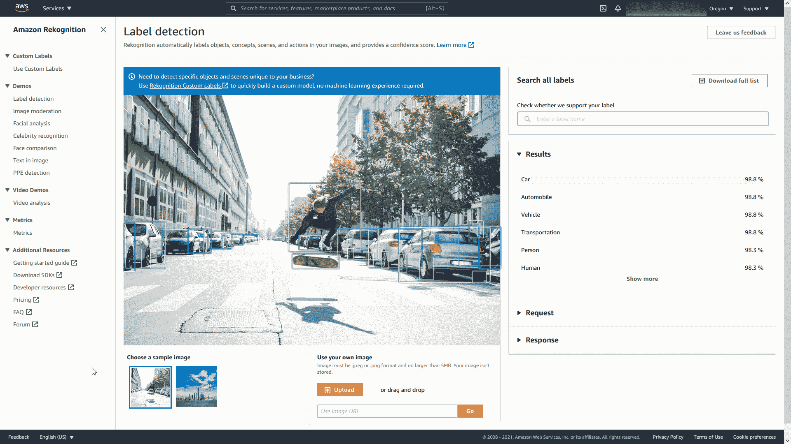
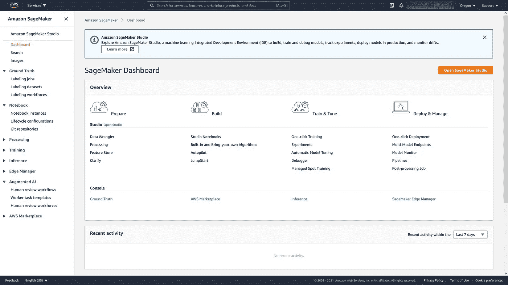

# 面向机器学习工程师的 AWS

> 原文：<https://towardsdatascience.com/aws-for-machine-learning-engineers-47e50a3b8015?source=collection_archive---------18----------------------->

## 探索 AWS 提供的一些关键服务，以解决数据驱动的挑战。

亚历克斯·库利科夫在 [Unsplash](https://unsplash.com?utm_source=medium&utm_medium=referral) 上的照片

# 介绍

随着越来越多的公司决定将内部数据中心转移到云提供商，过去几年中技术的一个关键趋势是对云计算的需求不断增长。2020 年，云计算市场规模相当于 3714 亿美元，预计到 2025 年将达到约 8321 亿美元[1]。截至 2021 年，按市场份额计算，AWS 目前是全球领先的云提供商[2]。

我最近完成了 [AWS 机器学习专业考试](https://aws.amazon.com/certification/certified-machine-learning-specialty/)(图 1)，因此，我决定总结一个数据科学家在从事 AWS 项目时可能会用到的关键服务。

图 1: [AWS ML 考试完成推文](https://twitter.com/Pier_Paolo_28)(图片由作者提供)。

如果您有兴趣了解关于云计算基础的更多信息，可以在我之前的文章[“数据科学家的云基础”](/cloud-foundations-for-data-scientists-e9d0c14fc98a)中找到更多信息。

# AWS 服务

AWS 提供了 3 个不同的抽象级别，您可以使用它们来创建机器学习解决方案:人工智能(AI)服务、ML 服务、ML 框架和基础设施。

## 人工智能服务

在这个层面上，我们可以找到所有专注于易用性和快速上市的 AWS 人工智能服务。这些服务完全由 AWS 管理，只需对已经由 AWS 预训练的高性能模型进行 API 调用，就可以为您的产品添加机器学习功能。通过这种方式，任何人都可以利用人工智能服务，即使没有任何 ML 方面的经验。人工智能服务的一些例子是:

*   **Amazon understand:**是一种自然语言处理(NLP)服务，旨在分析大量非结构化文本数据(例如，识别语言、文本中的关键事实、整体情感等。)
*   **Amazon Polly:** 是一个支持深度学习的文本到语音服务，可用于创建基于语音的应用程序。
*   **Amazon transcripte:**是语音转文本服务，用于将音频文件转换为文本文件。这种服务能够为批处理和实时流数据提供可靠的性能。
*   **亚马逊翻译:**是基于深度学习的语言翻译服务。
*   **Amazon Rekognition:** 是一项旨在从图像和视频中获得洞察力的服务(例如，对象/人物检测、内容审核等)。).
*   **Amazon Personalize:** 是一个推荐系统，旨在根据用户交互轻松提供实时产品排名、定制营销和推荐。

下面是一个简单的例子，展示了开始使用 Amazon Rekognition 是多么容易(图 2)。

图 2:亚马逊 Rekognition 演示(图片由作者提供)。

## ML 服务

ML Services 专注于为数据科学家和研究人员提供托管资源和服务，以便他们能够创建和部署机器学习模型，而不必花费太多时间来建立支持他们模型的架构。ML 服务的一些例子是:

*   **亚马逊 SageMaker:** 是一个完全托管的服务，旨在覆盖整个机器学习工作流程，从数据准备到部署和监控(图 3)。Amazon Sagemaker 中一些最有趣的选项有: **Data Wrangler** (一个基于 GUI 的数据准备工具)，一个内置的**功能库**， **Autopilot** (AWS 自动 ML 服务)， **Pipelines** (用于编排自动化工作流)等。如果您有兴趣了解有关 Sagemaker 及其功能的更多信息，请点击[链接。](https://www.youtube.com/watch?v=CK_xC4T1blk)
*   **亚马逊 SageMaker 地面真相:**是一项服务，旨在为机器学习任务创建数据集标签。使用这项服务，可以选择人工智能驱动的自动标签工具，或者将您的数据发送给人工劳动力进行人工标签。此外，还可以让服务自动标记它具有高可信度的实例，并将剩余的实例发送给人工(从而节省时间和成本)。目前，Ground Truth 能够支持不同类型的数据，如文本、图像和视频。
*   **亚马逊 SageMaker Neo:** 一旦经过训练，就可以在任何地方(在云端或物联网边缘设备上)部署机器学习模型。SageMaker Neo 通过采用在任何主要的 ML 框架(如 Keras、PyTorch、[、ONNX](/onnx-easily-exchange-deep-learning-models-f3c42100fd77) )中训练的模型，然后将其转换为优化的二进制表示，从而减少用于对模型进行推理的内存量，从而使这一点成为可能。
*   **亚马逊增强人工智能:**是一项服务，旨在创建生产 ML 模型，使人类保持在循环中。对于一些应用，如金融或医学，ML 模型做出的预测可能非常重要，并具有长期的影响。使用增强的人工智能，我们可以创建工作流，使人类有可能检查模型预测，并在必要时改变它们，以便向模型提供反馈(用于潜在的重新训练)，同时提高性能。

图 3:亚马逊 Sagemaker 仪表盘(图片由作者提供)。

## ML 框架和基础设施

该级别旨在使机器学习专家能够使用传统的开源框架(如 PyTorch、TensorFlow 和 AWS 上的 Apache MXNet)创建他们的模型。AWS 提供了不同的机器映像，旨在运行高性能的机器学习工作流，如深度学习 AMI 和深度学习容器(它们都带有已经安装的不同 ML 框架)。这样，ML 从业者就不必再担心与库依赖和有限计算能力的冲突了。

# 结论

总体而言，AWS 提供了一套令人印象深刻的服务，可用于在分析生命周期的任何阶段使用数据(例如，数据接收、数据存储、数据处理、数据分析等)。如果你有兴趣了解更多关于其他人工智能云提供商服务的信息，比如微软 Azure，更多信息可以在我之前的文章[“人工智能驱动的微软工具简介”](https://pierpaolo28.github.io/blog/blog28/)中找到。

# 联系人

如果你想了解我最新的文章和项目[，请在 Medium](https://pierpaoloippolito28.medium.com/subscribe) 上关注我，并订阅我的[邮件列表](http://eepurl.com/gwO-Dr?source=post_page---------------------------)。以下是我的一些联系人详细信息:

*   [领英](https://uk.linkedin.com/in/pier-paolo-ippolito-202917146?source=post_page---------------------------)
*   [个人网站](https://pierpaolo28.github.io/?source=post_page---------------------------)
*   [中等轮廓](https://towardsdatascience.com/@pierpaoloippolito28?source=post_page---------------------------)
*   [GitHub](https://github.com/pierpaolo28?source=post_page---------------------------)
*   [卡格尔](https://www.kaggle.com/pierpaolo28?source=post_page---------------------------)

# 文献学

[1]环球新闻网，研究和市场。访问:[https://www . globe news wire . com/news-release/2020/08/21/2081841/0/en/Cloud-Computing-Industry-to-Grow-from-37140 亿-in-2020-to-83210 亿-by-2025-at-a-a-of-17-5 . html](https://www.globenewswire.com/news-release/2020/08/21/2081841/0/en/Cloud-Computing-Industry-to-Grow-from-371-4-Billion-in-2020-to-832-1-Billion-by-2025-at-a-CAGR-of-17-5.html)

[2] Statista，亚马逊引领着价值 1500 亿美元的云市场。访问:[https://www . statista . com/chart/18819/world wide-market-share-of-leading-cloud-infra structure-service-providers/](https://www.statista.com/chart/18819/worldwide-market-share-of-leading-cloud-infrastructure-service-providers/)