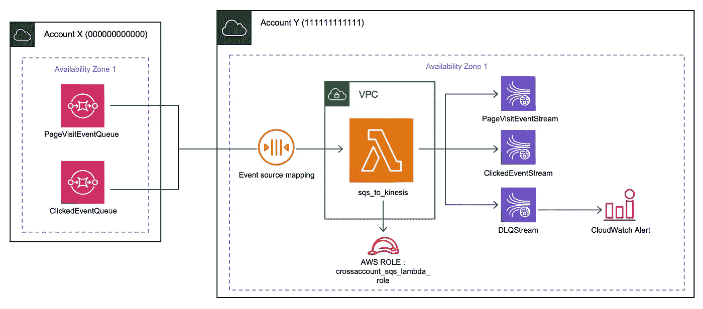
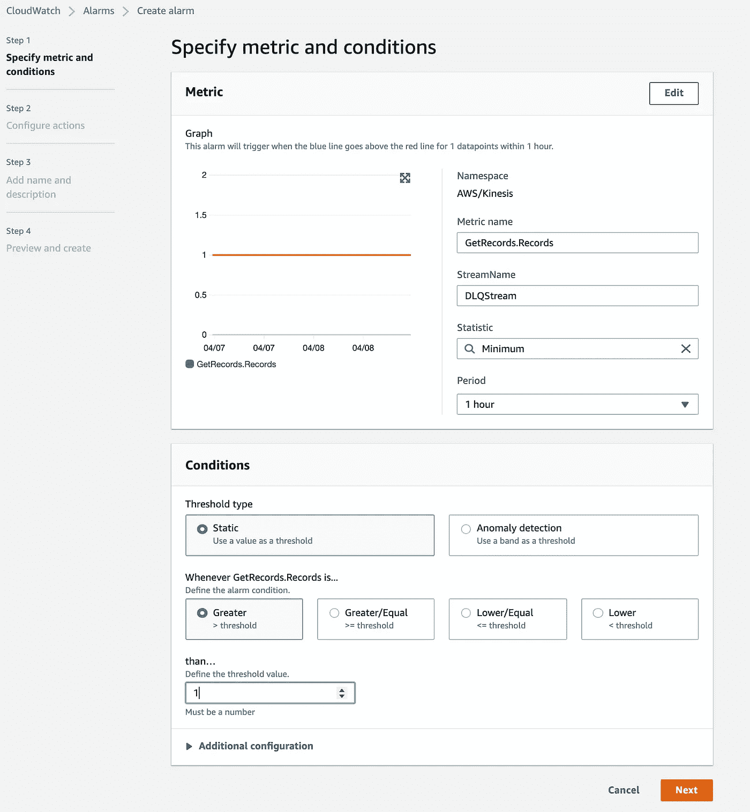
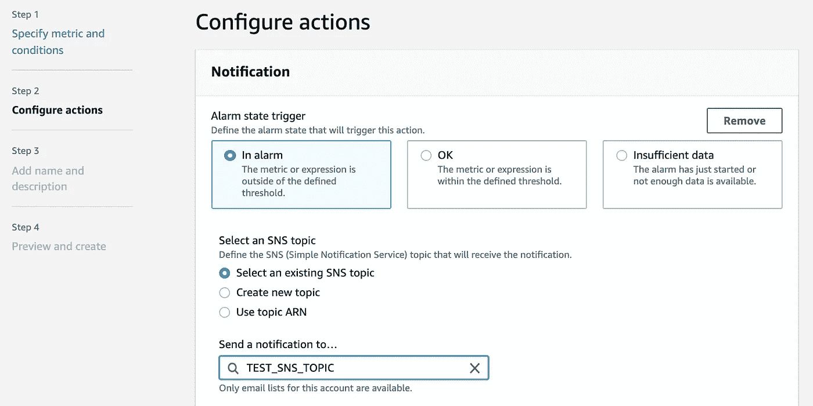

# AWS Lambda 是 SQS 和 Kinesis 之间的纽带

> 原文：<https://towardsdatascience.com/aws-lambda-as-a-link-between-sqs-and-kinesis-a39cb6e4f762?source=collection_archive---------16----------------------->

## 使用 Lambda 作为桥梁，使数据从帐户 X 中的 SQS 队列流向帐户 Y 中的 Kinesis 数据流


照片由[卡尔焊接](https://unsplash.com/@carlsolder?utm_source=medium&utm_medium=referral)在 [Unsplash](https://unsplash.com?utm_source=medium&utm_medium=referral) 上

让我们看一下这里使用的不同的 AWS 服务。

[**AWS 简单队列服务**](https://aws.amazon.com/sqs/) **:** 简单队列服务(SQS)是一个托管的分布式队列服务，允许在应用程序或服务之间发送和接收消息[并可选地持久化]。

[**AWS Kinesis 数据流**](https://aws.amazon.com/kinesis/data-streams/) **:** AWS 以 Kinesis 数据流的形式提供数据流服务，可用于实时收集数据并提供给下游消费者进行进一步处理。

[**AWS Lambda**](https://aws.amazon.com/lambda/)**:**Lambda 是一种无服务器计算服务，可用于执行一段代码，该代码在其他 AWS 服务的指定触发下处理数据。

[**AWS 身份&访问管理**](https://aws.amazon.com/iam/) **:** 身份&访问管理(IAM)服务使用户能够根据组或用户或角色以及附加到它们的策略使用权限来访问各种 AWS 服务。

# 问题陈述

在最近的一个项目中，我正在开发一个能够产生用户行为事件的产品，比如页面访问、点击流、播放的录音等。为了获取这些数据进行分析，我们使用特定的 API 订阅了相应的事件，这些 API 将这些事件发送到它在 AWS 服务帐户 X 中创建的相应的 SQS 队列，该帐户的 id 为 000000000000。这里的问题是让数据流向我们团队可以访问的 id 为 1111111111111 的帐户 Y。

我们怎样才能越过接收存在于另一个账户中的数据的障碍呢？

# 解决方案

首先，让我们看一下解决方案架构。



解决方案架构

本质上，需要在帐户 Y 中创建一个交叉帐户角色，并附加一组策略。角色为`crossaccount_sqs_lambda_role`的 sqs_to_kinesis lambda 应该能够轮询(读取)和删除帐户 x 中 sqs 队列的消息。此外，该角色应该能够写入帐户 y 中的 kinesis 数据流

## ***第一步:创建跨账户角色，附加需要的策略***

***在账户 Y*** 中，创建了一个 IAM 角色，名为“crossaccount_sqs_lambda_role”，我们用 ARN `arn:aws:iam::111111111111:role/crossaccount_sqs_lambda_role`来说吧。该角色附加了一个自定义策略:

*   *CustomLambdaAccess(内联策略):*该策略是 AWSLambdaFullAccess 和 AWSLambdaSQSQueueExecution 角色的变体的组合。而且，该策略包括了 Kinesis 定义的所有可以在所需的 Kinesis 流上执行的动作(这里是 PageVisitEventStream&clicked eventstream)。

> **注意:**您可以在资源字段下添加所需的流 arn。此外，如果使用的 Lambda 位于 VPC 中，则必须提供 EC2 网络接口权限。

## 步骤 2:向 SQS 队列添加权限

假设 PageVisitEvent 队列 URL 为`https://sqs.us-east-1.amazonaws.com/000000000000/PageVisitEventQueue`，ClickedEvent 队列 URL 为`https://sqs.us-east-1.amazonaws.com/000000000000/ClickedEventQueue`。

具有跨帐户角色的服务应该能够执行`ReceiveMessage`、`DeleteMessage`和`GetQueueAttributes`动作，因此，权限应该被添加到指定主体(这里是帐户 Y 的帐户 id)的队列中。

***在账户 X 中，***

*   在 AWS CLI 上执行以下命令:

```
$ aws sqs add-permission --queue-url https://sqs.us-east-1.amazonaws.com/000000000000/PageVisitEventQueue --label AllowedSQSPermissions --aws-account-ids "111111111111" --actions ReceiveMessage DeleteMessage GetQueueAttributes$ aws sqs add-permission --queue-url https://sqs.us-east-1.amazonaws.com/000000000000/ClickedEventQueue --label AllowedSQSPermissions --aws-account-ids "111111111111" --actions ReceiveMessage DeleteMessage GetQueueAttributes
```

[](https://docs.aws.amazon.com/cli/latest/reference/sqs/add-permission.html) [## add-permission - AWS CLI 1.19.47 命令参考

### 注意:您正在查看 AWS CLI 的较旧主要版本(版本 1)的文档。AWS CLI 版本 2,…

docs.aws.amazon.com](https://docs.aws.amazon.com/cli/latest/reference/sqs/add-permission.html) 

*   现在，在 AWS 控制台中，打开 PageVisitEvent SQS 队列。转到 Permissions 选项卡并编辑策略，以便我们创建的特定 IAM 角色可以访问队列，而不是整个帐户，即将主体从`arn:aws:iam::111111111111:root`更改为`arn:aws:iam::111111111111:role/crossaccount_sqs_lambda_role`。

访问策略的 YAML 应该如下所示:

## 步骤 3:创建运动流

***在账户 Y*** 中，创建 Kinesis 数据流，您将能够从账户 x 中各自的 SQS 队列映射到这些数据流

在 AWS CLI 上执行以下命令:

```
$ aws kinesis create-stream --stream-name PageVisitEventStream --shard-count 1$ aws kinesis create-stream --stream-name ClickedEventStream --shard-count 1
```

类似地，可以根据您的要求创建其他流。

[](https://docs.aws.amazon.com/cli/latest/reference/kinesis/create-stream.html) [## create-stream - AWS CLI 1.19.47 命令参考

### 创建一个 Kinesis 数据流。流捕获并传输从…连续发出的数据记录

docs.aws.amazon.com](https://docs.aws.amazon.com/cli/latest/reference/kinesis/create-stream.html) 

除了这些流之外，还要创建一个 DLQ 流(在步骤 4 中提供了理由):

```
$ aws kinesis create-stream --stream-name DLQStream --shard-count 1
```

## 步骤 4:创建和部署 Lambda 函数

首先，在您的本地系统中，创建一个名为`sqs_to_kinesis_mapping.json`的 JSON 文件，其中 SQS 队列的 ARN 将被映射到帐户 y 中的 Kinesis 流名称。将来，可能会有许多这样的事件被摄取，因此将它分离到一个配置文件中是一个更好的选择。

接下来，创建一个名为`lambda_function.py`的 python 文件，内容如下:

让我解释一下代码中发生了什么。

首先，读取包含 SQS 队列到 Kinesis 流映射的 JSON 文件。接下来，为每个 SQS 队列 ARN 创建一个字典`kinesis_records_all`，该包括一个`Records`关键字，该关键字包含将被转储到相应的`StreamName`中的字典列表。从`event`字典中`Records`键的每个记录中，提取所需的信息，这些信息是要推送到 Kinesis 流的实际数据。

每个 SQS 队列都可以配置一个死信队列(DLQ ),它本身就是一个接收在处理时导致异常/错误的消息的队列。不是维护必须在账户 X 中创建的单独的 DLQ，而是将所有不一致的消息作为一个整体来消费，并将它们推送到账户 y 中的动态流 DLQStream。这样做是为了避免关于维护来自账户 X 的 DLQ 的额外的复杂性层。可以在 DLQStream 上设置一个 CloudWatch 警报(请参考解决方案架构图),如果 GetRecords。记录度量值增加到某个阈值以上。此外，DLQStream 中的记录可以通过 Kinesis Firehose/Lambda/Spark 结构化流应用程序转储到 S3，以发现消息未在 Lambda 中得到处理的原因。这也确保了记录出现在 DLQStream 中的唯一原因是 Lambda 捕获的来自源(即 SQS 队列)的记录的格式不同于在其中执行的数据提取过程。

接下来，使用以下命令压缩这两个文件以创建一个 sqs_to_kinesis.zip 文件:

```
$ zip sqs_to_kinesis.zip lambda_function.py sqs_to_kinesis_mapping.json
```

在帐户 Y 中创建 Lambda 并部署它。

```
$ aws lambda create-function --function-name sqs_to_kinesis --zip-file fileb://sqs_to_kinesis.zip --handler lambda_function.lambda_handler --runtime python3.8 --role arn:aws:iam::111111111111:role/crossaccount_sqs_lambda_role
```

 [## 教程:在 Python 3.8 中创建 Lambda 函数

### 本教程将指导您使用 AWS 构建代码和资产，在 Python 3.8 中创建 Lambda 函数…

docs.aws.amazon.com](https://docs.aws.amazon.com/lambda/latest/dg/python-package-create.html) 

## 步骤 5:向 Lambda 添加触发器

当消息在源 SQS 队列中可用时，必须调用 Lambda 代码。为此，必须在 SQS 队列和 sqs_to_kinesis lambda 之间创建事件源映射。为此，在账户 Y 中的*，执行以下命令:*

```
*$ aws lambda create-event-source-mapping --event-source-arn arn:aws:sqs:us-east-1:000000000000:PageVisitEventQueue --function-name arn:aws:lambda:us-east-1:111111111111:function:sqs_to_kinesis$ aws lambda create-event-source-mapping --event-source-arn arn:aws:sqs:us-east-1:000000000000:ClickedEventQueue --function-name arn:aws:lambda:us-east-1:111111111111:function:sqs_to_kinesis*
```

*[](https://docs.aws.amazon.com/lambda/latest/dg/invocation-eventsourcemapping.html) [## AWS Lambda 事件源映射

### 事件源映射是一个 AWS Lambda 资源，它从事件源读取并调用 Lambda 函数。你…

docs.aws.amazon.com](https://docs.aws.amazon.com/lambda/latest/dg/invocation-eventsourcemapping.html) 

这将使 Lambda 函数能够轮询任何消息的 SQS 队列。一旦消息存在于队列中，lambda 就会对其进行处理，并根据代码是否能够成功提取所需的数据将消息发送到相应的流，然后从相应的 SQS 队列中将其删除。

## 步骤 6:在 CloudWatch 中为 Lambda 设置日志保留期

由于日志是在 Lambda 中打印的，因此必须为日志组设置一个保留期，以便在一段特定的时间后，将早于指定保留期的日志丢弃。这避免了日志占用大量的存储空间，尤其是当 Lambda 处理的事件数量很大时。

为此，在帐户 Y 中执行此命令 ***:***

```
$ aws logs put-retention-policy --log-group-name /aws/lambda/sqs_to_kinesis --retention-in-days 7
```

或者，

1.  转到帐户 Y 的 AWS 控制台
2.  打开云观察
3.  在导航窗格中选择日志组
4.  搜索/aws/lambda/sqs_to_kinesis 日志组并单击它
5.  转到操作下拉菜单→编辑保留设置。将保留期设置为 7 天(或根据需要)。

## 步骤 7:在 DLQStream 的 GetRecords 上添加 CloudWatch Alarm。记录指标

为了获得关于出现在 DLQStream 中的记录的通知，可以在 GetRecords 上创建一个 CloudWatch 警报。记录指标，每当最小(或根据您的要求的任何其他统计)记录数超过给定时间段的阈值时，将发送电子邮件。您可以转到 AWS 控制台，按如下方式进行设置。



CloudWatch 警报设置

接下来，您可以配置 SNS，以便在指标值超出给定阈值时接收通知。



## [根据您的要求]步骤 8:从 Kinesis 流中消耗数据

有几种方法可以从 Kinesis 流中获取数据，根据您的需求，可以选择其中的任何一种:

*   使用 AWS Lambda 读取记录并转储到 AWS S3
*   使用消防软管将记录直接转储到 S3 自动气象站
*   开发一个 Spark 流应用程序，使记录可以从 Kinesis Stream 实时传输到 datalake。
*   其他方法可以在这里找到:

 [## 从亚马逊 Kinesis 数据流中读取数据

### 消费者是处理来自 Kinesis 数据流的所有数据的应用程序。当消费者使用增强型扇出时…

docs.aws.amazon.com](https://docs.aws.amazon.com/streams/latest/dev/building-consumers.html) 

## 使用这种架构向前发展

如果将来对相同格式的事件有任何接收请求，可以通过实现以下步骤来使用该体系结构:

*   首先，执行步骤 2，将所需的权限添加到帐户 X 中的 SQS 队列
*   *接下来，执行步骤 3，这将在帐户 Y 中创建一个新的 Kinesis 数据流*
*   **通过添加一个新条目来更新`sqs_to_kinesis_mapping.json`,该条目以 SQS 队列 ARN 为键，以 Kinesis 数据流名称为值。将更改部署到`sqs_to_kinesis` lambda。**
*   **在 SQS 队列和 lambda 之间创建一个事件源映射(步骤 5)**

**就是这样！*** 

# ***包装它***

***通过这篇博客，我们了解了如何在 AWS 上设置 Lambda 函数来获取跨帐户数据，以及各种其他服务，使模型能够轻松机动化。***

***我希望记录我在这个项目中获得的知识能让你在这种情况下占据优势。***

***干杯！***