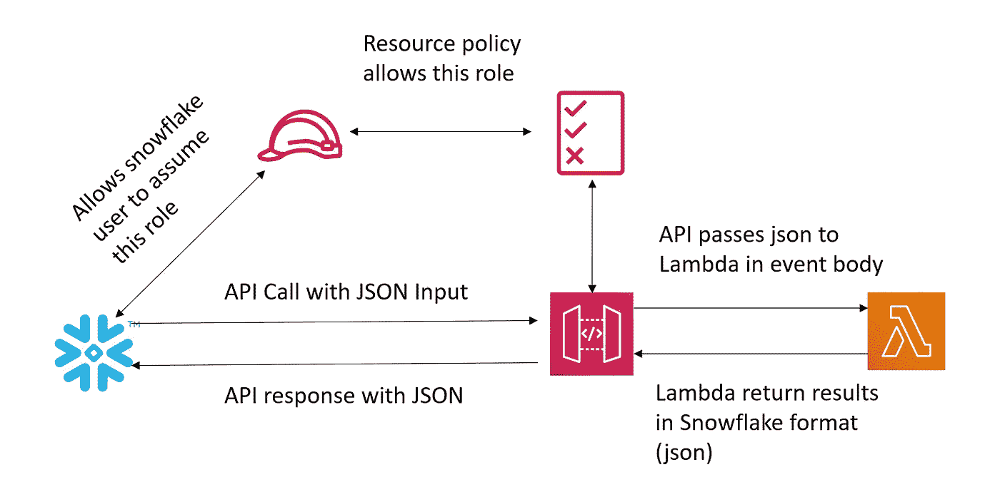
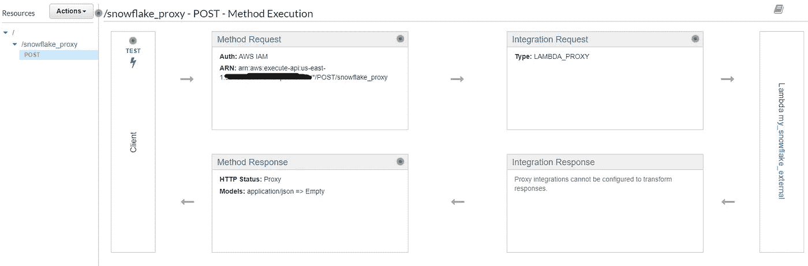
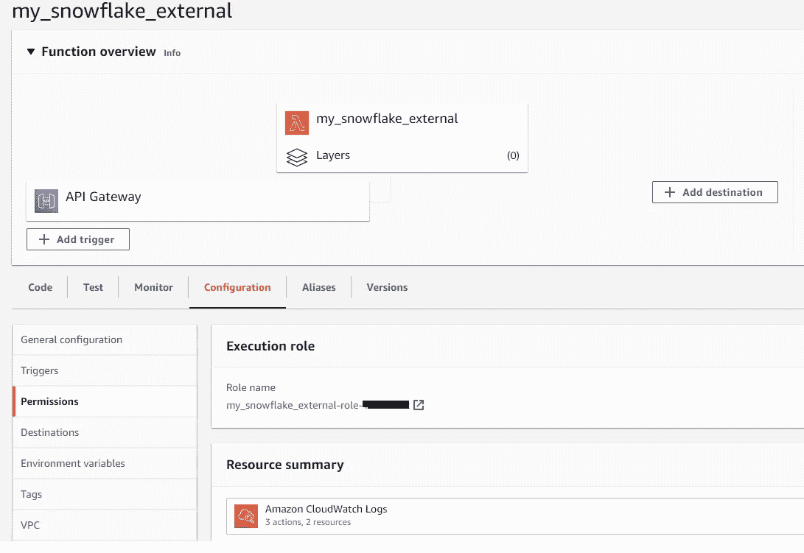
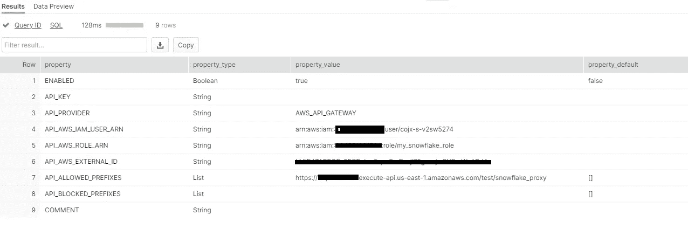

# AWS Lambda 与雪花的集成

> 原文：<https://towardsdatascience.com/aws-lambda-integration-with-snowflake-426debc9ec3a?source=collection_archive---------15----------------------->

图为[泰根·罗杰](https://unsplash.com/@t_saskia?utm_source=unsplash&utm_medium=referral&utm_content=creditCopyText)在 [Unsplash](https://unsplash.com/s/photos/snowflake?utm_source=unsplash&utm_medium=referral&utm_content=creditCopyText)

## 在 lambda 中执行 python 代码作为雪花中的外部函数

最近，我和 [Supreeth Chandrashekar](https://medium.com/u/2b96cea834d4?source=post_page-----426debc9ec3a--------------------------------) 合作了一项任务，我们希望对存储在雪花中的一些数据进行多重推理。我们利用外部函数触发 lambda，lambda 反过来从 AWS Sagemaker 端点(服务于不同的模型)获得推断。在这篇博客中，我们将讨论如何从雪花中调用 lambda。

# 解决方案概述

作者图片

# 工艺流程

1.  雪花用户承担目标帐户中的角色
2.  它使用角色调用 API 网关(API 网关资源策略只允许上述角色调用 POST 方法)
3.  API 网关将有效负载传递给 lambda
4.  Lambda 处理数据并将响应返回给 API Gateway
5.  API 网关向雪花发送回响应

# AWS 设置

## 我的角色将由雪花承担

只需创建一个没有权限的空角色。我们稍后将添加跨帐户信任。

## λ函数

创建一个 lambda 函数，它将响应 API 网关。使用下面的代码。这里要注意的重要事情是事件结构和响应结构。

雪花以 list 的形式发送事件，list 以 JSON 格式封装在名为`data`的 key 中。它期望响应对象包含一个`statusCode`键和一个带有 JSON 值的`data`键。

## API 网关

使用具有 lambda 代理集成的 POST 方法创建 API 网关。使用我们在上一步中创建的 Lambda ARN。在“方法请求”中添加 IAM 授权。

## 资源政策

替换以下 JSON 中的相关字段后，为 API 添加相同的资源策略。

最后，在 lambda 控制台中，您应该观察 API 触发的 Lambda 函数。

# 雪花设置

## API 集成

我们在雪花中创建了一个 API 集成。该集成将创建一个用户，并允许该用户承担我们在 AWS 设置步骤 1 中创建的角色。此外，它记录了我们在 API 网关中创建的 API 的执行端点。

## 外部函数

我们通过使用上一步中创建的集成来创建一个外部函数。使用以下代码进行集成和外部函数创建。

一旦创建了集成。描述集成。您将得到与下图类似的结果。

作者图片

记下`describe integration`命令输出的**API _ AWS _ IAM _ USER _ ARN**&**API _ AWS _ EXTERNAL _ ID**。在下面的策略中替换它，然后将它作为信任策略添加到开始时创建的“承担角色”中。

为了测试端到端功能，在雪花中运行该函数，您应该会看到 lambda 的响应。

添加从雪花内部执行 python 代码的功能，提供了雪花和云系统之间更好的集成。我们可以插入这些函数，并从雪花内部触发外部流程。

*注意:lambda 上有 6MB 有效载荷的限制，所以来自雪花的触发不能太大。*

快乐融入！！