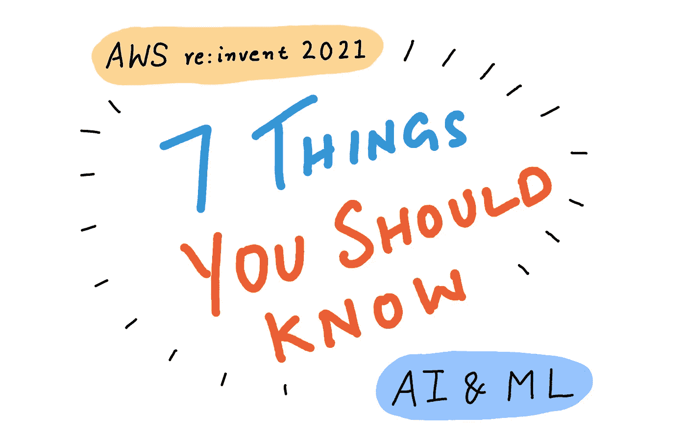
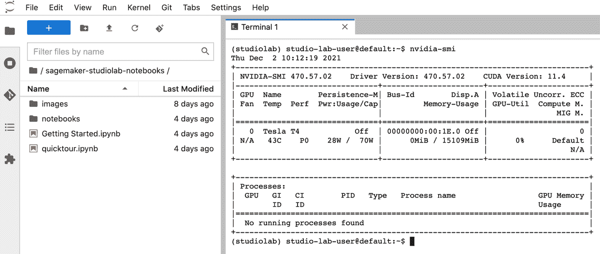
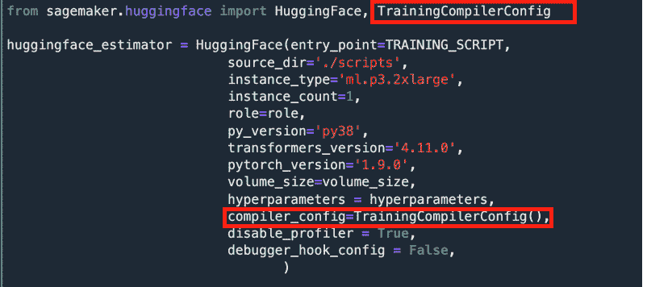
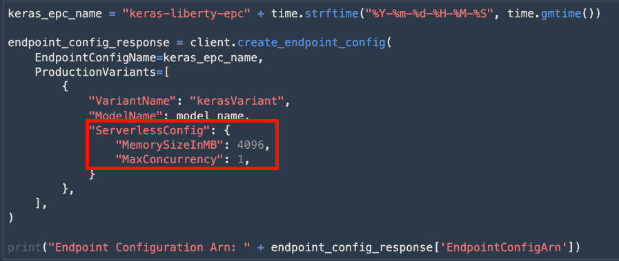
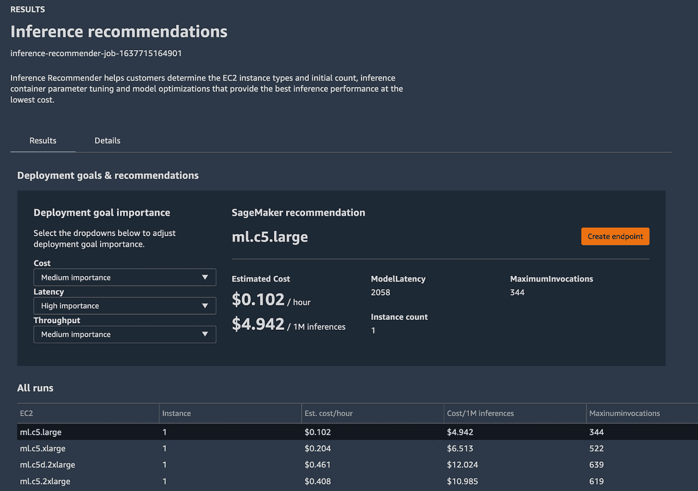
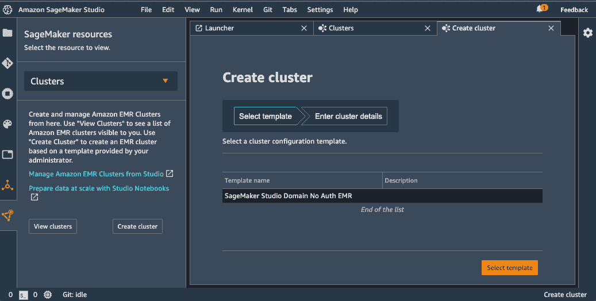
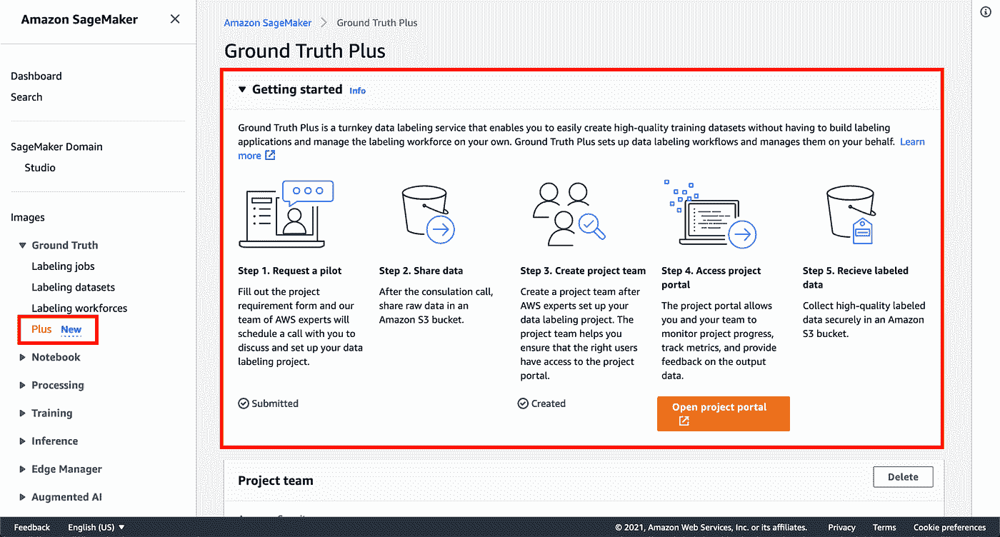
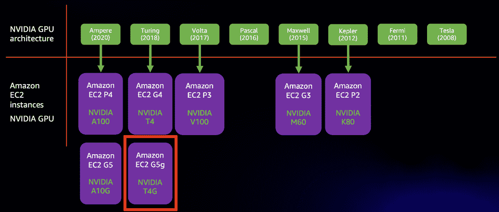
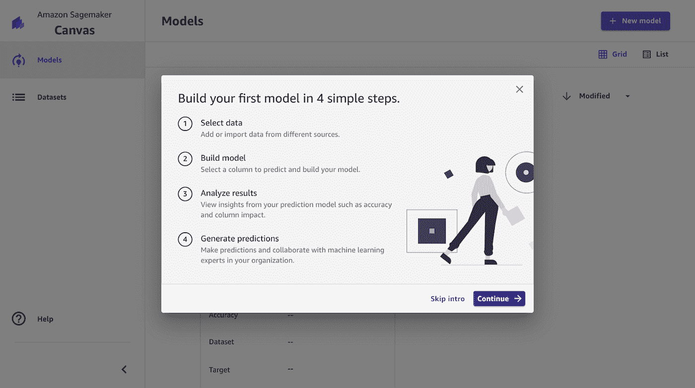

# AWS re:invent 2021 AI &机器学习发布会:你应该知道的 7 件事

> 原文：<https://towardsdatascience.com/aws-re-invent-2021-ai-machine-learning-launches-7-things-you-should-know-18c6c06fa982?source=collection_archive---------10----------------------->

## 你需要的唯一 re:invent AI/ML 发布摘要

作者插图

这是一年中最美好的时光——对云中的机器学习来说。AWS 本周在 re:invent 2021 上宣布了几项令人兴奋的人工智能和机器学习服务。在这篇文章中，我将为你逐个服务地分解所有的 ML 美味。我将所有有趣的人工智能/人工智能发布归类为 7 种不同的人工智能用例，因此您可以挑选与您的兴趣最相关的部分:

1.  ML 适合所有人
2.  ML 培训
3.  最大似然推理
4.  ML 和数据科学工作流
5.  ML 数据处理和标记
6.  ML 硬件
7.  面向非开发人员的 ML

听起来不错？我们开始吧！

# **1。每个人的 ML**

# 亚马逊 SageMaker 工作室实验室

## **什么事？**

亚马逊 SageMaker Studio Lab 是一项免费托管的 JupyterLab 服务，在这里您可以运行您的机器学习(ML)项目，而不需要 AWS 帐户、信用卡或云配置技能。你没看错，我说的是免费。如果您是开发人员、数据科学家、学生或初涉 ML 和数据科学的人，您将需要访问 CPU 和 GPU 计算资源。SageMaker Studio Lab 已经为您准备好了，只需创建一个帐户，您就可以访问云中的免费 ML 开发环境。就这么简单。

## **它是如何工作的？**

你可以选择纯 CPU 或 CPU+GPU 后端。如果您选择纯 CPU 后端，您将获得 12 小时的计算时间，这对于 Pandas 的大量数据预处理和 sci-kit learn 或 XGBoost 的经典 ML 算法训练来说已经足够了。对于深度学习训练，选择 GPU 后端获得 4 小时的计算时间，这对于在较小的数据集上训练或微调模型来说足够了。达到开始新会话的时间限制后，您可以立即重新启动 Studio lab 项目。您的数据(包括训练检查点)将在会话之间保持不变。

GPU 支持是由英伟达 T4 GPU，我也会在亚马逊 EC2 G4 实例中找到。作者图片

## **是给谁的？你应该什么时候使用它？**

像许多人一样，我在用学生预算购买的笔记本电脑上训练了我的第一个 ML 模型，并很快意识到我需要访问 GPU 来训练更复杂的深度学习模型。Studio Lab 是任何想要快速、轻松、无痛地访问机器学习计算资源的人。你可以使用 Studio Lab 来完成你的学校作业，参加 Kaggle 竞赛或者做 ML 研究。就我个人而言，我将首先使用 Studio Lab 制作模型原型，然后将其转移到 Amazon SageMaker 来运行更大规模的实验或在更大的数据集上进行训练。

# AWS DeepRacer 学生& AWS AI & ML 奖学金项目

## 这是什么？

本次发布包括两个部分:

1.  新的 DeepRacer 学生服务和 DeepRacer 学生联盟竞赛
2.  为参加 DeepRacer 学生联盟的学生提供奖学金计划

AWS DeepRacer Student 是一项面向全球 16 岁以上高中和高等教育入学学生的新服务。申请人可以访问 50 小时的 AWS AI/ML 内容，并接受 10 小时的模型培训，以及每月 5 GB 的存储空间，以参加 [AWS DeepRacer 学生联盟](http://deepracerstudent.com/)。

AWS 推出了 AWS AI & ML 奖学金计划，以帮助代表性不足和服务不足的高中和大学学生学习机器学习概念，并为他们在 AI/ML 领域的职业生涯做好准备。AWS AI & ML 奖学金计划每年为 2000 名学生提供 Udacity“用 Python 进行 AI 编程”纳米学位计划的奖学金。完成第一个纳米学位的前 500 名学生将有资格参加专门为 AWS AI & ML 奖学金获得者策划的第二个纳米学位项目。

## 它是如何工作的？

每个学生都可以注册并参与 AWS DeepRacer 学生计划，开始在排行榜中竞争。不需要 AWS 帐户。参加奖学金计划是可选的。要获得奖学金，您必须成功完成所有 AWS DeepRacer 学生学习模块，并在所有课程测验中取得至少 80%的分数，在学生联盟中驾驶 DeepRacer 赛车达到一定的单圈成绩，并提交一篇论文。奖学金获得者还可以从 Udacity 讲师那里获得长达 85 小时的辅导和指导。前往 http://student.deepracer.com/[的](http://student.deepracer.com/)开始吧！

## 是给谁的？

如果你是一名面临经济困难的学生，那么这个项目适合你。如果你是一名 16 岁以上的学生，自认为在技术领域服务不足或代表性不足，目前正在就读高中或全球认可的本科课程。你可能是科技行业中代表性不足的群体的一员，包括女性、残疾人、LGBTQ+人群以及有色人种。

# *2。ML 培训*

# 亚马逊 SageMaker 培训编译器

## **是什么？**

SageMaker Training 编译器是一款针对机器学习模型的优化编译器，旨在加快训练速度。它通过分析模型的计算图和寻找更好地利用 GPU 资源的机会来加速模型训练。最终结果是，您可以在不对培训脚本进行任何代码更改的情况下获得性能改进。

## **它是如何工作的？**

模型的计算图提供了许多简化的机会。例如，当您在没有训练编译器的 GPU 上训练您的模型时，您的模型的计算图中的操作将作为单独的 GPU 内核函数调用来执行。这增加了每次额外内核调用的函数调用开销。优化编译器可以识别这种低效，因为它可以查看完整的图形，而不是框架解释器会看到的独立函数。然后，编译器可以融合或组合运算符，从而减少 GPU 上的内核函数调用。编译器还可以查看整个图形，以便在内存规划和张量布局转换方面做出更好的决策，从而进一步加快训练速度。

作者图片

## **是给谁的？你应该什么时候使用它？**

如果你正在训练深度学习模型，你将受益于 SageMaker 训练编译器。在发布时支持的模型很少，包括大量的 HuggingFace 模型，并且您可以在不做任何代码更改的情况下获得一些免费的加速。编译模型的想法绝对不是新的，有几个模型编译器用于推理部署，如 SageMaker Neo、TVM 和 NVIDIA TensorRT。这是因为仅针对前向传递执行图形优化相对简单。在训练期间，你有向前传递和向后传递，这使得编译器的工作更加困难。我很高兴在 SageMaker 中看到训练编译器支持，并期待今天在 HuggingFace 模型上使用它，我将密切关注它将来支持的其他模型。

在 re:invent 2021 上还有其他与硬件培训相关的发布，我将在下面一个名为“ML 硬件”的专门章节中进行介绍。现在，让我们继续讨论 ML 推理服务的发布。

# 3.最大似然推理

# 亚马逊 SageMaker 无服务器推理[预览]

## **什么事？**

Amazon SageMaker 无服务器推理是一个模型托管功能，允许您部署端点进行推理，根据流量自动启动和扩展计算资源。使用 SageMaker 无服务器推理，您不必管理实例类型，只需为预测请求和处理这些请求所花费的时间付费。

## **它是如何工作的？**

如果您在 AWS 上使用其他无服务器服务，如 Lambda、Fargate、SQS 等，那么您应该可以在使用无服务器推理时获得类似的好处。借助无服务器部署，您无需根据需求和流量供应、管理或扩展 Amazon EC2 实例。SageMaker 无服务器推理将为您完成所有这些工作，使部署和扩展 ML 推理模型变得更加容易。

作者图片

## **是给谁的？你应该什么时候使用它？**

如果您已经在使用 SageMaker 来托管推理端点，那么只需更新您的端点配置，就可以很容易地从实时端点切换到无服务器端点。如果您预计您的流量在本质上是零星的，例如在一天的不同时间请求的数量是可变的，并且您没有严格的响应延迟要求，那么您应该从 SageMaker 无服务器推断开始。如果无服务器推理端点处于空闲状态，它将经历一个冷启动期，因此，如果您有一个延迟关键型应用程序，在任何时间点都不能容忍更低的延迟，您应该切换到实时端点，这些端点由您选择的专用 ml CPU 或 GPU 实例类型支持。对于其他一切，无服务器推理是一个显而易见的选择。

# 亚马逊 SageMaker 推理推荐器

## **什么事？**

Amazon SageMaker 推理推荐器加快了为您的模型部署找到正确的计算实例类型的过程，以最低的成本为您提供最高的性能。SageMaker 推理推荐器通过自动运行性能基准测试和跨 SageMaker ML 实例调优模型性能来实现实例类型发现过程的自动化。

## **它是如何工作的？**

SageMaker 支持超过 60 种实例类型和数量，选择合适的实例来满足您的部署目标可能会很耗时。您可以使用 SageMaker 推理推荐程序来运行默认的推荐作业，或者在一组选定的实例上指定自定义性能基准，以模拟您的生产部署的性能。您可能有一个目标吞吐量、延迟，并且您可以指定这些以及一个示例负载来运行测试。这个过程通常需要几个小时或更长时间，这取决于模型和自定义选项，结果可以在 SageMaker Studio 中查看，或在 Studio notebook 中使用 Pandas 等流行的库进行分析。

推理推荐器希望您的模型被打包到模型注册中心。通过创建模型包组来注册模型的好处是，您可以包含额外的元数据，例如服务容器、模型域(计算机视觉、NLP 等。)、任务(分类、回归等。)、框架(TensorFlow、Pytorch)、框架版本样本有效载荷等。一旦模型被注册，推理推荐器将处理剩下的。

基准测试完成后，您可以查看结果，并从延迟、吞吐量、成本、计算使用和内存使用等多个方面评估不同端点配置的利弊。

作者图片

## **是给谁的？你应该什么时候使用它？**

如果您目前有生产中的模型，您可能已经手动对多个 CPU 和 GPU 实例大小进行了基准测试，以确定满足您的目标延迟和吞吐量要求的正确实例，并计算每个实例上的部署成本，以选择最符合您预算的性能实例类型。如果这个人是你，那么亚马逊 SageMaker 推理推荐器将通过自动化过程为你节省几天甚至几周的时间。如果这个人不是你，那你也没必要变成那个人。使用亚马逊 SageMaker 推理推荐器，节省自己宝贵的时间。

# 4.ML 和数据科学工作流

# Amazon SageMaker Studio 与 Amazon EMR 的集成

## **什么事？**

Amazon SageMaker Studio 引入了与 Amazon EMR 的深度集成，使您不仅可以查看现有的 EMR 集群，还可以创建、监控和调试运行在 EMR 上的 Spark 作业，而无需离开您的 SageMaker Studio 界面。通过这种集成，您可以在 SageMaker Studio 界面中启动 Amazon EMR 集群，使用 SageMaker spark 库执行数据预处理，然后在 SageMaker 中训练和托管您的模型。在一个 SageMaker Studio 用户界面下，您得到的是端到端的数据预处理到部署工作流。

## **它是如何工作的？**

典型的设置是使用 AWS 服务目录来定义和推出预配置的模板，允许 SageMaker Studio 用户直接从 Studio 创建 EMR 集群。在这个通常由 DevOps 管理员或才华横溢的数据科学家执行的初始设置过程之后，您的 Studio 环境就可以创建 EMR 集群，连接到它，使用 Spark UI 监控和调试 Spark 作业。要运行 Spark 作业，您可以使用 Sparkmagic，它允许您在 Jupyter Notebook 中针对您在 Studio 中创建的远程 EMR 集群运行 Spark 代码。Sparkmagic 还创建了一个自动 SparkContext 和 HiveContext。

作者图片

使用完集群后，您还可以在 Studio 界面中终止它。

## **是给谁的？你应该什么时候使用它？**

如果你是一名数据工程师或数据科学家，使用运行在亚马逊 EMR 上的 Apache Spark、Hive 或 Presto 来做数据准备，并且还需要在亚马逊 SageMaker 中开发模型、训练、调优和部署它们，那么 SageMaker Studio 和亚马逊 EMR 之间的这种集成将使你的生活变得容易得多。我认为这离理想的完全集成的开发环境更近了一步，无论您是执行数据预处理还是模型部署，您都不必离开这个环境。

# 5.ML 数据标记

# 亚马逊 SageMaker 地面真相加

## **是什么？**

Amazon SageMaker Ground Truth Plus 是一项数据标注服务，它使用 AWS 管理的工作人员来提供高质量的标注，而无需您构建标注应用程序和管理标注工作人员。启动 Amazon SageMaker Ground Truth Plus 项目将使您与 AWS 团队保持联系，他们将与您一起了解您的用例、标签量和时间线要求。在项目批准时，您的数据集将由训练有素的 AWS 管理的工作人员使用已经可用的 SageMaker Ground Truth 功能进行标记。这意味着您不必与多家贴标供应商合作或在内部建立贴标团队，您可以仅在需要对数据进行贴标时使用 Ground Truth Plus 服务，从而解放您的数据科学家和 ML 专家的时间，让他们专注于模型开发和部署。

## 它是如何工作的？

作为 SageMaker Ground Truth Plus 的用户，您负责定义您的项目目标并提供数据集，输出是您的 S3 桶中的高质量数据标签，您可以使用 Amazon SageMaker 等服务来构建、训练和部署机器学习(ML)模型。在幕后，SageMaker Ground Truth Plus 结合了 ML 辅助预标记、人工专家标记和 ML 辅助验证人工标签，以检测人工错误和低质量标签。SageMaker Ground Truth Plus 还为您提供了一个了解质量控制数据标签操作的窗口。您可以监控进度，在仪表盘上查看标注指标，并对输出数据集提供反馈。

作者图片

## **是给谁的？你应该什么时候使用它？**

SageMaker Ground Truth Plus 适用于贵组织中负责生产 ML 团队使用的高质量标注数据集的人员。此人是数据领域和业务问题方面的专家，需要一个端到端的标签解决方案。在较小的团队或组织中，这可能是数据科学家，或者在较大的团队或组织中，这可能是专门的数据运营经理。无论您的角色是什么，您都不希望管理一年中不断变化的标签需求的标签工作人员，而是希望及时向您的 AI/ML 团队交付高质量的标签数据。

# 6.ML 硬件

# 由 AWS Graviton2 处理器支持的 Amazon EC2 G5g 实例

## **什么事？**

Amazon EC2 G5g 是目前 AWS 上广泛可用的 GPU 实例列表中的最新成员。G5g 是第一个将 NVIDIA GPU 与 AWS Graviton2 CPU 配对的实例。

作者图片

## **是给谁的？你应该什么时候使用它？**

EC2 G5g 实例是一个经济高效的机器学习推理部署选项，是基于英特尔 CPU 的 EC2 G4 和 EC2 G5 的替代方案。NVIDIA 在 AWS Marketplace 上提供深度学习亚马逊机器映像，它预配置了所有必要的 NVIDIA 驱动程序、库和依赖项，以便在 EC2 G5g 上运行支持 Arm 的软件。

# 亚马逊 EC2 Trn1 实例[预览]

## 这是什么？

亚马逊 EC2 Trn1 实例由 AWS Trainium 提供支持，这是一款由 AWS 设计的高性能 ML 训练芯片，用于加速训练工作量。Trn1 实例是首批网络吞吐量高达 800 Gbps 的 EC2 实例，是基于 GPU 的 EC2 实例的网络吞吐量的两倍。它们还支持加速器之间的超高速互连，以在云中提供最快的 ML 训练。

## **是给谁的？你应该什么时候使用它？**

EC2 Trn1 基于 AWS Trainium 加速器，这是继 NVIDIA GPUs 和英特尔 Habana Gaudi 之后，AWS 上用于 ML 培训的第三种加速器类型。如果您现在正在使用 GPU，并且正在突破 P4d.24xlarge GPU 实例的极限，那么 Trn1 应该会在它退出预览时引起您的注意。Trn1 也是第二个包含 AWS 设计的芯片的实例类型，第一个是 Inf1 实例，带有为推理而设计的推理加速器。要在 Inf1 上加速您的模型，您需要使用 AWS Neuron SDK，而同一 SDK 也不支持用于训练工作流的 Trn1 实例。

总的来说，我很高兴看到这么多的加速器选择 ML 从业者。当它变得可用时，我很兴奋地测试它，你可以打赌，在它可用后不久，我将为你准备一个深入的博客帖子。

# 7.面向非开发人员的 ML

# 亚马逊 SageMaker 画布

## **什么事？**

亚马逊 SageMaker Canvas 提供了一个可视化的点击界面，无需编写任何代码就可以创建机器学习模型并生成预测。它的 UI 为您提供了访问数据集、创建连接、选择目标变量列的选项。然后，它会自动训练多个模型，并让您直观地分析模型性能，生成预测。

## **它是如何工作的？**

Canvas 支持从亚马逊 S3 或本地上传的 CSV 文件类型。您还可以从 Amazon Redshift 或 SnowFlake 导入，并选择执行连接和 SQL 查询，以便更好地控制导入过程。导入数据集后，您可以使用左连接、右连接、内连接和外连接来组合数据集。当您对数据集满意时，可以选择要预测的目标列。SageMaker Canvas 将自动确定 type 问题类型—二元或多类分类或回归。当你开始训练时，它将建立多达 250 个模型，并选择一个表现最好的。最佳是主观的，所以你可以预览模型，看看它的估计准确性，并使用它来生成新数据集的预测。

**注:**作为一名 ML 教育者和实践者，我有责任告诉你负责任地使用你训练过的模型。模型可能有偏差，数据集也可能有偏差。引用著名统计学家乔治·博克斯的话“所有的模型都是错的，有些是有用的”。不管训练模型有多容易，都要对它们的有用性做出最佳判断。

作者图片

## **是给谁的？你应该什么时候使用它？**

读完这篇文章后，如果你的第一反应是测试 SageMaker Training 编译器，那么可以肯定 SageMaker Canvas 不适合你。SageMaker Canvas 可以简化数据分析和其他面向统计的工作角色的模型开发，这些工作角色需要构建预测模型，但不一定具备 python 编码或使用 SageMaker Studio 的技能。如果您具有解释数据集、理解数据分布和数据不平衡、识别好的和差的数据集以及缺失数据如何影响预测的技能，SageMaker Canvas 可以填补模型开发空白，因此您可以专注于成为数据和领域专家。

# 回复:cap

我发现这是 AI/ML 发布以来最激动人心的发明之一，原因如下。

我们得到了一个使用 SageMaker Canvas 非常简单的服务，我们得到了一个免费的服务，每个人都可以使用，包括 SageMaker Studio Lab 的学生。我们获得了一项服务，专家数据科学家可以依靠这项服务来加快 SageMaker 训练编译器的训练速度，我们还获得了一项服务来帮助数据科学家找出最佳实例来托管他们的 SageMaker 推理推荐器模型。我们得到了一个服务来托管模型，而不需要使用 SageMaker 无服务器推理来管理实例。我们为数据标注项目经理提供了一项服务，通过 SageMaker Ground Truth Plus 获得高质量的标注数据集。最后，我们用 Trn1 和 G5g 获得了新的训练和推理加速器，这意味着开发者有了更多的选择。我们为每个人提供人工智能/人工智能服务！

1.  **ML for everyone:** 亚马逊 SageMaker 工作室实验室，AWS DeepRacer 学生& AWS AI & ML 奖学金项目
2.  **ML 训练:**亚马逊 SageMaker 训练编译器
3.  **ML 推理:**亚马逊 SageMaker 无服务器推理，亚马逊 SageMaker 推理推荐器
4.  **ML 和数据科学工作流程:** Amazon SageMaker Studio 与 Amazon EMR 的集成
5.  **ML 数据处理和标注:**亚马逊 SageMaker Ground Truth Plus
6.  **ML 硬件:**亚马逊 EC2 G5g，亚马逊 EC2 Trn1
7.  **面向非开发者的 ML:**亚马逊 SageMaker Canvas

所有的东西都在这里了！如果你喜欢阅读这份总结，请随时在 medium、 [twitter](https://twitter.com/shshnkp) 和 [LinkedIn](https://www.linkedin.com/in/shashankprasanna/) 上关注我。在接下来的几周里，我将会忙于对这些服务进行更深入的研究，你不会想错过的。下一篇博文再见！