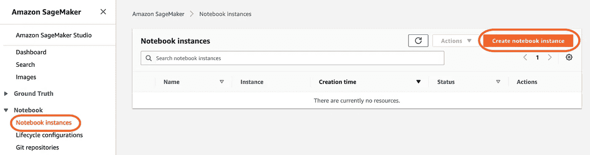
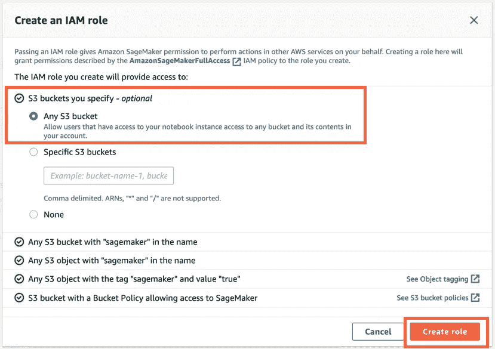
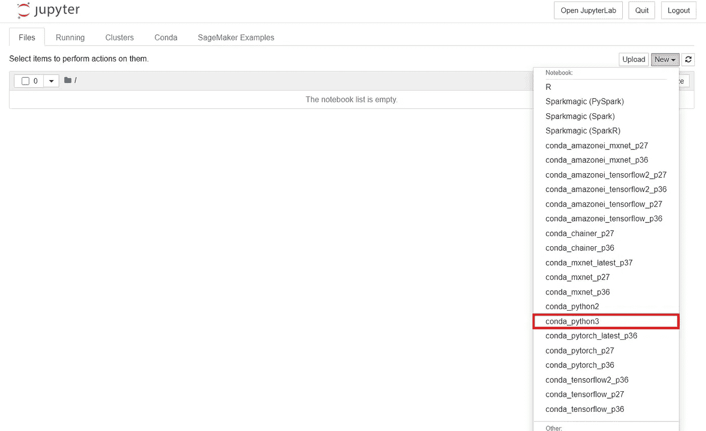
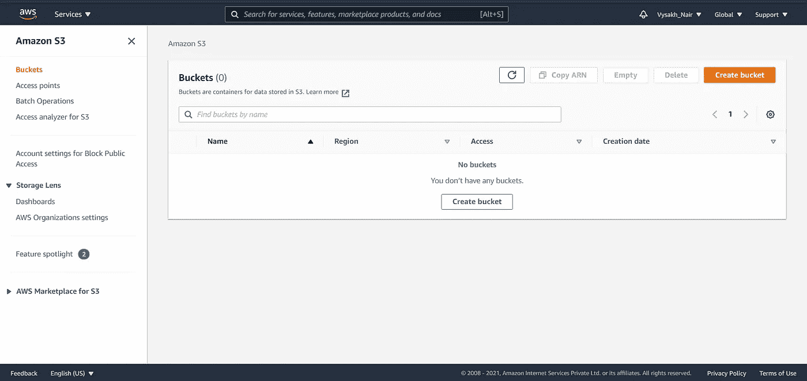

# AWS SageMaker

> 原文：<https://towardsdatascience.com/aws-sagemaker-db5451e02a79?source=collection_archive---------8----------------------->

## 在 Amazon SageMaker 上构建、训练和部署一个 ML 模型


亚历克斯·库利科夫在 Unsplash 上的照片

让我们从简单简短的 SageMaker 介绍开始，理解我们正在使用的是什么，稍后我们将深入 ML 教程！

# 什么是 AWS SageMaker？

亚马逊 SageMaker 是一个云机器学习平台{就像你的 jupyter 笔记本环境一样:)，但在云上}帮助用户在生产就绪的托管环境中构建、培训、调整和部署机器学习模型。

# 使用 AWS SageMaker 的一些好处

*   高度可扩展
*   快速训练
*   保持正常运行时间—过程保持运行，没有任何中断。
*   高数据安全性

# 用 SageMaker 进行机器学习

SageMaker 附带了许多内置的优化 ML 算法，这些算法广泛用于训练目的。现在要建立一个模型，我们需要数据。我们可以自己收集和准备培训数据，或者我们可以从亚马逊 S3 桶中选择，这是 AWS SageMaker 内的存储服务(有点像你系统中的硬盘驱动器)。让我们看看如何利用这个服务来构建一个端到端的 ML 项目。

# 现在让我们开始在 SageMaker 上构建我们的模型

本教程的重点将是使用 SageMaker 和所使用的库。任何 ML 概念都不会有任何解释。

**注意** : *你应该有一个 AWS 账户来执行这些任务。*

## 1.创建笔记本实例

就像您在您的系统中创建一个 jupyter 笔记本一样，我们也将在我们的平台上创建一个 jupyter 笔记本。以下是执行相同操作的步骤:

*   登录 AWS SageMaker 控制台*。*
*   点击**笔记本实例**，然后选择**创建笔记本实例。**



作者图片

*   在下一页，**将您的笔记本命名为**，将**实例类型**和**弹性推理**保留为默认，并为您的实例选择 **IAM 角色**。



图片作者|从下拉列表中，选择**创建一个新角色**，并选择**任何 S3 桶**

**IAM(身份和访问管理)角色:**

简而言之，SageMaker 和 S3 水桶是由 AWS 提供的服务。我们的笔记本实例需要存储在 S3 桶中的数据来构建模型。在 AWS 中，一个服务不能直接访问另一个服务。因此，应该提供一个**角色**，以便笔记本实例可以从 S3 存储桶访问数据。您可以为您的例程提供特定的 S3 时段或所有的 S3 时段。

*   创建角色后，点击**创建笔记本实例**。
*   创建实例需要几分钟时间。之后点击 **jupyter，**选择你想要使用的笔记本环境。



图片作者|本教程我选择了 conda_python3

这就是了。您的笔记本已创建。

## 2.了解使用的库

在本次会议中，我们将研究执行该任务所需的所有库:

使用的库

正如我之前提到的，AWS 包含了很多我们可以使用的内置 ML 算法。为了使用这些算法，我们需要 **sagemaker** 库。所有这些内置算法都是图像容器的形式，因此 **get_image_uri** 帮助我们访问这些容器。

如果你正在使用 sagemaker，你需要 **boto3** 库。就像您使用 pandas 从您的本地系统读取数据一样， **boto3** 帮助我们访问 S3 存储桶中的数据，前提是提供对这些存储桶的访问权限(还记得我的角色吗？).现在，如果我们想使用 sagemaker 实例，我们必须创建会话来完成。**会话**库用于创建会话。

## 3.创建 S3 存储桶



图片作者|最初没有水桶

S3 桶可以手动创建，也可以使用 boto3 从我们的笔记本实例中创建。在本教程中，我们将使用 boto3 来创建一个。

创建 S3 桶的代码

在 AWS 中有多个区域，每个用户在自己的区域工作。默认情况下，存储桶是在美国东部(N. Virginia)地区创建的，因此，如果您所在的地区不是 **US-East-1** ，您必须在创建存储桶时明确指定您所在的地区。

```
**my_region = boto3.session.Session().region_name** # this gives you               your region
**s3.create_bucket(Bucket=bucket_name, CreateBucketConfiguration={ 'LocationConstraint': my_region })** # this is how you explicitly add the location constraint
```

存储桶名称是全球唯一的！如果您与一个已经存在的存储桶冲突，并且您指定了一个不同于已经存在的存储桶区域的区域，AWS 将向您提供“IllegalLocationConstraintException”错误。如果您碰巧猜出了现有 bucket 的正确区域，它会给出 BucketAlreadyExists 异常。

除此之外，在给它们命名时，还必须记住一些命名约定:

*   存储桶名称的长度必须在 3 到 63 个字符之间。
*   存储桶名称只能由小写字母、数字、点(。)，以及连字符(-)。
*   存储桶名称必须以字母或数字开头和结尾。
*   存储段名称不得格式化为 IP 地址(例如，192.168.5.4)
*   桶名不能以`xn--`开头(2020 年 2 月以后创建的桶)。
*   存储桶名称在一个分区中必须是唯一的。分区是一组区域。AWS 目前有三个分区:`aws`(标准地区)`aws-cn`(中国地区)，以及`aws-us-gov` (AWS GovCloud【美国】地区)。
*   与亚马逊 S3 传输加速一起使用的桶不能有点(。)在他们的名下。有关传输加速的更多信息，请参见[亚马逊 S3 传输加速](https://docs.aws.amazon.com/AmazonS3/latest/dev/transfer-acceleration.html)。

## 4.将数据加载到 S3

我们首先将数据分为训练和测试。然后我们会把它运到 S3。

使用 SageMaker 时要记住的一个重要步骤是，SageMaker 中的内置算法期望相关要素是我们数据集的第一列。因此，如果数据集的第一列不是依赖要素的第一列，请确保对其进行更改。

将训练和测试数据加载到 S3 存储桶中

s3_input_train 和 s3_input_test 包含 s3 存储桶中上传的训练和测试数据的路径，这些数据将在以后训练时使用。

## 5.构建和训练模型

模型

容器通过指定区域名来检索内置的 XGB 模型。**估算器**通过指定我们希望在 **image_uri** 下使用的算法来处理端到端的 Amazon SageMaker 培训和部署任务。s3_input_train 和 s3_input_test 指定了训练和测试数据在 s3 存储桶中的位置。我们在步骤 4 中确定了这些路径。

## 6.部署

```
**xgb_predictor = xgb.deploy(initial_instance_count=1,instance_type='ml.m4.xlarge')**
```

然后可以使用上面的代码行部署训练好的模型。 **initial_instance_count** 指定预测时应该使用的实例数量。实例数量越多，预测越快。

## 7.预言；预测；预告

上述代码可用于预测结果。

## 8.打扫

在这一步中，您将终止您使用的所有资源。终止当前未被使用的资源可以降低成本，并且是一种最佳做法。不终止您的资源将导致您的帐户收费。

```
# Delete your deployed end points
**xgb_predictor.delete_endpoint() 
xgb_predictor.delete_model()**# Delete your S3 bucket
**bucket_to_delete = boto3.resource('s3').Bucket(bucket_name) bucket_to_delete.objects.all().delete()**
```

最后删除你的 SageMaker 笔记本:停下来，删除你的 SageMaker 笔记本。

1.  打开 SageMaker 控制台。
2.  在笔记本下，选择笔记本实例。
3.  选择您为本教程创建的笔记本实例，然后选择“操作”、“停止”。笔记本实例需要几分钟才能停止。当状态变为“已停止”时，继续下一步。
4.  选择操作，然后选择删除。
5.  选择删除。

> 你有它！这就是如何使用 AWS SageMaker 构建一个端到端的 ML 模型
> 
> *本教程的完整代码可以从我的*[**GitHub**](https://github.com/vysakh10/AWS-SageMaker)*中访问。*
> 
> *随时和我联系*[**LinkedIn**](https://www.linkedin.com/in/i-am-vysakh/)*。*

> 希望你喜欢这个教程。感谢阅读:)