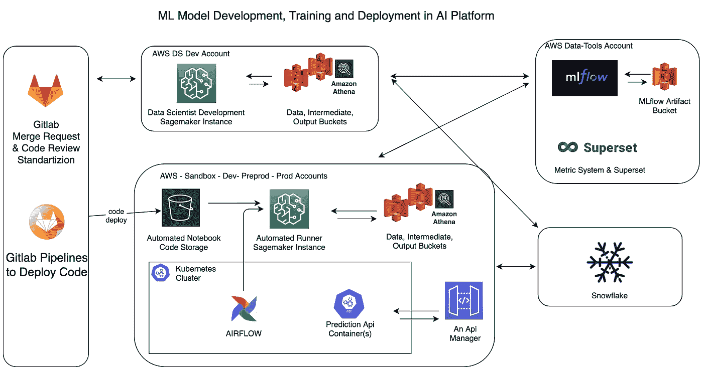
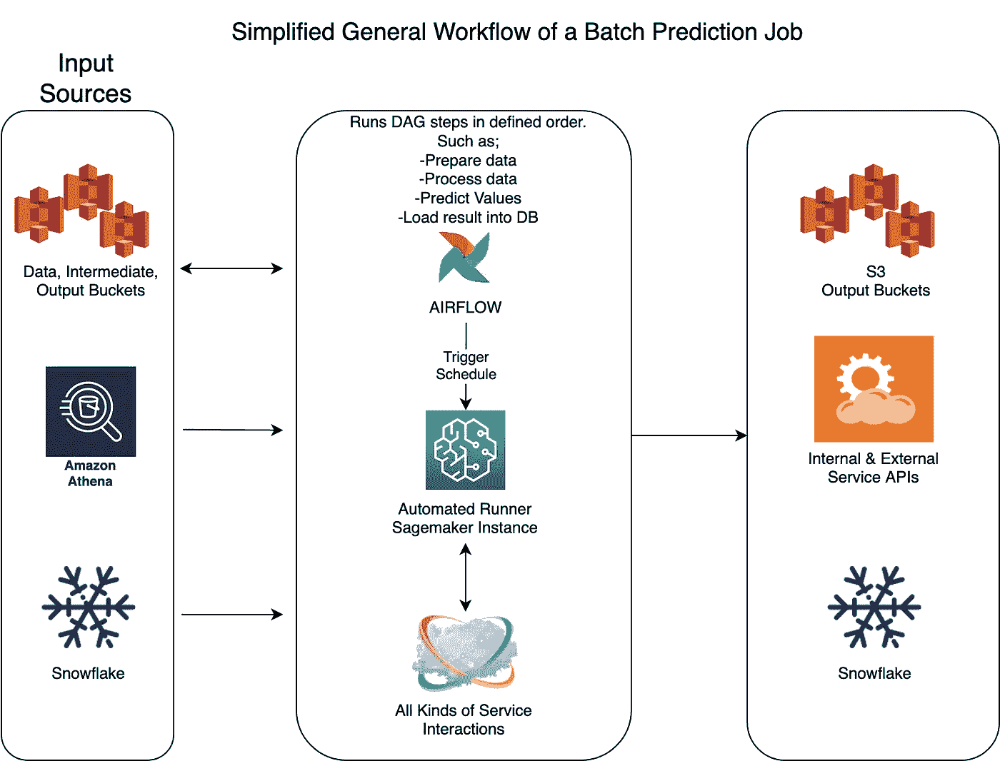

# AWS Sagemaker 气流工作流管理

> 原文：<https://towardsdatascience.com/aws-sagemaker-workflow-management-with-airflow-979748bf1eb0?source=collection_archive---------14----------------------->

## [实践教程](https://towardsdatascience.com/tagged/hands-on-tutorials)

## 使用 Sagemaker 笔记本电脑和 Airflow DAGs 生产数据科学项目

在这篇文章中，我将谈谈我在 [AWS Sagemaker](https://aws.amazon.com/sagemaker/) 实例上使用气流调度数据科学项目笔记本的经验。我们已经使用网飞的 [papermill](https://papermill.readthedocs.io/en/latest/) 库运行 [Jupyter](https://jupyter.org/) 笔记本两年多了，每天都有数十个 Sagemaker 笔记本实例由气流精心编排，工作起来很有魅力。

你将读到这个系统的总体架构设计，工作方式是什么，团队之间的角色和职责是什么，以及你如何自己实现它。

本文原载于我的个人博客[https://halilduygulu . com/blog/2021-12-11-managing-sage maker-workflows-with-air flow](https://halilduygulu.com/blog/2021-12-11-managing-sagemaker-workflows-with-airflow)

# [问题](https://halilduygulu.com/blog/2021-12-11-managing-sagemaker-workflows-with-airflow#the-problem)

这一切都是从我在网飞博客上读到的[这篇关于使用外部参数运行 jupyter 笔记本文件来生产数据科学工作负载的文章开始的。这可能是我在以前的公司面临的一个常见问题的解决方案，我们使用 pyspark 和其他 python 代码运行 Apache Spark 应用程序，用于 AWS EMR 上的数据科学和报告项目。大多数开发都是通过笔记本进行的，因为 Jupyter 笔记本几乎是数据科学家的标准开发环境。当时，一个常见的问题是在开发和准备生产代码期间，将代码从 ipynb 笔记本文件移动到普通的 python 文件，然后再移动回来。由于这是两个独立的文件，这涉及到从笔记本到。用于生产作品的 py 文件。](https://netflixtechblog.com/scheduling-notebooks-348e6c14cfd6)

虽然在项目的早期阶段，这是一项简单的任务，但后来当一个较旧的项目必须修改以获得新功能或修复错误时，您每次都必须从 python 文件创建一个笔记本文件，或者在您的工作区中找到较旧的笔记本，并使用 python 文件上发生的更改来修改它。当您完成开发后，现在是时候将更改放入 python 文件中了，再次将您最近所做的更改复制粘贴到 python 文件中并测试它。在这种来回的复制粘贴过程或自动生成文件的过程中，经常会发生一些简单的错误，如忘记导入、漏掉一行修改、缩进错误等..有些错误是立即可见的，有些是在运行 spark 应用程序超过 3 个小时后才可见的。如果只有一个人在一个项目中工作，想象一下，多个数据科学家在同一个项目中使用多个笔记本文件，将函数或代码块从一个文件移动到另一个文件，这是一项非常复杂的工作，仅仅是解决 git 上的冲突。

使用笔记本进行开发、python 进行生产的另一个缺点是，对于在测试 airflow automation dag 期间发生的错误，您会得到许多“它正在我的开发环境中工作”的响应。而这些错误都是简单的编码错误，就像我上面提到的，缺失导入，硬编码值，开发时使用的额外导入，requirement.txt 文件中缺失库等等。所以本质上，项目的可维护性是一个痛点。

# [解决方案](https://halilduygulu.com/blog/2021-12-11-managing-sagemaker-workflows-with-airflow#the-solution)

当我开始在目前的公司工作时，我不想有同样的问题，并从一开始就寻找一种方法来建立数据科学和数据工程团队之间的可靠工作方式。这个想法是，数据科学家可以自由地在 Sagemaker 笔记本实例上开发他们的项目，只要他们在 git 存储库中交付这个项目，并在 requirements.txt 文件中运行笔记本文件和整个依赖项，当使用 Airflow 生产项目时。

因此，从数据工程的角度来看，我们只需要知道应该安装哪些依赖项，然后哪些笔记本文件必须用一组参数和笔记本文件的顺序(如果有多个)来执行。有了这些信息，任何数据工程师都可以准备一个 DAG，在生产流程中按照要求的时间表运行这个项目，因为几乎所有的数据科学项目都有通用而简单的代码作为抽象的结果。通过将项目级别的领域知识保存在笔记本文件中，并将常见任务抽象为 Airflow 操作符，我们已经将安排关于 Airflow 的数据科学项目任务作为配置流程，而不是开发工作。

现在我们已经讨论了工作方式，让我们深入系统架构和实现的细节。

作者图片

上面你可以看到 AI 平台的简化概览图。我们将在这里讨论的主要组件是 Airflow 和 Sagemaker，但让我简单解释一下其他一些工具。

我们主要使用 s 3 存储桶作为 data science 的输入源，每个帐户都有 3 个主要存储桶，位于许多其他 S3 存储桶之上，用于其他目的。

*   **数据**，一个只读桶，在一个类似于 Hive 文件系统的文件夹结构中包含拼花文件。我们还在这些文件之上提供了 AWS Athena 用于特殊查询。
*   **中间**，读/写桶，存储不重要的临时、短期文件。想象一下 spark 作业的 parquet 或 json 输出，它们将作为管道中下一步的输入。
*   **输出**，读写桶，应用最终产品的存储。因此，如果有必要，预测结果、经过训练的模型或工件会长期存储在这里。

我们还在大多数项目中使用 MLflow，它用于存储跨帐户的模型工件和度量。并且雪花是公司中的主要数据仓库，对于一些项目也用作输入数据源，对于许多项目雪花是 ML 模型的输出数据的目的地。将数据加载到雪花是通过气流完成的。

如果我们回到运行笔记本文件的 Airflow 和 Sagemaker 编排，我们可以从讨论笔记本和项目中的其他代码是如何部署的开始。如图所示，每个项目的代码照常存储在 Gitlab 中，部署任务实际上做了一件简单的事情，将这个项目中的全部代码复制到一个 S3 桶中，我称这个桶为`automated-notebook`。与其他 S3 存储桶一样，该存储桶存在于每个名称带有后缀的 aws 帐户中。因此，当您在 gitlab pipeline 中单击 deploy to preprod 时，它实际做的是将项目内容复制到`xx-automated-notebook-preprod` bucket 中，以便 Sagemaker 实例在运行笔记本时可以访问该分支中代码的最新部署版本。

好了，我们把代码放在了 Sagemaker 实例可以访问的地方，现在我们需要一个触发器，在我们的例子中是气流。正如我上面提到的，每个项目都有一个 dag，当 DAG 运行时，它为每个项目执行几乎标准的任务，例如；

## 创建一个 Sagemaker 实例

根据 DAG 的要求，我们可以在一个 sagemaker 实例中运行所有笔记本，也可以使用多个 sagemaker 实例并行运行它们。想象这样一个场景，您为每个国家训练一个模型，因此我们可以简单地同时为 20 个国家启动 20 个 sagemaker 实例，因为没有必要等待彼此训练完成后再启动下一个。我们通常这样做，并保持 dag 的总运行时间不变，即使国家的数量在不断增加。有时，您必须为每种类型的实例创建 AWS 限制增加支持票，以增加您的活动 Sagemaker 实例数。

## 获取 Sagemaker 实例[的 IP 地址](https://halilduygulu.com/blog/2021-12-11-managing-sagemaker-workflows-with-airflow#get-ip-address-of-sagemaker-instance)

由于我们每次都创建一个新的实例，这也意味着它们在 aws 私有子网中被分配了新的私有 ip 地址，我们需要这个 IP 地址才能 ssh 到这些实例中。虽然 AWS 没有在 boto3 的描述实例 api 响应中返回这个 IP，但是因为实例是在我们的子网中创建的，所以我们仍然能够在弹性网络接口(ENI)控制台中找到它们。因此，通过一些 boto3 api 调用技巧，我们现在能够获得 IP 并通过 Xcom 将其传递给 Airflow 中的下一个任务。

## 通过 Papermill [运行笔记本](https://halilduygulu.com/blog/2021-12-11-managing-sagemaker-workflows-with-airflow#run-notebooks-via-papermill)

为了运行 papermill 命令，我们将使用 Airflow **SSHOperator** 和几个链接在一起的命令。

*   将项目代码签入新创建的 Sagemaker 实例。这是一个从自动笔记本存储桶到本地磁盘的`aws s3 sync`命令。
*   激活本项目中使用的首选 conda 环境。
*   安装所需的 papermill 版本，因为不是每个 conda env 都有默认版本。
*   使用项目中的文件通过`pip install -r requirements.txt`安装项目依赖项。
*   最后，在其他一切准备就绪的情况下，我们运行 papermill 命令，该命令包含笔记本名称、输出目的地、内核和许多其他要传递给笔记本文件的自定义参数。

Papermill 是一个伟大的项目，我最喜欢它的两个特点。当然，第一个是注入参数。Papermill 使您能够将参数注入笔记本文件，如果您只是在 ipynb 文件[中添加一个带有`parameters`标签的单元格，如这里所述](https://papermill.readthedocs.io/en/latest/usage-parameterize.html)。我们使用此功能将一些标准参数传递给笔记本，如 aws 环境名称或 id、来自 airflow dag 的执行日期以及项目/模型特定参数。

papermill 的第二个功能是，您可以将每个笔记本运行文件与单元输出和注入参数等保存在一起。得救了。ipynb 文件看起来与您手动运行它时一样。这为我们提供了两件事情，使用详细的错误日志进行故障排除，以及保存每次计划的运行以供审计或保存历史记录。基本上每个自动运行的笔记本文件都作为一个单独的文件保存在 S3 上。

## 删除 Sagemaker 实例

当所有笔记本文件都通过 Airflow dag 中的 SSHOperator 执行时，下一步是删除这个 Sagemaker 实例，因为我们不再需要它了。此 dag 和其他 Dag 的下一次运行将创建他们自己的 Sagemaker 实例来运行笔记本，这为我们提供了每个项目的临时和*隔离运行时，以及项目的更多并发运行程序。AWS Sagemaker 管理 api 的限制是每秒 4 个请求，因此如果出现 api 错误，您需要处理这个问题。*

## 交付结果

由于此流程用于 ML 模型训练以及预测/推理，大多数情况下 Dag 会有一个最终步骤，我们将笔记本的输出加载到雪花或其他目的地。这些是基于项目需求的 json 或 parquet 文件，在我们的例子中，与 Snowflake 或其他第三方的交互比在笔记本文件中更容易。Airflow 几乎为我们已经集成的所有东西都提供了一个操作符或插件，因此我们选择不在数据科学项目笔记本中包含这一职责，以保持简单。

作者图片

上面，我用 Sagemaker 笔记本实例为一个典型的气流 DAG 添加了一个简单的流。每个笔记本都可能在其中进行非常复杂的 ML 模型训练或预测，但从数据工程的角度来看，这是一个简单的应用程序，通过带有参数的气流触发，与各种源数据系统交互，并产生将被传递到目标系统的输出。

# 此解决方案的优势

*   数据工程师不需要了解数据科学项目的细节就可以实现自动化。
*   数据科学家可以开发和测试没有硬编码参数的笔记本，并且知道相同的代码正在生产中运行，没有复制粘贴，没有临时代码行等。所有的代码变更和历史都在 git 仓库中。
*   应用程序运行时是相同且独立的。每个 sagemaker 实例安装项目需求，并且只运行一个项目。不存在会导致与库版本冲突或需要定期维护长期运行时。
*   您不必等待另一个项目完成，这样另一个项目就可以开始运行。
*   所有 Sagemaker 实例仅在应用程序运行时使用，稍后会终止。因此，闲散人员无需支付任何费用。
*   多个软件开发环境可用于测试或解决生产问题，因为所有实例都设置相同，并且具有来自 git 存储库的相同代码。
*   任何支持的语言或内核都可以在项目中使用，这只是 Airflow dag 中的一个参数。
*   可以保持历史记录的日志气流，也在 S3 从造纸厂输出。
*   不需要丰富的 docker 经验或 kubernetes 集群管理员。
*   不需要处理 EMR 集群设置以及随之而来的相关问题。
*   您受到最大 Sagemaker 实例类型的限制，目前为 96 个 cpu 和 768 GB 内存，但在我们的情况下，这已经足够了，作为回报，我们不必维护 EMR 集群或其他运行时来运行数据科学工作负载。如果需要，在使用其他优势的同时，还有其他解决方案可供使用。

**链接**

*   【https://aws.amazon.com/sagemaker/ 
*   [https://papermill.readthedocs.io/en/latest/](https://papermill.readthedocs.io/en/latest/)
*   [https://netflixtechblog . com/scheduling-notebooks-348 E6 c 14 CFD 6](https://netflixtechblog.com/scheduling-notebooks-348e6c14cfd6)
*   [https://jupyter.org/](https://jupyter.org/)