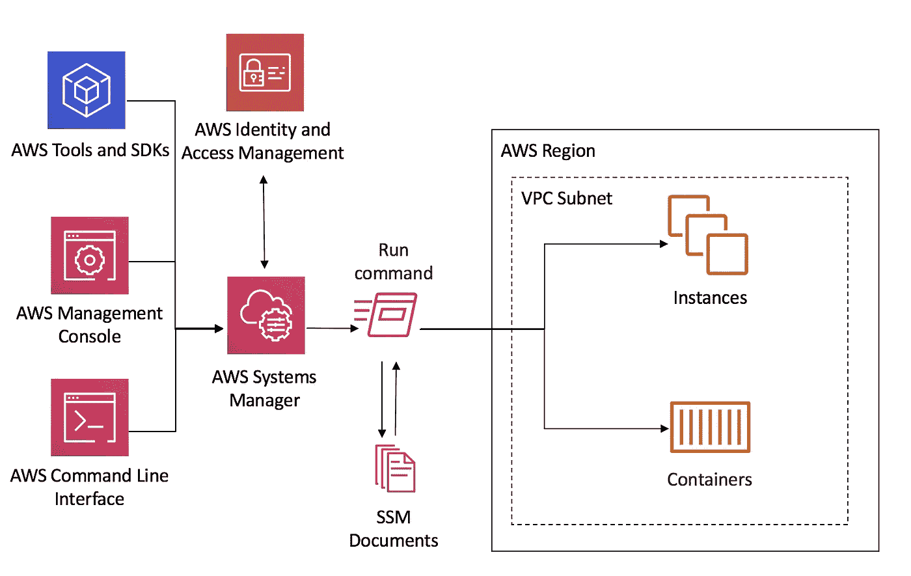

# AWS 系统管理器—远程管理服务器

> 原文：<https://towardsdatascience.com/aws-system-manager-manage-server-remotely-4f8ffe63575d?source=collection_archive---------17----------------------->


丹尼尔·格雷瓜尔在 [Unsplash](https://unsplash.com/s/photos/lighthouse?utm_source=unsplash&utm_medium=referral&utm_content=creditCopyText) 拍摄的照片

## SSM 在多台主机上并行运行命令，不使用 SSH

最近，由于我们安全团队的一些更新，我们不得不在 AWS 帐户的所有主机上安装一个代理。我们在客户中运行了 1100 多个 EC2 实例。这些服务器有不同的操作系统(亚马逊 Linux、Fedora、CentOS、RHEL、Ubuntu、Windows、FreeBSD 等)。此外，这些服务器支持各种工作负载，如 EMR(各种版本)、EKS、ECS、Airflow、Tableau、Alation。其中许多是供应商配置的服务器，它们有自己的 ami。用代理为每种类型创建 ami 需要很长时间和巨大的努力。此外，有些服务器不能容忍重启(为了让用户数据脚本工作)。

AWS 有一个名为 System Manager 的服务，它允许我们在不需要 SSH 的情况下运行远程命令。运行 SSM 文档的基本要求是主机应该运行`amazon-ssm-agent`,并且主机应该有一个能够访问 SSM(amazonsmsmanagedinstancecore)的 IAM 角色。下图总结了 SSM 运行命令的工作方式。



SSM 运行命令的高级流程|图片由作者提供

## SSM 运行命令中的低级 API 调用:

1.  SSM 代理向 SSM 服务端点更新实例详细信息。这每 5 分钟发生一次(ssm:UpdateInstanceInformation)。此更新增强了运行命令实例的详细信息。
2.  代理持续轮询(长时间)来自消息传递服务(ec2messages:GetMessages)的消息。
3.  一旦它接收到预定的消息，它就发送一个确认(ec2messages:AcknowledgeMessage)。
4.  它从 SSM 下载文档(ssm:GetDocument)
5.  执行文档。
6.  如果在此期间收到取消消息，它将取消文档执行。
7.  将响应发送回消息传递服务(ec2messages:SendReply)。

幸运的是，我们在这些服务器上安装了 SSM 代理。我们为 SSM 和其他所需的访问权限创建了一个托管策略，并将该策略附加到主机的 IAM 角色。我们利用 boto3 让所有拥有 EC2 服务的 IAM 角色成为可信实体，并向角色添加托管策略。

一旦满足了先决条件，我们就利用系统管理器的文档和运行命令功能来安装代理。对于正在运行的实例，我们采用了基于标签的方法，并基于该标签运行文档。


现有服务器修补解决方案设计|作者图片

由于我们的平台使用了大量的自动伸缩，我们还需要在由 AWS 管理的自动伸缩运行的新服务器上放置代理。我们可以使用启动模板的用户数据，但是 EMR 管理的扩展组(实例组)没有用户数据，我们不想干扰现有的引导脚本。我们使用了 CloudWatch、Lambda、SQS 和 SSM 来处理这些问题。


现场安装解决方案设计|作者图片

*   EC2 实例出现，它生成事件并将它们发送到 CloudWatch。
*   CloudWatch 基于实例状态变化(正在运行)来挖掘事件。它将该事件发送到 SQS 队列。

SQS 队列在消息上增加了 3 分钟的延迟，然后在 3 分钟的窗口中对消息进行批处理。


递送延迟的 SQS 队列配置|作者图片

*   AWS Lambda 批量接收消息。它过滤由 SSM 管理的实例。对于不由它管理的实例，将它发送到另一个数据库。SSM it 部门管理的所有实例都根据平台(Linux/Windows)进行分组。它调用 SSM 的相应文件。


Lambda |图片的 SQS 事件触发器(作者)

*   SSM 文档向所有目标实例发送命令，并在服务器上安装代理。


SSM 文档样本


命令的 SSM 文档运行历史|作者的图像

这种方法使我们能够在 3 天内对所有的机器运行安装命令(我们分批执行以减小爆炸半径)。所有新机器都通过 lambda 自动打补丁。我们也可以使用 cli 发送命令。

```
aws ssm send-command \
    --document-name "<Document_name>" \
    --targets "Key=instanceids,Values=i-1234567890abcdef0" \
    --timeout-seconds 300
```

尽管我们这样做是为了安装特定的代理，但是该解决方案可以扩展到各种用例(自动化就是其中之一)。我能马上想到的一个是替换**air flow . contrib . operators . ssh _ operator。**有了 SSM，我们不必创建 SSH 连接。一切都由 SSM 负责。解决方案中唯一的问题是 SSM 15 分钟的暂停。但是如果你跟着火走，却忘了接近，这将是一个很好的探索选择。

云计算快乐！！