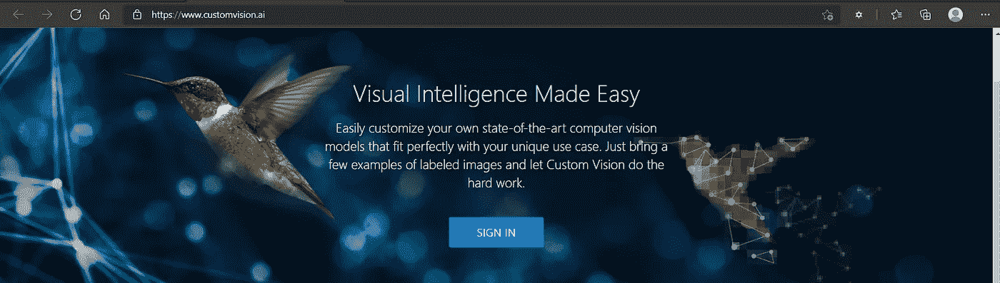

# Azure 认知服务:探索认知愿景

> 原文：<https://towardsdatascience.com/azure-cognitive-service-computer-vision-33ba62ce9d7e?source=collection_archive---------33----------------------->

## 第 1 部分:Azure 认知视觉服务概述，用于处理和分类来自深度学习的计算机视觉领域的图像


戴维·特拉维斯在 [Unsplash](https://unsplash.com?utm_source=medium&utm_medium=referral) 上拍摄的照片

# 介绍

随着各种公共云提供商(如 Azure、AWS 或 Google Cloud)提供的各种预培训服务的出现，认知服务领域发展得太快了。这个领域已经变得越来越有前景，因为它覆盖了解决大多数跨行业领域的常见业务用例。

这篇文章将主要研究微软 Azure 提供的各种认知服务，值得讨论每种服务的能力以及它们可以提供的解决方案。这将是一系列的帖子，首先介绍这些服务:1)认知视觉，2)认知文本分析，3)认知语言处理，4)知识处理和搜索。

在这第一篇文章中，我们将简要了解微软 Azure 的*认知愿景*产品。

*   认知人脸 API
*   计算机视觉 API
*   定制视觉服务
*   媒体服务视频分析器

<https://www.linkedin.com/in/p-jainani>  

# 视觉、图像和视频

## *Face API*

该服务提供算法，公开为基于 REST 的 web 服务调用，用于检测、验证、识别和分析人脸。该服务可以提供面部匹配、面部属性和特征分析。该 API 还具有面部识别和辨认的能力。该服务还提供特定于面部的:标志(鼻子、眼睛)和属性(肤色、年龄、性别)。
*人脸检测 API* :人脸检测 API 提供关于图像中检测到的人脸的信息，但并不是为了识别或辨认特定的*人脸而设计的。*

*人脸识别 API* :它建立在面部检测 API 的基础上，通过分析两张或更多图片中的地标来确定是否存在同一张脸。这对于人脸验证和识别是有用的。

*情感 API:***Face API 可以通过*检测*方法情感属性返回一般的情感值。API 通过使用额外的方法和算法来检测人脸图像中丰富的情绪集，通过提供以下情绪的置信度来提供这些结果:愤怒、轻蔑、厌恶、恐惧、快乐、情绪缺失(中性)、悲伤和惊讶。**

> **这里有一个[快速入门指南](https://docs.microsoft.com/en-in/azure/cognitive-services/face/quickstarts/client-libraries?tabs=visual-studio&pivots=programming-language-python),可以用你选择的任何语言和平台开始使用 Face API。**

**与大多数认知服务一样，Face API 需要使用订阅密钥(有时称为 API 密钥)进行授权。这个密钥应该保密，以确保其他人无法使用您的资源。您将为每个对 Face API 的调用包含订阅密钥**

## **计算机视觉 API**

**计算机视觉 API 提供了处理图像的算法能力，并使用预先训练的模型 API 返回洞察力。它使你能够发现一个图像是否有淫秽内容，或者需要找到图像中的所有面孔。它还通过评估图像特征和颜色、图像内容分类以及使用内置的 API 功能生成图像描述来提供帮助。**

****用于图像分析的计算机视觉 API****

**API 的*分析*端点根据图像内容提取丰富的视觉特征。请求示例如下所示:**

```
curl "https://<region>.api.cognitive.microsoft.com/vision/v2.0/**analyze**?**visualFeatures=Categories,Description&details=Landmarks**" \
-H "Ocp-Apim-Subscription-Key: $key" \
-H "Content-Type: application/json" \
-d "{'url' : '/images/mountains.jpg'}" \
| jq '.'curl "https://<region>.api.cognitive.microsoft.com/vision/v2.0/analyze?**visualFeatures=Adult,Description**" \
-H "Ocp-Apim-Subscription-Key: $key" \
-H "Content-Type: application/json" \
-d "{'url' : '/images/people.png'}" \
| jq '.'
```

> **有关`*analyze*`操作的更多信息，参见[分析图像](https://westus.dev.cognitive.microsoft.com/docs/services/5adf991815e1060e6355ad44/operations/56f91f2e778daf14a499e1fa)参考文件。**

****生成图像缩略图的计算机视觉 API****

**此外，计算机视觉 API 还可以使用*缩略图*端点:`https://<region>.api.cognitive.microsoft.com/vision/v2.0/generateThumbnail`智能生成图像缩略图，以有效显示大图像。请求示例如下所示:**

```
curl "https://<region>.api.cognitive.microsoft.com/vision/v2.0/**generateThumbnail**?width=100&height=100&smartCropping=true" \
-H "Ocp-Apim-Subscription-Key: $key" \
-H "Content-Type: application/json" \
-d "{'url' : '/images/dog.png'}" \
-o  thumbnail.jpg
```

> **关于`generateThumbnails`操作的更多信息，参见[获取缩略图](https://westus.dev.cognitive.microsoft.com/docs/services/5adf991815e1060e6355ad44/operations/56f91f2e778daf14a499e1fb)参考文件。**

****计算机视觉 API 提取印刷文本****

**API 的`ocr`操作检测图像中的打印文本并提取字符，然后将其转换为字符流供下游应用程序使用。请求的 URL 具有以下格式:`https://<region>.api.cognitive.microsoft.com/vision/v2.0/ocr?language=<...>&detectOrientation=<...>`。请求示例如下所示:**

```
curl "https://<region>.api.cognitive.microsoft.com/vision/v2.0/ocr" \
-H "Ocp-Apim-Subscription-Key: $key" \
-H "Content-Type: application/json"  \
-d "{'url' : '/images/ebook.png'}" \
 | jq '.'
```

> **有关`ocr`操作的更多信息，请参见 [OCR](https://westus.dev.cognitive.microsoft.com/docs/services/5adf991815e1060e6355ad44/operations/56f91f2e778daf14a499e1fc) 参考文档。**

****提取手写文本的计算机视觉 API****

**与 OCR 操作不同的是，`recognizeText`操作从笔记、信件、白板、表格和其他来源中检测和提取手写的&书法文本。请求的 URL 具有以下格式:**

**`https://<region>.api.cognitive.microsoft.com/vision/v2.0/recognizeText?mode=[Printed|Handwritten]`**

**请求将输出转储到控制台:**

```
curl "https://<region>.api.cognitive.microsoft.com/vision/v2.0/recognizeText?mode=Handwritten" \
-H "Ocp-Apim-Subscription-Key: $key" \
-H "Content-Type: application/json" \
-d "{'url' : '/images/handwriting.jpg'}" \
-D -
```

> **有关`recognizeText`操作的更多信息，请参见[识别手写文本](https://westus.dev.cognitive.microsoft.com/docs/services/5adf991815e1060e6355ad44/operations/587f2c6a154055056008f200)参考文档。**

> ****专业提示** : Azure 还提供了利用容器封装其认知服务产品的选项，这允许开发者跨平台快速部署他们的定制认知解决方案。快速参考[此处](https://docs.microsoft.com/en-in/azure/cognitive-services/cognitive-services-container-support)。**

## **定制视觉服务**

**Custom Vision 服务旨在创建图像分类模型，从您为特定领域提供的已标记图像中“学习”。例如，从给定的图像目录中识别狗的品种。**

**作为开发人员，要利用这项服务，您需要使用[自定义视觉服务门户](https://www.customvision.ai/)创建一个项目**

****

**自定义视觉服务门户:登录页**

**使用您的 Microsoft 帐户登录门户，并开始创建项目。它提供了在项目类型之间进行选择的能力，例如分类或对象检测、多标签或多类分类，以及预定义的域选择，即地标、零售、食品等...**

> **要快速实践定制视觉服务，请遵循此 [URL](https://docs.microsoft.com/en-us/azure/cognitive-services/custom-vision-service/getting-started-build-a-classifier) 中提到的步骤。全面的细节可从[定制视觉文档](https://docs.microsoft.com/en-us/azure/cognitive-services/custom-vision-service/overview)中获得。**

## **媒体服务视频分析器**

**媒体视频分析器是一个 Azure 认知服务，用于从视频媒体中提取见解。它使用可以进一步定制和训练的机器学习模型。它支持从视频媒体文件中进行人脸识别、文本识别、对象标记、场景分割。**

**它还分析来自音频的内容，例如转录和情感检测。这些结果可用于改进搜索、提取剪辑和创建缩略图。**

**微软为此服务提供了一个单独的门户网站，即[媒体门户网站](https://www.videoindexer.ai/)的视频分析器**

**Azure Video Analyzer for Media 提供了几个上传视频的选项，最常见的是从 URL 上传、REST API 或以字节数组的形式发送文件。它还支持广泛的文件格式，如 WMV，MOV，MPG 和 AVI。视频上传后，索引过程会自动开始。完成后，您可以检查索引器结果。**

**由此产生的见解不仅限于:成绩单、OCR、面孔、品牌、情绪或情感。**

**此外，它支持关于视频的高级见解和关键方面，如场景、镜头和关键帧。它还支持搜索视频中的关键概念，并提供时间线建议。**

> **为了在媒体 Azure 视频分析器上获得快速的动手练习，请遵循此 [URL](https://docs.microsoft.com/en-us/azure/azure-video-analyzer/video-analyzer-for-media-docs/video-indexer-get-started) 或此处[的](https://github.com/Azure-Samples/media-services-video-indexer/blob/master/IntroToVideoIndexer.md)中提到的步骤。全面的细节可通过 [Azure 媒体视频分析器](https://docs.microsoft.com/en-us/azure/azure-video-analyzer/video-analyzer-for-media-docs/video-indexer-overview)获得。**

# **摘要**

**在这篇文章中，我们简要讨论了各种 Azure 认知服务，这些服务旨在解决需要计算机视觉能力的业务问题。这些服务在调配后即可立即使用，并且大多以随用随付的方式提供。**

**在下一篇文章中，我们将讨论 Azure 的语言和文本认知服务。**

## **参考**

**[1] Azure 认知服务— [文档](https://docs.microsoft.com/en-in/azure/cognitive-services/)**

**<https://www.linkedin.com/in/p-jainani> **