# Azure Data Factory CI-CD 简化版:使用 Azure DevOps YAML 管道构建和部署 ARM 模板

> 原文：<https://towardsdatascience.com/azure-data-factory-ci-cd-made-simple-building-and-deploying-your-arm-templates-with-azure-devops-30c30595afa5?source=collection_archive---------5----------------------->

## 发布/部署 Azure 数据工厂工件的最简单方式

安德里亚斯·费尔斯克在 [Unsplash](https://unsplash.com/photos/9GwMIek9jnY?utm_source=unsplash&utm_medium=referral&utm_content=creditCopyText) 上的照片

如果你使用 Azure Data Factory，你可能会注意到这个工具的部署过程是独一无二的。它不同于 API 或网站部署，因为它生成 ARM 模板，并且在某些时候肯定会问“为什么部署它如此困难？”。嗯，不一定是…

# 数据工厂 CI/CD —旧的(有问题的)流程

Azure Data Factory 是大数据流程的优秀编排工具。它有许多集成和功能，使数据工程师的生活非常容易。

虽然当我们谈论部署时，有一些技巧，例如工作区内的**发布按钮**，这是生成要部署的 ARM 模板所必需的。此外，没有部署到开发环境中，因为您已经在那里作为一个编辑器工具工作。与其他“传统开发”相比，这个过程有点不同，这个**手动步骤**让开发人员不寒而栗:

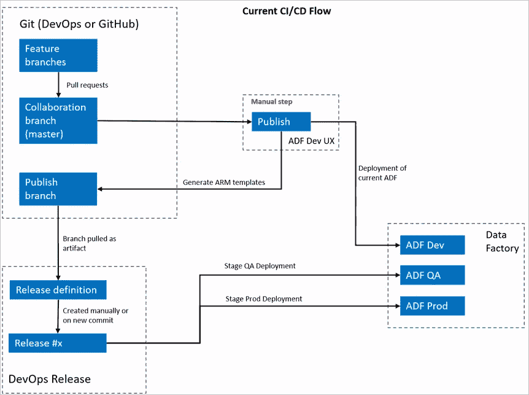

从 Azure 数据工厂工作区部署—图片来自[微软文档](https://docs.microsoft.com/en-us/azure/data-factory/continuous-integration-deployment-improvements#current-cicd-flow)

它经常创建讨论和“变通办法”来处理这个手动步骤。在一些解决方案中，人们将生成 ARM 模板从 adf_publish 手动移动到 feature 分支，并创建新的提交。在其他情况下，有一个使用多个 repo 的集成，但是同样，启动部署应该是一个手动步骤。

在旧的方法上，从我的角度来看，最好的解决方案是使用 Azure Powershell 进行部署，但这增加了复杂性，因为您需要手动控制所有应该部署的元素，如链接的服务和管道。

# 数据工厂 CI/CD —新的(更好的)流程

幸运的是，有一种新的方法可以生成要部署的 ARM 模板，您不需要上面提到的变通方法。

在这种策略中，您基本上是验证您的数据工厂 JSON 文件并将其“构建”到准备使用的 ARM 模板中。为了让它工作，你需要创建一个构建管道并使用 [ADFUtilities NPM 包](https://www.npmjs.com/package/@microsoft/azure-data-factory-utilities)。这样就干净多了，手动步骤也消失了:)。

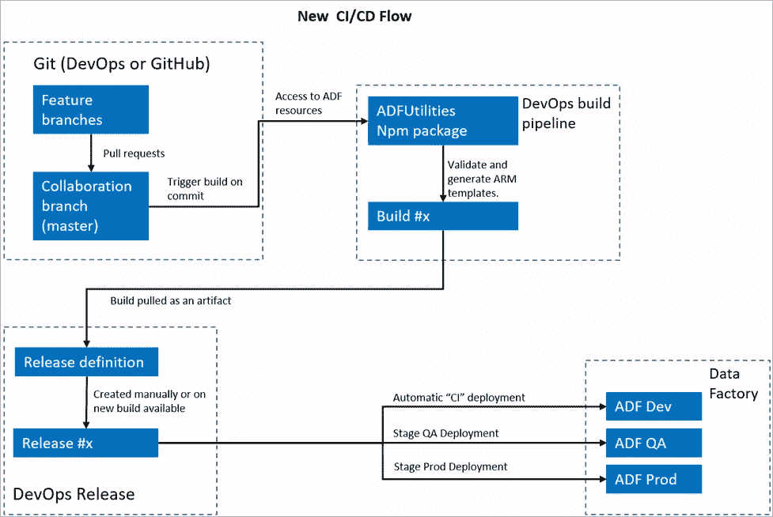

部署新的 Azure 数据工厂流程——图片来自[微软文档](https://docs.microsoft.com/en-us/azure/data-factory/continuous-integration-deployment-improvements#the-new-cicd-flow)

更多信息，查看官方文档[这里](https://docs.microsoft.com/en-us/azure/data-factory/continuous-integration-deployment-improvements)。

# 如何使用 IaC 创建 Azure 数据工厂

## 基础设施作为代码

在你的项目中使用 IaC 有很多理由，你可以在这里查看。其中之一是基础设施作为代码是实现您的环境的最简单快捷的方式。所以，既然我们想保持 ADF 部署简单，为什么不使用它呢:)？

在这个例子中，我将使用 [Bicep](https://docs.microsoft.com/en-us/azure/azure-resource-manager/bicep/overview) 模板来部署我们的数据工厂。如果 Bicep 对你来说是新的，它基本上是一种 DSL(领域特定语言),让 ARM 模板用户更容易使用。

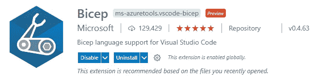

Bicep 对 VS 代码有很好的扩展——图片来自[微软文档](https://docs.microsoft.com/en-us/azure/azure-resource-manager/bicep/install#development-environment)

在这篇[文章](https://camargo-wes.medium.com/dataops-automation-creating-azure-data-factory-with-git-integration-using-bicep-376fd3b5bc81)中，您可以查看如何使用 git 集成为数据工厂创建 Bicep 文件，该文件将用于部署 ADF。

它将在你的 Azure 数据工厂和你的 git repo 之间创建一个链接(它在 Azure DevOps 和 GitHub 上工作)，所以当你在你的数据工厂中创建一个管道时，它也将被版本化到 git repo 中。

# Git 储存库

## 知识库结构

回购结构将取决于每个项目。最佳实践之一是在同一个 repo 中保留部署项目所需的所有代码。因此，我喜欢创建一个结构，其中有组件的名称，并且下面总是有一个“src”文件夹。在这种情况下，我们将把 src 文件夹作为 git 集成过程中的“根文件夹”。

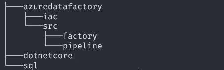

存储库结构—按作者分类的图像

## 构建 ARM 模板所需的文件

一些文件是必要的，在我们的回购生成模板。这些文件需要添加到 src 文件夹中，在构建阶段会被引用。

在 src 文件夹中创建 package.json 文件，它包含将用于构建 ADF 工件的包的元数据。

在同一个文件夹中，创建包含以下内容的 publish_config.json 文件。这不会影响 ARM 模板的生成，但是运行构建是必要的:

最后一个文件是 ARM-template-Parameters-definition . JSON。我不会进入细节，因为它需要一个专门的职位。对于初始版本，您可以创建以下内容:

在创建 git integrate 和所有必要的文件之后，这就是你的回购看起来的样子:

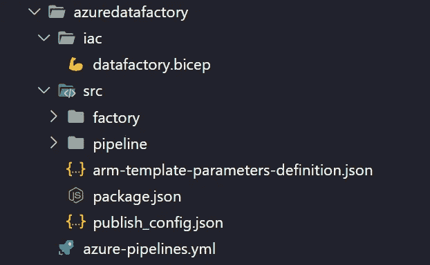

Azure 数据工厂的存储库结构—按作者分类的图片

# 如何为 Azure 数据工厂创建构建 YAML 管道

毫无疑问，管道作为代码将是管道定义的未来，具有版本控制和可重用性的能力。

## 变量

第一个必要的配置是变量。它们将被用于以后的构建和发布。

构建阶段最重要的变量是:

1.  这是 src 目录。必须有上面提到的所需文件。
2.  dataFactoryResourceId -用您的 ADF 的资源 Id 填充它。这是一个好主意，使其参数化，以在不同的环境中工作

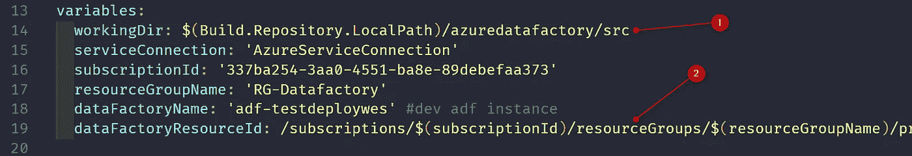

构建和部署变量—按作者分类的图像

## 构建数据工厂

如上所述，我们需要在构建过程中使用 [ADFUtilities NPM 包](https://www.npmjs.com/package/@microsoft/azure-data-factory-utilities)。

在前两个任务中，NodeJS 是在构建代理中配置的。注意我们在变量部分提到的 workingDir 变量。

在最近的两个任务中，我们调用 NPM 包来验证和“构建”我们的数据工厂，并生成 ARM 模板。在最后一个任务中，“工件”是相对输出目录。这意味着它将是 ARM 模板的输出目录。

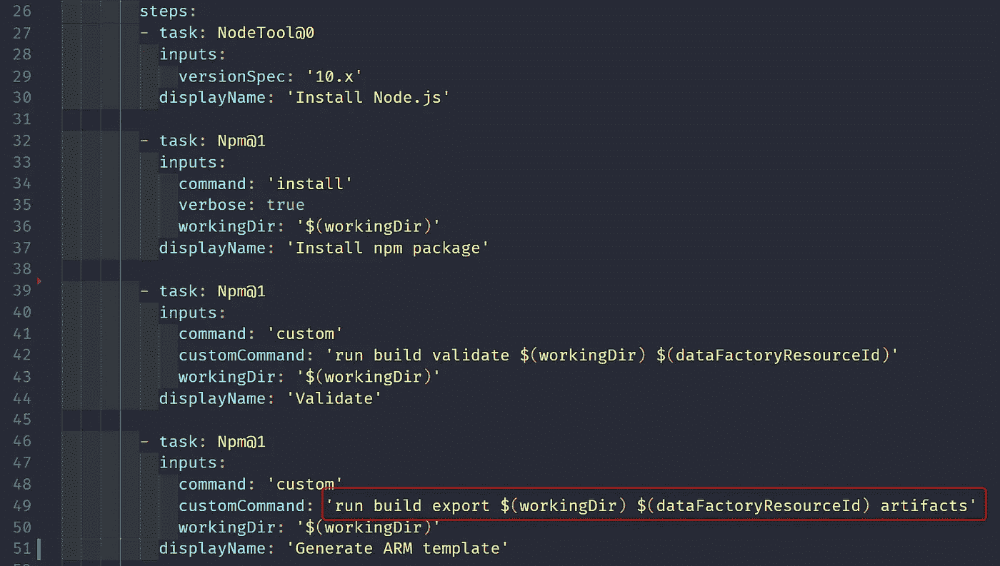

为 Azure 数据工厂构建任务—按作者分类的图片

在接下来的任务中，我们将把 ARM 模板从输出复制到暂存目录，并将 bicep 文件“构建”到 ARM 模板中。这些将用于创建 Azure 数据工厂工作区。

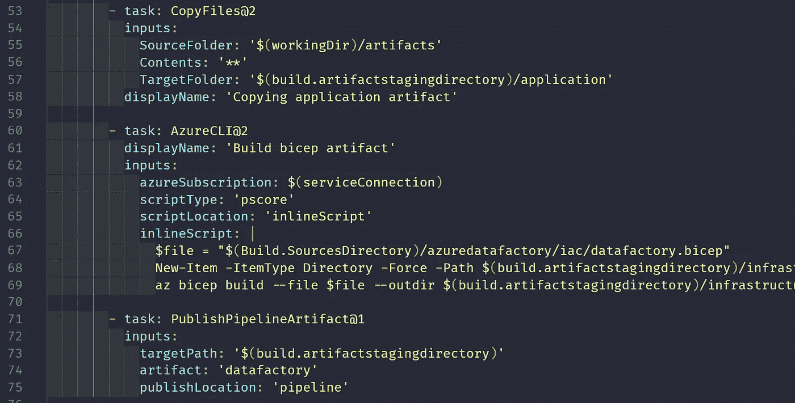

为 Azure 数据工厂构建任务—按作者分类的图片

在运行构建管道之后，您将拥有将在部署阶段使用的工件:

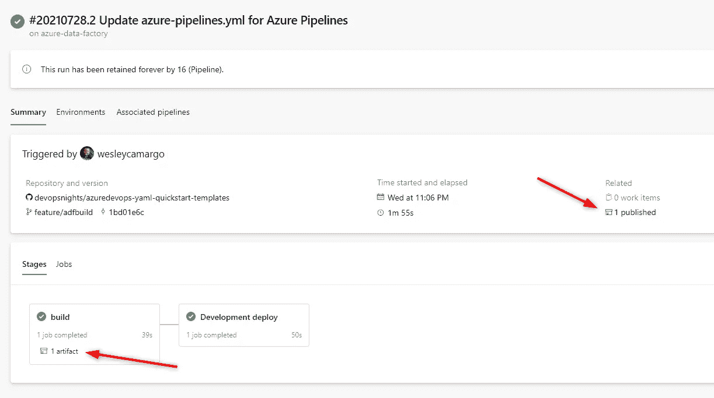

Azure 数据工厂工件——作者图片

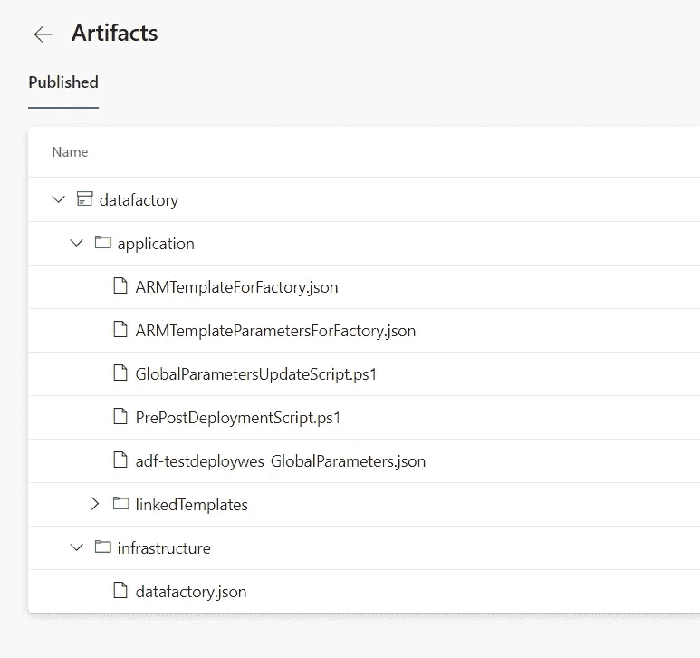

Azure 数据工厂 ARM 模板—作者图片

# 如何为 Azure 数据工厂创建发布 YAML 管道

为了部署数据工厂，我们使用运行一次策略。它将消耗在构建阶段创建的工件

## 发展

当在开发环境中启用 git 集成时，因为代码是在工作区中生成的，所以不需要在这个环境中发布。它将只部署使用基础设施作为代码模板的环境。它还包含构建阶段的依赖项。

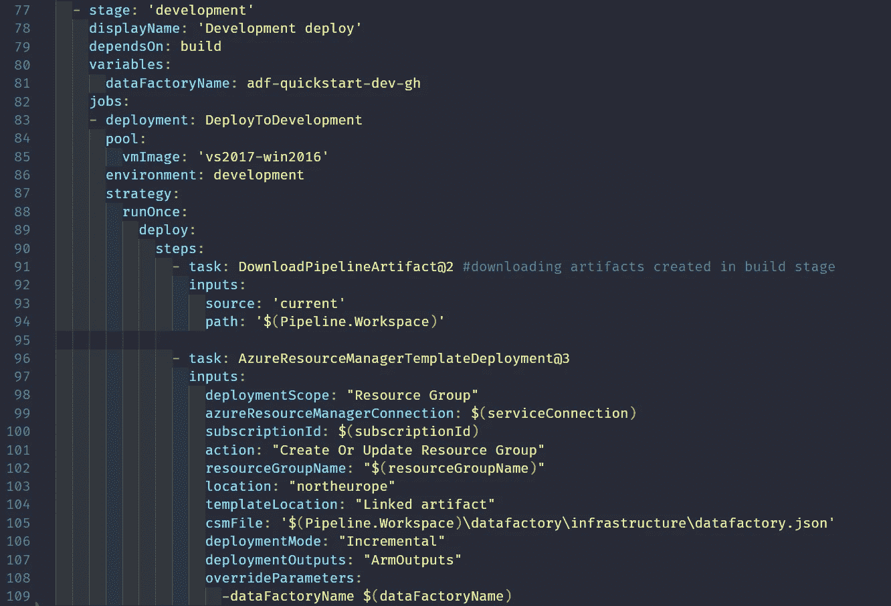

开发环境—作者图片

## UAT 和生产

在 UAT，我们依赖发展环境。在生产方面，依赖于 UAT。在这些阶段，我们需要部署基础架构和代码，我们将使用预部署和部署作业:

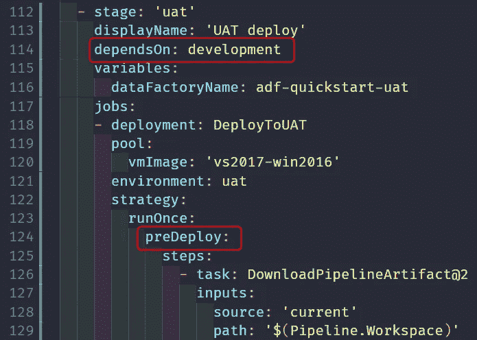

部署前阶段—作者提供的图像

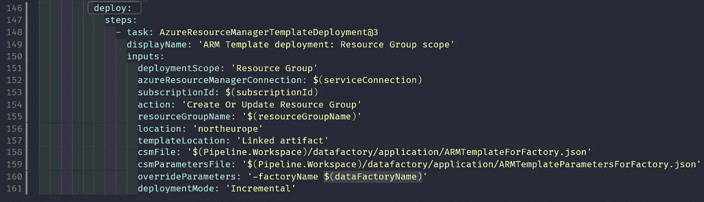

部署阶段—按作者排列的图像

在运行时，它将首先在预部署阶段使用 Bicep 文件创建基础设施，然后部署在构建阶段生成的工件。这是最后的结果:

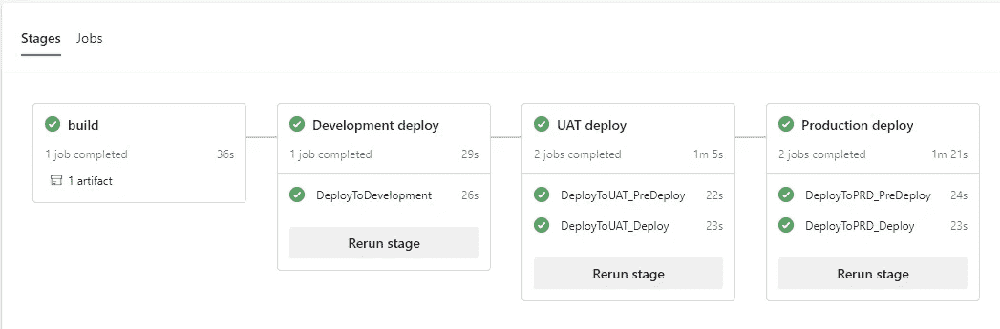

部署管道—按作者分类的图片

# 关键要点

部署 Azure Data Factory 的策略不止一种，我已经尝试了其中的大部分，它们工作得非常好，但在我看来，这是实现完全自动化部署的最简单、最干净的方法。

下面您可以查看用于部署它的完整 YAML。你也可以在我的 GitHub repo 中查看其他 Azure DevOps YAML 模板示例:[devo psnights/azuredevops-YAML-quick start-Templates(github.com)](https://github.com/devopsnights/azuredevops-yaml-quickstart-templates)

希望能有用！