# 基于容器映像构建的 AWS Lambda 的 Azure DevOps CI/CD 管道

> 原文：<https://towardsdatascience.com/azure-devops-pipelines-with-aws-toolkit-and-docker-cd619ebce375?source=collection_archive---------5----------------------->

## Azure DevOps 中的 CI/CD 管道介绍，用于自动执行使用 docker 容器构建的 AWS Lambda 的构建过程。

Jean-Philippe Delberghe 在 [Unsplash](https://unsplash.com?utm_source=medium&utm_medium=referral) 上拍摄的照片

# 介绍

我最近的文章关注了 AWS 中一个相当新的功能，即通过容器映像构建 AWS Lambda。

*   [如何为数据科学构建 AWS Lambda](/how-to-build-an-aws-lambda-for-data-science-cec62deaf0e9)
*   [如何构建算法交易的 AWS Lambda](https://levelup.gitconnected.com/how-to-build-an-aws-lambda-for-algorithmic-trading-da5d6826551a)

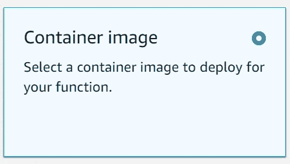

来自 AWS 控制台的图像

这一新功能使得打包 AWS Lambda 所需的所有代码依赖项变得非常容易，而且就在 Lambda 的源代码旁边。这也消除了将代码从您最喜欢的 IDE 中复制并粘贴到 AWS 控制台中的倾向，并使事情变得无序。您的源代码现在成为部署到 AWS 中的所有代码的根，这使得事情变得非常顺利和有条理。

当我开始看到用容器映像构建我的 AWS lambda 的美妙之处时，我并不热衷于通过命令行进行维护，如果我对 docker 文件或包含 AWS lambda 代码的文件进行任何更改，这就是我最初维护代码部署的方式。所以，我开始研究 CI/CD 管道。

CI/CD 代表:

*   CI-持续集成
*   CD-连续部署

参见此[文章](https://www.infoworld.com/article/3271126/what-is-cicd-continuous-integration-and-continuous-delivery-explained.html)了解更多信息。

有很多不同的工具可以用来构建 CI/CD 管道，但我决定使用 Azure DevOps，因为我对该工具很熟悉。自由层允许创建一个 CI/CD 管道。Jenkins[是一个非常受欢迎的开源解决方案。Azure DevOps 与 AWS 合作创建了一个](https://www.jenkins.io/)[工具包](https://docs.aws.amazon.com/vsts/index.html)，使得创建构建管道变得非常容易。

## 步骤 1:使用版本控制分发服务器组织您的代码

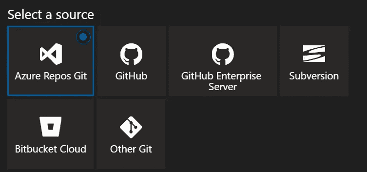

有许多不同的版本控制发行商。只要确保你有办法把你的代码连接到 Azure DevOps。出于本教程的目的，我们将构建一个 docker 文件，并更新已经内置在 AWS 中的 AWS Lambda。要跟进，请确保您已经完成了这些步骤。如果您在这些方面需要任何帮助，请随意阅读我之前的两篇关于如何构建 AWS Lambda 的文章。

## 步骤 2:创建 Azure DevOps 帐户

这里有一个开始使用的链接。这是免费的，如果你有一个 Github 帐户，你可以使用它来加快这个过程。

[Azure DevOps 服务|微软 Azure](https://azure.microsoft.com/en-us/services/devops/)

## 步骤 3:创建您的存储库

根据代码存储的位置和方式，这一步可能会因人而异。总体目标是在 Azure DevOps 中连接或建立代码存储库，以便您的管道可以访问构建过程所需的文件。

这可以在左侧面板的 Repos 部分找到。

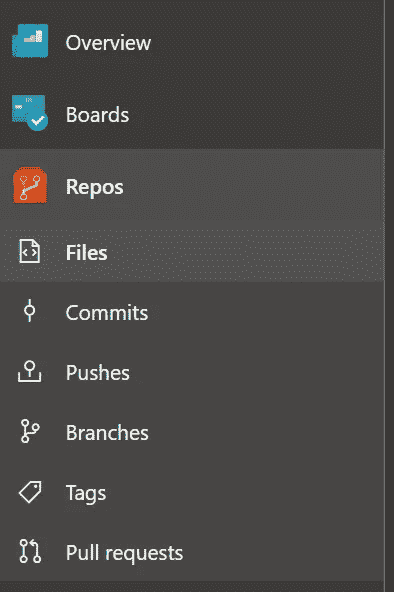

来自 Azure DevOps 的回购部分

您可以从 Azure DevOps 的这个部分创建一个新的存储库、导入一个存储库并管理您的存储库。

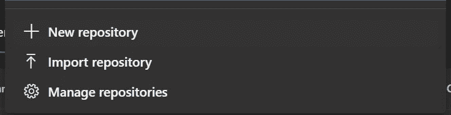

Azure DevOps 中的存储库选项

## **第四步:创建新的管道**

导航到左侧面板上的管道选项。选择底部的“使用经典编辑器”。

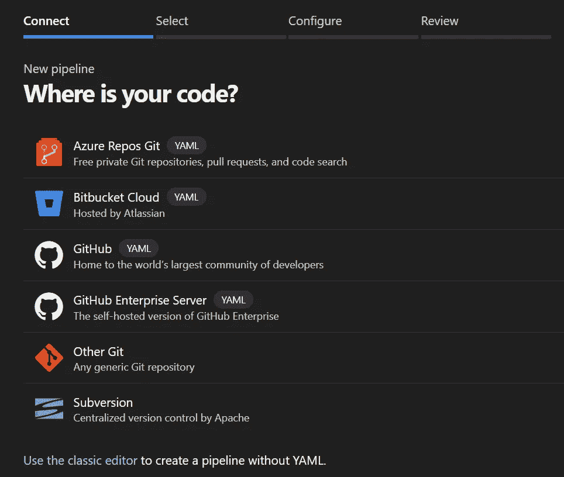

Azure DevOps 中的新管道构建

然后，您将选择代码所在的位置，以及您想要从哪个存储库和分支进行构建。

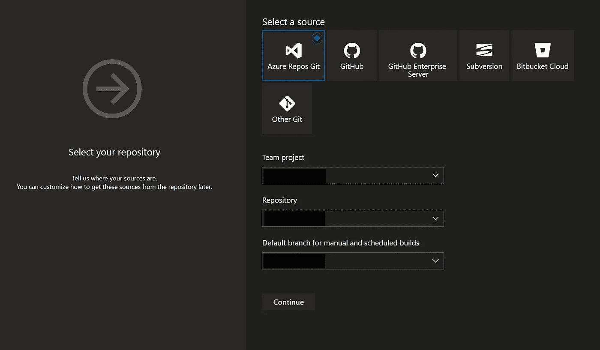

连接到 Azure DevOps 中的存储库

接下来，将提示您选择一个模板。选择顶部的“空工单”。

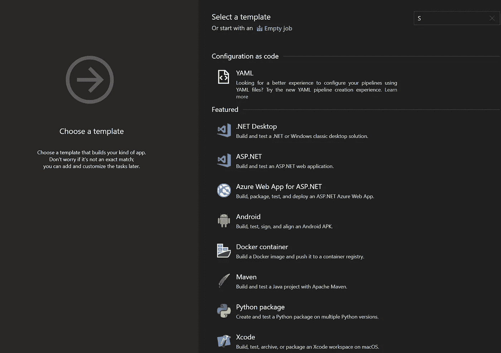

在这里，您将能够自动化构建 docker 映像、将其推送到 AWS ECR 以及基于更改更新 lambda 的整个过程。整个过程大约需要 4 分钟。

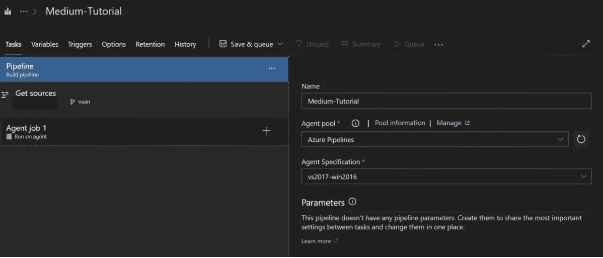

在 Azure DevOps 中创建管道

首先，我们将使用构建 docker 映像的模板来构建 docker 映像。单击代理作业 1 旁边的+。

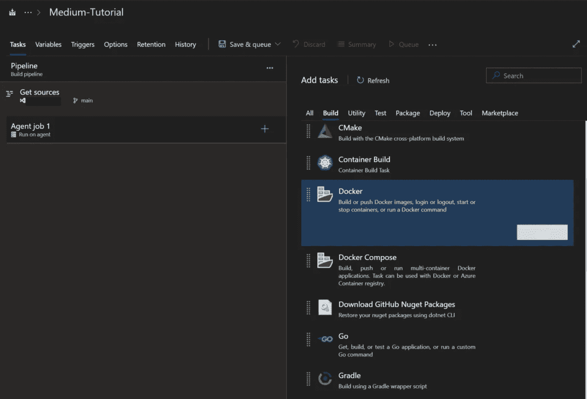

Azure DevOps 中的 Docker 构建

添加完成后，点击即可开始。

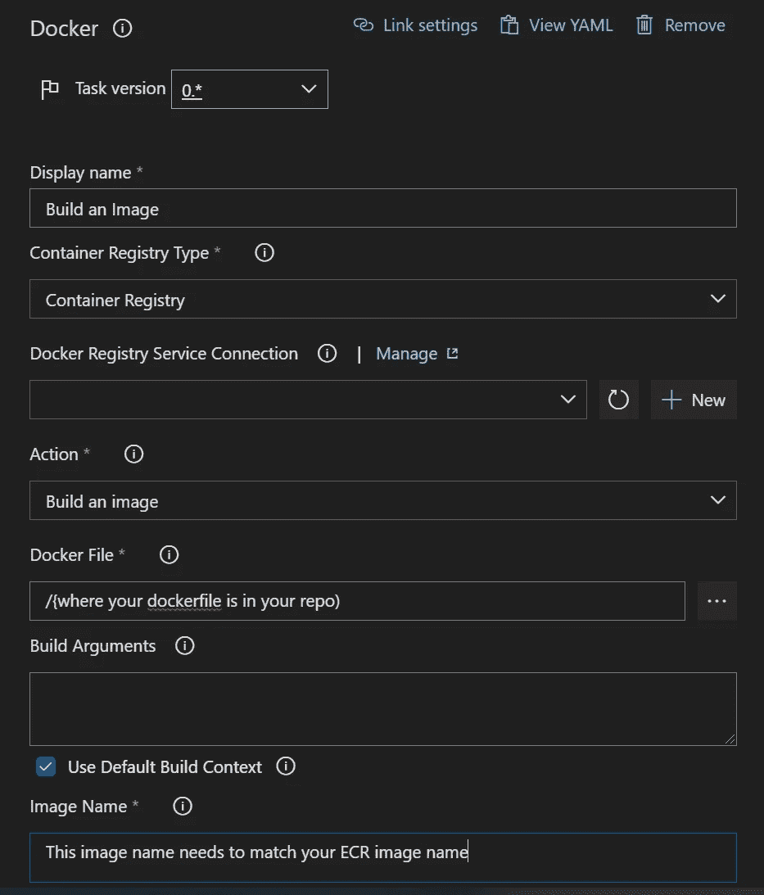

Docker 图像说明

需要注意一些事情:

*   确保将任务版本更改为*0。
*   确保您拥有 docker 文件的正确路径。您可以使用输入旁边的省略号在 repo 中找到它。
*   在图像名称上，它必须与您在 ECR 中为标签使用的名称相匹配。在我以前的文章中，我将其标记为 lambda_dependencies。

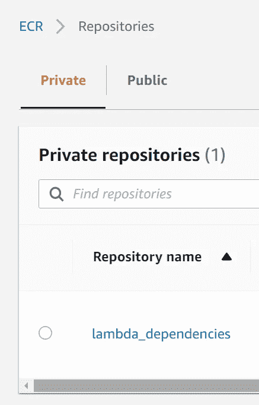

AWS 中的 ECR 存储库名称

我们现在将通过单击代理作业旁边的+添加下一个任务。这一次，我们将添加一个作业，将新更新的 docker 映像推送到云中。

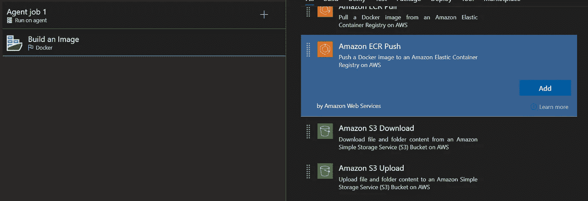

来自 Azure DevOps 的 ECR 推送

AWS 工具包使得使用所有 AWS 服务变得非常容易。您所要做的就是用您的访问令牌连接这两个服务

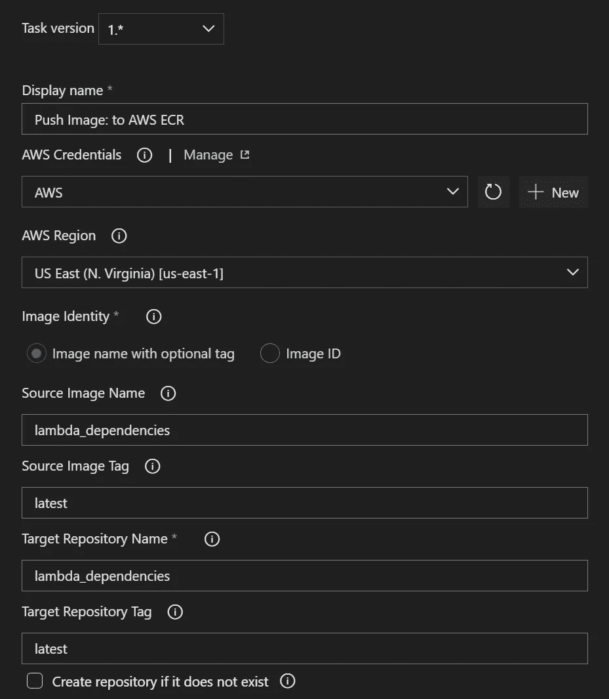

ECR 推送构建创建

在显示+New 的地方，您将添加您的 AWS 凭证。

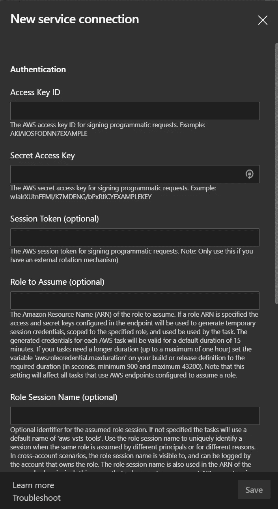

Azure DevOps 中的 AWS 凭据

最后，我们将添加另一个作业并找到 AWS CLI 任务。这将用于用最新版本的 docker 映像更新我们的 lambda。

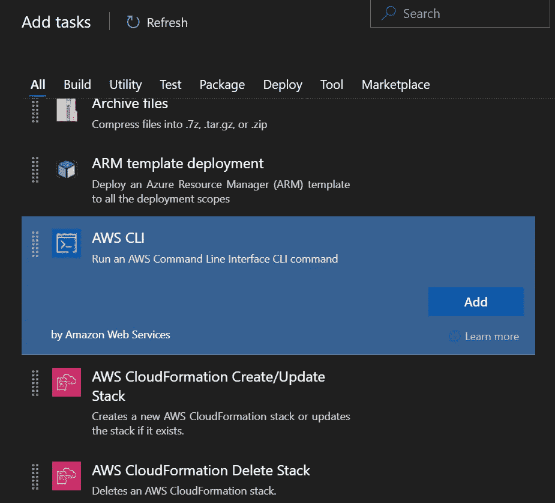

Azure DevOps 中的 AWS CLI 任务

AWS CLI 允许您调用您想要的任何命令和子命令。这只是完成工作的一个简单方法。

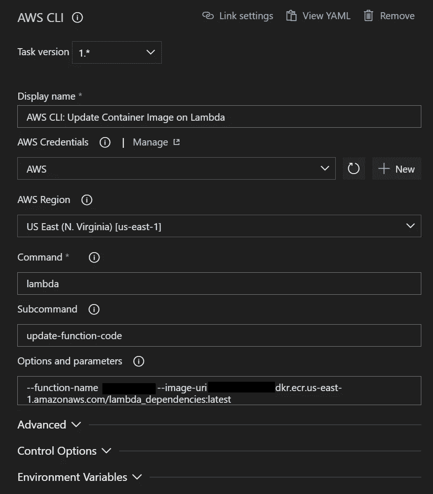

在 Azure DevOps 中设置 AWS CLI

需要对典型的 CLI 命令进行一点转换，比如从一开始就删除 AWS，并像命令/子命令/和参数一样进行拆分。

当你完成时，事情应该是这样的。

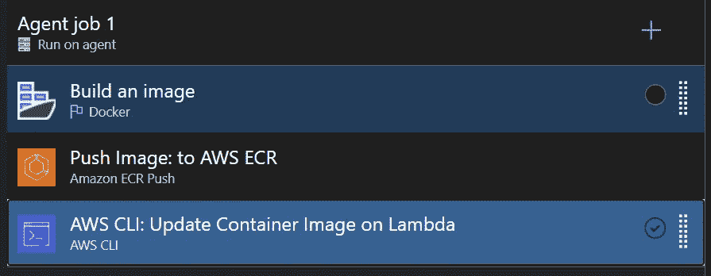

完成的管道

现在，您已经准备好对其进行测试，并通过点击 Save 和 Queue 来查看神奇的事情发生了。拿些爆米花。

## 步骤 5:测试构建管道

您可以通过保存编辑和排队来手动触发构建管道。Azure DevOps 在快速浏览构建方面做得很好。如果您单击代理作业 1，您可以看到幕后实际发生的情况。(魔术)

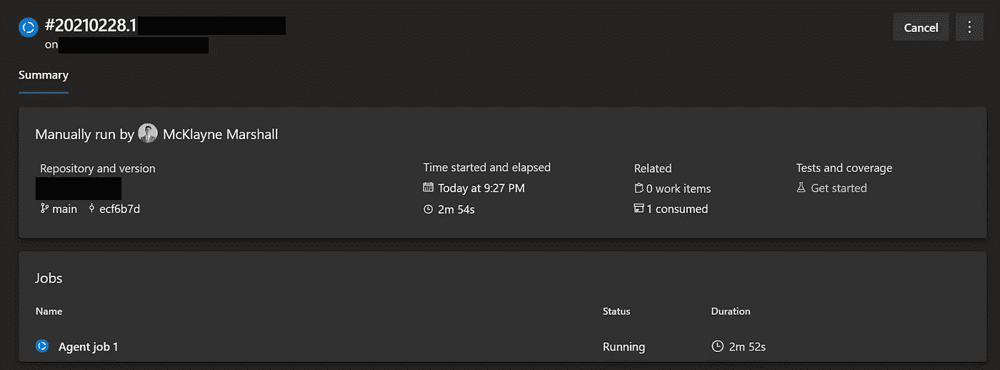

Azure DevOps 中的构建摘要

代理作业 1 将向您显示日志以及管道在其进程中所处的位置。整个过程大约需要 4 分钟。

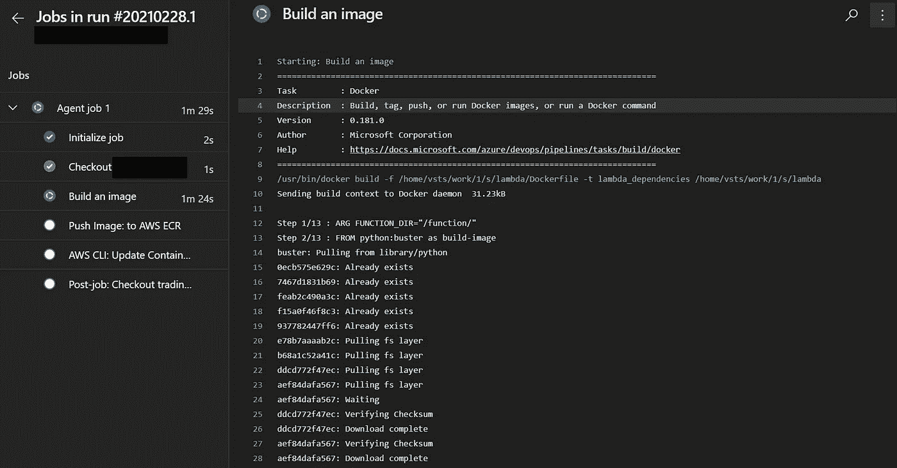

构建日志

管道完成后，您的屏幕将显示作业进展情况的总体统计数据。

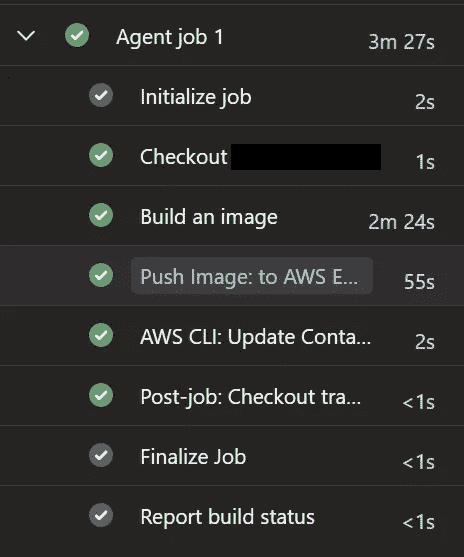

成功

此时，你应该庆祝一下！:)

## 步骤 6:决定什么应该触发构建管道

在管道创建面板中，有一个触发器部分。CI/CD 的目的是持续集成和部署，因此下面显示了如何实现这一点。您可以在 repo 中选择一个分支，以便在每次提交该分支时触发构建管道。还有一些其他选项，比如制定一个时间表，或者让它在不同的构建完成时触发。我的偏好，尤其是在云中工作时，是在每次提交后构建。它让我的代码在我的机器上和云中保持干净和最新。

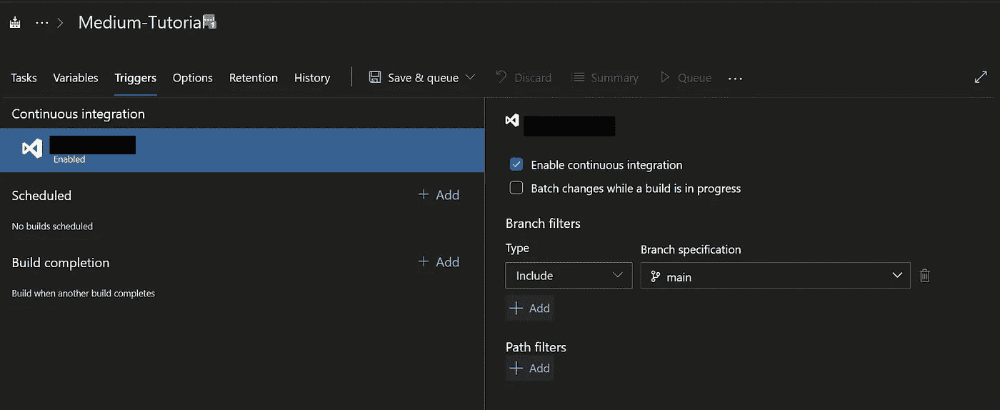

Azure DevOps 中的触发器管道

## **第七步:坐下来，放松一下，下次再做承诺**

每当我自动化一些东西时，我总是需要花一些时间放松和享受我的好工作。

# 结论

使用容器映像构建 AWS Lambda 函数的能力改变了游戏规则。将它与 CI/CD 配对可以确保您的包依赖项从 docker 文件同步到本地写到云中的 lambda 函数。我希望你喜欢这个教程，并且它可以让你在每次修改你的 lambdas 时，不用再通过命令行来维护你的 docker 镜像。

干杯。