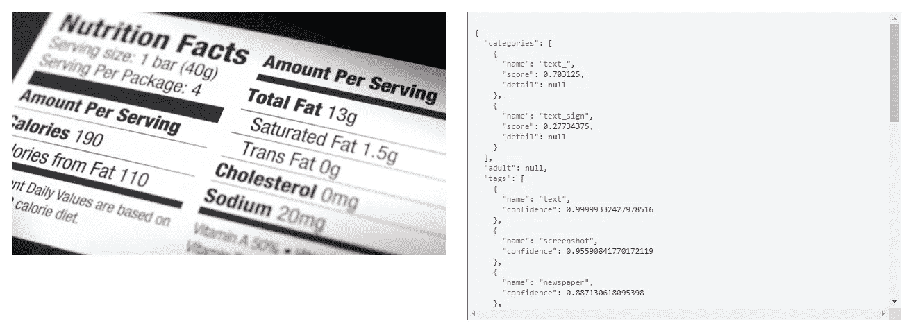
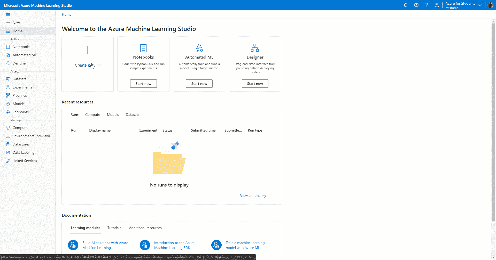

# 面向机器学习工程师的 Azure

> 原文：<https://towardsdatascience.com/azure-for-machine-learning-engineers-7c3ae416ea0f?source=collection_archive---------30----------------------->

## 了解 Azure 提供的所有不同的人工智能服务，以及何时应该使用它们

马库斯·温克勒在 [Unsplash](https://unsplash.com?utm_source=medium&utm_medium=referral) 上的照片

# 介绍

随着越来越多的公司决定将其内部数据中心迁移到云中，云技能现在变得越来越重要。

2020 年，微软 Azure 被宣布为增长最快的云提供商[1]，因此我决定挑战自己，了解更多关于他们的数据科学服务，并完成他们的 [Azure 数据科学家认证](https://docs.microsoft.com/en-us/learn/certifications/azure-data-scientist/)。

 [## 微软认证:Azure 数据科学家助理由微软颁发给 Pier Paolo Ippolito。

### 获得 Azure 数据科学家助理认证验证了应用 Azure 机器的技能和知识…

www.credly.com](https://www.credly.com/badges/a91b0677-0a13-433e-a19b-cb06add00a9a) 

在本文中，我们将介绍一些 Azure key 机器学习服务，以及它们如何相互比较，以创建完整的人工智能解决方案。如果您有兴趣了解更多关于云计算和大数据系统的基础知识，可以在我以前的文章[“数据科学家的云基础”](/cloud-foundations-for-data-scientists-e9d0c14fc98a)和[“大数据分析:Spark 和 Hadoop”](/big-data-analysis-spark-and-hadoop-a11ba591c057)中找到更多信息。

# Azure 服务

Azure 提供了 4 个不同的抽象级别，可以用来创建端到端的机器学习解决方案:

*   Azure 应用人工智能服务
*   Azure 认知服务
*   Azure 机器学习
*   人工智能基础设施

## Azure 应用人工智能服务

在这个层面上，Azure 提供了一套专门的人工智能服务，这些服务是根据特定的业务场景设计的。这些类型的服务建立在 Azure 认知服务 API 之上，以便为最终用户提供不同类型的预制模型，这些模型可以在特定的业务环境中使用，几乎没有任何形式的设置要求。应用人工智能服务的一些例子是:

*   **Azure Form Recognizer:** 从文档集合中自动提取知识，并以结构化数据格式输出结果，该格式能够提供多条信息，例如:关系、边界框等。
*   **Azure Metrics Advisor:** 执行时序数据的监控和异常检测，以便从数据中自动计算度量并驱动决策。
*   **Azure Cognitive Search:** 使使用人工智能排名功能快速查找和探索大规模组织内可用的内容成为可能。
*   **Azure Bot 服务:**利用预先构建的自然语言模型来快速构建对话机器人。Azure Bot Service Composer 另外提供了一个可视化界面，以便尽可能容易地创建和测试您的虚拟代理。

## Azure 认知服务

认知服务是一个可定制的 API 集合，用于与视觉、语音、决策和语言相关的任务。利用这些 API，你就可以在你的应用中集成人工智能的能力，甚至不需要任何关于数据科学和机器学习的专业知识。可以通过使用许多不同的方法来利用 Azure 认知服务，例如:Azure 门户(主要的 Azure 用户界面)、Azure 命令行界面、SDK 库(用 C#、Java、JavaScript 和 Python 等语言)和 Azure 资源管理器模板。认知服务中可用能力的一些例子是:

*   语音到文本转换
*   语音翻译
*   说话人识别
*   异常检测
*   内容审核
*   使用 Bing 搜索新闻
*   物体识别

下面是一个简单的例子，展示了开始使用认知服务 API 是多么容易(图 1)。

图 1: Azure 认知服务计算机视觉应用编程接口(图片由作者提供)。

## Azure 机器学习

Azure ML 是一个端到端的平台，可用于准备、构建、训练和部署您自己的机器学习模型和管道(而不是使用微软创建的预制模型)。为了使这成为可能，Azure 提供了图形界面(如拖放设计器和 AutoML 功能)和编码环境(如 Jupyter Lab ),以使用常见的开源库(如 Tensorflow、Keras、PyTorch、ONNX 等)开发您自己的模型

在同一环境中创建终端部署模型，可以遵循常见的 MLOps(机器学习→操作)实践，跟踪 ML 实验并监控它们在生产环境中的性能，以便在出现任何数据漂移时尽快做出反应。

Azure 机器学习提供的一些关键功能是:

*   数据标记
*   协作笔记本环境
*   用于时间序列预测、分类和回归的自动化机器学习工具
*   使用拖放工具创建 ML 管道
*   内置 MLOps 功能
*   内置模型可解释性可视化

下面是一个简单的例子，展示了 Azure 机器学习平台的不同部分(图 2)。

图 2: Azure 机器学习平台(图片由作者提供)。

## 人工智能基础设施

最后，Azure 还提供了不同的可扩展虚拟机，用户可以选择这些虚拟机来创建和运行他们的机器学习和数据科学项目。通过这种方式，用户能够完全控制他们的开发环境和他们想要使用的不同包。

此外，Azure 还提供特定于数据科学的虚拟机，这些虚拟机预打包了一些最常见的数据科学库(例如 TensorFlow、Keras、MLFlow 等)。

# 结论

总的来说，Azure 提供了一套完整的服务，可以用来在分析生命周期的任何阶段处理数据。除了微软的人工智能服务，Azure 还提供了一个市场，用户可以在这个市场上决定使用其他组织创建的人工智能服务，如 Azure Databricks(针对优化的 Apache Spark)、SAS Viya、DataRobot、Dataiku、H2O.ai 等

如果你有兴趣了解更多关于 AWS 等其他人工智能云提供商服务的信息，可以在我之前的文章[“机器学习工程师的 AWS”](/aws-for-machine-learning-engineers-47e50a3b8015)中找到更多信息。

# 联系人

如果你想了解我最新的文章和项目[，请通过媒体](https://pierpaoloippolito28.medium.com/subscribe)关注我，并订阅我的[邮件列表](http://eepurl.com/gwO-Dr?source=post_page---------------------------)。以下是我的一些联系人详细信息:

*   [领英](https://uk.linkedin.com/in/pier-paolo-ippolito-202917146?source=post_page---------------------------)
*   [个人网站](https://pierpaolo28.github.io/?source=post_page---------------------------)
*   [中等轮廓](https://towardsdatascience.com/@pierpaoloippolito28?source=post_page---------------------------)
*   [GitHub](https://github.com/pierpaolo28?source=post_page---------------------------)
*   [卡格尔](https://www.kaggle.com/pierpaolo28?source=post_page---------------------------)

# 文献学

[1]微软 Azure 是目前发展最快的云平台。他们有你可以满足的关键需求。TheNextWeb。访问地址:[https://then extweb . com/news/Microsoft-azure 是发展最快的云计算平台，而他们已经得到了你可以满足的关键需求](https://thenextweb.com/news/microsoft-azure-is-the-fastest-growing-cloud-platform-around-and-theyve-got-key-needs-you-could-fill)